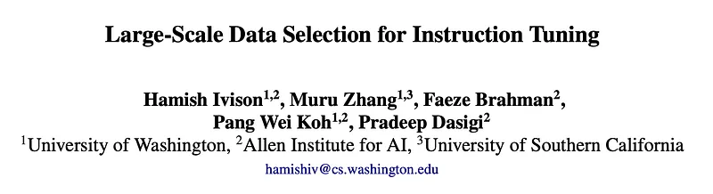
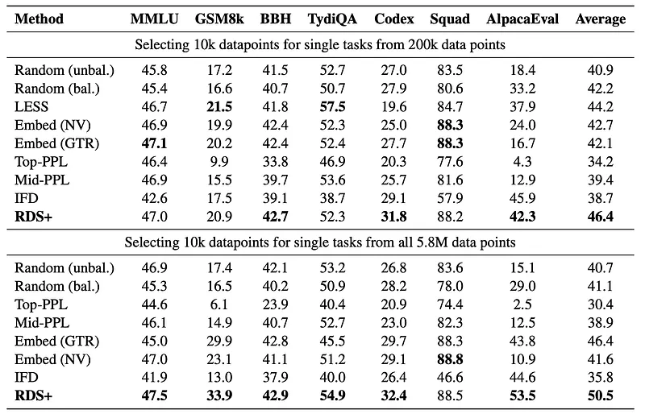
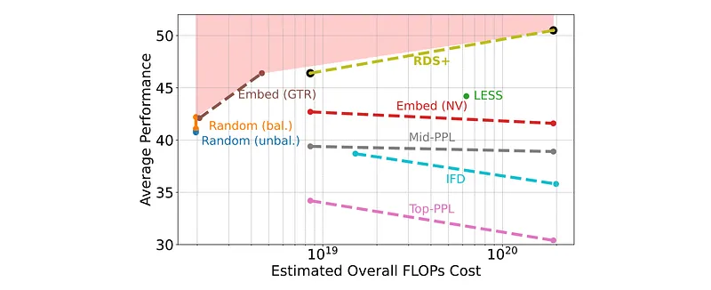
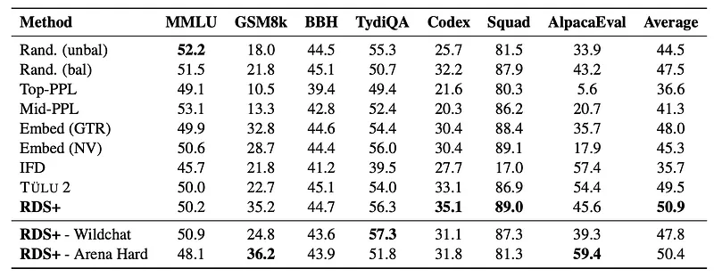
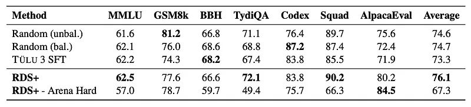
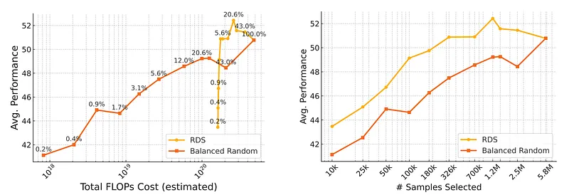

# Papers Explained 338 - Large-Scale Data Selection for Instruction Tuning

This work presents a systematic study of how well data selection methods scale, It finds that:

This page ingests the source article into the wiki and connects it to [[Papers Explained Corpus]], [[Synthetic Data]], [[Model Compression and Efficiency]], [[Evaluation and Benchmarks]], [[Supervised Fine-Tuning]], [[Model Distillation]].

## Source Metadata

- Source file: `raw/2025-03-26_Papers-Explained-338--Large-Scale-Data-Selection-for-Instruction-Tuning-72ef9f8221aa.md`
- Source title: Papers Explained 338: Large-Scale Data Selection for Instruction Tuning
- Published: 2025-03-26
- Canonical: [https://medium.com/@ritvik19/papers-explained-338-large-scale-data-selection-for-instruction-tuning-72ef9f8221aa](https://medium.com/@ritvik19/papers-explained-338-large-scale-data-selection-for-instruction-tuning-72ef9f8221aa)

## Key Ideas

- Many recently proposed methods fall short of random selection in this setting (while using more compute), and even decline in performance when given access to larger pools of data to select over.
- A variant of representation-based data selection (RDS+), which uses weighted mean pooling of pretrained LM hidden states, consistently outperforms more complex methods across all settings tested — all whilst being more compute-efficient.
- The following data selection methods are explored, aiming to select n instances from a data pool D using a query set V (containing 10s to 100s of samples) drawn from the same distribution as the evaluation set.
- Random Selection: This baseline method involves randomly sampling n instances from D.
- Perplexity: Calculates the loss of each d ∈ D using the original base model. “Mid-ppl” selects points in the middle of the loss distribution, while “top-ppl” selects those with the highest loss.

## Notes

This work presents a systematic study of how well data selection methods scale, It finds that:

- Many recently proposed methods fall short of random selection in this setting (while using more compute), and even decline in performance when given access to larger pools of data to select over.

- A variant of representation-based data selection (RDS+), which uses weighted mean pooling of pretrained LM hidden states, consistently outperforms more complex methods across all settings tested — all whilst being more compute-efficient.

## Data Selection Methods

The following data selection methods are explored, aiming to select n instances from a data pool D using a query set V (containing 10s to 100s of samples) drawn from the same distribution as the evaluation set. Each method assigns a score to each data point d ∈ D, either directly or by aggregating scores from pairs v, d ∈ V, D.

- Random Selection: This baseline method involves randomly sampling n instances from D. A “balanced” variant uniformly samples from different data sources within D until each source is exhausted, then distributes the remaining budget equally among the remaining sources.

- Perplexity: Calculates the loss of each d ∈ D using the original base model. “Mid-ppl” selects points in the middle of the loss distribution, while “top-ppl” selects those with the highest loss.

- IFD (Iterative Feature Distillation): Trains a model on representative samples from D, then scores each d ∈ D using the ratio of the answer loss given the question to the loss of the answer alone (IFD score).

- LESS (Leveraging Experience via Selective Sampling): Trains LoRAs on a random subset of D. Scores each pair v, d ∈ V, D based on the gradient-based influence of d on v.

- Embedding: Scores each pair v, d ∈ V, D based on the cosine similarity of their embeddings, using either NV-Embed-v2 or GTR-base embedding models.

- RDS+ (Representation-based Data Similarity): A custom variant of RDS. Computes the cosine similarity for each pair v, d ∈ V, D using a position-weighted mean pool of the last hidden layer states from the model being trained.

### Selection & Aggregation

For methods scoring pairs v, d ∈ V, D, the |V| scores for each d ∈ D are aggregated. A round-robin approach iteratively adds the highest-scoring point for each v ∈ V to the selected pool until the desired size n is reached.

For multi-task scenarios, task-level aggregation is also performed. A score S[t, d] for each data point d and task t is calculated as the maximum score across all query points vt within the query set Vt for that task. A round-robin procedure then iterates over tasks, selecting the highest-scoring data point for each task until the desired dataset size is reached (after deduplication).

### Data Pool

Experiments are conducted on two large, diverse, and unbalanced data pools: TÜLU 2 unfiltered and TÜLU 3 unfiltered. These pools contain millions of samples from various sources, primarily FLAN and Open Orca, and are significantly larger than those used in prior work. Exact-match deduplication was performed to ensure sample uniqueness.

## Experiment Setup

The experimental design is extended off TÜLU 2. As TÜLU 2 is finetuned starting from Llama 2 base models, the primary experiment is with the Llama 2 7B model. Additionally, results are reported using the TÜLU 3 mixture and Llama 3.1.

For finetuning, the models are fully fine tuned for two epochs with a batch size of 1, 128 gradient accumulation steps, a learning rate of 2e−5 (1e−5 for 70B size models), linear learning rate warmup for the first 3% of training steps, and linear cooldown for the rest of training.

The mean across three random runs (including reselecting data) is reported for random base- lines and single-run scores for other settings.

## Evaluation

### Single-Task Data Selection

Models are trained on 10k samples selected by each method and evaluated separately for each task. Two pool sizes are used: a smaller pool (200k samples) and the full pool (5.8M samples). LESS performance is not evaluated on the full pool due to computational constraints.

*Figure: Single-task performance of different data selection techniques over the TÜLU 2 unfiltered set.*

*Figure: Performance against estimated compute cost of varied data selection methods when selecting 10k points from data pools consisting of 200k (left points) and 5.8M (right points) data points.*

- RDS+ performed best on average across both pool sizes.

- RDS+ achieved the best performance for individual tasks (except for SQuAD where it was second best) when selecting from the full pool.

- Several methods (PPL, Random, IFD, Embed (NV)) performed worse with the larger pool, indicating scaling issues.

- Both RDS+ and Embed (GTR) improved with the larger pool.

### Multi-task Selection

*Figure: Multi-task performance of dataset selection methods when selecting 326k samples from the full TÜLU 2 unfiltered pool.*

- RDS+ consistently outperforms other data selection methods, including human-curated mixtures and random selection.

- Embedding-based methods generally perform better than non-embedding methods for data selection.

*Figure: Multi-task performance of RDS against baselines when finetuning from Llama 3.1 8B base and selecting 939k samples from the TÜLU 3 unfiltered mixture.*

- RDS+ maintains its strong performance even when evaluated on out-of-distribution tasks, suggesting good generalization capabilities. Using a high-quality selection set like Arena Hard yields comparable results to using task-specific data.

- RDS+ also performs well with different data pools and base models, as demonstrated by its superior performance compared to the official TÜLU 3 SFT model when using TÜLU 3 data to fine-tune Llama 3.1 models.

### Scaling Multi-task Selection

- RDS+ consistently outperforms balanced random selection across different data selection sizes.

- RDS+ achieves comparable performance to training on the entire dataset while using only a fraction (around 6%) of the data. It even outperforms training on all data when selecting over 1 million samples.

- When considering the computational cost of both selection and training, RDS+ becomes more efficient than random selection when selecting larger datasets (≥ 326k samples).

- The cost of RDS+ could potentially be further reduced through optimization strategies like reusing embeddings or using smaller models for selection.

## Paper

Large-Scale Data Selection for Instruction Tuning [2503.01807](https://arxiv.org/abs/2503.01807)

## Figures

Figures from the Medium HTML export (`raw/2025-03-26_Papers-Explained-338--Large-Scale-Data-Selection-for-Instruction-Tuning-72ef9f8221aa.md`); local copies under `wiki/assets/papers-explained-338-large-scale-data-selection-for-instruction-tuning/` when download succeeded.

| Figure | Caption |
|--------|---------|
|  | Title card: Large-Scale Data Selection for Instruction Tuning. |
|  | Single-task performance of different data selection techniques over the TÜLU 2 unfiltered set. |
|  | Performance against estimated compute cost of varied data selection methods when selecting 10k points from data pools consisting of 200k (left points) and 5.8M (right points) data points. |
|  | Multi-task performance of dataset selection methods when selecting 326k samples from the full TÜLU 2 unfiltered pool. |
|  | Multi-task performance of RDS against baselines when finetuning from Llama 3.1 8B base and selecting 939k samples from the TÜLU 3 unfiltered mixture. |
|  | Models are trained on 10k samples selected by each method and evaluated separately for each task. |
## Related

- [[Papers Explained Corpus]]
- [[Synthetic Data]]
- [[Model Compression and Efficiency]]
- [[Evaluation and Benchmarks]]
- [[Supervised Fine-Tuning]]
- [[Model Distillation]]
- [[Papers Explained 337 - Logic-RL]]
- [[Papers Explained 339 - Code Guided Synthetic data generation system (CoSyn)]]

#summary #topic
