# Papers Explained 339 - Code Guided Synthetic data generation system (CoSyn)

Given a text query q about an image type, the goal is to create a synthetic multimodal dataset Dq = (I,T), where I is the image, and T is the textual instruction-tuning data (e.g., question-answer pairs). Dq is used to train a VLM to improve its ability to understand images related to q.

This page ingests the source article into the wiki and connects it to [[Papers Explained Corpus]], [[Synthetic Data]], [[Code Models]], [[Vision Language Models]], [[Large Language Models]], [[Reasoning Models]].

## Source Metadata

- Source file: `raw/2025-03-27_Papers-Explained-339--Code-Guided-Synthetic-data-generation-system--CoSyn--22b7f371906b.md`
- Source title: Papers Explained 339: Code Guided Synthetic data generation system (CoSyn)
- Published: 2025-03-27
- Canonical: [https://medium.com/@ritvik19/papers-explained-339-code-guided-synthetic-data-generation-system-cosyn-22b7f371906b](https://medium.com/@ritvik19/papers-explained-339-code-guided-synthetic-data-generation-system-cosyn-22b7f371906b)

## Key Ideas

- Given a text query q about an image type, the goal is to create a synthetic multimodal dataset Dq = (I,T), where I is the image, and T is the textual instruction-tuning data (e.g., question-answer pairs).
- P( I, T|q) = P_LM (C|q) · P (I|C) · P(LM (T| C)
- Where P_LM (C|q) represents prompting a language model to generate code C, which is executed to render the image, P (I|C) · P(LM (T| C) uses code C (without the image) as context for an LLM to generate the textual instruction-tuning data.
- Matplotlib, Plotly, and Vega-Lite are used to create different types of charts. LaTeX and HTML are used for documents and tables, while Mermaid and Graphviz generate diagrams. SVG and Asymptote are utilized to create vector graphics and math-related content.
- 20 pipelines are designed based on 11 rendering tools. Each pipeline follows the same procedure:

## Notes

Code Guided Synthetic data generation system (CoSyn) is a framework that leverages the coding capabilities of text-only LLMs to automatically create synthetic text-rich multimodal data. Given input text describing a target domain, CoSyn prompts an LLM to generate code (Python, HTML, LaTeX, etc.) for rendering synthetic images. With the underlying code as textual representations of the synthetic images, CoSyn can generate high-quality instruction-tuning data, again relying on a text-only LLM. Using CoSyn, a dataset comprising 400K images and 2.7M rows of vision-language instruction-tuning data is constructed.

## Problem Formulation

Given a text query q about an image type, the goal is to create a synthetic multimodal dataset Dq = (I,T), where I is the image, and T is the textual instruction-tuning data (e.g., question-answer pairs). Dq is used to train a VLM to improve its ability to understand images related to q. The core idea of the approach is using code C as the intermediate representation to bridge the image and text. The overall generation process can be decomposed as follows:

[ EQN ]

P( I, T|q) = P_LM (C|q) · P (I|C) · P(LM (T| C)

Where P_LM (C|q) represents prompting a language model to generate code C, which is executed to render the image, P (I|C) · P(LM (T| C) uses code C (without the image) as context for an LLM to generate the textual instruction-tuning data.

## CoSyn System

*Figure: The overview of CoSyn.*

The system takes a language input, such as “generate a dataset of book covers”, and outputs a multimodal dataset. Based on the input query, CoSyn selects one of 20 generation pipelines built on 11 rendering tools. The process starts with topic generation, conditioned on a sampled persona that guides the style and content. Next, the system generates data content and converts it into code, which is then executed to render synthetic images. Finally, using the code as context, the LLM generates corresponding textual instructions.

### Rendering Tools and Pipelines

Matplotlib, Plotly, and Vega-Lite are used to create different types of charts. LaTeX and HTML are used for documents and tables, while Mermaid and Graphviz generate diagrams. SVG and Asymptote are utilized to create vector graphics and math-related content. Lilypond is used to generate music sheets and RDKit for chemical structures. Customized functions are implemented for each tool to execute LLM-generated code and obtain corresponding rendered images.

20 pipelines are designed based on 11 rendering tools. Each pipeline follows the same procedure:

- Topic generation to define the theme of this synthetic example

- Data generation to populate the detailed contents

- Code generation to create executable code that renders the image

- Instruction generation conditioned on code to produce instructions, including questions, answers and explanations for chain-of-thought reasoning.

Each stage is controlled by a prompt customized for image category and rendering tool.

CoSyn adopts the 200K personas released by Persona Hub to enhance diversity during the Topic Generation stage. Each persona is a short sentence describing a personality or identity.

For the data and code generation stages, Claude-3.5-Sonnet is used for its performance in coding tasks. For instruction-tuning data generation, GPT-4o-mini is selected for its cost efficiency.

### CoSyn-400K

*Figure: CoSyn-400K dataset.*

CoSyn is used to generate a large-scale synthetic dataset of 400K images across nine categories: charts, documents, math problems, tables, diagrams, vector graphics, music sheets, electrical circuits, and chemical structures.

## Experimental Setup

The same image preprocessing and architecture as Molmo are followed, which uses an MLP layer to connect the vision encoder and a pretrained LLM. OpenAI’s CLIP (ViT-L/14 336px) is chosen as the vision backbone and Mistral-7B as the language model.

The same training strategy as Molmo, consisting of two stages is adopted:

- Pre-training on dense captions from PixMo-Cap

- Supervised fine- tuning on CoSyn-400K dataset along with the following datasets:

VQAv2, GQA, OK-VQA, OCR-VQA, A-OKVQA, ScienceQA, TabMWP, ST-VQA, TallyQA, DVQA, FigureQA, and PlotQA. These auxiliary datasets contain around 1M training images.

## Results

The model’s performance is compared against other models using seven text-rich benchmark datasets, including a zero-shot evaluation.

*Figure: Results on 7 text-rich benchmarks.*

- The 7B model achieved the highest average performance across the seven benchmarks, surpassing the second-best model (Llama 3.2 11B) by 3.9%.

- The 7B model ranked first in four out of the seven datasets and second in the remaining three.

- The zero-shot version of the 7B model outperformed most other open and closed models, even without being trained on any data from the evaluation datasets.

- The competing models often used benchmark training data, making them not true zero-shot models.

### Analysis

Ablation studies are conducted on different combinations of fine-tuning datasets (synthetic, auxiliary, and in-domain). They also evaluated the models on a novel task (NutritionQA) and existing benchmarks (ChartQA, TableVQA, DocVQA, InfoVQA) using different prompt templates (CoT and short answer).

*Figure: Ablation on training data selection.*

- Synthetic data boosts performance: Synthetic data significantly improves VLM performance, even surpassing GPT-4V in some zero-shot settings.

*Figure: Zero shot performance on NutritionQA.*

- Zero-shot generalization: CoSyn enables VLMs to generalize to novel tasks by generating task-specific synthetic data. The model trained on synthetic data achieved comparable performance to GPT-4V on NutritionQA, a novel task.

*Figure: Ablation of using Chain-of-Thought reasoning.*

- Chain-of-thought reasoning: Synthetic data with explanations facilitates chain-of-thought reasoning, improving performance on tasks requiring multi-hop reasoning (ChartQA, TableVQA, NutritionQA). However, it can negatively impact performance on benchmarks with biases towards short answers (DocVQA, InfoVQA).

*Figure: Results on human and machine-generated questions of ChartQA.*

- Mitigating biases: Synthetic data helps mitigate overfitting to biases in benchmark datasets, such as the distribution shift in question types in ChartQA. This improves performance on human-annotated questions.

### Synthetic Pointing Data

A code-guided generation system is used to synthesize pointing data. An LLM is provided with the source code of generated images and prompted to create a pointing question and modify the code to draw points on the image. The coordinates of these points are then extracted and used as training data for VLMs. This synthetic data is then used to train VLMs for click prediction tasks. The method is evaluated by comparing performance against models trained on human-annotated data.

*Figure: The overview of enabling VLMs to point through synthetic data.*

*Figure: Click accuracy on ScreenSpot.*

- Synthetic pointing data proves to be a data-efficient approach for training VLMs. A model trained on 65K synthetic samples achieves comparable performance to a model trained on 155K human-annotated samples (PixMo-point).

- Combining synthetic and human-annotated data leads to state-of-the-art performance on the ScreenSpot benchmark, outperforming existing methods like UGround, which was trained on a much larger dataset (1.3M screenshots).

## Paper

Scaling Text-Rich Image Understanding via Code-Guided Synthetic Multimodal Data Generation [2502.14846](https://arxiv.org/abs/2502.14846)

## Figures

Figures from the Medium HTML export (`raw/2025-03-27_Papers-Explained-339--Code-Guided-Synthetic-data-generation-system--CoSyn--22b7f371906b.md`); local copies under `wiki/assets/papers-explained-339-code-guided-synthetic-data-generation-system-cosyn/` when download succeeded.

| Figure | Caption |
|--------|---------|
| 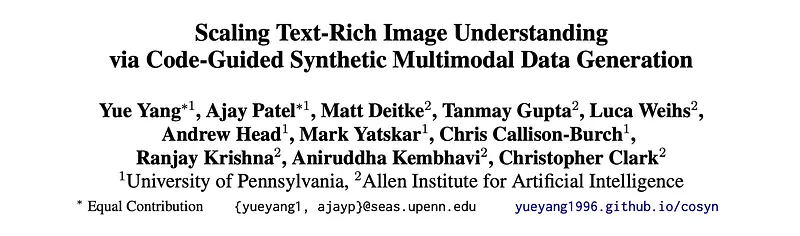 | Title card: Code Guided Synthetic data generation system (CoSyn). |
| 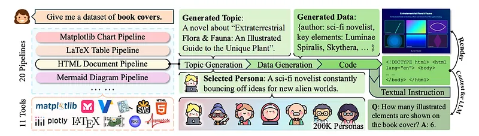 | The overview of CoSyn. |
| 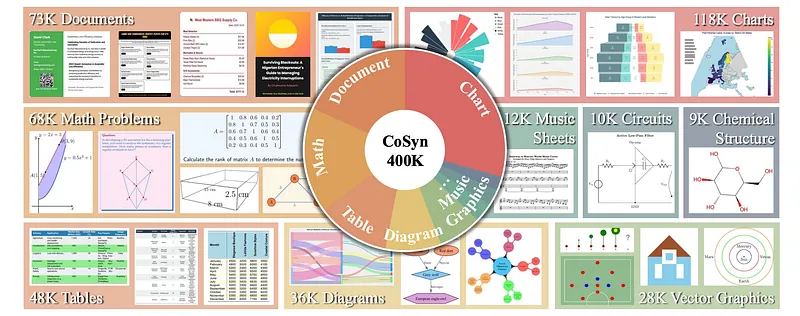 | CoSyn-400K dataset. |
| 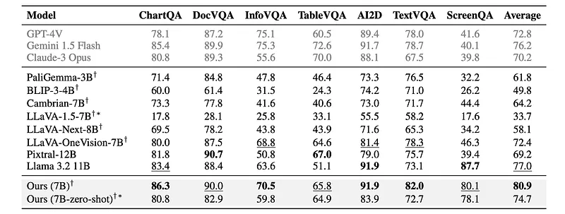 | Results on 7 text-rich benchmarks. |
| 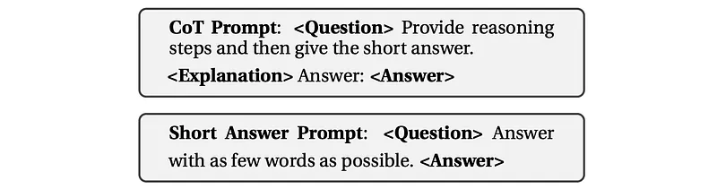 | Ablation studies are conducted on different combinations of fine-tuning datasets (synthetic, auxiliary, and in-domain). |
| 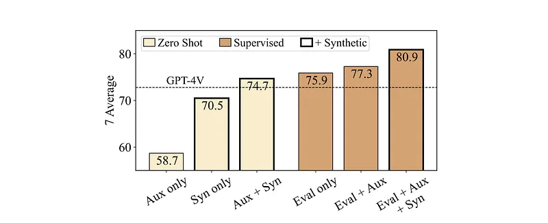 | Ablation on training data selection. |
| 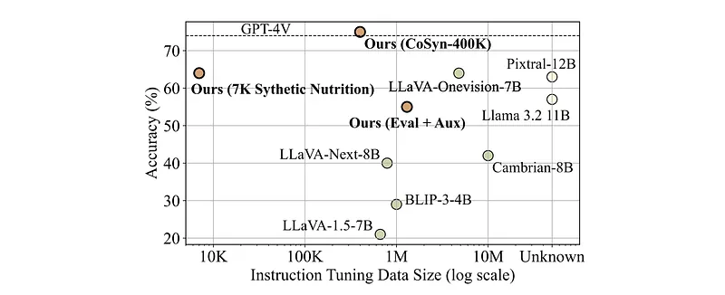 | Zero shot performance on NutritionQA. |
| 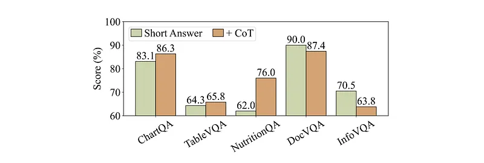 | Ablation of using Chain-of-Thought reasoning. |
| 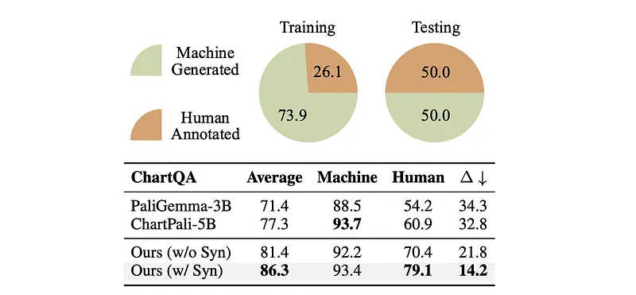 | Results on human and machine-generated questions of ChartQA. |
| 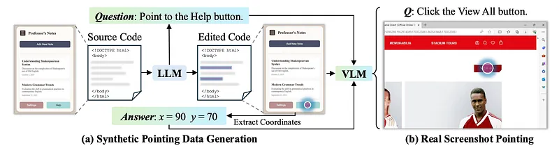 | The overview of enabling VLMs to point through synthetic data. |
| 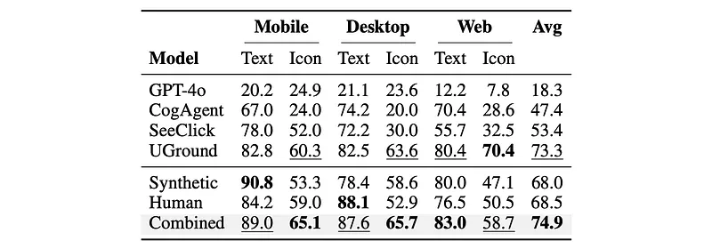 | Click accuracy on ScreenSpot. |
## Related

- [[Papers Explained Corpus]]
- [[Synthetic Data]]
- [[Code Models]]
- [[Vision Language Models]]
- [[Large Language Models]]
- [[Reasoning Models]]
- [[Papers Explained 338 - Large-Scale Data Selection for Instruction Tuning]]
- [[Papers Explained 340 - CHASE]]

#summary #topic
