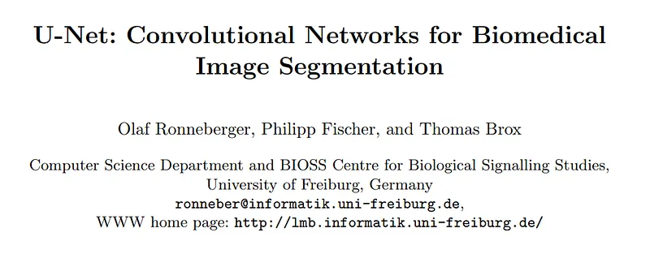
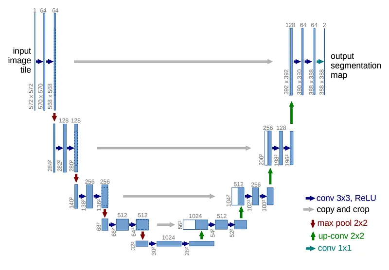
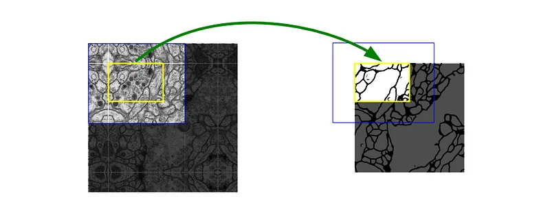
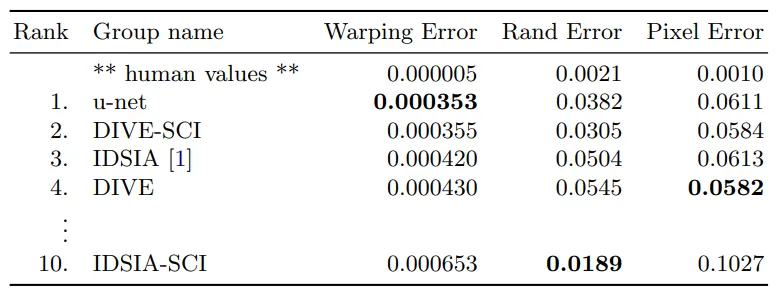
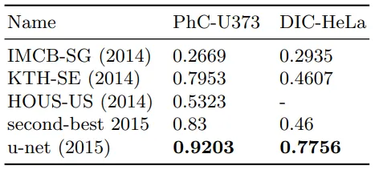

# Papers Explained 341 - U-Net

Each blue box corresponds to a multi-channel feature map. The number of channels is denoted on top of the box. The x-y-size is provided at the lower left edge of the box. White boxes represent copied feature maps. The arrows denote the different operations.

This page ingests the source article into the wiki and connects it to [[Papers Explained Corpus]], [[Computer Vision]], [[Model Compression and Efficiency]].

## Source Metadata

- Source file: `raw/2025-04-07_Papers-Explained-341--U-Net-18be21566d2.md`
- Source title: Papers Explained 341: U-Net
- Published: 2025-04-07
- Canonical: [https://medium.com/@ritvik19/papers-explained-341-u-net-18be21566d2](https://medium.com/@ritvik19/papers-explained-341-u-net-18be21566d2)

## Key Ideas

- U-Net consists of a contracting path (left) and an expansive path (right).
- To allow a seamless tiling of the output segmentation map, it is important to select the input tile size such that all 2x2 max-pooling operations are applied to a layer with an even x- and y-size.
- The application of the u-net is demonstrated to three different segmentation tasks.
- The u-net is also applied to a cell segmentation task in light microscopic images. This segmenation task is part of the ISBI cell tracking challenge 2014 and 2015.
- The first data set “PhC-U373”2 contains Glioblastoma-astrocytoma U373 cells on a polyacrylimide substrate recorded by phase contrast microscopy. It contains 35 partially annotated training images.

## Notes

U-Net consists of a contracting path (left) and an expansive path (right).

*Figure: U-net architecture.*

Each blue box corresponds to a multi-channel feature map. The number of channels is denoted on top of the box. The x-y-size is provided at the lower left edge of the box. White boxes represent copied feature maps. The arrows denote the different operations.

The contracting path follows the typical architecture of a convolutional network. It consists of the repeated application of two 3x3 convolutions (unpadded convolutions), each followed by a rectified linear unit (ReLU) and a 2x2 max pooling operation with stride 2 for downsampling. At each downsampling step the number of feature channels are doubled. Every step in the expansive path consists of an upsampling of the feature map followed by a 2x2 convolution (“up-convolution”) that halves the number of feature channels, a concatenation with the correspondingly cropped feature map from the contracting path, and two 3x3 convolutions, each followed by a ReLU. The cropping is necessary due to the loss of border pixels in every convolution. At the final layer a 1x1 convolution is used to map each 64- component feature vector to the desired number of classes. In total the network has 23 convolutional layers.

*Figure: Overlap-tile strategy for seamless segmentation of arbitrary large images. Prediction of the segmentation in the yellow area, requires image data within the blue area as input. Missing input data is extrapolated by mirroring.*

To allow a seamless tiling of the output segmentation map, it is important to select the input tile size such that all 2x2 max-pooling operations are applied to a layer with an even x- and y-size.

## Experiments

The application of the u-net is demonstrated to three different segmentation tasks.

The first task is the segmentation of neuronal structures in electron microscopic recordings. The data set is provided by the EM segmentation challenge that was started at ISBI 2012. The training data is a set of 30 images (512x512 pixels) from serial section transmission electron microscopy of the Drosophila first instar larva ventral nerve cord (VNC). Each image comes with a corresponding fully annotated ground truth segmentation map for cells (white) and membranes (black). The test set is publicly available, but its segmentation maps are kept secret. An evaluation can be obtained by sending the predicted membrane probability map to the organizers. The evaluation is done by thresholding the map at 10 different levels and computation of the “warping error”, the “Rand error” and the “pixel error”.

*Figure: Ranking on the EM segmentation challenge (march 6th, 2015), sorted by warping error.*

The u-net is also applied to a cell segmentation task in light microscopic images. This segmenation task is part of the ISBI cell tracking challenge 2014 and 2015.

The first data set “PhC-U373”2 contains Glioblastoma-astrocytoma U373 cells on a polyacrylimide substrate recorded by phase contrast microscopy. It contains 35 partially annotated training images.

The second data set “DIC-HeLa”3 are HeLa cells on a flat glass recorded by differential interference contrast (DIC) microscopy. It contains 20 partially annotated training images.

*Figure: Segmentation results (IOU) on the ISBI cell tracking challenge 2015.*

## Paper

U-Net: Convolutional Networks for Biomedical Image Segmentation [1505.04597](https://arxiv.org/abs/1505.04597)

## Figures

Figures from the Medium HTML export (`raw/2025-04-07_Papers-Explained-341--U-Net-18be21566d2.md`); local copies under `wiki/assets/papers-explained-341-u-net/` when download succeeded.

| Figure | Caption |
|--------|---------|
|  | Title card: U-Net. |
|  | U-net architecture. |
|  | Overlap-tile strategy for seamless segmentation of arbitrary large images. Prediction of the segmentation in the yellow area, requires image data within the blue area as input. Missing input data is extrapolated by mirroring. |
|  | Ranking on the EM segmentation challenge (march 6th, 2015), sorted by warping error. |
|  | Segmentation results (IOU) on the ISBI cell tracking challenge 2015. |
## Related

- [[Papers Explained Corpus]]
- [[Computer Vision]]
- [[Model Compression and Efficiency]]
- [[Papers Explained 340 - CHASE]]
- [[Papers Explained 342 - U-ViT]]

#summary #topic
