# Papers Explained 342 - U-ViT

U-ViT is a simple and general ViT-based architecture for image generation with diffusion models, characterized by treating all inputs including the time, condition and noisy image patches as tokens and employing long skip connections between shallow and deep layers.

This page ingests the source article into the wiki and connects it to [[Papers Explained Corpus]], [[Computer Vision]], [[Embedding and Retrieval]], [[Large Language Models]].

## Source Metadata

- Source file: `raw/2025-04-08_Papers-Explained-342--U-ViT-54c907b849c8.html`
- Source title: Papers Explained 342: U-ViT
- Published: 2025-04-08
- Canonical: [https://medium.com/@ritvik19/papers-explained-342-u-vit-54c907b849c8](https://medium.com/@ritvik19/papers-explained-342-u-vit-54c907b849c8)

## Key Ideas

- U-ViT is a simple and general ViT-based architecture for image generation with diffusion models, characterized by treating all inputs including the time, condition and noisy image patches as tokens and employing long skip connections between shallow and deep...
- U-ViT takes the time t, the condition c and the noisy image xt as inputs and predicts the noise injected into xt. The image is split into patches, and U-ViT treats all inputs including the time, condition and image patches as tokens (words).
- The following combinations aim to fuse the embeddings from the main branch (hm) and the long skip branch (hs) before inputting them into the next transformer block:
- Concatenation + Linear Projection: Concatenating hm and hs, then applying a linear projection.
- Direct Addition: Simply adding hm and hs.

## Notes

U-ViT is a simple and general ViT-based architecture for image generation with diffusion models, characterized by treating all inputs including the time, condition and noisy image patches as tokens and employing long skip connections between shallow and deep layers.

*Figure: The U-ViT architecture for diffusion models.*

U-ViT takes the time t, the condition c and the noisy image xt as inputs and predicts the noise injected into xt. The image is split into patches, and U-ViT treats all inputs including the time, condition and image patches as tokens (words). U-ViT optionally adds a 3×3 convolutional block before output. This is intended to improve the visual quality of the samples generated.

## Implementation Details

### The way to combine the long skip branch

The following combinations aim to fuse the embeddings from the main branch (hm) and the long skip branch (hs) before inputting them into the next transformer block:

- Concatenation + Linear Projection: Concatenating hm and hs, then applying a linear projection.

- Direct Addition: Simply adding hm and hs.

- Projection to hs + Addition: Projecting hs with a linear transformation before adding it to hm.

- Addition + Linear Projection: Adding hm and hs, then projecting the combined vector.

- Without Long Skip Connection: Comparing these methods to a scenario where the long skip connection isn’t present.

Directly adding hm and hs doesn’t significantly benefit as hm already contains information from hs through its skip connections. Other methods (2–4) involving linear projection on hs improve performance. Among these, concatenation (method 1) performs best, altering representations significantly.

### The way to feed the time into the network

Incorporating time into the model can be done in different ways.

- Tokenized Time: Time is treated as a separate token, meaning it’s embedded similarly to other tokens in the sequence.

- Adaptive Layer Normalization (AdaLN): Incorporating time information after the layer normalization in the transformer block. AdaLN works by using a linear projection of the time embedding, which is then added to the output after the layer normalization process. It’s akin to adaptive group normalization used in architectures like U-Net.

Despite the simplicity of treating time as a token, it performs better than AdaLN.

### The way to add an extra convolutional block after the transformer

- Post-Transformer Convolution: Adding a 3×3 convolutional block after the linear projection that maps token embeddings to image patches.

- Pre-Transformer Convolution: A 3×3 convolutional block is added before the linear projection. This method requires rearranging the 1D sequence of token embeddings into a 2D feature before projection.

- No Extra Convolutional Block

The first method yields slightly better performance than the other two choices.

### Variants of the patch embedding

- Original Patch Embedding: A linear projection to map an image patch directly to a token embedding.

- Convolutional Approach: A series of 3×3 convolutional blocks followed by a 1×1 convolutional block to convert the image into token embeddings.

The original patch embedding technique outperforms the convolutional approach.

### Variants of the position embedding

- 1-Dimensional Learnable Position Embedding: A 1D embedding that the model learns during training.

- 2-Dimensional Sinusoidal Position Embedding: Concatenating sinusoidal embeddings for both horizontal (i) and vertical (j) positions within a patch at position (i, j). The result is a 2D position representation.

The 1D learnable position embedding performs better than the 2D sinusoidal version. Additionally, without any position embedding, the model failed to generate meaningful images, indicating the critical role of position information in image generation tasks.

### Effect of Depth, Width and Patch Size

*Figure: Effect of depth, width and patch size.*

Increasing depth initially improves performance, but beyond a certain point (around 13 layers), further depth doesn’t enhance results.

Similarly, widening the model up to a certain point (around a hidden size of 512) improves performance, but increasing beyond that doesn’t yield gains.

Decreasing patch size also improves performance until it reaches a limit where reducing it further doesn’t help.

To manage high-resolution images efficiently, they’re first converted into low-dimensional latent representations before being processed by U-ViT.

## Experimental Setup

### Datasets

Unconditional Learning:

- CIFAR10 (contains 50K training images)

- CelebA 64×64 (contains 162,770 training images of human faces)

Class-conditional Learning

- ImageNet at 64×64, 256×256 and 512×512 resolution (contains 1,281,167 training images from 1K different classes)

Text-to-image Learning

- MS-COCO at 256×256 resolution (contains 82,783 training images and 40,504 validation images. Each image is annotated with 5 captions)

### High Resolution Image Generation

Images at 256×256 and 512×512 resolutions are first converted to latent representations at 32×32 and 64×64 resolutions respectively, using a pretrained image autoencoder provided by Stable Diffusion. Then these latent representations are modeled using the U-ViT.

### Text-to-image learning

Discrete texts are converted to a sequence of embeddings using a CLIP text. Then these embeddings are fed into U-ViT as a sequence of tokens.

### Configurations

## Evaluation

### Unconditional and Class-Conditional Image Generation

*Figure: FID results of unconditional image generation on CIFAR10 and CelebA 64×64, and class-conditional image generation on ImageNet 64×64, 256×256 and 512×512.*

- U-ViT-M with 131M parameters achieves a better FID (5.85) than IDDPM (U-Net with 100M parameters, FID 6.92).

- U-ViT-L with 287M parameters further improves FID from 5.85 to 4.26.

- U-ViT performs well in the latent space, obtaining a state-of-the-art FID of 2.29 on class-conditional ImageNet 256×256.

- Outperforms LDM under different sampling steps and VQ-Diffusion, a discrete diffusion model with a transformer backbone.

### Text-to-Image Generation

*Figure: FID results of different models on MS-COCO validation (256 × 256).*

- U-ViT-S achieves a state-of-the-art FID without requiring access to large external datasets during training

- U-ViT-S (Deep), with increased layers from 13 to 17, achieves an even better FID of 5.48

- Comparison between U-Net and U-ViT using the same random seed shows U-ViT generates higher quality samples with better semantic matching to the given text

- It is hypothesized that U-ViT’s frequent interaction between texts and images at every layer outperforms U-Net’s interaction only at cross-attention layers

## Paper

All are Worth Words: A ViT Backbone for Diffusion Models [2209.12152](https://arxiv.org/abs/2209.12152)

## Figures

Figures from the Medium HTML export (`raw/2025-04-08_Papers-Explained-342--U-ViT-54c907b849c8.html`); local copies under `wiki/assets/papers-explained-342-u-vit/` when download succeeded.

| Figure | Caption |
|--------|---------|
| 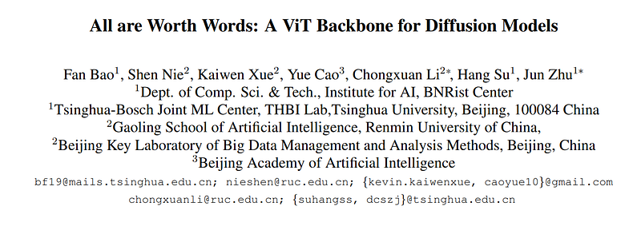 | Title card: U-ViT. |
| 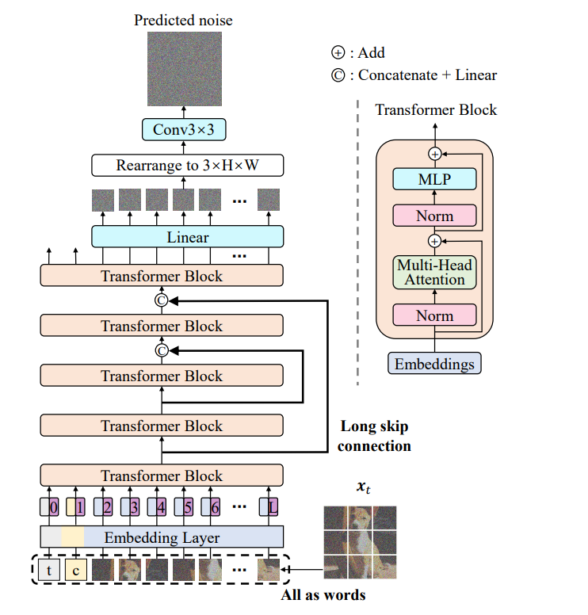 | The U-ViT architecture for diffusion models. |
| 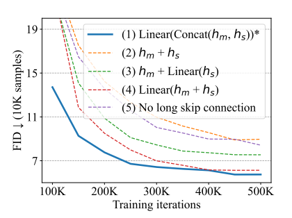 | U-ViT takes the time t, the condition c and the noisy image xt as inputs and predicts the noise injected into xt. |
| 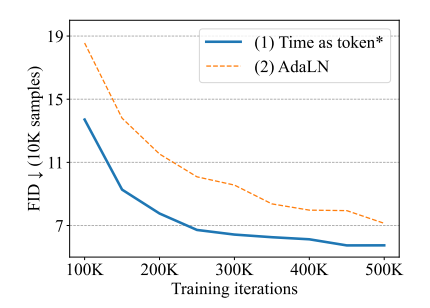 | Directly adding hm and hs doesn’t significantly benefit as hm already contains information from hs through its skip connections. |
| 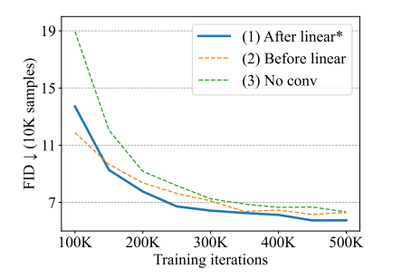 | Despite the simplicity of treating time as a token, it performs better than AdaLN. |
| 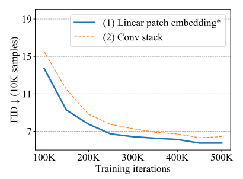 | The first method yields slightly better performance than the other two choices. |
| 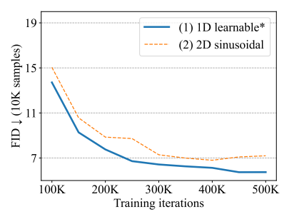 | The original patch embedding technique outperforms the convolutional approach. |
| 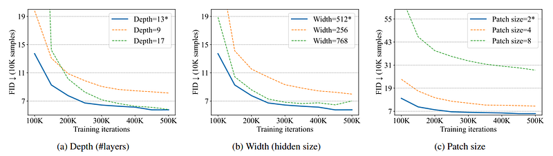 | Effect of depth, width and patch size. |
| 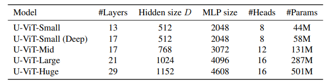 | Discrete texts are converted to a sequence of embeddings using a CLIP text. |
| 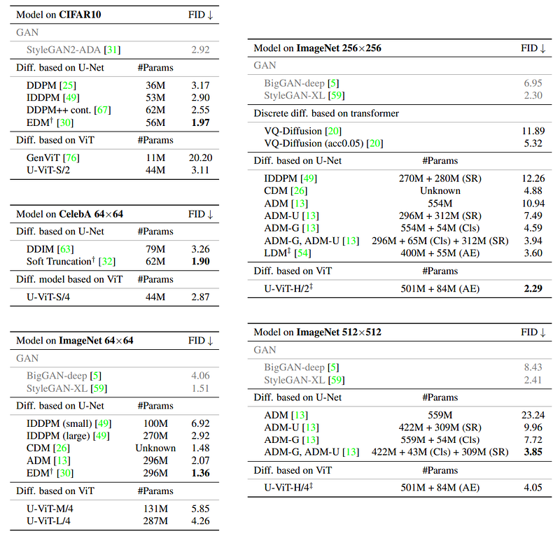 | FID results of unconditional image generation on CIFAR10 and CelebA 64×64, and class-conditional image generation on ImageNet 64×64, 256×256 and 512×512. |
| 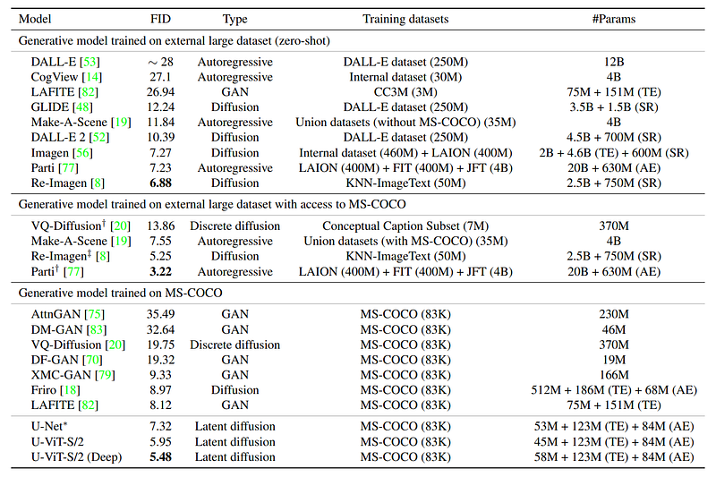 | FID results of different models on MS-COCO validation (256 × 256). |
## Related

- [[Papers Explained Corpus]]
- [[Computer Vision]]
- [[Embedding and Retrieval]]
- [[Large Language Models]]
- [[Papers Explained 341 - U-Net]]
- [[Papers Explained 343 - LSNet]]

#summary #topic
