# Papers Explained 343 - LSNet

Token mixing aims to generate a feature representation (yi) for each token (xi) based on its contextual region (N(xi)). This process involves two key steps:

This page ingests the source article into the wiki and connects it to [[Papers Explained Corpus]], [[Model Compression and Efficiency]].

## Source Metadata

- Source file: `raw/2025-04-09_Papers-Explained-343--LSNet-22fc08fec1ae.html`
- Source title: Papers Explained 343: LSNet
- Published: 2025-04-09
- Canonical: [https://medium.com/@ritvik19/papers-explained-343-lsnet-22fc08fec1ae](https://medium.com/@ritvik19/papers-explained-343-lsnet-22fc08fec1ae)

## Key Ideas

- The project is available at [GitHub](https://github.com/jameslahm/lsnet).
- Perception (P): Extracting contextual information and capturing relationships among tokens.
- Aggregation (A): Integrating features based on the perception outcome, incorporating information from other tokens.
- The general formula for token mixing is:
- Self-attention calculates attention scores between a token (xi) and all other tokens in the feature map (X) through pairwise correlations. These scores, after softmax normalization, weight the features of X to obtain the output representation (yi).

## Notes

This paper draws inspiration from the dynamic heteroscale vision ability inherent in the efficient human vision system and proposes a “See Large, Focus Small” strategy for lightweight vision network design. The paper introduces LS (Large-Small) convolution, which combines large-kernel perception and small-kernel aggregation. It can efficiently capture a wide range of perceptual information and achieve precise feature aggregation for dynamic and complex visual representations, thus enabling proficient processing of visual information.

The project is available at [GitHub](https://github.com/jameslahm/lsnet).

## Revisiting Self-Attention and Convolution

*Figure: Comparison of self-attention, convolution, and LS conv.*

Token mixing aims to generate a feature representation (yi) for each token (xi) based on its contextual region (N(xi)). This process involves two key steps:

- Perception (P): Extracting contextual information and capturing relationships among tokens.

- Aggregation (A): Integrating features based on the perception outcome, incorporating information from other tokens.

The general formula for token mixing is:

### Self-Attention

Self-attention calculates attention scores between a token (xi) and all other tokens in the feature map (X) through pairwise correlations. These scores, after softmax normalization, weight the features of X to obtain the output representation (yi).

- Perception (Pattn): Obtains attention scores via pairwise correlations.

- Aggregation (Aattn): Weights features of X by attention scores.

Limitations of Self-Attention:

- Redundant Attention and Excessive Aggregation: Self-attention performs computations even in less informative regions, leading to inefficiency.

- Homoscale Contextual Processing: Operates at the same contextual scale for all tokens, resulting in high computational complexity when expanding the perception range. This makes it challenging to balance representation capability and efficiency in lightweight models.

### Convolution

Convolution utilizes a fixed kernel (Wconv) to aggregate features within a local neighborhood (NK(xi)) around the token (xi). The kernel weights determine the aggregation weights based on relative positions.

- Perception (Pconv): Derives aggregation weights from relative positions

- Aggregation (Aconv): Convolves features in NK(xi) using the kernel weights

⊛ denotes the convolution operation.

Limitations of Convolution:

- Limited Perception Range: The token mixing scope is restricted by the kernel size (K), which is usually small in lightweight models.

- Fixed and Shared Aggregation Weights: The relationship between tokens is solely based on relative positions and is fixed for all tokens. This prevents adaptive contextual modeling and limits expressive ability, particularly impactful in lightweight networks with inherently smaller modeling capacity.

## LS (Large-Small) Convolution

*Figure: Illustration of the proposed LS convolution.*

The LS (Large-Small) Convolution, inspired by the human vision system, aims to efficiently mix tokens in lightweight models by employing a “See Large, Focus Small” strategy. This strategy involves two main steps:

- Large-Kernel Perception: Captures broad contextual information using a large receptive field.

- Small-Kernel Aggregation: Adaptively integrates features within a smaller, highly related context.

The fundamental process of LS Convolution is thus:

where:

- yi: The output feature for token xi.

- xi: The input token.

- P(xi, NP(xi)): The perception operation applied to token xi using a large contextual region NP(xi).

- A(…, NA(xi)): The aggregation operation using a smaller contextual region NA(xi), taking the output of the perception operation as input.

- NP(xi): Large contextual region around token xi.

- NA(xi): Small contextual region around token xi.

### Large-Kernel Perception

Large-Kernel Perception first reduces the channel dimension using a point-wise convolution, then applies a large-kernel depth-wise convolution to capture a wide field of view, and finally uses another point-wise convolution to generate weights for the aggregation step. The use of depthwise convolution makes this process computationally efficient.

where:

- wi: The context-adaptive weights generated for token xi. These weights are used in the subsequent aggregation step.

- Pls(xi, NKL(xi)): Large-kernel perception operation on token xi using a neighborhood of size KL x KL (N_KL(xi)).

- PW(…): Point-wise convolution, used for dimensionality reduction and to model spatial relationships.

- DW_KL×KL(…): Depth-wise convolution with a kernel size of KL x KL, efficiently capturing large-field spatial context.

- N_KL(xi): The neighborhood of size KL x KL centered around xi.

### Small-Kernel Aggregation

Small-Kernel Aggregation divides the channels into groups and applies group-specific, dynamically generated weights (from Large-Kernel Perception) to aggregate features within a small neighborhood. This allows for adaptive and efficient integration of highly relevant contextual information. Sharing weights within groups reduces computational cost. The convolution operation effectively blends the neighborhood features using the learned weights.

where:

- yic: The aggregated feature representation for the c-th channel of token xi.

- Als(…): The small-kernel aggregation operation.

- w*_i: The reshaped weights generated by LKP for token xi, specific to channel group g. The reshaping operation transforms the weight vector wi into a kernel w*i of size RG x KS x KS, where KS x KS is the small kernel size and G is the number of groups the channels are divided into.

- w*g_i: The aggregation weights for the g-th group, derived from w_i. Each group of channels shares the same aggregation weights.

- N_KS(xic): The neighborhood of size KS x KS centered around the c-th channel of xi.

- ⊛: Convolution operation between the reshaped weights and the neighborhood features.

## LSNet: Large-Small Network

*Figure: Illustration of the proposed LSNet.*

LSNet is built using LS convolution as the primary operation. The basic block LS Block utilizes:

- LS Convolution: Performs effective token mixing.

- Skip Connection: Facilitates model optimization.

- Depth-wise Convolution and SE Layer: Enhances model capability by introducing local inductive bias.

- Feed Forward Network (FFN): Used for channel mixing.

LSNet utilizes overlapping patch embedding to project the input image into the visual feature map. It employs depth-wise and point-wise convolution to reduce spatial resolution and modulate channel dimension. LS Blocks are stacked in the top three stages. In the final stage, with lower resolution, Multi-head Self-Attention (MSA) blocks are used to capture long-range dependencies. Similar to the LS Block, depth-wise convolution and an SE layer are incorporated to introduce local structural information.

Following common practices, more blocks are employed in later stages as processing at higher resolutions in earlier stages is more computationally expensive.

Default values used are KL = 7, KS = 3, and G = C/8, based on established practices.

Three variants of LSNet are available for different computational budgets:

- LSNet-T (Tiny): 0.3G FLOPs

- LSNet-S (Small): 0.5G FLOPs

- LSNet-B (Base): 1.3G FLOPs

## Experiments

### Image Classification

*Figure: Classification results on ImageNet-1K.*

- LSNet consistently achieves state-of-the-art performance across various computational costs, demonstrating the best trade-offs between accuracy and inference speed.

- LSNet-B outperforms AFFNet by 0.5% in top-1 accuracy with ~3x faster inference speed. It also surpasses RepViT-M1.1 and FastViT-T12 by 0.9% and 1.2% in top-1 accuracy, respectively, with higher efficiency.

- Smaller LSNet models (LSNet-S and LSNet-T) also achieve superior performance with lower computational costs compared to other models like UniRepLKNet-A, FasterNet-T1, StarNet-S1, and EfficientViT-M3.

### Downstream Tasks

Object Detection and Instance Segmentation

*Figure: Object detection and instance segmentation results on COCO.*

- LSNet consistently outperforms competitor models in object detection and instance segmentation tasks on the COCO-2017 dataset, achieving higher Average Precision (AP) scores with often lower computational costs.

- Specifically, LSNet variants outperform models like StarNet, PoolFormer, PVT, SHViT, EfficientViT, and RepViT.

Semantic Segmentation

*Figure: Semantic segmentation on ADE20K.*

- LSNet demonstrates superior performance in semantic segmentation tasks on the ADE20K dataset across different model scales, achieving higher mean Intersection over Union (mIoU) scores compared to competitor models like VAN, PVTv2, RepViT, SHViT, SwiftFormer, and FastViT, often with lower computational complexity.

## Paper

LSNet: See Large, Focus Small [2503.23135](https://arxiv.org/abs/2503.23135)

## Figures

Figures from the Medium HTML export (`raw/2025-04-09_Papers-Explained-343--LSNet-22fc08fec1ae.html`); local copies under `wiki/assets/papers-explained-343-lsnet/` when download succeeded.

| Figure | Caption |
|--------|---------|
| 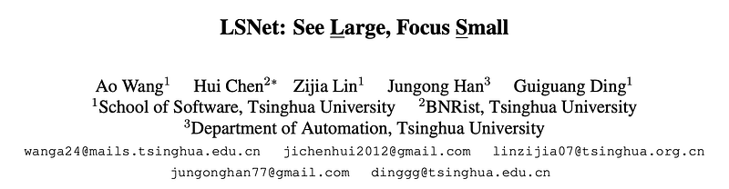 | Title card: LSNet. |
| 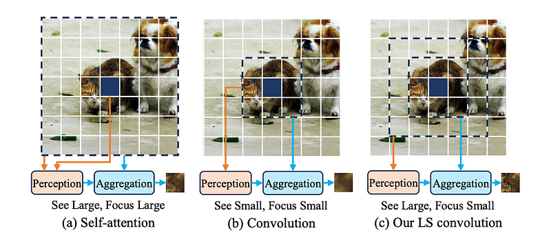 | Comparison of self-attention, convolution, and LS conv. |
|  | The general formula for token mixing is. |
| 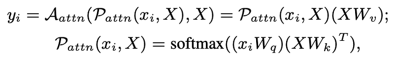 | Limitations of Self-Attention. |
| 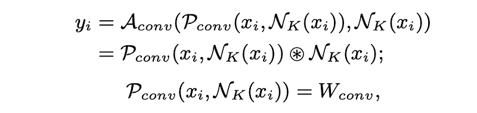 | Convolution utilizes a fixed kernel (Wconv) to aggregate features within a local neighborhood (NK(xi)) around the token (xi). |
| 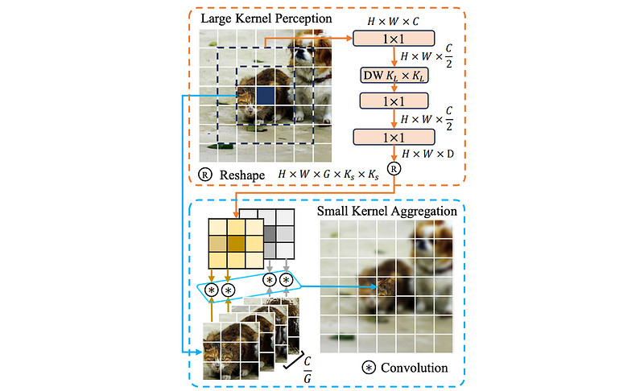 | Illustration of the proposed LS convolution. |
|  | The fundamental process of LS Convolution is thus. |
| 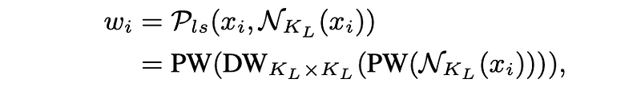 | where. |
| 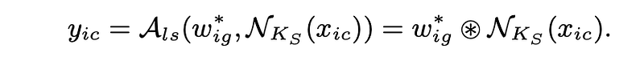 | where. |
| 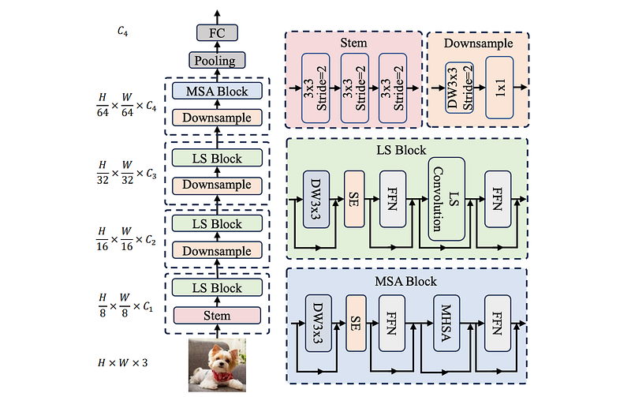 | Illustration of the proposed LSNet. |
| 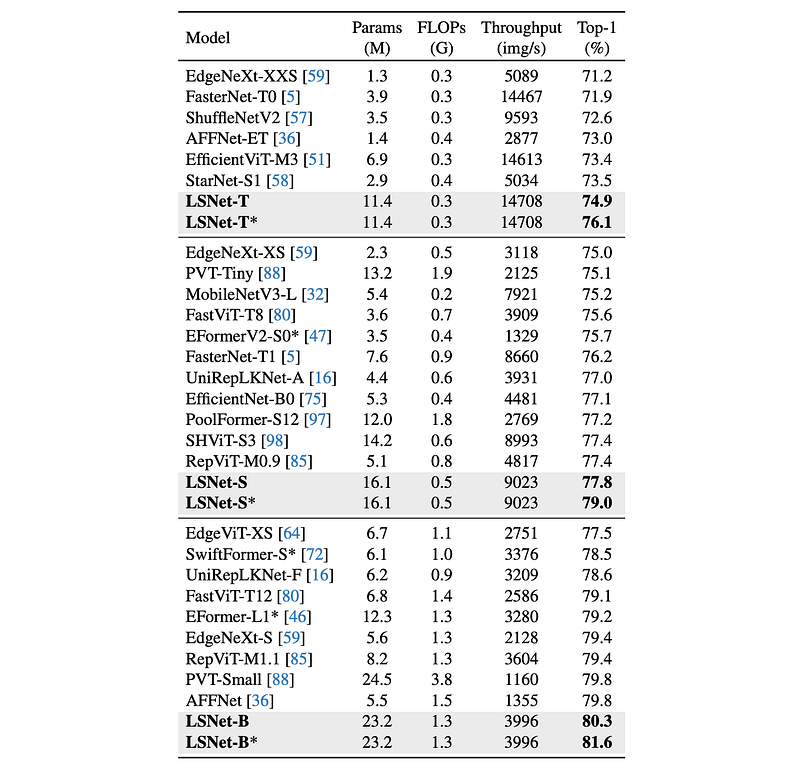 | Classification results on ImageNet-1K. |
| 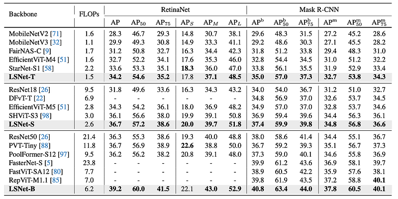 | Object detection and instance segmentation results on COCO. |
| 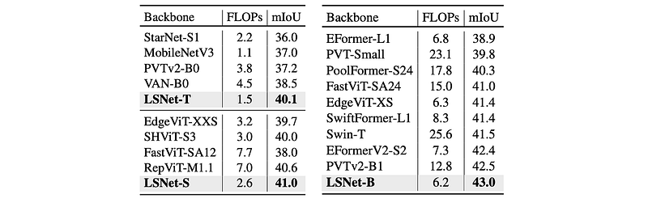 | Semantic segmentation on ADE20K. |
## Related

- [[Papers Explained Corpus]]
- [[Model Compression and Efficiency]]
- [[Papers Explained 342 - U-ViT]]
- [[Papers Explained 344 - What do Vision Transformers Learn]]

#summary #topic
