# Papers Explained 344 - What do Vision Transformers Learn

This study addresses the obstacles to performing visualizations in ViTs and analyzes the mechanism of various ViT variants, including DeiT, CoaT, ConViT, PiT, Swin, and Twin, to conclude the following:

This page ingests the source article into the wiki and connects it to [[Papers Explained Corpus]], [[Computer Vision]], [[Large Language Models]], [[Vision Language Models]], [[Code Models]].

## Source Metadata

- Source file: `raw/2025-04-10_Papers-Explained-344--What-do-Vision-Transformers-Learn-ef4a80da46d8.html`
- Source title: Papers Explained 344: What do Vision Transformers Learn
- Published: 2025-04-10
- Canonical: [https://medium.com/@ritvik19/papers-explained-344-what-do-vision-transformers-learn-ef4a80da46d8](https://medium.com/@ritvik19/papers-explained-344-what-do-vision-transformers-learn-ef4a80da46d8)

## Key Ideas

- The neurons in ViTs trained with language model supervision (e.g., CLIP) are activated by semantic concepts rather than visual features.
- ViTs also detect image background features, just like CNNs, but their predictions depend far less on high-frequency information.
- Both architecture types behave similarly in the way features progress from abstract patterns in early layers to concrete objects in late layers.
- ViTs maintain spatial information in all layers except the final layer, where spatial information is discarded and behaves as a global pooling operation.
- The code repository is available at: https://github.com/hamidkazemi22/vit-visualization

## Notes

This study addresses the obstacles to performing visualizations in ViTs and analyzes the mechanism of various ViT variants, including DeiT, CoaT, ConViT, PiT, Swin, and Twin, to conclude the following:

- The neurons in ViTs trained with language model supervision (e.g., CLIP) are activated by semantic concepts rather than visual features.

- ViTs also detect image background features, just like CNNs, but their predictions depend far less on high-frequency information.

- Both architecture types behave similarly in the way features progress from abstract patterns in early layers to concrete objects in late layers.

- ViTs maintain spatial information in all layers except the final layer, where spatial information is discarded and behaves as a global pooling operation.

The code repository is available at: https://github.com/hamidkazemi22/vit-visualization

Recommended Reading: [Papers Explained 25: Vision Transformers](https://medium.com/dair-ai/papers-explained-25-vision-transformers-e286ee8bc06b)

## ViT Feature Visualization

Gradient steps are taken to maximize feature activations, starting from random noise. To enhance the image quality, total variation is penalized, and the Jitter augmentation, ColorShift augmentation, and augmentation ensembling are employed. It is found that Gaussian smoothing facilitates better visualization in experiments, as is commonly observed in feature visualization.

ViT represents each patch pof an input image x at a specific layer l by using arrays A with multiple entries for each patch. These arrays contribute to forming a feature vector f, where each entry in the vector comes from concatenating specific entries from each patch’s array. The optimization objective is to maximize the sum of these entries in the feature vector over the inputs. The main loss is then

Total variation regularization λTV(x) is introduced by adding a term to control the smoothness of the visualization. Augmenting input images and optimizing over these augmented versions ak(x) enhances the final visualization quality. Finally, the optimization problem is:

To better understand the content of a visualized feature, every visualization is paired with images from the ImageNet validation/train set that most strongly activate the relevant feature. The majority of the demonstrations throughout the paper use ViT-B16.

Features of the multi-headed attention layer are visualized, including visualization of the keys, queries, and values, by performing activation maximization. The visualized feedforward features are found to be significantly more interpretable than other layers.

*Figure: The output of the GELU layers is visualized in the experiments.*

It is hypothesized that the network exploits these high-dimensional spaces to store relatively disentangled representations. On the other hand, compressing the features into a lower dimensional space may result in the jumbling of features, yielding uninterpretable visualizations.

## Last Layer Token Mixing

It is observed that ViTs learn to preserve spatial information, despite lacking the inductive bias of CNNs. However the last layer of the network behaves differently and instead appears to serve a role similar to average pooling.

ViTs use a fully connected layer applied only on the CLS token. It is possible that the network globalizes information in the last layer to ensure that the CLS token has access to the entire image. It is hypothesized that the CLS token plays a relatively minor role throughout the network and is not used for globalization until the last layer.

*Figure: “Isolating CLS” denotes the experiment where attention is only performed between patches before the final attention block, while “Patch Average” and “Patch Maximum” refer to the experiment in which the classification head is placed on top of individual patches without fine-tuning.*

Interestingly, when the network is tested by removing access to the CLS token in earlier layers and only reintroducing it in the last layer, the network could still classify images fairly well. This indicates that the CLS token primarily gathers global information only in the final stage.

*Figure: Heat map of classification accuracy on the validation set when the classification head trained to classify images is applied on the top of the CLS token to the other patches.*

In another experiment, the fully connected layer trained to classify images on top of the CLS token is taken, and without any fine-tuning or adaptation, and applied to each patch, one at a time. This setup still successfully classifies the images pretty accurately showing that the last-layer globalization behavior is not exclusive to the CLS token, but actually occurs across every patch in the last layer.

## Comparison of ViTs And CNNs

Like CNNs, ViTs also go through layers that notice basic things like colors and edges, then move to more complex details like objects.

*Figure: The progression for visualized features of ViT B-32.*

*Figure: Feature activation maps in internal layers can effectively segment the contents of an image with respect to a semantic concept.*

The reliance of ViTs and CNNs on background and foreground image features is also examined by masking out the foreground or background on a set of evaluation images using the bounding boxes provided by ImageNet.

*Figure: ViTs more effectively correlate background information with correct class.*

*Figure: ViTs more effectively correlate background information with correct class.*

ViTs seem good at using background info to identify things, while CNNs rely on both background and foreground. Even when parts of the image are removed, ViTs still perform well, unlike CNNs.

To study the role of texture in model predictions, the high-frequency components from ImageNet test images are filtered out via low-pass filtering. While the predictions of ResNets suffer greatly when high-frequency texture information is removed from their inputs, ViTs seem resilient.

*Figure: Effect of low-pass filtering on top-1 ImageNet accuracy.*

CNNs are more dependent on high frequency textural image information than ViTs.

## ViTs With Language Model Supervision

Training ViTs with Language Supervision would require the network to extract features not only suitable for detecting nouns (e.g. simple class labels like ‘bird’), but also modifying phrases like prepositions and epithets, Several such features are observed that are not present in ViTs trained solely as image classifiers.

*Figure: Left: Feature optimization shows sharp boundaries, and maximally activating ImageNet examples contain distinct, adjacent images. Middle: Feature optimization and maximally activating ImageNet photos all show images from an elevated vantage point. Right: Feature optimization shows a crowd of people, but maximally activating images indicate that the repetition of objects is more relevant than the type of object.*

*Figure: Features from ViT trained with CLIP that relates to the category of morbidity and music. Top-left image in each category: Image optimized to maximally activate a feature from layer 10. Rest: Seven of the ten ImageNet images that most activate the feature.*

## Conclusion

- ViTs preserve spatial information of the patches even for individual channels across all layers with the exception of the last layer, indicating that the networks learn spatial relationships from scratch.

- The sudden disappearance of localization information in the last attention layer results from a learned token mixing behavior that resembles average pooling.

- ViTs make better use of background information and are able to make vastly superior predictions relative to CNNs when exposed only to image backgrounds.

- The two architectures share a common property whereby earlier layers learn textural attributes, whereas deeper layers learn high level object features or abstract concepts.

- ViTs trained with language model supervision learn more semantic and conceptual features, rather than object-specific visual features as is typical of classifiers.

## Paper

What do Vision Transformers Learn? A Visual Exploration [2212.06727](https://arxiv.org/abs/2212.06727)

## Figures

Figures from the Medium HTML export (`raw/2025-04-10_Papers-Explained-344--What-do-Vision-Transformers-Learn-ef4a80da46d8.html`); local copies under `wiki/assets/papers-explained-344-what-do-vision-transformers-learn/` when download succeeded.

| Figure | Caption |
|--------|---------|
| 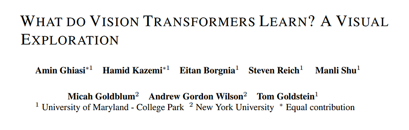 | Title card: What do Vision Transformers Learn. |
| 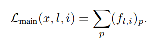 | ViT represents each patch pof an input image x at a specific layer l by using arrays A with multiple entries for each patch. |
| 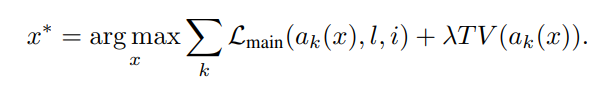 | Total variation regularization λTV(x) is introduced by adding a term to control the smoothness of the visualization. |
| 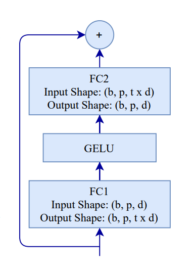 | The output of the GELU layers is visualized in the experiments. |
| 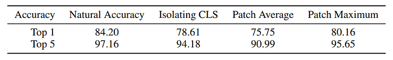 | “Isolating CLS” denotes the experiment where attention is only performed between patches before the final attention block, while “Patch Average” and “Patch Maximum” refer to the experiment in which the classification head is placed on top of individual patches without fine-tuning. |
| 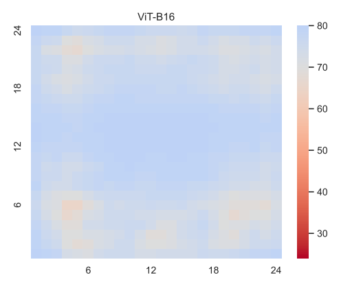 | Heat map of classification accuracy on the validation set when the classification head trained to classify images is applied on the top of the CLS token to the other patches. |
| 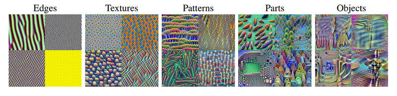 | The progression for visualized features of ViT B-32. |
| 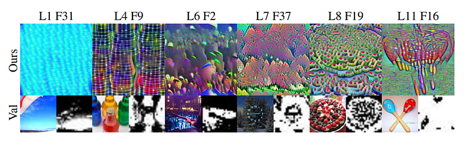 | Feature activation maps in internal layers can effectively segment the contents of an image with respect to a semantic concept. |
| 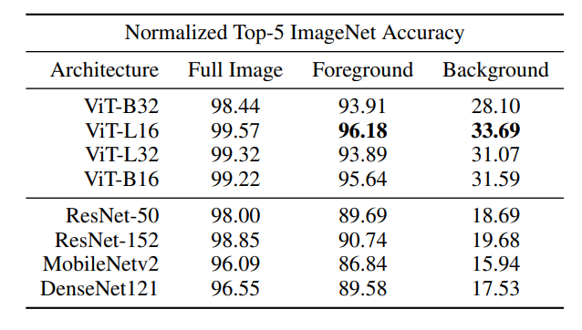 | ViTs more effectively correlate background information with correct class. |
| 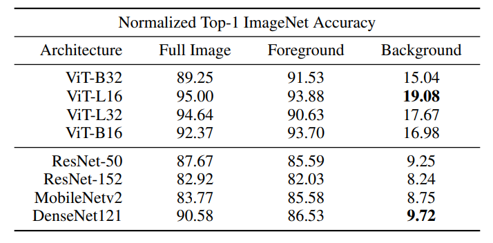 | ViTs more effectively correlate background information with correct class. |
| 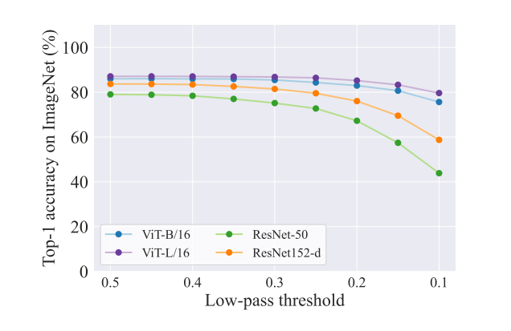 | Effect of low-pass filtering on top-1 ImageNet accuracy. |
| 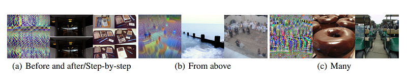 | Left: Feature optimization shows sharp boundaries, and maximally activating ImageNet examples contain distinct, adjacent images. Middle: Feature optimization and maximally activating ImageNet photos all show images from an elevated vantage point. Right: Feature optimization shows a crowd of people, but maximally activating images indicate that the repetition of objects is more relevant than the type of object. |
| 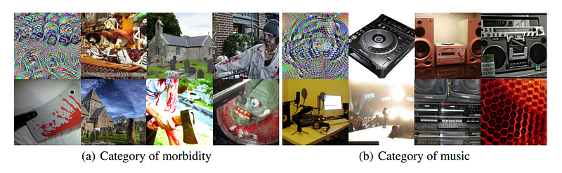 | Features from ViT trained with CLIP that relates to the category of morbidity and music. Top-left image in each category: Image optimized to maximally activate a feature from layer 10. Rest: Seven of the ten ImageNet images that most activate the feature. |
## Related

- [[Papers Explained Corpus]]
- [[Computer Vision]]
- [[Large Language Models]]
- [[Vision Language Models]]
- [[Code Models]]
- [[Papers Explained 343 - LSNet]]
- [[Papers Explained 345 - ConvNets Match Vision Transformers at Scale]]

#summary #topic
