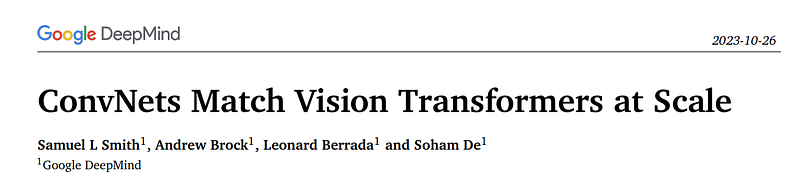
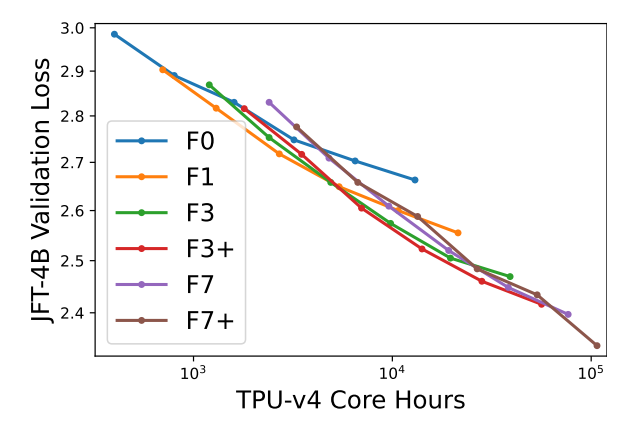
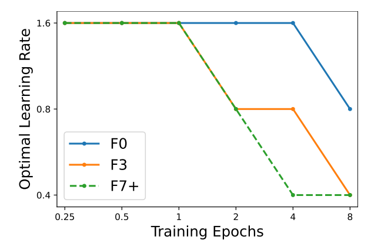
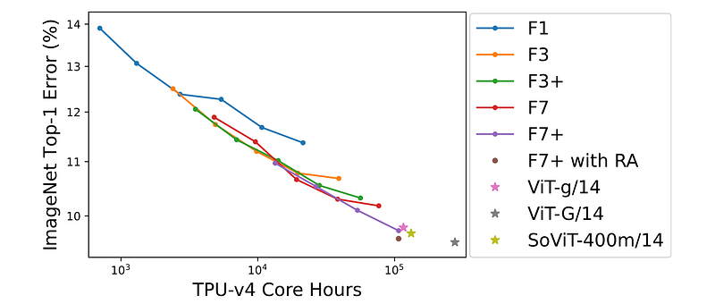

# Papers Explained 345 - ConvNets Match Vision Transformers at Scale

To address this gap, the study evaluates NFNet models, a pure convolutional architecture, by pre-training on a dataset and observing a scaling law between validation loss and compute budget.

This page ingests the source article into the wiki and connects it to [[Papers Explained Corpus]], [[Computer Vision]], [[Synthetic Data]], [[Large Language Models]].

## Source Metadata

- Source file: `raw/2025-04-11_Papers-Explained-345--ConvNets-Match-Vision-Transformers-at-Scale-496690f604c7.html`
- Source title: Papers Explained 345: ConvNets Match Vision Transformers at Scale
- Published: 2025-04-11
- Canonical: [https://medium.com/@ritvik19/papers-explained-345-convnets-match-vision-transformers-at-scale-496690f604c7](https://medium.com/@ritvik19/papers-explained-345-convnets-match-vision-transformers-at-scale-496690f604c7)

## Key Ideas

- Recommended Reading: [Papers Explained 25: Vision Transformers](https://medium.com/dair-ai/papers-explained-25-vision-transformers-e286ee8bc06b) [Papers Explained 84: NF Net](https://ritvik19.medium.com/papers-explained-84-nf-net-b8efa03d6b26)
- NFNet Models are trained for a range of epoch budgets between 0.25 and 8 with varying depth and width on JFT-4B dataset.
- Cosine decay learning rate schedule is used for training.
- Base learning rate is tuned separately for each epoch budget on a small logarithmic grid.
- A linear trend is observed matching the scaling laws observed for language modelling (log-log scaling law between validation loss and pre-training compute).

## Notes

Convolutional Neural Networks (ConvNets) initially led the way for deep learning success. Despite dominating computer vision benchmarks for nearly a decade, they have recently faced competition from Vision Transformers (ViTs). The shift in evaluating network performance from specific datasets to pre-training on general-purpose web datasets prompts a critical question: do Vision Transformers outperform ConvNets with similar computational budgets? While the belief in ViTs’ superior scaling properties prevails, there’s a lack of substantial evidence supporting this claim.

To address this gap, the study evaluates NFNet models, a pure convolutional architecture, by pre-training on a dataset and observing a scaling law between validation loss and compute budget.

Recommended Reading: [Papers Explained 25: Vision Transformers](https://medium.com/dair-ai/papers-explained-25-vision-transformers-e286ee8bc06b) [Papers Explained 84: NF Net](https://ritvik19.medium.com/papers-explained-84-nf-net-b8efa03d6b26)

## Pre-trained NFNets obey scaling laws

- NFNet Models are trained for a range of epoch budgets between 0.25 and 8 with varying depth and width on JFT-4B dataset.

- Cosine decay learning rate schedule is used for training.

- Base learning rate is tuned separately for each epoch budget on a small logarithmic grid.

*Figure: Held out loss of NFNets on JFT-4B, plotted against the compute used during training. Both axes are log-scaled, and each curve denotes a different model trained for a range of epoch budgets.*

- A linear trend is observed matching the scaling laws observed for language modelling (log-log scaling law between validation loss and pre-training compute).

- Optimal model size and epoch budget increase as compute budget increases.

- A rule of thumb is to scale model size and training epochs at the same rate.

*Figure: Optimal learning rate for different models across epoch budgets*

- The optimal learning rate behaves predictably and is easy to tune.

- All models show similar optimal learning rates 𝛼 ∼ 1.6 when the epoch budget is small.

- The learning rate falls slowly as model size and epoch budget increases.

- Some pre-trained models do not perform as expected, potentially due to data loading pipeline issues causing under-sampling of training examples.

## Fine-tuned NFNets are competitive with Vision Transformers on ImageNet

*Figure: ImageNet Top-1 error, after fine-tuning pre-trained NFNet models for 50 epochs. Both axes are log-scaled.*

- Performance improves consistently as the compute used during pre-training increases.

- Slightly larger learning rates during pre-training sometimes led to better performance post fine-tuning.

- The largest model (F7+) achieves comparable performance to that reported for pre-trained ViTs with a similar compute budget.

- The performance of this model improved further when fine-tuned with repeated augmentation (RA).

## Conclusion

- The most important factors determining the performance of a sensibly designed model are the compute and data available for training

- There is no strong evidence to suggest that pre-trained ViTs outperform pre-trained ConvNets when evaluated fairly.

- ViTs may have practical advantages in specific contexts, such as the ability to use similar model components across multiple modalities.

## Paper

ConvNets Match Vision Transformers at Scale [2310.16764](https://arxiv.org/abs/2310.16764)

## Figures

Figures from the Medium HTML export (`raw/2025-04-11_Papers-Explained-345--ConvNets-Match-Vision-Transformers-at-Scale-496690f604c7.html`); local copies under `wiki/assets/papers-explained-345-convnets-match-vision-transformers-at-scale/` when download succeeded.

| Figure | Caption |
|--------|---------|
|  | Title card: ConvNets Match Vision Transformers at Scale. |
|  | Held out loss of NFNets on JFT-4B, plotted against the compute used during training. Both axes are log-scaled, and each curve denotes a different model trained for a range of epoch budgets. |
|  | Optimal learning rate for different models across epoch budgets. |
|  | ImageNet Top-1 error, after fine-tuning pre-trained NFNet models for 50 epochs. Both axes are log-scaled. |
## Related

- [[Papers Explained Corpus]]
- [[Computer Vision]]
- [[Synthetic Data]]
- [[Large Language Models]]
- [[Papers Explained 344 - What do Vision Transformers Learn]]
- [[Papers Explained 346 - SmolVLM]]

#summary #topic
