# Papers Explained 346 - SmolVLM

SmolVLM is a family of small, efficient multimodal models designed for resource-constrained devices, achieving high performance despite limited size. SmolVLM excels in both image and video tasks, demonstrating robust video comprehension suitable for real-time, on-device applications.

This page ingests the source article into the wiki and connects it to [[Papers Explained Corpus]], [[Vision Language Models]], [[Model Compression and Efficiency]], [[Evaluation and Benchmarks]].

## Source Metadata

- Source file: `raw/2025-04-14_Papers-Explained-346--SmolVLM-9b4e208fa66b.md`
- Source title: Papers Explained 346: SmolVLM
- Published: 2025-04-14
- Canonical: [https://medium.com/@ritvik19/papers-explained-346-smolvlm-9b4e208fa66b](https://medium.com/@ritvik19/papers-explained-346-smolvlm-9b4e208fa66b)

## Key Ideas

- SmolVLM is a family of small, efficient multimodal models designed for resource-constrained devices, achieving high performance despite limited size.
- The research systematically explores design choices for small multimodal models. In these models, encoded images are pooled and projected into a SmolLM2 backbone.
- Three variants of the SmolVLM are constructed for different computational environments:
- SmolVLM-256M: combining the 93M SigLIP-B/16 and the SmolLM2–135M. Operating on < 1GB GRAM makes it ideal for resource-constrained edge applications.
- SmolVLM-500M: 93M SigLIP-B/16 paired with the SmolLM2–360M. Balancing memory efficiency and performance, it is suitable for moderate-resource edge devices.

## Notes

SmolVLM is a family of small, efficient multimodal models designed for resource-constrained devices, achieving high performance despite limited size. SmolVLM excels in both image and video tasks, demonstrating robust video comprehension suitable for real-time, on-device applications.

## Smol VLM

*Figure: SmolVLM Architecture.*

The research systematically explores design choices for small multimodal models. In these models, encoded images are pooled and projected into a SmolLM2 backbone.

Three variants of the SmolVLM are constructed for different computational environments:

- SmolVLM-256M: combining the 93M SigLIP-B/16 and the SmolLM2–135M. Operating on < 1GB GRAM makes it ideal for resource-constrained edge applications.

- SmolVLM-500M: 93M SigLIP-B/16 paired with the SmolLM2–360M. Balancing memory efficiency and performance, it is suitable for moderate-resource edge devices.

- SmolVLM-2.2B: 400M SigLIP-SO400M and a 1.7B-parameter SmolLM2 backbone. This model maximizes performance while remaining deployable on higher-end edge systems.

### How to assign compute between vision and language towers?

Three SmolLM2 variants (135M, 360M, and 1.7B parameters) are paired with two SigLIP encoders: a compact 93M SigLIP-B/16 and a larger 428M SigLIP-SO400M. Typically, larger VLMs disproportionately allocate parameters to the LM; however, as the LM is scaled down, this is no longer the case.

*Figure: Impact of vision encoder and language model sizes.*

- Performance declines significantly when using a large encoder with the smallest LM (135M), highlighting an inefficient encoder-LM balance.

- At an intermediate LM scale (360M), the larger encoder improves performance by 11.6%, yet this comes with a substantial 66% increase in parameters, making the compact encoder preferable.

- Only at the largest LM scale (1.7B), the larger encoder represents just a 10% parameter increase.

### How can we efficiently pass the images to the Language Model?

A self-attention architecture is adopted in which visual tokens from the vision encoder are concatenated with textual tokens and jointly processed by a language model. This design requires significantly more context than the 2k-token limit used in SmolLM2, as a single 512 × 512 image encoded with SigLIP-B/16 requires 1024 tokens. To address this, the context capacity is extended by increasing the RoPE base from 10k to 273k and the model is fine-tuned on a mix of long-context data (Dolma books, The Stack, and short-context sources (FineWeb-Edu, DCLM) and math from SmolLM2).

*Figure: Performance significantly improves with increased context lengths.*

- Fine-tuning was stable at 16k tokens for the 1.7B LM.

- Smaller models (135M, 360M) struggled beyond 8k tokens.

- Experiments with the 2.2B SmolVLM confirmed consistent performance gains up to 16k tokens.

- Accordingly, a 16k-token context is adopted for SmolVLM and an 8k-token limit for smaller variants.

Recent VLMs combine the self-attention architecture with token compression techniques to fit longer sequences efficiently and reduce computational overhead. One particularly effective compression method is pixel shuffle (space-to-depth), initially proposed for super-resolution tasks and recently adopted by Idefics3. Pixel shuffle rearranges spatial features into additional channels, reducing spatial resolution but increasing representational density.

*Figure: Pixel shuffle.*

This reduces the total number of visual tokens by a factor of r2, where r is the shuffle ratio. However, higher ratios collapse larger spatial regions into single tokens, impairing tasks requiring precise localization, such as OCR.

*Figure: Optimal pixel shuffle factor (PS=2 vs. PS=4) varies by model size.*

- Models like InternVL and Idefics3 use r = 2 to balance compression and spatial fidelity.

- In contrast, experiments show that smaller VLMs benefit from more aggressive compression (r = 4) as the reduced token count eases attention overhead and improves long-context modeling.

### How can we efficiently encode images and videos?

Balancing token allocation between images and videos is crucial for efficient multimodal modeling: images benefit from higher resolution and more tokens to retain fidelity, whereas videos typically require fewer tokens per frame to handle longer sequences efficiently. To achieve this, an image-splitting strategy where high-resolution images are divided into multiple sub-images along with a downsized version of the original is adopted. This approach proved effective in maintaining image quality without excessive computational overhead. For videos, however, strategies such as frame averaging, negatively impacted performance.

*Figure: Frame averaging reduces video performance.*

- Combining multiple frames significantly degraded OpenCompass-Video results, particularly at higher averaging factors (2, 4, 8).

- Consequently, frame averaging is excluded from SmolVLM’s final design, and video frames are instead rescaled to the resolution of the image encoder.

### Learned Tokens vs. String

A primary design consideration in SmolVLM involves encoding split sub-image positions effectively. Initially, simple string tokens (e.g., <row_1_col_2>) were used, which caused early training plateaus — termed the “OCR loss plague” — characterized by sudden loss drops without corresponding improvements in OCR performance.

To address instability during training, positional tokens are introduced, significantly improving training convergence and reducing stalls. Although larger models are relatively robust to using raw string positions, smaller models benefited substantially from positional tokens, achieving notably higher OCR accuracy and improved generalization across tasks.

*Figure: Tokenization Strategy Comparisons.*

- Learned positional tokens consistently outperform naive string positions on multiple image and text benchmarks.

- Models leveraging learned tokens consistently score higher in both OpenCompass-Image and OpenCompass-Video evaluations, underscoring the effectiveness of structured positional tokenization in compact multimodal models.

### Structured Text Prompts and Media Segmentation

We evaluated how system prompts and explicit media intro/outro prefixes incrementally improve SmolVLM’s performance on image and video benchmarks.

*Figure: Cumulative Effect of Training Strategies on SmolVLM Performance.*

System Prompts: To clarify task objectives and reduce ambiguity during zero-shot inference, concise instructions are prepended to tasks. This results in clear performance improvements, particularly in image-centric tasks.

Media Intro/Outro Tokens: To clearly demarcate visual content, textual markers around image and video segments are introduced (e.g., “Here is an image…” and “Here are N frames sampled from a video…”). The outro tokens then transition back to textual instructions (e.g., “Given this image/video…”). This strategy substantially boosts performance on video tasks — where confusion between multiple frames is more likely — and still yields measurable improvements on image tasks.

Masking User Prompts: To reduce overfitting, user-prompt masking is explored during supervised fine-tuning. Masking user queries yields improved performance in both image and video tasks, compared to the unmasked baseline. This effect is significantly pronounced in multimodal QA, where questions are often repetitive and can be trivially memorized by the model. Masking, thus forces the model to rely on task-related content rather than superficial repetition, promoting better generalization.

### Impact of Text Data Reuse from LLM-SFT

A seemingly intuitive practice is to reuse text data from the final supervised fine-tuning stages of large language models, anticipating in-distribution prompts and higher-quality linguistic inputs.

- Experiments show that incorporating LLM-SFT text data (SmolTalk) can degrade performance in smaller multimodal architectures by as much as 3.7% in video tasks and 6.5% in image tasks.

- This negative transfer is attributed to reduced data diversity, which outweighs any benefits of reusing text.

- Therefore, a strict 14% text proportion is maintained in the training mix.

### Optimizing Chain-of-Thought Integration for Compact Models

Chain-of-Thought (CoT) prompting, which exposes models to explicit reasoning steps during training, generally enhances reasoning capabilities in large models. However, its effect on smaller multimodal architectures remains unclear. To investigate this, the proportion of CoT data integrated into the Mammoth dataset, covering text, image, and video tasks, is varied.

- Experiments show that incorporating a minimal fraction (0.02–0.05%) of CoT examples slightly improved performance, but higher proportions markedly degraded results, especially in image tasks.

- These observations suggest that excessive reasoning- oriented textual data can overwhelm the limited capacity of smaller VLMs, thereby compromising their visual representation capabilities.

### Impact of Video Sequence Length on Model Performance

Increasing video duration during training offers richer temporal context but comes at a greater computational cost. To identify an optimal duration, SmolVLM is trained on average video lengths ranging from 1.5 to 3.5 minutes.

- Clear performance improvements for both video and image benchmarks as video durations approached approximately 3.5 minutes are observed, likely due to more effective cross-modal feature learning.

- Extending video duration beyond 3.5 minutes yielded minimal further gains, indicating diminishing returns relative to the added computational expense.

- Thus, moderately extending video sequences enhances performance significantly in smaller models, whereas overly long sequences do not proportionally justify their computational cost.

## Training Data

*Figure: Data Details.*

Model training occurs in two distinct stages: a vision stage and a video stage.

The vision training stage utilizes a novel combination of datasets, including those used in Idefics, to which MathWriting has been added. This stage encompasses various visual components, such as document understanding, captioning, and visual question answering (with 2% dedicated to multi-image reasoning). Additionally, it includes chart understanding, table understanding, and visual reasoning tasks.

To preserve the model’s performance in text-based tasks, a modest amount of general knowledge Q&A and text-based reasoning & logic problems were retained. These incorporate mathematics and coding challenges.

The video fine-tuning stage maintains 14% of text data and 33% of video to achieve optimal performance. For video, visual description and captioning are sampled from LLaVA-video-178k, Video-STAR, Vript, and ShareGPT4Video. Temporal understanding is drawn from Vista-400k, while narrative comprehension is sourced from MovieChat and FineVideo. Multi-image data is sampled from M4-Instruct and Mammoth.

## Evaluation

### Main Results

*Figure: Benchmark comparison of SmolVLM variants across vision-language tasks.*

*Figure: Comparison of SmolVLM with other state-of-the-art small VLM models.*

- Strong Performance at a Tiny Scale: SmolVLM achieves strong performance across various benchmarks despite its compact size. SmolVLM-2.2B achieves the highest overall score (59.8%), outperforming even much larger models like Idefics 80B on most benchmarks.

- Efficiency and Memory Footprint: SmolVLM demonstrates remarkable computational efficiency with significantly lower RAM usage compared to larger models. SmolVLM-256M uses only 0.8GB of VRAM for single-image inference, compared to 27.7GB for MolmoE-A1B-7B.

- Scaling Benefits: Increasing SmolVLM’s parameter count consistently improves performance across all benchmarks. Even visually-oriented tasks benefit from scaling the language model capacity, indicating the importance of language models for multimodal reasoning.

- Competitive with Other Compact VLMs: SmolVLM-2.2B achieves strong performance compared to other small-scale VLMs while maintaining exceptionally low GPU usage. It outperforms models with similar or larger parameter counts on several benchmarks while using significantly less VRAM.

- Strong Video Performance: SmolVLM demonstrates strong capabilities in video understanding tasks, outperforming significantly larger models on benchmarks like Video-MME and WorldSense.

### On-Device Performance

*Figure: Throughput in tokens per second.*

- SmolVLM demonstrates suitability for on-device and edge deployment.

- On A100, SmolVLM-256M achieves high throughput (0.8 to 16.3 examples/second), scaling well with batch size

- On A100, SmolVLM-500M shows good scaling (0.7 to 9.9 examples/second), while 2.2B variant scales more modestly (0.6 to 1.7 examples/second) due to higher computational demands.

- On L4, SmolVLM-256M reaches peak throughput at 2.7 examples/second (batch size 8), demonstrating edge compatibility.

- On L4, SmolVLM-500M and 2.2B variants peak at lower batch sizes (1.4 and 0.25 examples/second respectively) due to more restrictive hardware conditions.

- Optimized ONNX exports enable cross-platform compatibility and broader deployment.

- SmolVLM-256M achieves up to 80 decode tokens per second on a 14-inch MacBook Pro (M4 Max) via WebGPU, demonstrating browser deployment feasibility.

### Downstream Applications

- ColSmolVLM: Smaller SmolVLM variants (256M and 500M parameters) enable efficient multimodal inference on resource-constrained devices like mobile phones and laptops. This demonstrates SmolVLM’s effectiveness in on-device deployment.

- Smol Docling: A 256M parameter SmolVLM variant optimized for document processing using “DocTags” achieves competitive performance with larger models while maintaining a compact size. This highlights SmolVLM’s efficiency in document understanding tasks.

- BioVQA: Small-scale SmolVLM models show promising results in biomedical visual question answering, demonstrating their potential in healthcare applications with limited computational resources. This showcases SmolVLM’s applicability and effectiveness in specialized domains.

## Smol VLM2

SmolVLM2 represents a significant advancement in video understanding, aiming to democratize access to this technology by shifting from large, resource-intensive models to efficient ones capable of running on diverse devices, from phones to servers. The core goal is to make video understanding universally accessible.

The models are available at [HuggingFace](https://huggingface.co/collections/HuggingFaceTB/smolvlm2-smallest-video-lm-ever-67ab6b5e84bf8aaa60cb17c7).

SmolVLM2 is released in three distinct sizes, each optimized for different use cases and computational constraints:

- 2.2 Billion (2.2B) parameters: The flagship model, designed as the go-to choice for comprehensive vision and video tasks. Its balanced video/image performance is attributed to data mixture learnings from the “Apollo: An Exploration of Video Understanding in Large Multimodal Models” research. It requires only 5.2GB of GPU RAM for video inference.

- 500 Million (500M) parameters: A highly efficient model with video capabilities very close to the 2.2B model, but at a significantly reduced size. It requires only 1.8GB of GPU RAM for video inference.

- 256 Million (256M) parameters: An experimental, lightweight model, inspired by IBM’s achievements with the base SmolVLM-256M-Instruct, pushing the boundaries of small-scale video understanding. It aims to inspire creative applications and specialized fine-tuning projects, requiring a mere 1.38GB of GPU RAM for video inference.

### Training Data

SmolVLM2 was trained on a substantial dataset of 3.3 million samples sourced from ten different datasets, including LlaVa Onevision, M4-Instruct, Mammoth, LlaVa Video 178K, FineVideo, VideoStar, VRipt, Vista-400K, MovieChat, and ShareGPT4Video.

The training data is split across various modalities:

- Image: 34.4% (llava-onevision/other, llava-onevision/vision_flan, llava-onevision/mavis_math_metagen, llava-onevision/mavis_math_rule_geo, llava-onevision/sharegpt4o, llava-onevision/sharegpt4v_coco, llava-onevision/image_textualization, llava-onevision/sharegpt4v_llava, llava-onevision/mapqa, llava-onevision/qa, llava-onevision/textocr)

- Text: 20.2%. (llava-onevision/magpie_pro_ft3_80b_mt, llava-onevision/magpie_pro_ft3_80b_tt, llava-onevision/magpie_pro_qwen2_72b_tt, llava-onevision/mathqa)

- Video: 33.0% (llava-video-178k/1–2m, llava-video-178k/2–3m, other-video/combined, llava-video-178k/hound, llava-video-178k/0–30s, video-star/starb, vista-400k/combined, vript/long, ShareGPT4Video/all)

- Multi-image: 12.3% (m4-instruct-data/m4_instruct_multiimage, mammoth/multiimage-cap6)

### Evaluation

Despite their compact size, SmolVLM2 models demonstrate superior performance per memory consumption compared to existing models.

- Video-MME Benchmark: SmolVLM2 joins frontier model families in the 2B parameter range and leads the pack in the even smaller model space on the Video-MME benchmark. Video-MME is a comprehensive benchmark covering diverse video types, durations (11 seconds to 1 hour), multiple data modalities (subtitles, audio), and high-quality expert annotations across 900 videos totaling 254 hours.

- Memory Efficiency: The models are exceptionally memory efficient, with the 2.2B model being capable of running even in a free Google Colab environment.

## Paper

SmolVLM: Redefining small and efficient multimodal models [2504.05299](https://arxiv.org/abs/2504.05299)

## Figures

Figures from the Medium HTML export (`raw/2025-04-14_Papers-Explained-346--SmolVLM-9b4e208fa66b.md`); local copies under `wiki/assets/papers-explained-346-smolvlm/` when download succeeded.

| Figure | Caption |
|--------|---------|
| 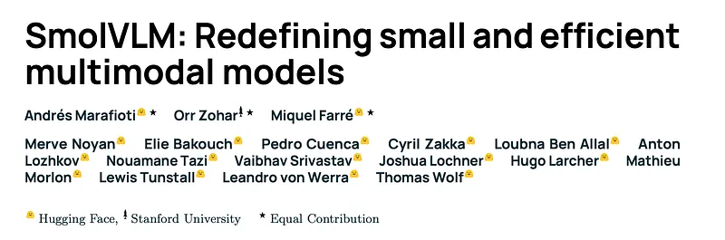 | Title card: SmolVLM. |
| 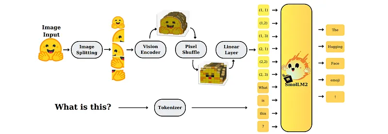 | SmolVLM Architecture. |
| 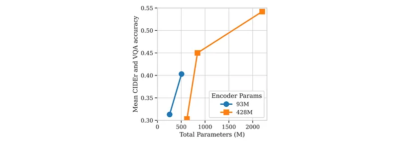 | Impact of vision encoder and language model sizes. |
| 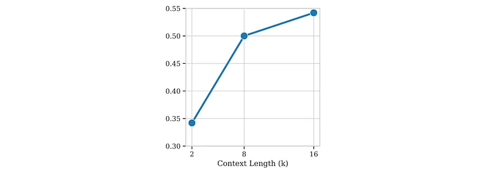 | Performance significantly improves with increased context lengths. |
| 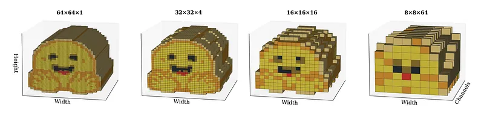 | Pixel shuffle. |
| 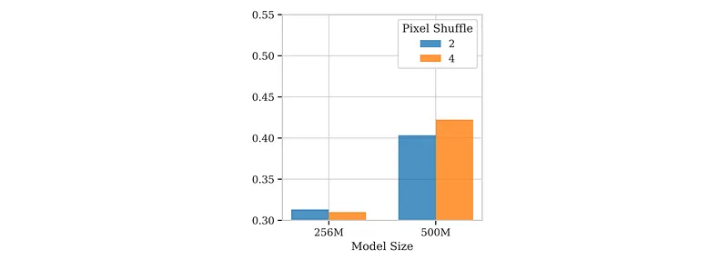 | Optimal pixel shuffle factor (PS=2 vs. PS=4) varies by model size. |
| 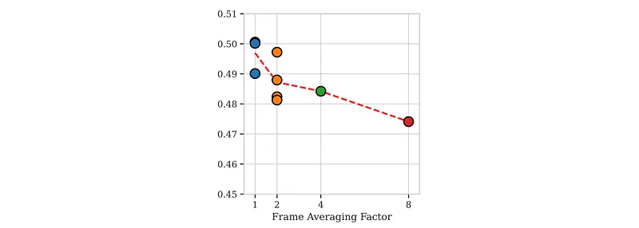 | Frame averaging reduces video performance. |
| 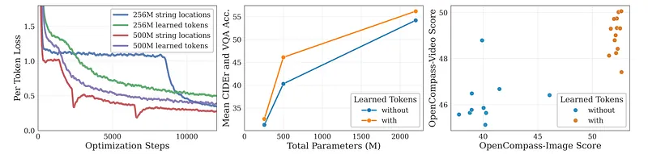 | Tokenization Strategy Comparisons. |
| 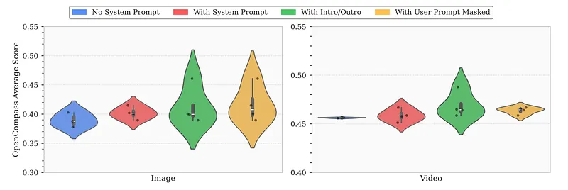 | Cumulative Effect of Training Strategies on SmolVLM Performance. |
| 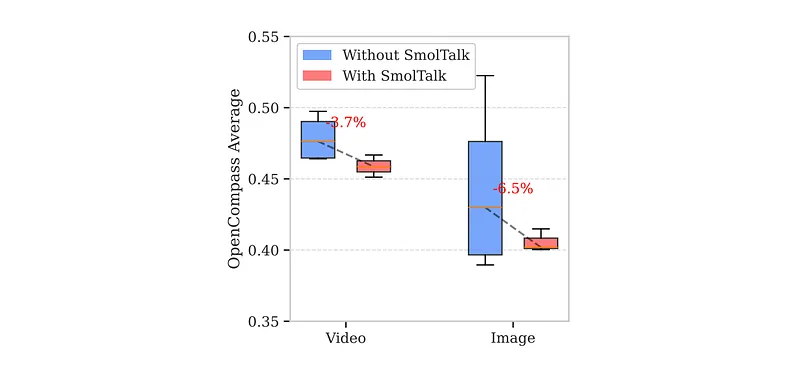 | Masking User Prompts: To reduce overfitting, user-prompt masking is explored during supervised fine-tuning. |
| 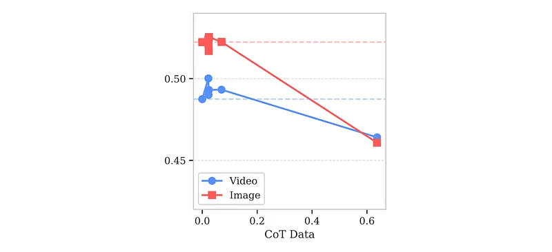 | Chain-of-Thought (CoT) prompting, which exposes models to explicit reasoning steps during training, generally enhances reasoning... |
| 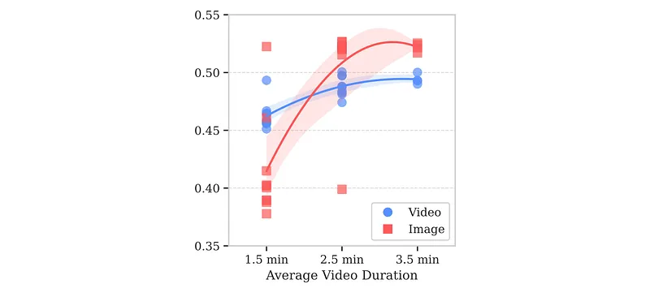 | Increasing video duration during training offers richer temporal context but comes at a greater computational cost. |
| 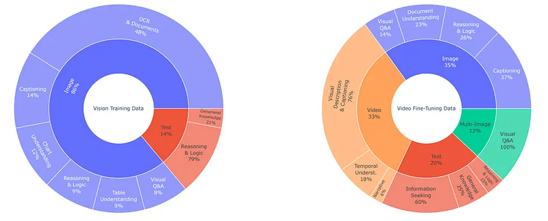 | Data Details. |
| 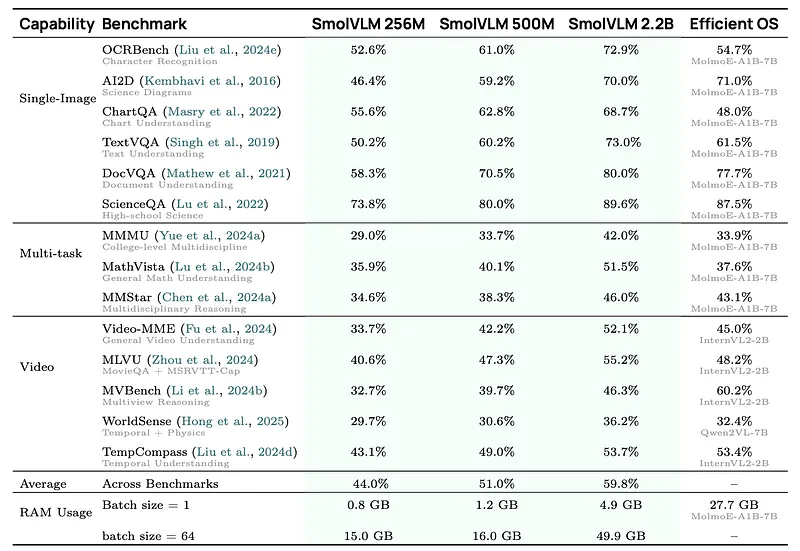 | Benchmark comparison of SmolVLM variants across vision-language tasks. |
| 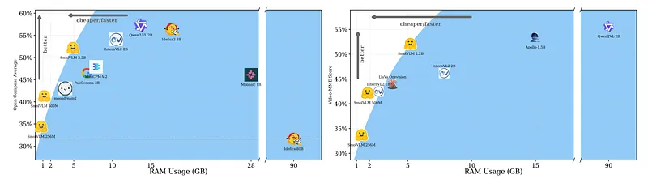 | Comparison of SmolVLM with other state-of-the-art small VLM models. |
| 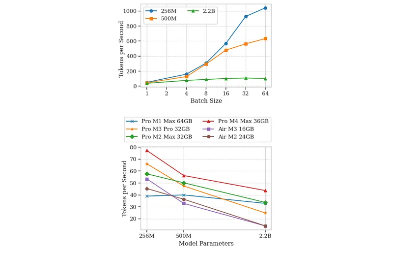 | Throughput in tokens per second. |
| 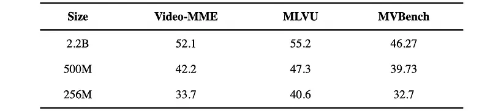 | Despite their compact size, SmolVLM2 models demonstrate superior performance per memory consumption compared to existing models. |
## Related

- [[Papers Explained Corpus]]
- [[Vision Language Models]]
- [[Model Compression and Efficiency]]
- [[Evaluation and Benchmarks]]
- [[Papers Explained 345 - ConvNets Match Vision Transformers at Scale]]
- [[Papers Explained 347 - Command A]]

#summary #topic
