# Papers Explained 347 - Command A

Command A is an agent-optimized and multilingual-capable model, with support for 23 languages of global business: English, French, Spanish, Italian, German, Portuguese, Japanese, Korean, Arabic, Chinese, Russian, Polish, Turkish, Vietnamese, Dutch, Czech, Indonesian, Ukrainian, Romanian, Greek, Hindi, Hebrew, and Persian.

This page ingests the source article into the wiki and connects it to [[Papers Explained Corpus]], [[Multilingual Models]], [[Embedding and Retrieval]], [[Agentic AI]], [[Large Language Models]], [[Document AI]]. Canonical product announcement: [[Introducing Command A: Max performance, minimal compute]] (`raw/command-a/`).

## Source Metadata

- Source file: `raw/2025-04-15_Papers-Explained-347--Command-A-4e0512baee56.md`
- Source title: Papers Explained 347: Command A
- Published: 2025-04-15
- Canonical: [https://medium.com/@ritvik19/papers-explained-347-command-a-4e0512baee56](https://medium.com/@ritvik19/papers-explained-347-command-a-4e0512baee56)

## Key Ideas

- Command A is an agent-optimized and multilingual-capable model, with support for 23 languages of global business: English, French, Spanish, Italian, German, Portuguese, Japanese, Korean, Arabic, Chinese, Russian, Polish, Turkish, Vietnamese, Dutch, Czech...
- A decoder-only Transformer architecture is used with the following key architectural decisions:
- SwiGLU: The SwiGLU activation demonstrates performance improvements over other activation functions.
- Interleaved attention layers: Interleaved layers of sliding window attention and full attention are used in a 3:1 ratio. Each sliding window layer uses Rotary Positional Embeddings (RoPE) and every full attention layer uses No Positional Embeddings (NoPE).
- GQA: Grouped-query attention (GQA) is used to increase serving throughput. Document masking is used to ensure that each individual sequence in a batch can only attend to itself.

## Notes

Command A is an agent-optimized and multilingual-capable model, with support for 23 languages of global business: English, French, Spanish, Italian, German, Portuguese, Japanese, Korean, Arabic, Chinese, Russian, Polish, Turkish, Vietnamese, Dutch, Czech, Indonesian, Ukrainian, Romanian, Greek, Hindi, Hebrew, and Persian. It is purpose-built to excel at real-world enterprise use cases. It offers best-in-class RAG capabilities with grounding and tool use to automate sophisticated business processes.

## Model Architecture

*Figure: Schematic of the Command A model architecture.*

A decoder-only Transformer architecture is used with the following key architectural decisions:

- SwiGLU: The SwiGLU activation demonstrates performance improvements over other activation functions.

- Interleaved attention layers: Interleaved layers of sliding window attention and full attention are used in a 3:1 ratio. Each sliding window layer uses Rotary Positional Embeddings (RoPE) and every full attention layer uses No Positional Embeddings (NoPE).

- GQA: Grouped-query attention (GQA) is used to increase serving throughput. Document masking is used to ensure that each individual sequence in a batch can only attend to itself.

- Parallel transformer block: This shows equivalent performance but significant improvement in throughput compared to the vanilla transformer block.

- No bias: Bias terms are discarded, which improves training stability at larger scales.

- Input and output embeddings: The input and output embedding matrices are shared, which provides a large reduction in memory requirements due to the large vocabulary size. No performance degradation is observed across ablations.

## Pretraining

Command A models are trained on multilingual data from various sources including publicly available text and code data from the web, a collection of synthetic datasets generated internally, instruction-tuning datasets obtained from human annotators, and high quality data sourced from specialised data vendors. The web text data is optimised by enhancing the ratio of educational samples that are relatively sparse on the internet, and down-sampling low-quality samples identified by Machine Learning (ML)-based quality filters after careful de-duplication and heuristic filtering for safety and quality. The final data mixture is determined by running a series of ablations using smaller models.

## Post-training

*Figure: Command A post-training phases.*

Command A is trained by alternating centralised training stages, where a single model is fine-tuned, and decentralised training stages, where multiple expert models are trained separately to maximise domain-wise performance before merging their parameters.

The global Command A post-training recipe is divided into several sub-stages, each producing intermediary model artifacts:

- Instruct Model: An initial Instruct model is trained with supervised learning on top of the base model to provide the core basic capabilities of the model.

- SFT Expert Models: Six SFT experts are trained on top of the Instruct checkpoint with specialised data mixtures to maximise capability-specific performance.

- SFT Soup Model: The six model experts are merged into a Soup model with parameter-merging methods to produce a single SFT aggregate model.

- RL Expert Models: Six RL experts are trained on top of the SFT Soup checkpoint using RL algorithms tailored to each domain, using pairwise comparisons or verifiable rewards.

- RL Soup Model: The six RL experts are merged into a RL Soup model with parameter-merging methods to produce a single RL aggregate model.

- Polished Model: A final stage is performed on the RL Soup model to enhance human interaction performance by alternating between best-of-N methods, offline preference, and online RL algorithms.

Six expert models are created at each expert stage: Code, Safety, RAG, Math, Multilingual, and a General Long-Context expert. This approach allows for the adaptation of each expert’s training procedure, tailoring it to the specific capability or domain of interest. This becomes even more crucial during the RL stage, as different domains demand distinct RL techniques — for example, verifiable rewards for Math and Code, or preference pairs for Safety and Multilingual. Finally, the model undergoes a polishing phase to improve its writing style. First, a best-of-N supervised training stage is applied to the RL Soup model. Then, a ping-pong approach alternates between offline preference and online RL optimization, iterating as required until a human preference performance plateau is observed, to obtain the final Command A model.

## Reinforcement Learning

Depending on the stage and task, direct alignment is performed using preference training or optimization for a reward signal through reinforcement learning (RL) either offline or online. This reward signal can be the learnt reward model, or a verifiable reward.

### SRPO (Self-Improving Robust Preference Optimization)

This novel approach introduces a continuous improvement mechanism for model alignment and robustness. It addresses limitations of traditional methods by being less reliant on the specific distribution of the preference dataset. SRPO uses a min-max optimization strategy with a complex objective function:

- π: The generative policy of the model (initial output).

- π†: The self-refinement policy that improves upon the initial output.

- P(y2 ≻ y1 | x): The probability that output y2 is preferred over y1 given the input x. This is learned from the preference dataset.

- βKL(π† || πref | x, y1): A term that regularizes the self-refinement policy (π†) to stay close to a reference policy (πref), ensuring it doesn’t deviate too far from established behavior.

- βKL(π || πref | x): Similar to the previous term, this regularizes the generative policy (π) to stay close to the reference policy. This helps maintain overall stability. The goal here is to learn a generative policy that is difficult for the self-refinement policy to improve upon.

### Optimising the Reward Model with RL

Reinforcement Learning is used to optimize the reward model, leveraging the KL-regularized reinforcement learning objective and the Contrastive Policy Gradient (CoPG) approach.

KL-regularized Reinforcement Learning Objective:

The objective function is defined as:

J(π) = ExEy∼π(·|x)[R(x, y) − β KL(π||πref|x)]

- π: The policy being learned.

- x: The input prompt.

- y: The generated output.

- R(x, y): The reward function (either learned or verifiable).

- β: A hyperparameter controlling the strength of the KL regularization.

- πref: A reference policy. The KL term ensures the learned policy doesn’t deviate too far from this reference. This helps maintain stability and prevent undesirable behaviors.

Contrastive Policy Gradient (CoPG):

CoPG is used to optimize the above objective. It works by comparing the rewards of multiple completions for the same prompt. CoPG Loss:

This loss encourages the policy to assign higher probabilities to completions with higher rewards. The contrastive nature of the loss (comparing pairs of completions) makes it more robust and less prone to overfitting.

CoPG can be used in both offline and online settings.

- Offline: Leverages existing datasets with multiple completions per prompt.

- Online: Learns directly through interaction with an environment, potentially using a replay buffer or in a purely on-policy fashion (equivalent to Reinforce Leave-One Out or RLOO).

## Capabilities

### Instruction-Following

Instruction-following is a prerequisite for more specific model capabilities focusing on advanced topics such as code, multilingual, and reasoning. In the Command A post-training recipe, the model is taught to follow instructions across a wide range of topics and domains, including but not limited to generalist instruction-following (e.g., factual knowledge requests), formatting, STEM-specific tasks (e.g., tabular reasoning, structured data manipulation), and preamble compliance. Instruction-following capabilities are acquired both via SFT and offline preference tuning.

Synthetically generated diverse sets of prompts are used to generate two completions per prompt, sampled with different temperatures. Human annotators provide discrete ratings for both completions. This process is repeated over multiple turns, resulting in a multi-turn dataset. If the two completion ratings are not tied and the better completion does not obtain the highest possible rating, the annotator improves the better completion.

SFT datasets are constructed using the human rewrites obtained. Preference pairs are constructed directly from the obtained samples by considering completions with different ratings (including the human rewrites), with ties excluded. The obtained preference samples are used to train both Command A and the reward model itself.

Internal reward models are trained on the most recent Command A checkpoints. This is done iteratively. The most recent checkpoints at a given point in time are used to generate completions. Those completions are scored using the reward model. Preference pairs and SFT samples are created using the scores. The models are then re-trained, and the process is repeated.

Command A is post-trained with SFT and preference tuning. A range of methods are experimented with for preference tuning, including SLiC, IPO, DPO, and SRPO. SRPO performs best across evaluation tasks.

### Retrieval Augmented Generation, Tool Use and Agents

Models can execute specific actions, such as performing calculations or retrieving information, to solve tasks more effectively by generating API calls. This process typically involves providing a set of tool definitions in the model’s preamble. When faced with a task, the model selects and invokes the appropriate tools, and the results are fed back to inform its final response.

This process roughly follows the ReAct framework, a widely adopted method for guiding LLMs through dynamic problem-solving. ReAct enables models to interleave reasoning and action: they first articulate their thought process, outlining plans and tool requirements, then either execute a tool (via structured outputs like JSON) or deliver a final answer. This iterative loop enables adaptive planning, reflection, and interaction with external systems, making it ideal for complex, multi-step tasks.

The model is trained on a combination of human-annotated and synthetically generated data in multiple languages, covering code tool execution, user-uploaded documents, and general API environments, using an SFT step followed by offline preference tuning. Each datapoint includes a user prompt, available tools, model instructions, a reasoning step, tool calls, tool outputs, and a model response with citations. Annotation is performed by trained internal annotators with multiple reviews for quality, and preference data is collected using a majority vote. Synthetic data is also generated and verified using internal LLMs-as-a-judge.

### Multilingual

The multilingual data mixture spans a diverse set of domains and tasks, covering machine translation, multilingual safety, multilingual reasoning, multilingual robust controllability, multilingual RAG, multilingual agents, etc; ensuring that Command A possesses strong generalisation capabilities across languages.

Human annotation is conducted using two different approaches: 1) LLM-generated response with human post-editing; and 2) manually annotated human data.

To further improve the multilingual quality of Command A, iterative synthetic data collection through multilingual best-of-N is conducted. Using a collection of high-quality prompts, responses are collected from all expert models and scored using internal reward models. The best response is selected to be used in iterative training.

The multilingual expert model is trained via both SFT and DPO. Training several models with the same configuration (but a different random seed) and uniformly merging them gives a slight performance boost for the expert at the SFT stage, but does not help at the preference tuning stage.

### Code

The code capabilities of Command A are focused to assist the software development cycle and improve user coding experience. The data mix focuses on 8 priority programming languages (Python, Java, C++, Rust, Go, JavaScript, TypeScript, COBOL) and 5 dialects of SQL (SQLite, MySQL, PostgreSQL, Microsoft T- SQL, Oracle PL/SQL). Across these languages, a wide range of tasks are targeted including code generation (i.e., NL-to-code), code translation, and code optimisation.

Data is sourced from annotation and synthetic generation, enriched with execution feedback, explanations, paraphrases, stack traces, database context, diff patches, and unit tests. Positive execution validation is prioritized. A multi-language code execution sandbox evaluates code correctness. Pre-Training involves execution-based code data enrichment by adding print statements and synthetic inputs, executing the code, and appending the output. Code repositories are formatted as long documents based on import links.

In the RL stage, code correctness and annotated preferences are jointly optimized, using unit test success as a reward metric and penalizing non-code output. Synthetic unit tests are generated, and SQL completions are canonicalized. DPO-style preference pairs are used to optimize code style, documentation, and formatting.

The code expert is trained in three stages:

- Large-scale self supervised learning on the code data mixture, using linear merging over top k seeds to mitigate variance.

- Supervised learning on high-quality data (verifiable human/synthetic data or data rated highly by reward models), again using merging across random seeds.

- RL using the offline Contrastive Policy Gradient algorithm with execution feedback and DPO-style preference pairs. Regularization schemas include repeating Stage 2 on non-code expert models, a hybrid cross-entropy loss function, and WARP-style merging of the RL-trained model with the parent checkpoint.

### Math and Reasoning

The research focuses on core mathematical reasoning because it is both intrinsically useful (e.g., in financial use cases) and yields out-of-distribution improvements in other knowledge-intensive tasks such as coding and data manipulation. Training on synthetic data outperforms human-written data, so the approach is heavily weighted towards the use of synthetic examples. Carefully-curated seed prompts are used for few-shot generation of novel mathematical problems, and LLM-as-judge techniques determine the correctness of novel problem-solution pairs. Preference tuning is employed after SFT across one of two datasets, dependent on the downstream model training stages. The first dataset consists of human-rated preferences on paired completions to reasoning prompts. The second, fully-synthetic dataset comprises correct and incorrect paired solutions to reasoning prompts.

### Long Context

Samples are taken from the long-context pre-training dataset and Command R+ is prompted to generate question-answer pairs based on randomly selected fragments within 8,192 tokens. To ensure high-quality, a reward model is used to select the best generation from a pool of candidates. The selected question-answer pairs are then concatenated to the original samples to construct synthetic data. One stage of SFT is performed on top of the pretrained model, following a similar approach to the cooldown phase. An interleaved training regime with datasets of 16k and 256k sequence lengths at a 3:1 interleaving ratio is used.

### Safety

The safety training process involves pre-training filtering to remove CSEA and sexual content domains, and low-quality content. Post-training uses SFT and preference datasets with manual and automated safety annotations from trained internal and external annotators. Data diversity is increased using LLM personas and reformulations. Balancing safety and refusal behavior is crucial, using both information requests on safety topics and benign requests with similar vocabulary to unsafe prompts.

## Merging

The overall goal for an enterprise-ready LLM is a single monolithic model, with multiple capabilities. These capabilities can sometimes be orthogonal and may involve different scales of training data. Model merging enables multiple teams to work asynchronously on improving different capabilities, with their contributions merged together in parameter space.

Merging is applied at two points in the overall training pipeline: firstly, to combine a set of expert models trained using SFT into an initial ‘SFT model soup’; secondly, to combine a set of experts that were trained using offline preference optimisation techniques on top of the SFT soup, giving an ‘off-pref soup’.

“Leave-one-out” merges are used to identify collisions (performance degradation caused by one expert on others), which are addressed by including cross-domain data in each expert’s training and maintaining consistent data styles.

Linear merging (weight averaging) is used due to its simplicity, effectiveness, and associativity, despite experimenting with more complex methods. Weights are manually searched, guided by heuristics and brute force, to improve underperforming domains.

## Polishing

Model merging provides a powerful mechanism for combining a diverse set of experts into a single model. However, combining experts trained to target specific capabilities does not guarantee the final model’s alignment with human preferences. To address this, a polishing phase is introduced as the final post-training step. This phase serves two critical purposes: fixing any artifacts introduced during model merging and aligning the final model with human preferences.

Polishing is divided into three steps:

- Supervised Fine-Tuning (SFT): A best-of-N SFT approach is employed where synthetically generated four candidate completions for each prompt are leveraged. A reward model trained on human preference data ranks these completions. SFT is then applied using the highest-ranked completions, ensuring that the model learns from the most highly rewarded responses.

- Preference Tuning: Completions with the highest reward scores are selected as preferred completions, and the completions with the lowest reward scores are used as dis-preferred. Additionally, the dataset is refined by filtering out prompts exhibiting a low average reward.

- Reinforcement Learning from Human Feedback (RLHF): To enhance the alignment of the model with human preferences, Reinforcement Learning from Human Feedback (RLHF) is further employed. Online CoPG with two generations per prompt is used.

## Results

### Standard Benchmarks

*Figure: Results for Command A on standard academic benchmarks.*

- Command A is competitive with or outperforms similarly-sized models across all benchmarks.

- Command A also performs competitively with considerably larger and less efficient models.

- On instruction-following benchmarks (IFEval and InFoBench), Command A performs competitively, outperforming similarly sized models on InFoBench and only being surpassed by Llama 3.3 70B Instruct on IFEval.

### Agentic Tool Use

Standard RAG benchmarks: Assessed models’ ability to answer questions based on provided documents, including single and multi-hop reasoning. Correctness is judged by a panel of LLMs comparing model generations to reference answers.

*Figure: Standard RAG evaluations.*

- Command A and GPT-4o generally performed well on standard RAG benchmarks.

BFCL: Measured models’ proficiency in using tools/functions, including single-step, irrelevance detection, and multi-turn scenarios.

*Figure: BFCL Results.*

- Command A and GPT-4o demonstrated strong performance in the BFCL, particularly in multi-turn scenarios requiring complex tool use sequences. Many models struggled with multi-turn tasks.

Taubench: Evaluated models’ performance in complex, multi-turn, agentic tool use scenarios simulating customer support tasks in airline and retail settings. Performance is measured using Pass@k (P@k), reflecting the consistency of correct answers over multiple runs.

*Figure: Taubench Results.*

- Command A and GPT-4o achieved the highest scores on Taubench, indicating superior performance in complex agentic tool use scenarios.

- The P@k metric highlighted inconsistencies in model performance across multiple runs, even for top-performing models.

- Overall, the results suggest that while LLMs have made progress in tool use and reasoning, challenges remain, particularly in maintaining consistent performance in complex, multi-turn interactions.

- Command A and GPT-4o consistently demonstrated superior capabilities across the evaluated tasks.

### Multilingual

*Figure: Machine translation (COMET-20) scores on NTREX.*

*Figure: Command A mArenaHard winrates against on 23 languages against open-weights models.*

*Figure: Multilingual Taubench Results.*

*Figure: Crosslingual line-level pass rate (LPR) from the Language Confusion Benchmark.*

*Figure: ADI2 score over monolingual and crosslingual prompts in 4 Arabic dialects (Egyptian, Saudi, Syrian, Moroccan).*

- Command A demonstrates strong multilingual capabilities across a range of tasks and languages. It outperforms or is competitive with other leading LLMs, including Llama, DeepSeek, Mistral, and GPT-4, in many of the evaluations.

- Command A excels in translation, achieving scores within the winning cluster on NTREX-128. It also performs well on regional context understanding (INCLUDE) and multilingual mathematical reasoning (MGSM).

- Command A exhibits strong instruction-following abilities in multiple languages, outperforming competitors in head-to-head human evaluations.

- Command A demonstrates strong agentic capabilities, outperforming some models and being competitive with GPT-4o on a multilingual version of τ-bench.

- Command A shows high accuracy in adhering to the user’s desired language and demonstrates strong sensitivity to regional dialects, particularly in Arabic. It outperforms other models in maintaining language consistency and adhering to specific dialects.

### Code

*Figure: Code Understanding Benchmarks.*

- Command A demonstrates strong performance in code understanding and generation tasks across multiple programming languages, outperforming similar and larger models in many cases.

- Command A achieves state-of-the-art results in COBOL code generation and translation. This highlights its potential for modernizing legacy codebases.

- Utilizing Command A as a code agent with tool access and feedback significantly improves its performance in code generation tasks. This approach leads to substantial gains on LiveCodeBench, BigCodeBench, and LBPP, exceeding the performance of other leading models. Specifically, Command A agent achieves state-of-the-art performance on BigCodeBench and surpasses all competitors on LBPP-Python.

*Figure: Code Editing Benchmarks.*

- Command A shows competitive performance in code editing tasks, although this was not a primary focus during model development.

*Figure: : SQL Generation Benchmarks.*

- Command A exhibits leading performance in SQL generation across various benchmarks and database systems, including both academic and enterprise-relevant scenarios.

### Math and Reasoning

*Figure: Reasoning performance of Command A compared to similarly-sized models.*

- Command A demonstrates strong performance on mathematical reasoning benchmarks, particularly excelling in the MATH benchmark.

- The merging of models in Command A preserves reasoning performance, with only a slight decrease (within a few percentage points) compared to specialized reasoning-expert models on most benchmarks.

- Command A outperforms or is competitive with other large language models (Llama 3.3 70B, Llama 3.3 405B, Mistral Large 2, GPT-4) on the selected benchmarks.

### Long-Context Benchmarks

*Figure: Results on the RULER long context benchmark.*

*Figure: LongBench-V2 results for Command A.*

- Command A demonstrates exceptional long-context capabilities, as shown by its performance on RULER and LongBench-V2.

- Command A achieves this performance with significantly less KV cache memory compared to models with a full attention architecture. For example, at 8k sequence length, Command A uses less KV cache than Llama 3.3 70B Instruct (75%), Llama 3.1 405B Instruct (23.8%), and Mistral Large (45.5%). At 128k sequence length, these percentages decrease further.

- The reduced KV cache memory usage of Command A leads to decreased latency and memory consumption, and increased throughput during inference, especially for longer contexts.

## Paper

Command A: An Enterprise-Ready Large Language Model [2504.00698](https://arxiv.org/abs/2504.00698)

## Figures

Figures from the Medium HTML export (`raw/2025-04-15_Papers-Explained-347--Command-A-4e0512baee56.md`); local copies under `wiki/assets/papers-explained-347-command-a/` when download succeeded.

| Figure | Caption |
|--------|---------|
| 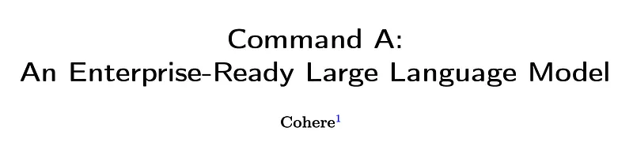 | Title card: Command A. |
| 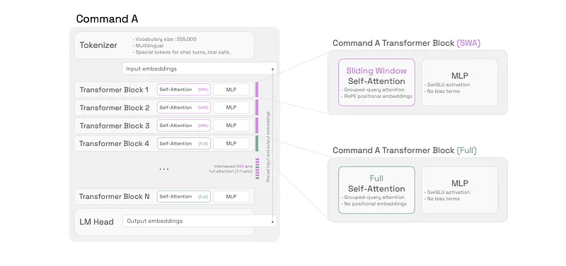 | Schematic of the Command A model architecture. |
| 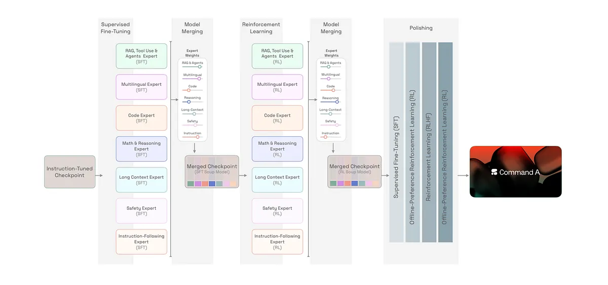 | Command A post-training phases. |
|  | This novel approach introduces a continuous improvement mechanism for model alignment and robustness. |
| 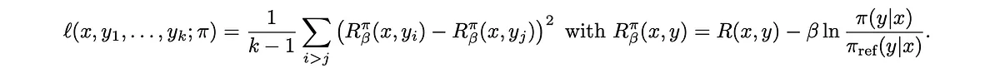 | CoPG is used to optimize the above objective. It works by comparing the rewards of multiple completions for the same prompt. CoPG Loss. |
| 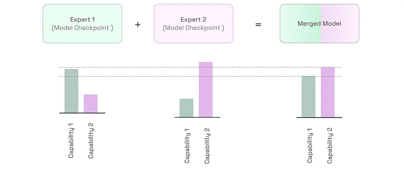 | The safety training process involves pre-training filtering to remove CSEA and sexual content domains, and low-quality content. |
| 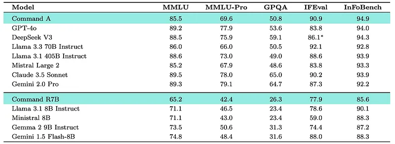 | Results for Command A on standard academic benchmarks. |
| 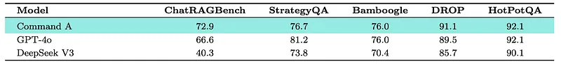 | Standard RAG evaluations. |
| 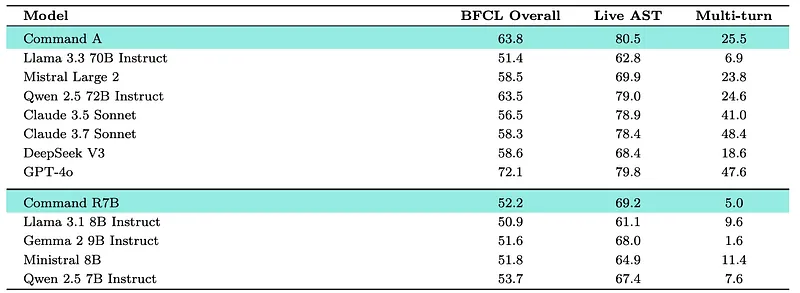 | BFCL Results. |
| 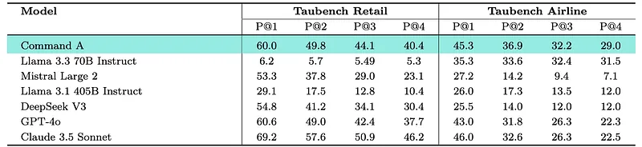 | Taubench Results. |
| 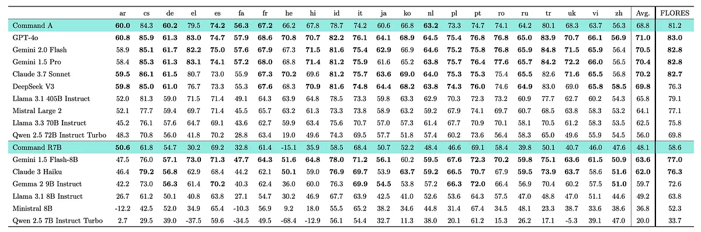 | Machine translation (COMET-20) scores on NTREX. |
| 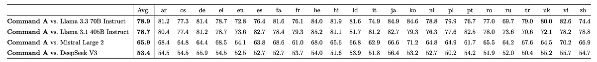 | Command A mArenaHard winrates against on 23 languages against open-weights models. |
| 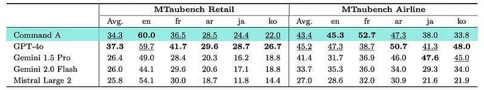 | Multilingual Taubench Results. |
| 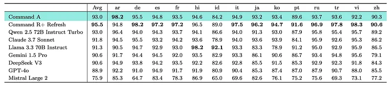 | Crosslingual line-level pass rate (LPR) from the Language Confusion Benchmark. |
| 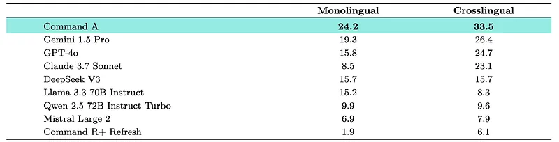 | ADI2 score over monolingual and crosslingual prompts in 4 Arabic dialects (Egyptian, Saudi, Syrian, Moroccan). |
| 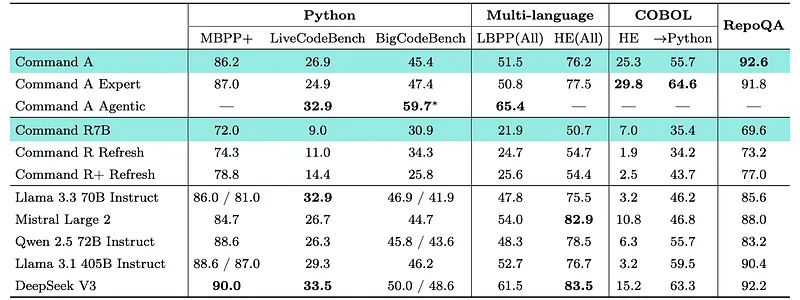 | Code Understanding Benchmarks. |
| 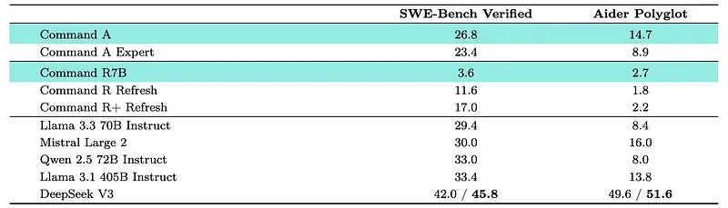 | Code Editing Benchmarks. |
| 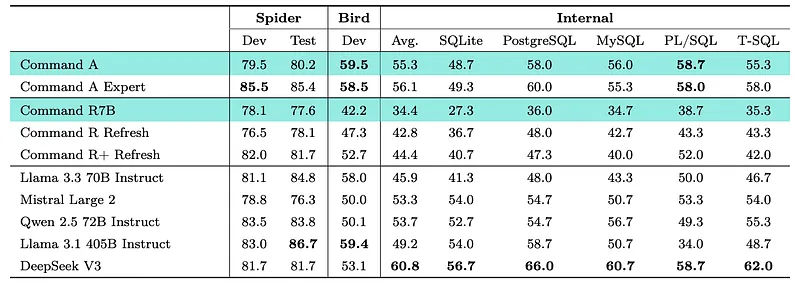 | SQL Generation Benchmarks. |
| 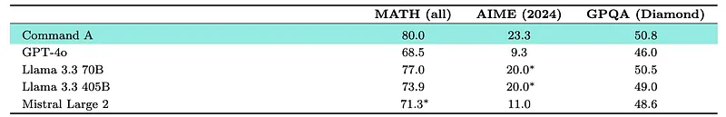 | Reasoning performance of Command A compared to similarly-sized models. |
| 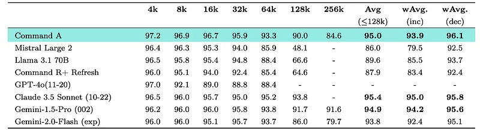 | Results on the RULER long context benchmark. |
| 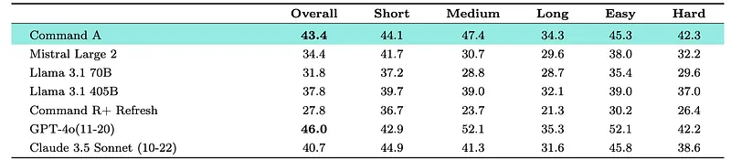 | LongBench-V2 results for Command A. |
## Related

- [[Introducing Command A: Max performance, minimal compute]] — Cohere blog announcement (canonical marketing source).
- [[Papers Explained Corpus]]
- [[Multilingual Models]]
- [[Embedding and Retrieval]]
- [[Agentic AI]]
- [[Large Language Models]]
- [[Document AI]]
- [[Papers Explained 346 - SmolVLM]]
- [[Papers Explained 348 - ReaderLM-v2]]

#summary #topic
