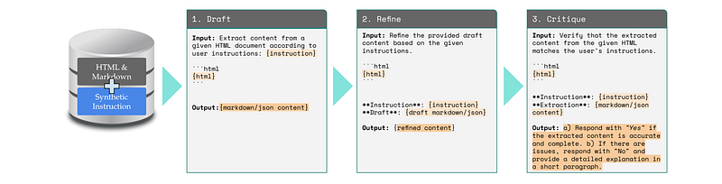
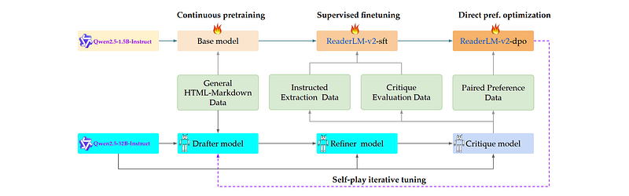
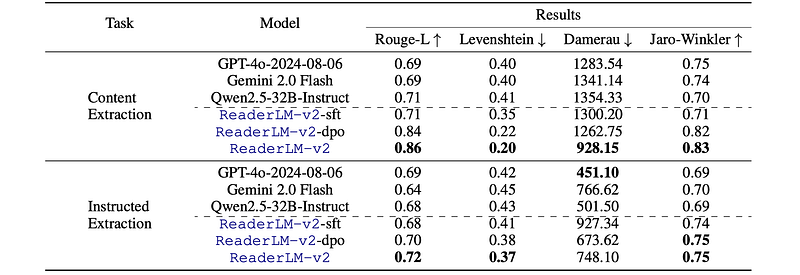

# Papers Explained 348 - ReaderLM-v2

A 1.5B language model specialized for efficient web content extraction, transforming HTML into clean Markdown or JSON formats, It utilizes a novel three-stage data synthesis pipeline (Draft-Refine-Critique) for generating high-quality training data and a comprehensive training strategy combining continuous pre-training, multi-objective...

This page ingests the source article into the wiki and connects it to [[Papers Explained Corpus]], [[Large Language Models]], [[Model Compression and Efficiency]].

## Source Metadata

- Source file: `raw/2025-04-16_Papers-Explained-348--ReaderLM-v2-b5bed3f57fbe.html`
- Source title: Papers Explained 348: ReaderLM-v2
- Published: 2025-04-16
- Canonical: [https://medium.com/@ritvik19/papers-explained-348-readerlm-v2-b5bed3f57fbe](https://medium.com/@ritvik19/papers-explained-348-readerlm-v2-b5bed3f57fbe)

## Key Ideas

- A 1.5B language model specialized for efficient web content extraction, transforming HTML into clean Markdown or JSON formats, It utilizes a novel three-stage data synthesis pipeline (Draft-Refine-Critique) for generating high-quality training data and a...
- ReaderLM-v2, a compact 1.5 billion parameter language model designed for efficient web content extraction, processes documents up to 512K tokens, transforming messy HTML into clean Markdown or JSON formats.
- a three-stage data synthesis pipeline that generates high-quality, diverse training data by iteratively drafting, refining, and critiquing web content extraction
- a unified training framework combining continuous pre-training with multi-objective optimization.
- The aim is to create a model to transform raw HTML content into structured formats, such as JSON or Markdown. This is inherently complex due to several real-world challenges:

## Notes

A 1.5B language model specialized for efficient web content extraction, transforming HTML into clean Markdown or JSON formats, It utilizes a novel three-stage data synthesis pipeline (Draft-Refine-Critique) for generating high-quality training data and a comprehensive training strategy combining continuous pre-training, multi-objective optimization, and self-play iterative tuning, enabling it to effectively process documents up to 512K tokens with significantly lower computational requirements.

ReaderLM-v2, a compact 1.5 billion parameter language model designed for efficient web content extraction, processes documents up to 512K tokens, transforming messy HTML into clean Markdown or JSON formats. The model’s effectiveness results from two key innovations:

- a three-stage data synthesis pipeline that generates high-quality, diverse training data by iteratively drafting, refining, and critiquing web content extraction

- a unified training framework combining continuous pre-training with multi-objective optimization.

The aim is to create a model to transform raw HTML content into structured formats, such as JSON or Markdown. This is inherently complex due to several real-world challenges:

- HTML Complexity: Real-world HTML is inherently messy, often deviating from schema standards. It may include legacy markup, embedded JavaScript, comments, and CSS, which complicates extraction and parsing.

- Length Variability: HTML documents exhibit a long-tail token length distribution. Current LLMs, such as Qwen2.5 which supports 128K context length through the YARN length extension method, still struggle to process this variability effectively, often missing critical content in longer inputs.

- Inference Bottlenecks: Long input sequences often result in correspondingly lengthy decoded outputs, creating significant performance bottlenecks for LLM inference.

- Training Misalignment: Pre-trained LLMs, optimized for reasoning, coding, and mathematical tasks, are not designed for extracting and structuring content from HTML, presenting an opportunity for optimization.

The proposed solution involves fine-tuning an existing SLM (under 2B parameters) to support longer contexts (ideally 512k) with two dedicated training objectives.

- Instructed Markdown Extraction: This task aims to convert HTML documents into Markdown format based on specific instructions. It focuses on extracting and converting relevant content from HTML documents into a structured Markdown representation, removing non-essential elements like navigation menus and advertisements. While the default behavior targets conversion of a page’s main content, users can provide specific instructions to customize the extraction scope and criteria, controlling how HTML content is transformed into structured Markdown.

- Schema-Guided JSON Extraction: This task is schema-driven, requiring output to conform to a predefined JSON structure and set of fields. The model needs to identify relevant data fields within the HTML document and map them to corresponding keys in the JSON schema.

## Datasets and Data Synthesis

Training data comes from two sources: a curated dataset called WebMarkdown-1M and synthetic data generated from a Draft-Refine-Critique process to produce high-quality training data.

### WebMarkdown-1M

WebMarkdown-1M is constructed by randomly sampling one million URLs from the top 500 domains listed in the Common Crawl URL Index. Using a service called Reader3, the content of these URLs is converted into Markdown and JSON formats. Since the backbone model Qwen2.5 supports 29 global languages, language detection and filtering are applied to exclude documents in unsupported languages, resulting in the finalized WebMarkdown-1M dataset.

### Synthetic Data With Draft-Refine-Critique

*Figure: The three-step data synthesis pipeline for ReaderLM-v2.*

Due to the novelty of this task, no publicly-available datasets can be directly used for training models to perform HTML-to-Markdown conversion or schema-guided HTML-to-JSON extraction. To address this, synthetic data generation is employed to create training data for Stage 2, Stage 3, and Stage 4 tuning. The method, Draft-Refine-Critique, is designed to generate high-quality supervised tuning datasets and preference data.

- Draft: Generate synthetic Markdown or JSON data based on specific instructions. While the generated samples align well with the desired output formats and content focus, they may include noise, redundancy, or inconsistencies. Despite these imperfections, this drafting step provides a broad and diverse set of training examples.

- Refine: Refine the drafted data by removing redundancy, enforcing structural consistency, and ensuring adherence to format-specific conventions. An LLM-based review evaluates content accuracy, correctness, and real-world alignment, further improving data quality for subsequent stages.

- Critique: Employ a prompt-based evaluation to assess data accuracy and provide refinement feedback. By comparing model outputs against specified prompt requirements, this step detects discrepancies and inconsistencies, producing a binary judgment on whether the refined response meets quality standards, along with an explanation justifying the decision.

The Draft-Refine-Critique process begins with raw HTML from the WebMarkdown-1M dataset. Once the pipeline completes, the data is categorized into three distinct datasets based on the binary judgment outcome:

- WebData-SFT-Filtered: Includes only instances where the refined output successfully passed the Critique review, filtering out negative judgments.

- WebData-SFT-Critique: Contains 100,000 training examples from the Critique step. Each example pairs an input (the original HTML and its converted format from the Refine step) with an output (the critique’s assessment and detailed explanation). A 1:2 ratio between examples with negative and positive critique assessments is maintained in the final dataset.

- WebData-DPO-Preference: Consists of preference pairs, where each sample includes an HTML input with its corresponding instruction, a desired output (validated by the Critique review), and an undesired output from the initial drafting stage. The final dataset comprises 150,000 preference triplets.

## Training Pipeline

*Figure: ReaderLM-v2’s iterative training process.*

### Stage 1: Continued PreTraining

Pre-training of the base model Qwen2.5–1.5B-Instruct continues on the WebMarkdown-1M dataset. The base model was originally pre-trained with a context length of 32,768 tokens and a RoPE base frequency of 1,000,000. To improve the model’s ability to handle longer sequences, the ring-zag attention mechanism, extended context lengths, and higher RoPE base frequencies are adopted. Specifically, a progressive context length expansion strategy during training is implemented, progressing through three stages of 32,768, 125,000, and ultimately 256,000 tokens, using a RoPE base frequency of 5,000,000. Although the model is trained on sequences up to 256,000 tokens, it can extrapolate up to 512,000 during inference due to RoPE’s inherent extrapolation capabilities.

### Stage 2: Supervised Fine-Tuning

Instead of training a single model on all data types simultaneously, four separate specialized checkpoints are trained, each focusing on different data types. This includes two checkpoints trained with the WebData-SFT-Filtered dataset for HTML-to-Markdown and HTML-to-JSON tasks, and two checkpoints trained with the WebData-SFT-Critique dataset for the same tasks. During model development, significant degeneration issues in the form of repetitive token generation were encountered. The model would either repeat individual tokens or enter loops of short token sequences until reaching the maximum output length. To address this, contrastive loss is incorporated during training to encourage more discriminative and isotropic token representations. To combine the specialized capabilities of individual checkpoints into a single robust model, linear parameter merging with weighted interpolation across the task-specific checkpoints is applied.

### Stage 3: Direct Preference Optimization

The model is trained using the WebData-DPO-Preference dataset. Each HTML input yields a preference pair consisting of an initial draft and its refined version, providing natural quality differentials for DPO training without requiring manual annotations.

### Stage 4: Self-Play Iterative Tuning

To further enhance the model’s performance and generalization, an additional training stage called Self-play Iterative Tuning is introduced. This stage mirrors Stage 2 and Stage 3, which involve SFT and DPO, but with a key difference: the Draft-Refine-Critique process is applied again, using the Stage 3 checkpoint to generate draft data. In this step, the WebData-SFT-Filtered, WebData-SFT-Critique, and WebData-DPO-Preference datasets are regenerated using the checkpoint obtained after weight merging and DPO in the previous stage.

## Evaluation

### Instructed Markdown Extraction

The quality of extracted Markdown is evaluated using four metrics:

- Levenshtein Distance and Damerau-Levenshtein Distance: Measure character-level edits (textual accuracy).

- ROUGE-L: Measures the longest common subsequence (structural preservation and content match).

- Jaro-Winkler Similarity: Emphasizes string similarity at the beginning of text.

*Figure: Markdown extraction performance.*

- ReaderLM-v2 significantly outperforms all other models in Markdown extraction, particularly in the main content extraction task. For example, ReaderLM-v2 achieves a Rouge-L score of 0.86, a 24.6% improvement over GPT-4o-2024–08–06 and Gemini 2.0 Flash.

- Direct preference tuning (Stage 3) was the most impactful training stage, leading to substantial improvements in all metrics.

- While ReaderLM-v2 also excels in instructed Markdown extraction, its performance gains are less pronounced in this task compared to main content extraction, suggesting potential limitations related to model size. Larger models maintain more consistent performance across both tasks.

### Schema Guided Json Extraction

The extracted JSON data is compared to ground truth data by converting both into tree structures and using information retrieval metrics (Precision, Recall, F1-Score) for evaluation. Syntactic validity and structural adherence are also assessed using Pass-Rate.

*Figure: JSON extraction performance.*

- JSON extraction performance is relatively stable across different training stages, unlike Markdown extraction. This stability suggests that initial supervised fine-tuning effectively captures JSON’s structured nature.

- DPO primarily improves the reliability of the extraction, leading to higher pass rates.

- ReaderLM-v2, despite being smaller than other models, achieves solid performance but still lags behind larger models on this complex task. This suggests a correlation between model size and performance in structured JSON extraction.

## Paper

ReaderLM-v2: Small Language Model for HTML to Markdown and JSON [2503.01151](https://arxiv.org/abs/2503.01151)

## Figures

Figures from the Medium HTML export (`raw/2025-04-16_Papers-Explained-348--ReaderLM-v2-b5bed3f57fbe.html`); local copies under `wiki/assets/papers-explained-348-readerlm-v2/` when download succeeded.

| Figure | Caption |
|--------|---------|
|  | Title card: ReaderLM-v2. |
|  | The three-step data synthesis pipeline for ReaderLM-v2. |
|  | ReaderLM-v2’s iterative training process. |
|  | Markdown extraction performance. |
|  | JSON extraction performance. |
## Related

- [[Papers Explained Corpus]]
- [[Large Language Models]]
- [[Model Compression and Efficiency]]
- [[Papers Explained 347 - Command A]]
- [[Papers Explained 349 - ReSearch]]

#summary #topic
