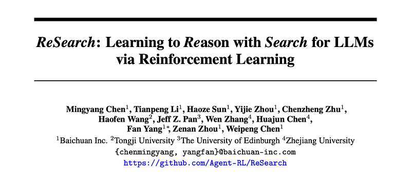
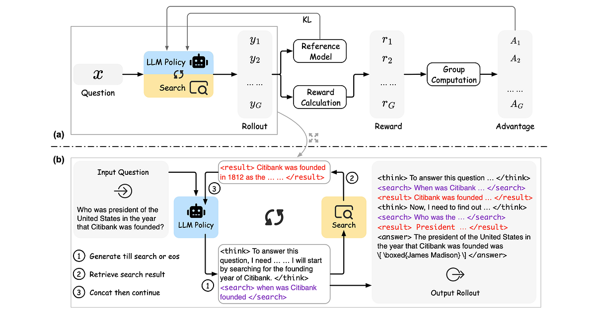
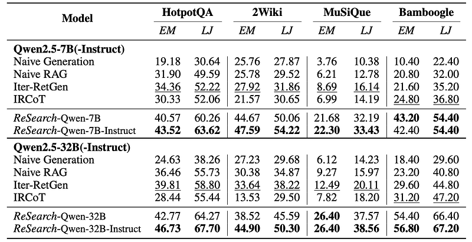
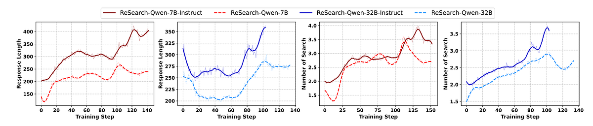
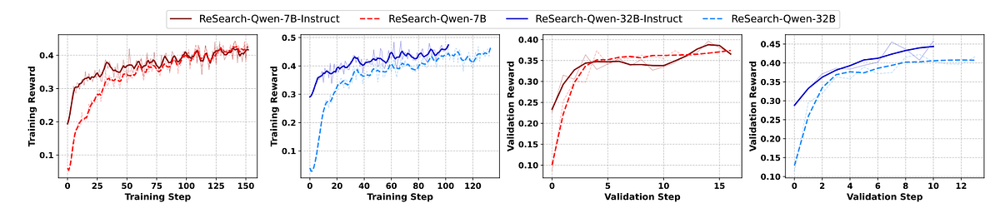

# Papers Explained 349 - ReSearch

In original GRPO, the loss is calculated by all the generated tokens in the whole rollout. In ReSearch, the rollout contains retrieval results, which are not generated by the training policy, but retrieved by the search environment.

This page ingests the source article into the wiki and connects it to [[Papers Explained Corpus]], [[Embedding and Retrieval]], [[Reinforcement Learning Topic]], [[Agentic AI]], [[Safety and Alignment]], [[Synthetic Data]], [[Reinforcement Learning]].

## Source Metadata

- Source file: `raw/2025-04-17_Papers-Explained-349--ReSearch-80c79cb22fed.html`
- Source title: Papers Explained 349: ReSearch
- Published: 2025-04-17
- Canonical: [https://medium.com/@ritvik19/papers-explained-349-research-80c79cb22fed](https://medium.com/@ritvik19/papers-explained-349-research-80c79cb22fed)

## Key Ideas

- The reward function considers two parts: answer reward and format reward.
- Answer Reward: The correctness of the final answer in \boxed{} and the ground truth answer is calculated via F1 score.
- Format Reward: The rollout correctly following the defined format as described in the prompt templates is checked, mainly checking the correctness of tags and existence of \boxed{} in the answer.
- Specifically, for the final reward of a rollout:
- Training and evaluation are conducted on Qwen2.5–7B, Qwen2.5–7B-Instruct, Qwen2.5–32B and Qwen2.5–32B-Instruct.

## Notes

ReSearch is a novel framework that trains LLMs to Reason with Search via reinforcement learning without using any supervised data on reasoning steps. The approach treats search operations as integral components of the reasoning chain, where when and how to perform searches is guided by text-based thinking, and search results subsequently influence further reasoning. Analysis reveals that ReSearch naturally elicits advanced reasoning capabilities such as reflection and self-correction during the reinforcement learning process.

## Method

*Figure: The training overview of ReSearch.*

Compared with conventional rollout that only contains text-based thinking as reasoning, the rollout in ReSearch also contains search queries and retrieval results. <search> and </search> are used to enclose the search queries and <result> and </result> to enclose the retrieval results, and such instruction is described in the prompt templates. The rollout process is an iterative process between text-based thinking, search queries, and retrieval results. Specifically, when the generation process encounters </search> tag, the query between the last <search> and current </search> tags will be used as the search query to retrieve relevant factual information, and the retrieval results will be enclosed by <result> and </result> tags. Then, existing rollout concated with the retrieval results will be used as the next input to generate following response iteratively, until the generation encounters end-of-sentence (eos) tag.

Prompt Template for Base Model:

```text
A conversation between User and Assistant.
The user asks a question, and the assistant solves it.
The assistant first thinks about the reasoning process in the mind and then provides the user with the answer.
During thinking, the assistant can invoke the wikipedia search tool to search for fact information about specific topics if needed.
The reasoning process and answer are enclosed within <think> </think> and <answer> </answer> tags respectively,
and the search query and result are enclosed within <search> </search> and <result> </result> tags respectively.
For example,
<think> This is the reasoning process. </think>
<search> search query here </search>
<result> search result here </result>
<think> This is the reasoning process. </think>
<answer> The final answer is \boxed{answer here} </answer>.
In the last part of the answer, the final exact answer is enclosed within \boxed{} with latex format.
User: prompt. Assistant:
```

System Prompt for Instruct Model:

```text
You are a helpful assistant that can solve the given question step by step with the help of the wikipedia search tool.
Given a question, you need to first think about the reasoning process in the mind and then provide the answer.
During thinking, you can invoke the wikipedia search tool to search for fact information about specific topics if needed.
The reasoning process and answer are enclosed within <think> </think> and <answer> </answer> tags respectively,
and the search query and result are enclosed within <search> </search> and <result> </result> tags respectively.
For example,
<think> This is the reasoning process. </think>
<search> search query here </search>
<result> search result here </result>
<think> This is the reasoning process. </think>
<answer> The final answer is \boxed{answer here} </answer>.
In the last part of the answer, the final exact answer is enclosed within \boxed{} with latex format.
```

In original GRPO, the loss is calculated by all the generated tokens in the whole rollout. In ReSearch, the rollout contains retrieval results, which are not generated by the training policy, but retrieved by the search environment. Retrieval results are masked in the loss calculation to avoid the training policy from being biased towards the retrieval results.

The reward function considers two parts: answer reward and format reward.

- Answer Reward: The correctness of the final answer in \boxed{} and the ground truth answer is calculated via F1 score.

- Format Reward: The rollout correctly following the defined format as described in the prompt templates is checked, mainly checking the correctness of tags and existence of \boxed{} in the answer.

Specifically, for the final reward of a rollout:

## Experiment Setup

Training and evaluation are conducted on Qwen2.5–7B, Qwen2.5–7B-Instruct, Qwen2.5–32B and Qwen2.5–32B-Instruct. Only the training set (19938 samples) of MuSiQue is used for training, since it has various types of multi-hop questions and was constructed via fine-grained quality control. The models are trained for 2 epochs.

E5-base-v2 is used as the retriever and Wikipedia data from December 2018 is used as the knowledge base.

Four standard benchmarks on multi-hop question answering tasks are used, including HotpotQA, WikiMultiHopQA, MuSiQue, and Bamboogle. Specifically, HotpotQA, WikiMultiHopQA, and MuSiQue are constructed among wikipedia or wikidata, via different multi-hop mining strategies with crowd-sourcing, while Bamboogle is a manually constructed dataset with 2-hop questions, where all questions are sufficiently difficult to be unanswerable by a popular internet search engine.

## Evaluation

*Figure: Exact Match (EM, %) and LLM-as-a-Judge (LJ, %) results on multi-hop question answering benchmarks.*

- ReSearch significantly outperforms baseline models: ReSearch achieved average improvements of 15.81% in exact match and 17.56% in LLM-as-a-judge (for the 7B parameter model) and 14.82% in exact match and 15.46% in LLM-as-a-judge (for the 32B parameter model) compared to the best baseline models across all benchmarks.

- Instruction-tuned models further enhance ReSearch performance: Using instruction-tuned LLMs as the foundation for ReSearch led to further performance improvements compared to using base LLMs. This observation was consistent across all benchmarks and model sizes.

- ReSearch demonstrates strong generalization ability: Despite being trained only on the MuSiQue dataset, ReSearch generalized well to other benchmarks with different question types and structures, indicating that the learned reasoning ability is not dataset-specific.

*Figure: Response length and number of search operations during training*

- Response Length Increases During Training: Response length generally increases during training, with instruction-tuned models generating longer responses than base models. 32B models initially show a decrease in response length before increasing again, potentially due to initial reliance on inherent knowledge and later utilization of retrieval after receiving reward signals.

- Search Operations Increase During Training: The number of search operations consistently increases throughout training, indicating that the model learns to utilize search iteratively for complex multi-hop questions.

*Figure: Training and validation reward during training.*

- Reward Increases Sharply Initially, Then Gradually: Both training and validation reward increase rapidly in the initial training steps and then gradually increase further. Instruction-tuned models start with a higher reward. 7B models converge to similar reward levels, while 32B instruction-tuned models maintain a higher reward than their base counterparts.

## Paper

ReSearch: Learning to Reason with Search for LLMs via Reinforcement Learning [2503.19470](https://arxiv.org/abs/2503.19470)

## Figures

Figures from the Medium HTML export (`raw/2025-04-17_Papers-Explained-349--ReSearch-80c79cb22fed.html`); local copies under `wiki/assets/papers-explained-349-research/` when download succeeded.

| Figure | Caption |
|--------|---------|
|  | Title card: ReSearch. |
|  | The training overview of ReSearch. |
|  | Specifically, for the final reward of a rollout. |
|  | Exact Match (EM, %) and LLM-as-a-Judge (LJ, %) results on multi-hop question answering benchmarks. |
|  | Response length and number of search operations during training. |
|  | Training and validation reward during training. |
## Related

- [[Papers Explained Corpus]]
- [[Embedding and Retrieval]]
- [[Reinforcement Learning Topic]]
- [[Agentic AI]]
- [[Safety and Alignment]]
- [[Synthetic Data]]
- [[Reinforcement Learning]]
- [[Papers Explained 348 - ReaderLM-v2]]
- [[Papers Explained 350 - GPT 4.5]]

#summary #topic
