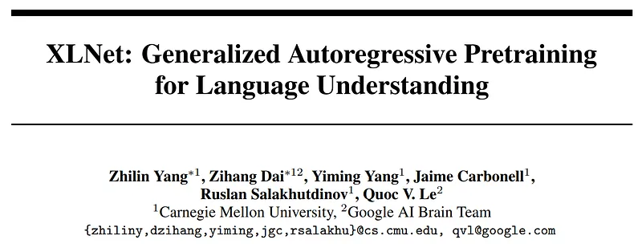
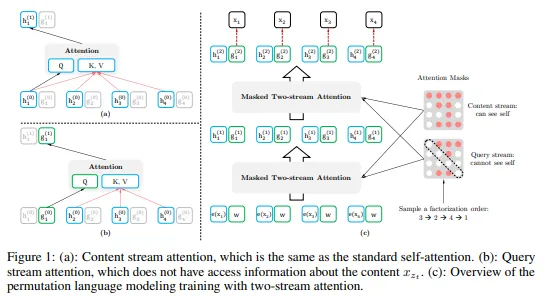
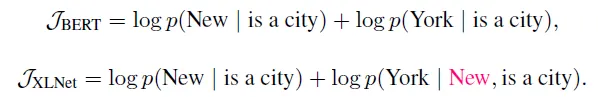
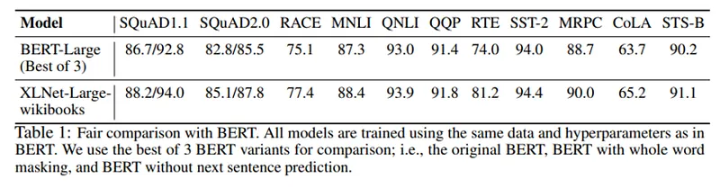
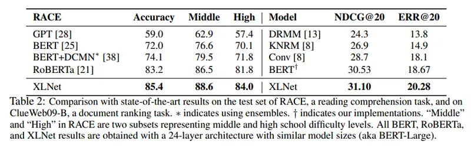
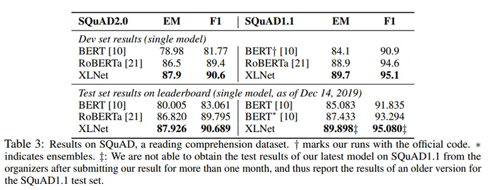
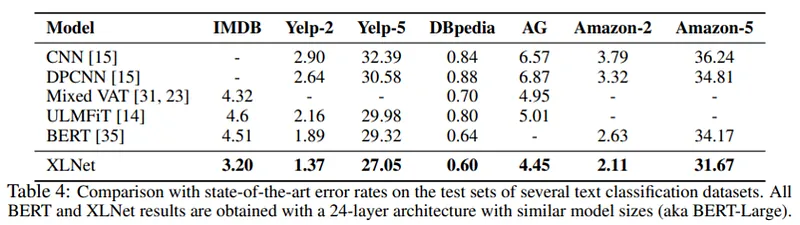
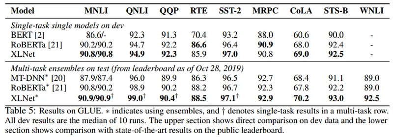

# Papers Explained 35 - XLNet

XLNet proposes a new method for pretraining language models that combines ideas from AR and AE objectives while avoiding their limitations and can improve their performance on a wide range of natural language understanding (NLU) tasks.

This page ingests the source article into the wiki and connects it to [[Papers Explained Corpus]], [[Large Language Models]], [[Reasoning Models]].

## Source Metadata

- Source file: `raw/2023-03-13_Papers-Explained-35--XLNet-ea0c3af96d49.md`
- Source title: Papers Explained 35: XLNet
- Published: 2023-03-13
- Canonical: [https://medium.com/@ritvik19/papers-explained-35-xlnet-ea0c3af96d49](https://medium.com/@ritvik19/papers-explained-35-xlnet-ea0c3af96d49)

## Key Ideas

- The key idea behind XLNet is to use a permutation-based approach that allows the model to learn from all possible combinations of the input tokens, rather than just one fixed order.
- XLNet also uses a modified version of the Transformer architecture, called the “Transformer-XL,” which is designed to capture long-range dependencies in the input sequence.
- XLNet combines BooksCorpus, English Wikipedia, Giga5, ClueWeb 2012-B, and Common Crawl for pretraining. Tokenization is achieved with SentencePiece.
- The same architecture hyperparameters as BERT-Large are used in XLNet-Large. XLNet-Large was not able to leverage the additional data scale, so XLNet-Base (analogous to BERT-Base) was used to conduct a fair comparison with BERT.
- For explicit reasoning tasks like SQuAD and RACE that involve longer context, the performance gain of XLNet is usually larger. This superiority at dealing with longer context could come from the Transformer-XL backbone in XLNet.

## Notes

Autoregressive (AR) language modeling and Autoencoding (AE) are two successful pretraining objectives for neural networks used in transfer learning for NLP. AR language modeling predicts the next word in a sequence based on the previous words, but it cannot handle deep bidirectional context which is important for tasks like sentiment analysis and question answering. AE, on the other hand, reconstructs original data from corrupted data and is used in BERT. However, BERT has some limitations such as BERT assumes the predicted tokens are independent of each other given the unmasked tokens, which is oversimplified as high-order, long-range dependency is prevalent in natural language.

XLNet proposes a new method for pretraining language models that combines ideas from AR and AE objectives while avoiding their limitations and can improve their performance on a wide range of natural language understanding (NLU) tasks.

### Permutation Language Modeling

The key idea behind XLNet is to use a permutation-based approach that allows the model to learn from all possible combinations of the input tokens, rather than just one fixed order. This is achieved by training the model to predict the probability of a token given all other tokens in the input sequence, regardless of their position. This approach is called “permutation language modeling” and it is an extension of the autoregressive language modeling approach used by previous models.

XLNet also uses a modified version of the Transformer architecture, called the “Transformer-XL,” which is designed to capture long-range dependencies in the input sequence. This is achieved by using a segment-level recurrence mechanism, which allows the model to maintain a memory of the previous segment while processing the current segment.

### Evaluation

XLNet combines BooksCorpus, English Wikipedia, Giga5, ClueWeb 2012-B, and Common Crawl for pretraining. Tokenization is achieved with SentencePiece. to obtain 2.78B, 1.09B, 4.75B, 4.30B, and 19.97B subword pieces for Wikipedia, BooksCorpus, Giga5, ClueWeb, and Common Crawl respectively, which are 32.89B in total.

The same architecture hyperparameters as BERT-Large are used in XLNet-Large. XLNet-Large was not able to leverage the additional data scale, so XLNet-Base (analogous to BERT-Base) was used to conduct a fair comparison with BERT. This also means that only BooksCorpus and English Wikipedia were used for pretraining.

- For explicit reasoning tasks like SQuAD and RACE that involve longer context, the performance gain of XLNet is usually larger. This superiority at dealing with longer context could come from the Transformer-XL backbone in XLNet.

- For classification tasks that already have abundant supervised examples such as MNLI (>390K), Yelp (>560K), and Amazon (>3M), XLNet still leads to substantial gains.

## Paper

XLNet: Generalized Autoregressive Pretraining for Language Understanding [1906.08237](https://arxiv.org/abs/1906.08237)

## Figures

Figures from the Medium HTML export (`raw/2023-03-13_Papers-Explained-35--XLNet-ea0c3af96d49.md`); local copies under `wiki/assets/papers-explained-35-xlnet/` when download succeeded.

| Figure | Caption |
|--------|---------|
|  | Title card: XLNet. |
|  | XLNet proposes a new method for pretraining language models that combines ideas from AR and AE objectives while avoiding their limitations... |
|  | XLNet also uses a modified version of the Transformer architecture, called the “Transformer-XL,” which is designed to capture long-range... |
|  | The same architecture hyperparameters as BERT-Large are used in XLNet-Large. |
|  | The same architecture hyperparameters as BERT-Large are used in XLNet-Large. |
|  | The same architecture hyperparameters as BERT-Large are used in XLNet-Large. |
|  | The same architecture hyperparameters as BERT-Large are used in XLNet-Large. |
|  | The same architecture hyperparameters as BERT-Large are used in XLNet-Large. |
## Related

- [[Papers Explained Corpus]]
- [[Large Language Models]]
- [[Reasoning Models]]
- [[Papers Explained 34 - TransformerXL]]
- [[Papers Explained 36 - MobileBERT]]

#summary #topic
