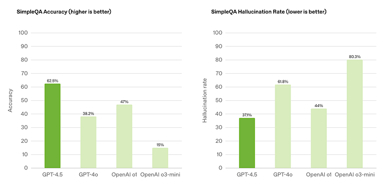
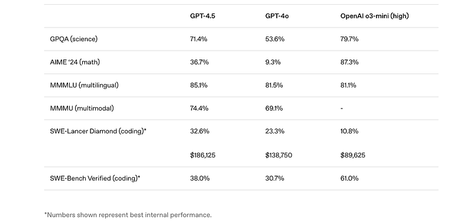
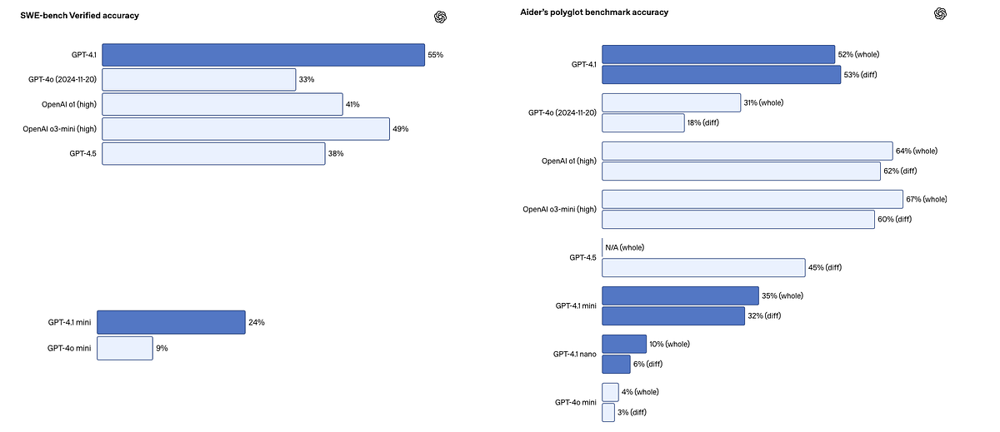
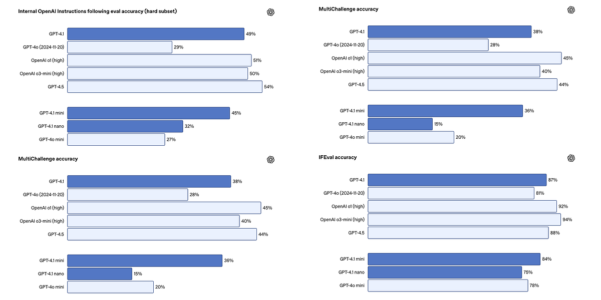
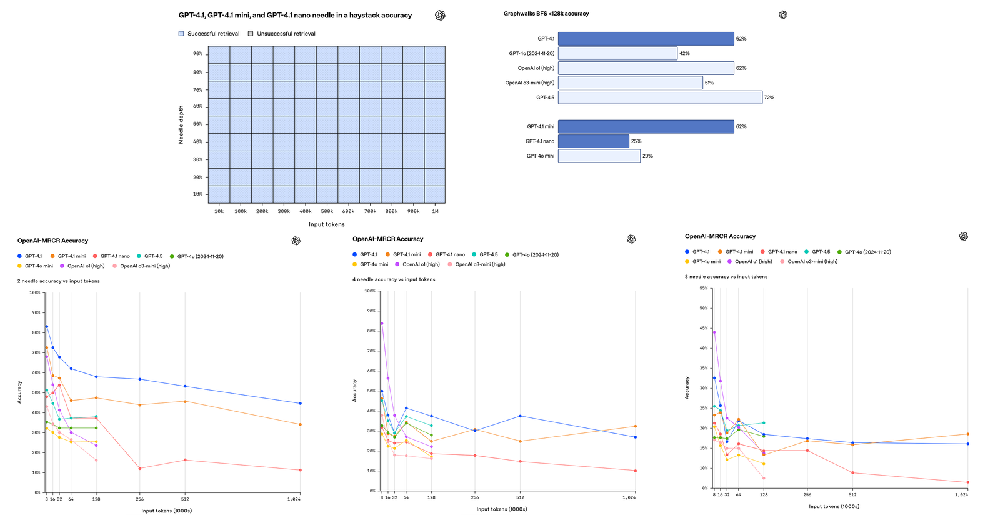
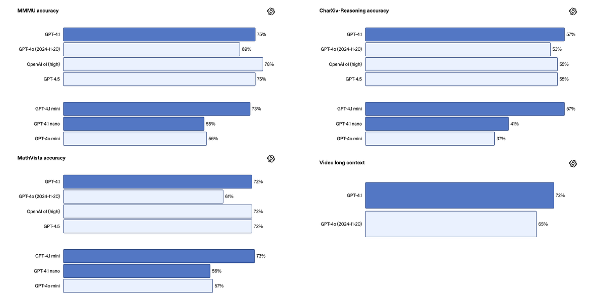
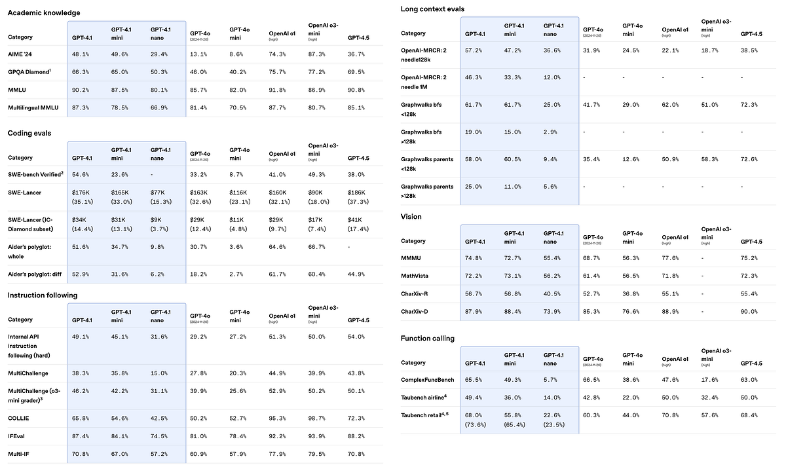

# Papers Explained 350 - GPT 4.5

OpenAI GPT-4.5 is the largest and most knowledgeable model yet. Building on GPT-4o, GPT-4.5 scales pre-training further and is designed to be more general-purpose than powerful STEM-focused reasoning models.

This page ingests the source article into the wiki and connects it to [[Papers Explained Corpus]], [[Large Language Models]], [[Reasoning Models]], [[Code Models]], [[Long Context]], [[Model Compression and Efficiency]], [[Supervised Fine-Tuning]], [[Reinforcement Learning]].

## Source Metadata

- Source file: `raw/2025-04-18_Papers-Explained-350--GPT-4-5-dc1d4b097ad1.html`
- Source title: Papers Explained 350: GPT 4.5
- Published: 2025-04-18
- Canonical: [https://medium.com/@ritvik19/papers-explained-350-gpt-4-5-dc1d4b097ad1](https://medium.com/@ritvik19/papers-explained-350-gpt-4-5-dc1d4b097ad1)

## Key Ideas

- Early testing shows that interacting with GPT-4.5 feels more natural. Its broader knowledge base, stronger alignment with user intent, and improved emotional intelligence make it well-suited for tasks like writing, programming, and solving practical problems...
- GPT-4.5 advances AI capabilities by scaling two paradigms: unsupervised learning and chain-of-thought reasoning. Scaling chain-of-thought reasoning teaches models to think before they respond, allowing them to tackle complex STEM or logic problems.
- As models solve broader, more complex problems, it becomes increasingly important to teach them a greater understanding of human needs and intent.
- GPT4.1 are a family of 3 models: GPT‑4.1, GPT‑4.1 mini, and GPT‑4.1 nano. These models outperform GPT‑4o and GPT‑4o mini across the board, with major gains in coding and instruction following.
- Coding: GPT-4.1 demonstrates a major leap in coding abilities, scoring 54.6% on SWE-bench Verified. This represents a 21.4% improvement over GPT-4o and a 26.6% improvement over GPT-4.5, positioning it as a leading model for coding tasks.

## Notes

OpenAI GPT-4.5 is the largest and most knowledgeable model yet. Building on GPT-4o, GPT-4.5 scales pre-training further and is designed to be more general-purpose than powerful STEM-focused reasoning models. It is trained using new supervision techniques combined with traditional methods like SFT and RLHF, similar to those used for GPT-4o.

Early testing shows that interacting with GPT-4.5 feels more natural. Its broader knowledge base, stronger alignment with user intent, and improved emotional intelligence make it well-suited for tasks like writing, programming, and solving practical problems — with fewer hallucinations.

GPT-4.5 advances AI capabilities by scaling two paradigms: unsupervised learning and chain-of-thought reasoning. Scaling chain-of-thought reasoning teaches models to think before they respond, allowing them to tackle complex STEM or logic problems. In contrast, scaling unsupervised learning increases world model accuracy, decreases hallucination rates, and improves associative thinking. GPT-4.5 is the next step in scaling the unsupervised learning paradigm.

As models solve broader, more complex problems, it becomes increasingly important to teach them a greater understanding of human needs and intent. For GPT-4.5, new, scalable alignment techniques are developed that enable training larger and more powerful models with data derived from smaller models. These techniques allowed for improvement of GPT-4.5’s steerability, understanding of nuance, and natural conversation.

## GPT-4.1

GPT4.1 are a family of 3 models: GPT‑4.1, GPT‑4.1 mini, and GPT‑4.1 nano. These models outperform GPT‑4o and GPT‑4o mini across the board, with major gains in coding and instruction following. They also have larger context windows — supporting up to 1 million tokens of context — and are able to better use that context with improved long-context comprehension. They feature a refreshed knowledge cutoff of June 2024.

Performance Enhancements:

Coding: GPT-4.1 demonstrates a major leap in coding abilities, scoring 54.6% on SWE-bench Verified. This represents a 21.4% improvement over GPT-4o and a 26.6% improvement over GPT-4.5, positioning it as a leading model for coding tasks. It’s better at agent coding, frontend coding, creating cleaner diffs, following diff formats, consistent tool usage, and reducing extraneous edits (from 9% in GPT-4o to 2% in GPT-4.1). The model can handle larger files with its increased output token limit of 32,768 tokens.

Instruction Following: GPT-4.1 exhibits enhanced reliability in following instructions, scoring 38.3% on Scale’s MultiChallenge benchmark — a 10.5% increase over GPT-4o. Internal evaluations show improvements across various instruction types, including format following, negative instructions, ordered instructions, content requirements, ranking, and handling overconfidence. It’s also improved in multi-turn instruction following, scoring 87.4% on IFEval compared to GPT-4o’s 81.0%.

Long Context Evaluations:

All three new models support a significantly expanded context window of up to 1 million tokens, enabling them to process extensive codebases or numerous lengthy documents (previous models were limited to 128,000 tokens). GPT-4.1 demonstrates superior long-context comprehension, effectively retrieving and understanding information across the entire context window, even disambiguating between multiple identical requests within a large context. It scores 72.0% on Video-MME (long w/o subs), a new state-of-the-art result.

OpenAI has released two new evaluations for long-context understanding:

- OpenAI-MRCR (Multi-Round Coreference): Tests the model’s ability to find and differentiate between multiple identical requests hidden within a large context.

- Graphwalks: Evaluates multi-hop long-context reasoning by requiring the model to perform a breadth-first search within a graph embedded in the context window. GPT-4.1 achieves 61.7% accuracy, matching o1 and surpassing GPT-4o.

Vision: The GPT-4.1 family excels in image understanding. GPT-4.1 mini shows remarkable progress, often surpassing GPT-4o in image benchmarks like MMMU, MathVista, and CharXiv-Reasoning. Its long-context capabilities extend to multimodal applications, such as processing lengthy videos without subtitles.

Lower Cost: The GPT-4.1 family delivers exceptional performance at a reduced cost compared to previous models. GPT-4.1 mini, in particular, offers substantial cost savings (83% less than GPT-4o) while exceeding GPT-4o’s performance in many benchmarks.

Reduced Latency: These models offer faster response times. GPT-4.1 mini boasts nearly half the latency of GPT-4o. GPT-4.1 nano is designed for low-latency tasks like classification and autocompletion, often returning the first token in under five seconds for queries with 128,000 input tokens. Initial tests show GPT-4.1’s latency to first token is around 15 seconds for 128,000 tokens and about a minute for 1 million tokens. Prompt caching can further reduce latency and cost.

Real-World Applications and Examples:

Alpha testers have demonstrated GPT-4.1’s effectiveness in various domains:

- Windsurf: 60% higher score on internal coding benchmarks compared to GPT-4o.

- Qodo: Generated better code review suggestions in 55% of cases compared to other leading models.

- Blue J: 53% more accurate on challenging tax scenarios compared to GPT-4o.

- Hex: Nearly 2x improvement on complex SQL evaluations.

- Thomson Reuters: 17% improvement in multi-document review accuracy in legal work.

- Carlyle: 50% better performance in extracting financial data from large, complex documents.

Benchmarks:

Availability and Deprecation:

- API Only: GPT-4.1 will only be available through the API. Many of its improvements have been gradually integrated into the latest version of GPT-4o within ChatGPT, with more planned for future releases.

- GPT-4.5 Preview Deprecation: OpenAI will discontinue GPT-4.5 Preview in the API on July 14, 2025, due to GPT-4.1’s superior performance and lower cost.

## Paper

- [Introducing GPT-4.5](https://openai.com/index/introducing-gpt-4-5/)

- [OpenAI GPT-4.5 System Card](https://cdn.openai.com/gpt-4-5-system-card-2272025.pdf)

- [Introducing GPT-4.1 in the API](https://openai.com/index/gpt-4-1/)

## Figures

Figures from the Medium HTML export (`raw/2025-04-18_Papers-Explained-350--GPT-4-5-dc1d4b097ad1.html`); local copies under `wiki/assets/papers-explained-350-gpt-4-5/` when download succeeded.

| Figure | Caption |
|--------|---------|
|  | Title card: GPT 4.5. |
|  | As models solve broader, more complex problems, it becomes increasingly important to teach them a greater understanding of human needs and... |
|  | As models solve broader, more complex problems, it becomes increasingly important to teach them a greater understanding of human needs and... |
|  | Coding: GPT-4.1 demonstrates a major leap in coding abilities, scoring 54.6% on SWE-bench Verified. |
|  | Long Context Evaluations. |
|  | OpenAI has released two new evaluations for long-context understanding. |
|  | Vision: The GPT-4.1 family excels in image understanding. |
|  | Benchmarks. |
## Related

- [[Papers Explained Corpus]]
- [[Large Language Models]]
- [[Reasoning Models]]
- [[Code Models]]
- [[Long Context]]
- [[Model Compression and Efficiency]]
- [[Supervised Fine-Tuning]]
- [[Reinforcement Learning]]
- [[Papers Explained 349 - ReSearch]]
- [[Papers Explained 351 - MathFusion]]

#summary #topic
