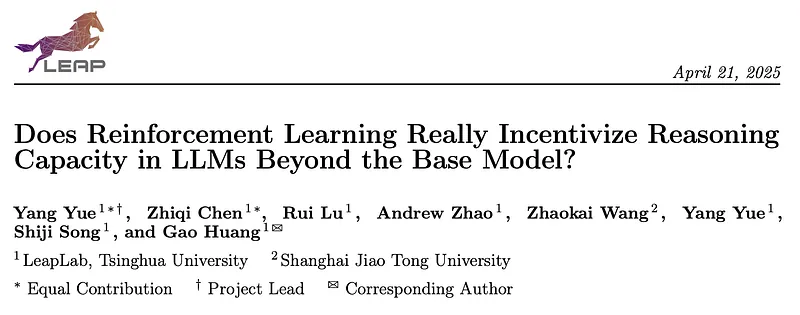
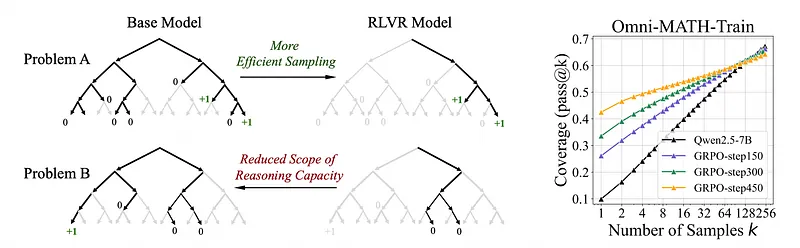
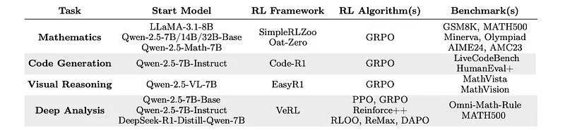
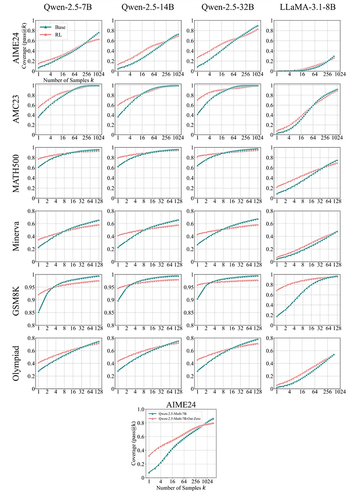
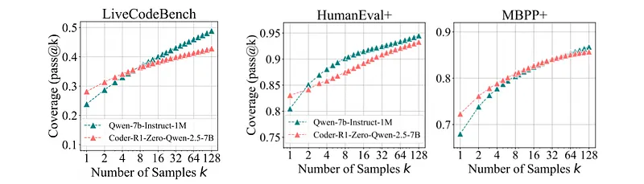
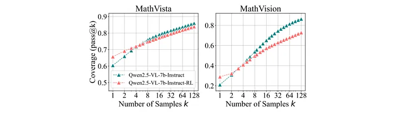
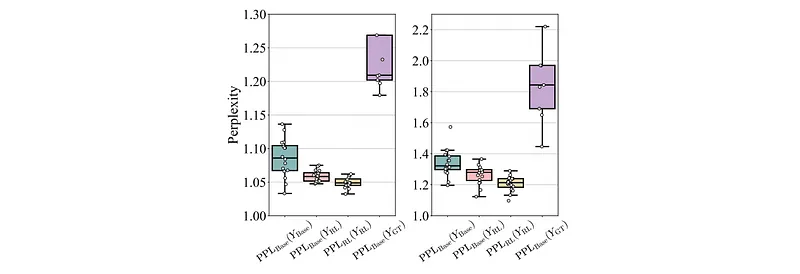
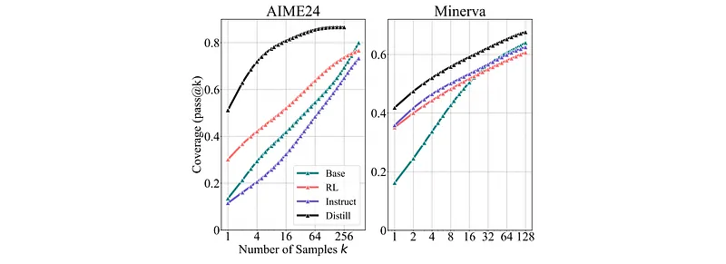
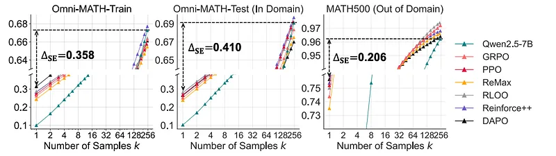
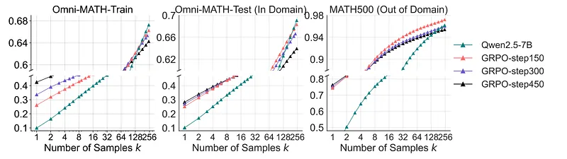

# Papers Explained 354 - Does RL Incentivize Reasoning Capacity in LLMs Beyond the Base Model

It is widely believed that RLVR enables LLMs to continuously self-improve, thus acquiring novel reasoning abilities that exceed corresponding base models’ capacity.

This page ingests the source article into the wiki and connects it to [[Papers Explained Corpus]], [[Reasoning Models]], [[Reinforcement Learning Topic]], [[Model Compression and Efficiency]], [[Code Models]], [[Verifier-Bounded Learning]], [[Reinforcement Learning]], [[Model Distillation]].

## Source Metadata

- Source file: `raw/2025-04-24_Papers-Explained-354--Does-RL-Incentivize-Reasoning-Capacity-in-LLMs-Beyond-the-Base-Model--77ae394a5054.md`
- Source title: Papers Explained 354: Does RL Incentivize Reasoning Capacity in LLMs Beyond the Base Model?
- Published: 2025-04-24
- Canonical: [https://medium.com/@ritvik19/papers-explained-354-does-rl-incentivize-reasoning-capacity-in-llms-beyond-the-base-model-77ae394a5054](https://medium.com/@ritvik19/papers-explained-354-does-rl-incentivize-reasoning-capacity-in-llms-beyond-the-base-model-77ae394a5054)

## Key Ideas

- While RL-trained models outperform their base models at smaller values of k (e.g., k=1), base models can achieve a comparable or even higher pass@k score compared to their RL counterparts at large k values.
- Further analysis shows that the reasoning paths generated by RL-trained models are already included in the base models’ sampling distribution, suggesting that most reasoning abilities manifested in RL-trained models are already obtained by base models.
- RL training boosts the performance by biasing the model’s output distribution toward paths that are more likely to yield rewards, therefore sampling correct responses more efficiently.
- However, this also limits their exploration capacity, resulting in a narrower reasoning capability boundary compared to base models.
- Similar results are observed in visual reasoning tasks trained with RLVR.

## Notes

It is widely believed that RLVR enables LLMs to continuously self-improve, thus acquiring novel reasoning abilities that exceed corresponding base models’ capacity. However, this assumption is critically re-examined by measuring the pass@k metric with large values of k to explore the reasoning capability boundary of the models across a wide range of model families, RL algorithms and math/coding benchmarks.

### TL;DR:

- While RL-trained models outperform their base models at smaller values of k (e.g., k=1), base models can achieve a comparable or even higher pass@k score compared to their RL counterparts at large k values.

- Further analysis shows that the reasoning paths generated by RL-trained models are already included in the base models’ sampling distribution, suggesting that most reasoning abilities manifested in RL-trained models are already obtained by base models.

- RL training boosts the performance by biasing the model’s output distribution toward paths that are more likely to yield rewards, therefore sampling correct responses more efficiently.

- However, this also limits their exploration capacity, resulting in a narrower reasoning capability boundary compared to base models.

- Similar results are observed in visual reasoning tasks trained with RLVR.

- Moreover, it is found that distillation can genuinely introduce new knowledge into the model.

The project is available at [GitHub](https://limit-of-rlvr.github.io/).

## RLVR’s Effect on Reasoning Capacity Boundary

The analysis is organized by task category, covering three representative domains: mathematics, code generation, and visual reasoning. For all sampling procedures involving both base and RL-trained models, a temperature of 0.6 and a top-p value of 0.95 are used, allowing a maximum generation of 16,384 tokens.

*Figure: Experimental setup for assessing RLVR’s effect on the reasoning boundaries of LLMs across different tasks.*

### RLVR for Mathematical Reasoning

- Compared the performance of base LLMs (Qwen-2.5 and LLaMA-3.1–8B) with their RLVR-trained counterparts (trained using GRPO on GSM8K and MATH datasets).

- Evaluated models using pass@k (the probability of generating a correct answer within k attempts) on various math benchmarks (GSM8K, MATH500, Minerva, Olympiad, AIME24, AMC23).

- Included an additional comparison with Oat-Zero-7B, an RL model trained using the Oat-Zero framework.

- RLVR increases the likelihood of sampling correct answers when k is small (e.g., k=1, equivalent to average-case accuracy).

- RLVR narrows the model’s overall problem-solving coverage, as evidenced by base models outperforming RL models at larger k values.

### RLVR for Code Generation

- Model: Code-R1 (specifically CodeR1-Zero-Qwen2.5–7B) trained with RLVR using a binary correctness reward based on predefined test cases. The model was based on Qwen2.5–7B-Instruct-1M and trained on 12K LeetCode and TACO samples.

- Evaluation: Performance is assessed on three code generation benchmarks: LiveCodeBench v5 (880 problems), HumanEval+, and MBPP+.

- RLVR improves single-sample performance (pass@1) in code generation tasks, similar to its effect on mathematical reasoning tasks.

- RLVR negatively impacts the reasoning boundary or coverage of the model. While the original model shows potential for solving more problems with increased sampling (k), the RLVR-trained model plateaus. Specifically, at k=128, the original model solves ~50% of problems while the RLVR model solves only ~42.8% on LiveCodeBench.

- Although RLVR enhances initial performance, it limits the model’s potential to solve a wider range of problems compared to the original model when allowing for multiple solution attempts. This suggests a trade-off between single-sample accuracy and exploration capability.

### RLVR for Visual Reasoning

- Model: Qwen-2.5-VL-7B (a vision-language model) trained using the EasyR1 framework on Geometry3K dataset.

- Evaluation Data: Filtered versions of MathVista-TestMini and MathVision-TestMini, excluding multiple-choice questions to avoid guessing bias. The filtering resulted in 460 problems from MathVista and 114 problems from MathVision.

- RLVR consistently improves the visual reasoning performance of the LLM, similar to its effects on math and coding benchmarks.

- The improvement is attributed to broader coverage of solvable questions, meaning the model can solve a wider range of problems after RLVR training.

- Manual inspection of CoT in challenging problems indicates that the increased performance is due to the model learning valid reasoning paths, rather than random guessing. Specifically, for both the original and RL models, 7 out of 8 inspected problems had at least one correct CoT leading to the right answer. This validates the effectiveness of the CoT approach in improving reasoning abilities.

## Deep Analysis

### Reasoning Patterns Already Present in Base Models

Compared the set of solvable problems for base models and their corresponding RL-trained versions on AIME24 (math problems) and coding tasks.

Performed perplexity analysis: measured the perplexity of responses generated by the base model (PPLBase) for responses generated by the RL-trained model (YRL) and the base model itself (YBase), and compared them to responses from a stronger model (OpenAI-o1, YGT).

*Figure: Perplexity distribution of responses from different sources, evaluated by the base and RL models.*

- RLVR does not introduce new reasoning abilities: The RL-trained models do not exhibit reasoning capabilities beyond those already present in the base models. The reasoning paths exploited by the RL model already exist within the base model’s output distribution. This is supported by the perplexity analysis showing that the RL model’s responses are highly likely to be generated by the base model.

- RLVR improves sampling efficiency: While not introducing new capabilities, RLVR improves the likelihood of sampling correct reasoning paths already present in the base model, leading to better performance in terms of pass@1.

- RLVR narrows the reasoning boundary: The improved sampling efficiency comes at the cost of reduced exploration and diversity in the generated responses, leading to lower pass@k (solving problems within k attempts) for larger values of k. This is attributed to RL’s tendency to reduce output entropy.

### Distillation Expands the Reasoning Boundary

Distillation of a large reasoning model (DeepSeek-R1) into a smaller base model (Qwen-2.5-Math-7B). Comparison of the performance of the distilled model (DeepSeek-R1-Distill-Qwen-7B) with:

- the base model (Qwen-2.5-Math-7B)

- its RL-trained counterpart (Qwen-2.5-Math-7B-Oat-Zero)

- an instruction-tuned model (Qwen-2.5-Math-7B-Instruct)

*Figure: Coverage comparison of base, Instruct, RL, and distilled models.*

- Distillation significantly improves the reasoning capabilities of the base model.

- Unlike RL, which is limited by the base model’s reasoning capacity, distillation introduces new reasoning patterns learned from the stronger teacher model, allowing the distilled model to surpass the limitations of the base model.

### Effects of Different RL Algorithms

- Algorithms: Several popular RL algorithms (PPO, GRPO, Reinforce++, RLOO, ReMax, DAPO) were re-implemented using the VeRL framework.

- Dataset: Omni-MATH-Rule dataset is split into training and in-domain test sets. MATH500 is used as the out-of-domain benchmark.

- Metric: Sampling Efficiency Gap (∆SE) is defined as the difference between the RL-trained model’s pass@1 and the base model’s pass@256. Lower ∆SE indicates better sampling efficiency.

*Figure: Different RL algorithms.*

- General Performance: Different RL algorithms showed minor variations in pass@1 and pass@256, but none significantly closed the Sampling Efficiency Gap (∆SE). ∆SE remained above 40 points across all algorithms.

- DAPO: Achieved slightly higher pass@1 scores but required significantly more samples per batch (3–6x) during training and performance dropped considerably at pass@256.

- RLOO and Reinforce++: Performed consistently well across different values of k (1 to 256) with efficient training costs, offering a good balance between effectiveness and efficiency.

- ReMax: Showed lower performance, likely due to the instability caused by the binary and highly variable reward used as the advantage baseline.

### Asymptotic Effects of RL Training

The modelias trained using RL with varying numbers of training steps (e.g., 150, 450). Performance is evaluated using pass@1 (exact match accuracy) and pass@256 (accuracy within top 256 candidates) metrics on training, in-domain test, and out-of-domain test sets.

*Figure: Different RL training steps.*

- Increasing RL training steps improves pass@1 on the training set significantly (from 26.1 to 42.5).

- However, the improvement in pass@1 on in-domain and out-of-domain test sets is marginal beyond 150 steps, suggesting potential overfitting to the training set.

- Increasing training steps leads to a decrease in pass@256 across all datasets, with the lowest performance at 450 steps. This indicates a reduced reasoning boundary and exploration ability as training progresses, likely due to decreasing output entropy.

- Longer RL training (beyond 150 steps) may not provide substantial benefits and might even hinder performance due to overfitting and reduced exploration.

## Paper

Does Reinforcement Learning Really Incentivize Reasoning Capacity in LLMs Beyond the Base Model? [2504.13837](https://www.arxiv.org/abs/2504.13837)

## Figures

Figures from the Medium HTML export (`raw/2025-04-24_Papers-Explained-354--Does-RL-Incentivize-Reasoning-Capacity-in-LLMs-Beyond-the-Base-Model--77ae394a5054.md`); local copies under `wiki/assets/papers-explained-354-does-rl-incentivize-reasoning-capacity-in-llms-beyond-the-base-model/` when download succeeded.

| Figure | Caption |
|--------|---------|
|  | Title card: Does RL Incentivize Reasoning Capacity in LLMs Beyond the Base Model. |
|  | The project is available at GitHub. |
|  | Experimental setup for assessing RLVR’s effect on the reasoning boundaries of LLMs across different tasks. |
|  | The analysis is organized by task category, covering three representative domains: mathematics, code generation, and visual reasoning. |
|  | The analysis is organized by task category, covering three representative domains: mathematics, code generation, and visual reasoning. |
|  | The analysis is organized by task category, covering three representative domains: mathematics, code generation, and visual reasoning. |
|  | Perplexity distribution of responses from different sources, evaluated by the base and RL models. |
|  | Coverage comparison of base, Instruct, RL, and distilled models. |
|  | Different RL algorithms. |
|  | Different RL training steps. |
## Related

- [[Papers Explained Corpus]]
- [[Reasoning Models]]
- [[Reinforcement Learning Topic]]
- [[Model Compression and Efficiency]]
- [[Code Models]]
- [[Verifier-Bounded Learning]]
- [[Reinforcement Learning]]
- [[Model Distillation]]
- [[Papers Explained 353 - s1]]
- [[Papers Explained 355 - OpenMath Nemotron]]

#summary #topic
