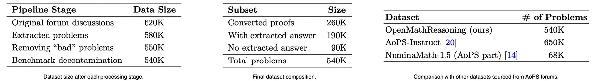
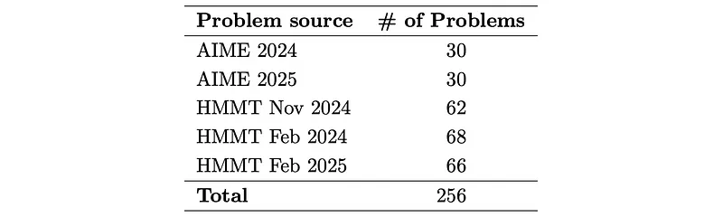
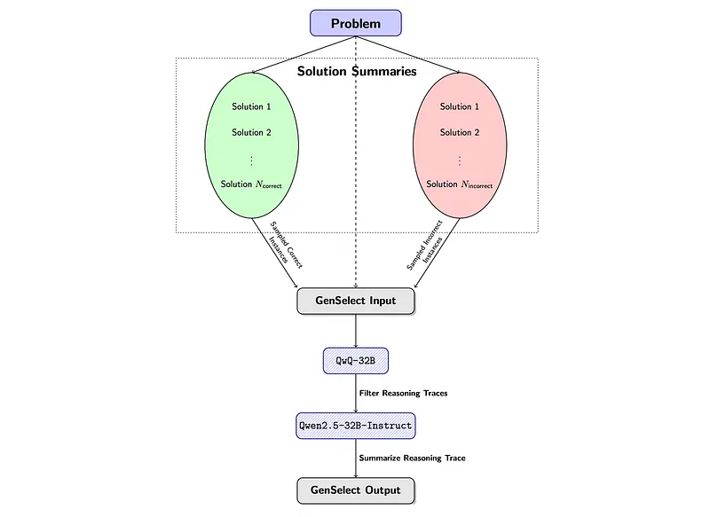
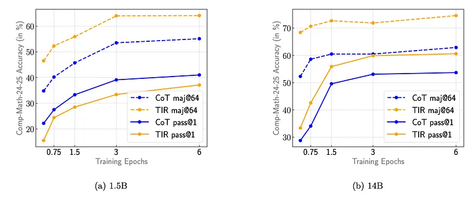
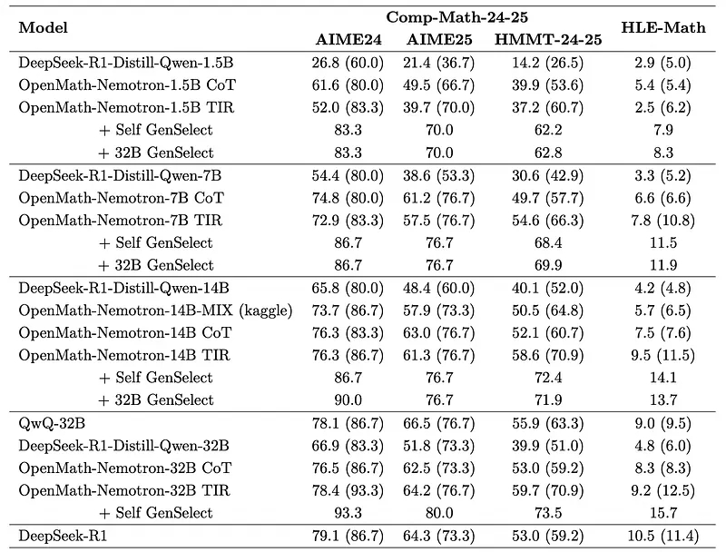

# Papers Explained 355 - OpenMath Nemotron

This paper presents a winning submission to the AI Mathematical Olympiad — Progress Prize 2 (AIMO-2) competition.

This page ingests the source article into the wiki and connects it to [[Papers Explained Corpus]], [[Reasoning Models]], [[Large Language Models]], [[Synthetic Data]], [[Code Models]], [[Agentic AI]].

## Source Metadata

- Source file: `raw/2025-04-25_Papers-Explained-355--OpenMath-Nemotron-d73c6000148a.md`
- Source title: Papers Explained 355: OpenMath Nemotron
- Published: 2025-04-25
- Canonical: [https://medium.com/@ritvik19/papers-explained-355-openmath-nemotron-d73c6000148a](https://medium.com/@ritvik19/papers-explained-355-openmath-nemotron-d73c6000148a)

## Key Ideas

- A large-scale dataset comprising 540K unique high-quality math problems, including olympiad-level problems, and their 3.2M long-reasoning solutions is created.
- A novel method to integrate code execution with long reasoning models through iterative training, generation, and quality filtering is developed, resulting in 1.7M high-quality Tool-Integrated Reasoning solutions.
- A pipeline to train models to select the most promising solution from many candidates is created.
- Combining these ideas, a series of models are trained that achieve state-of-the-art results on mathematical reasoning benchmarks.
- The models and datasets are available at [HuggingFace](https://huggingface.co/collections/nvidia/openmathreasoning-68072c0154a5099573d2e730/).

## Notes

This paper presents a winning submission to the AI Mathematical Olympiad — Progress Prize 2 (AIMO-2) competition.

- A large-scale dataset comprising 540K unique high-quality math problems, including olympiad-level problems, and their 3.2M long-reasoning solutions is created.

- A novel method to integrate code execution with long reasoning models through iterative training, generation, and quality filtering is developed, resulting in 1.7M high-quality Tool-Integrated Reasoning solutions.

- A pipeline to train models to select the most promising solution from many candidates is created.

Combining these ideas, a series of models are trained that achieve state-of-the-art results on mathematical reasoning benchmarks.

The models and datasets are available at [HuggingFace](https://huggingface.co/collections/nvidia/openmathreasoning-68072c0154a5099573d2e730/).

## Data Preparation

### Problems preparation

A large set of mathematical problems was collected from the Art of Problem Solving (AoPS) community forums, excluding “Middle School Math” as discussions found to be too elementary and unhelpful. The process involved several steps:

Problem Extraction: LLM is prompted to identify and extract all problems from the initial forum posts . While most posts contain a single problem, some include multiple problems or none at all.

```text
I will give you a post from a math-related forum that might contain one or several math problems.
Your task is to extract all problems or state that none are available.
Here are some guidelines you should follow:
- If no problems are available, output:
**"No problems identified."**
- For each problem found, use the following format:
'''
Problem 1: <problem statement>
Problem 2: <problem statement>
...
'''
- For each math problem you identify, **rephrase it** so that it is stated clearly and concisely.
- **Remove** any redundant context, personal commentary, anecdotes, or unrelated information.
- Do **not** change the meaning of the problem. Keep all necessary mathematical or technical details.
- If multiple problems you extract are related, make sure to **include all relevant context** in each problem statement, as they will be reviewed independently.
---
### Examples
**Example 1**
Forum post:
'''
Countdown:
What is the remainder of 8^6 + 7^7 + 6^8 divided by 5?
No calculator of course, paper isn’t needed either, but sure.
'''
Output:
'''
Problem 1: What is the remainder of $8^6 + 7^7 + 6^8$ when divided by 5?
'''
---
**Example 2**
Forum post:
'''
Question 1:
A tetrahedron has four vertices. We can label each vertex by one of the four digits: 1, 2, 3, 4.
How many non-congruent ways are there to assign a different digit to each vertex of a tetrahedron?
Tetrahedra are considered congruent through rotation. Reflections are considered different.
I'm wondering how I could approach a problem like this. I started off with 4! and then divided by 4 to take out the rotation aspect. Now I am stuck.
Note: I’d rather not do case work because I’m sure the test writers could have easily used an icosahedron, or something equally lengthy.
Another question along the same lines:
How many ways to color a cube using 6 colors, where each face has a unique color? Thanks.
'''
Output:
'''
Problem 1: How many non-congruent ways are there to assign a different digit to each vertex of a tetrahedron, where congruence is defined by rotation but not reflection?
Problem 2: How many ways can a cube be colored using 6 different colors, such that each face has a unique color?
'''
---
**Example 3**
Forum post:
'''
Yes! I completely agree with what you said. It’s been a tough transition for me too, but we’ll figure it out.
'''
Output:
'''
No problems identified.
'''
---
**Example 4**
Forum post:
'''
Billy Bob has fourteen different pairs of socks in his drawer. They are just thrown around randomly in the drawer.
Billy Bob once woke up in a hurry and had to get his socks quickly. Without switching the light on, he pulled out enough socks to know that he had at least one pair, and then he ran out of the room.
How many socks did Billy Bob pull out?
'''
Output:
'''
Problem 1: From a drawer containing 14 different pairs of socks, how many socks must be pulled out randomly to ensure at least one matching pair?
'''
---
Please analyze the following forum post and extract all math problems.
**Here are the guidelines one more time for your reference:**
- If no problems are available, output:
**"No problems identified."**
- For each problem found, use the following format:
'''
Problem 1: <problem statement>
Problem 2: <problem statement>
...
'''
- Rephrase each math problem so it is stated clearly and concisely.
- Remove any redundant context, personal commentary, anecdotes, or unrelated information.
- Do not change the meaning of the problem, and keep all necessary mathematical or technical details.
- If multiple problems you extract are related, include all the context in each problem statement, as they will be reviewed independently.
---
**Forum post:**
'''
{ forum_post }
'''
**Output:**
```

Problem Classification: Each extracted problem is classified into the following categories:

- Proof problem or not

```text
I will give you a math problem and ask you to identify if it’s a "proof" problem.
Respond only with "proof" if it *is* a proof problem, and "not proof" if it is *not*.
Consider the following characteristics of proof problems:
1. They often use phrases like "prove that", "show that", or "demonstrate that".
2. They may ask you to justify or explain why a statement is true.
3. They don’t have a well-defined answer in the form of a number or expression.
Here are a few examples:
Example 1
**Problem:**
Prove the identity
\[
a^{\frac{1}{2}} - \frac{a - a^{-2}}{a^{\frac{1}{2}} - a^{-\frac{1}{2}} + \frac{1 - a^{-2}}{a^{\frac{1}{2}} + a^{-\frac{1}{2}} + \frac{2}{a^{\frac{3}{2}}}} = 0
\]
**Output:** proof
Example 2
**Problem:**
Write the first several terms of a geometric progression in which the difference between
the third and first terms is equal to 9, and that between the fifth and third terms is equal to 36.
**Output:** not proof
Example 3
**Problem:**
Solve the following equation:
\[
\frac{\sin(60^\circ + x) + \sin(60^\circ - x)}{2} = \frac{\tan x}{(1 + \tan^2 x)^2} + \frac{\cot x}{(1 + \cot^2 x)^2}
\]
**Output:** not proof
Example 4
**Problem:**
Denoting the sums of the first \( n_1 \), \( n_2 \), and \( n_3 \) terms of an arithmetic progression by
\( S_1 \), \( S_2 \), and \( S_3 \), respectively, show that
\[
\frac{S_1}{n_1}(n_2 - n_3) + \frac{S_2}{n_2}(n_3 - n_1) + \frac{S_3}{n_3}(n_1 - n_2) = 0
\]
**Output:** proof
Now here is the problem you need to extract the answer from.
**Problem:**
{ problem }
**Output:**
```

- Multiple choice question or not

```text
I will provide a math problem, and you need to determine whether it is a multiple-choice problem.
Respond only with `mcq` if the problem meets the criteria, and `not mcq` otherwise.
A multiple-choice problem must satisfy **all** of the following conditions:
1. The problem **explicitly presents** a set of answer choices to select from.
2. The problem **asks for a final answer** rather than requiring a proof, justification, or explanation.
3. The problem has **at least one correct answer** among the given choices.
If the problem does not include answer choices, even if it has a numerical answer, it should be classified as `not mcq`.
Here are a few examples:
---
**Example 1**
**Problem:**
Simplify the expression \( \frac{2\sqrt{6}}{\sqrt{2}} + \sqrt{3} + \sqrt{5} \) and choose the correct option from the following:
A. \( \sqrt{2} + \sqrt{3} - \sqrt{5} \)
B. \( 4 - \sqrt{2} - \sqrt{3} \)
C. \( \sqrt{2} + \sqrt{3} + \sqrt{6} - 5 \)
D. \( \frac{1}{2}(\sqrt{2} + \sqrt{5} - \sqrt{3}) \)
E. \( \frac{1}{3}(\sqrt{3} + \sqrt{5} - \sqrt{2}) \)
**Output:** `mcq`
---
**Example 2**
**Problem:**
Write the first several terms of a geometric progression in which the difference between the third and first terms is equal to 9, and that between the fifth and third terms equals 36.
**Output:** `not mcq`
---
**Example 3**
**Problem:**
Solve the following equations:
\[ \frac{\sin(60^\circ+x) + \sin(60^\circ - x)}{2} = \frac{\tan x}{(1 + \tan^2 x)^2} + \frac{\cot x}{(1 + \cot^2 x)^2} \]
**Output:** `not mcq`
---
**Example 4**
**Problem:**
Simplify the expression
\[ \log\left(\frac{a}{b}\right) + \log\left(\frac{b}{c}\right) + \log\left(\frac{c}{d}\right) - \log\left(\frac{ay}{dx}\right) \]
Choose from the following options:
**(A)** \( \log\left(\frac{y}{x}\right) \)
**(B)** \( \log\left(\frac{x}{y}\right) \)
**(C)** 1
**(D)** 0
**(E)** \( \log\left(\frac{a^2y}{d^2x}\right) \)
**Output:** `mcq`
---
**Example 5**
**Problem:**
What is the maximum possible magnitude of the difference between two vectors? Choose from the following options and provide reasoning:
A. The magnitude of one of the vectors.
B. The magnitude of both vectors.
C. The magnitude of their sum.
D. Their scalar product.
**Output:** `mcq`
---
**Example 6**
**Problem:**
Compare the numbers \( a = 3(\log 7 - \log 5), \quad b = 2\left(\frac{1}{2} \log 9 - \frac{1}{3} \log 8\right) \)
**Output:** `not mcq`
---
**Example 7**
**Problem:**
Which of the two numbers \( 31^{11} \) and \( 17^{14} \) is greater?
**Output:** `not mcq`
---
**Example 8**
**Problem:**
Let \( ABCD \) be a rectangle and \( E \) the reflection of \( A \) with respect to the diagonal \( BD \). If \( EB = EC \), what is the ratio \( \frac{AD}{AB} \)
**Output:** `not mcq`
---
Now here is the problem you need to extract the answer from.
**Problem:**
{ problem }
**Output:**
```

- Binary question (yes-or-no answer) or not

```text
I will provide a math problem, and you need to determine whether it is a **binary question**.
Respond only with `binary` if the problem meets the criteria, and `not binary` otherwise.
A problem qualifies as a binary question **if and only if**:
1. The problem explicitly asks for a binary response, such as "yes or no", "true or false", or another equivalent two-choice response.
2. The problem is phrased as a question or statement that naturally leads to a binary response (e.g., "Is this true?" or "Determine whether the statement is true or false").
If the problem does **not** explicitly ask for a binary response, even if it **can** be interpreted that way, it should be classified as `not binary`.
---
### Examples
**Example 1**
**Problem:**
Is it true that $0.439530899999\ldots = 0.4395309$?
**Output:** `binary`
**Example 2**
**Problem:**
Write first several terms of a geometric progression in which the difference between the third and first terms is equal to 9, and that between the fifth and third terms equals 36.
**Output:** `not binary`
**Example 3**
**Problem:**
Solve the following equations:
\[
\frac{{\sin(60^\circ + x) + \sin(60^\circ - x)}}{2} = \frac{{\tan x}}{(1 + \tan^2 x)^2} + \frac{{\cot x}}{(1 + \cot^2 x)^2}
\]
**Output:** `not binary`
**Example 4**
**Problem:**
Given the quadratic expression \( ax^2 + bx + c \) with coefficients \( a, b, c \) such that \( b - c > a \) and \( a \ne 0 \), is it true that the equation \( ax^2 + bx + c = 0 \) always has two distinct real roots?
**Output:** `binary`
**Example 5**
**Problem:**
Can the vertices of a cube be colored in red, yellow, and blue such that every set of four coplanar vertices contains all three colors?
**Output:** `binary`
**Example 6**
**Problem:**
Can the numbers \( \frac{14x + 5}{9} \) and \( \frac{17x - 4}{12} \) both be integers for some integer \( x \)? If so, find that integer.
**Output:** `not binary`
**Example 7**
**Problem:**
Can the distances from a point on the plane to the vertices of a certain square be equal to \(1, 1, 2,\) and \(3\)?
**Output:** `binary`
---
Now here is the problem you need to extract the answer from.
**Problem:**
{ problem }
**Output:**
```

- Valid problem or not

```text
I will provide a problem statement from a math forum. Your task is to determine whether it is a valid, solvable math problem based on the given text.
Respond with `not invalid` if the problem meets **all** of the following conditions:
1. It is a well-defined math question, such as solving an equation, finding a minimum, computing an expression, or proving a result.
2. It contains enough information to be solved using standard mathematical techniques, even if the solution requires advanced concepts (e.g., limits, logarithms, recursion).
3. It is **not** just a conceptual or definitional question (e.g., "What does the notation mean?" is not a valid math problem).
4. It does **not** rely on external resources such as images or missing context.
Otherwise, respond with `invalid`, but only if there is a clear and strong reason why the problem cannot be solved. If you are uncertain, default to `not invalid`.
### Important Notes:
1. The vast majority (>99%) of problems will be valid math problems.
2. Only extremely rare cases are invalid, such as:
- Problems relying on external images or missing definitions.
- Vague or incomplete statements that cannot be interpreted mathematically.
- Open-ended conceptual discussions rather than problem-solving.
3. A problem is still valid even if solving it requires advanced methods like recursion, limits, or logarithms.
4. **Do not** evaluate whether the problem has a solution or not.
5. **Do not** analyze the difficulty of the problem or the methods required to solve it.
6. Only check whether it is a well-formed math problem that can be meaningfully interpreted.
---
### Here are a few examples:
**Example 1**
**Problem:**
Solve the equation \( \log(x - 2)(2x - 3) = \log(x^2) \).
**Output:** not invalid
**Example 2**
**Problem:**
Solve the math problem found on Facebook (image provided).
**Output:** invalid
**Example 3**
**Problem:**
Solve the following equations:
\[
\frac{\sin(60^\circ+x)+\sin(60^\circ-x)}{2} = \frac{\tan x}{(1+\tan^2 x)^2} + \frac{\cot x}{(1+\cot^2 x)^2}
\]
**Output:** not invalid
**Example 4**
**Problem:**
Find the area of square T?
**Output:** invalid
**Example 5**
**Problem:**
Provide another example of a similar problem involving remainders and squaring a number.
**Output:** invalid
**Example 6**
**Problem:**
What does the notation \( \vec{B} \) mean in the context of vectors?
**Output:** invalid
**Example 7**
**Problem:**
Is there a quick way to multiply 59 and 61? If so, explain the method.
**Output:** invalid
**Example 8**
**Problem:**
None
(Note: There is only one problem in the given forum post.)
**Output:** invalid
**Example 9**
**Problem:**
If \( a + b = 31 \) and \( ab = 240 \), find the sum of the reciprocals of \( a \) and \( b \).
**Output:** not invalid
**Example 10**
**Problem:**
What is the value of \( 35461^{54593428} \mod 11 \)?
**Output:** not invalid
---
Now here is the problem you need to extract the answer from.
**Problem:**
{ problem }
**Output:**
```

All multiple-choice questions, binary questions, and invalid problems are removed from the final dataset.

Question Transformation: All proof questions are converted into answer-based questions that require similar problem-solving techniques.

```text
I will give you a math problem that asks to prove something.
Your task is to create an equivalent problem that instead has some kind of numerical
or expression answer that can be used to automatically grade the solution.
Make sure the new problem is at least as difficult as the original proof problem.
Here are a few examples.
Example 1
Problem:
Prove that the system
\begin{align*}
x^6 + x^3 + x^3y + y &= 147^{157} \\
x^3 + x^3y + y^2 + y + z^9 &= 157^{147}
\end{align*}
has no solutions in integers $x$, $y$, and $z$.
Output:
Let $x$, $y$, and $z$ be a solution to the following system of equations:
\begin{align*}
x^6 + x^3 + x^3y + y &= 147^{157} \\
x^3 + x^3y + y^2 + y + z^9 &= 157^{147}
\end{align*}
Calculate the sum of all possible values of $x$.
Example 2
Problem:
A triangle is called a parabolic triangle if its vertices lie on a parabola $y = x^2$.
Prove that for every nonnegative integer $n$, there is an odd number $m$ and a parabolic
triangle with vertices at three distinct points with integer coordinates with area
$(2^n m)^2$.
Output:
Consider parabolic triangles whose vertices lie on $y = x^2$ with integer coordinates.
Let $f(n)$ be the smallest possible value of $c$, where $(0, 0)$, $(b, b^2)$, and $(c, c^2)$
are vertices of such a triangle with area exactly $(2^n)^2$, for some integer $b$
where $0 < b < c$.
Find $f(4)$.
Now here is the problem you need to modify. Only output the new problem **WITH NO**
explanation or notes after it.
Again, start with the problem right away, **DO NOT** start with "Let's modify the
given problem" or anything like that.
Problem:
{ problem }
Output:
```

Answer Extraction: For non-proof questions, the final answer is extracted from the forum discussions.

```text
I will give you a series of posts from a math-related forum that contain one or several math problems and discussion of their solutions.
I will also specify which problem I’m currently looking at (in case there are multiple).
Your task is to find an answer to the problem I’m currently looking at inside the forum discussions.
The answer should be a numerical value or a mathematical expression.
If the answer is not available, output `"Answer not found."` in the last line of your response.
You can think before stating the final answer. The final line of your response should be:
`Answer: <final answer>`
---
**Here is an example.**
**First forum post with problem(s):**
This problem was extra credit for my math class and I haven’t gotten it back yet but I’m assuming:
a.) Everyone handed it in
b.) None of you here goes/takes/will go/take my math class
Anyways:
Suppose two of the zeroes of the following fourth-degree equation are the same and the other two zeroes are the reciprocals of each other. Find \( a \) and \( b \).
\[ x^4 + ax^3 + bx^2 + 4x + 4 = 0 \]
It’s not at all hard as it looks... a lot of work though, so I suggest organizing as you go along.
**Problem we are looking at (it might be rephrased):**
Suppose two of the zeroes of the fourth-degree equation
\[ x^4 + ax^3 + bx^2 + 4x + 4 = 0 \]
are the same and the other two zeroes are reciprocals of each other. Find \( a \) and \( b \).
**Forum discussions:**
**Post 1:**
Tare wrote:
Here’s a shorter way:
Say the four roots are \( c, c, d, \) and \( \frac{1}{d} \). Then the product of the four roots is the constant term of the polynomial, so \( c^2 \cdot d \cdot \frac{1}{d} = c^2 = 4 \).
Then \( c = \pm 2 \).
Similarly, from the linear term:
\( c^2 d + \frac{c^2}{d} + c + c = -4 \).
If we plug in \( c = 2 \), we get \( d = -1 \), so the roots are \( 2, 2, -1, -1 \).
So:
- \( a = -(2 + 2 - 1 - 1) = -2 \)
- \( b = 2 \cdot 2 + 2(-1) + 2(-1) + 2(-1) + 2(-1) + (-1)(-1) = -3 \)
If we plug in \( c = -2 \), we get:
\( 4d + \frac{4}{d} = 0 \Rightarrow d + \frac{1}{d} = 0 \).
Then:
- \( a = -(-2 -2 + 0) = 4 \)
- \( b = (-2)^2 + (-2)(0) + (-2)(0) + 1 = 5 \)
So either \( a = -2, b = -3 \) or \( a = 4, b = 5 \).
Thanks Tare for catching the mistakes.
—Dan
**Post 2:**
Well... it didn’t specify that the solution is real and also you were supposed to get a and b...
**Output:**
Seems that there is an answer at the end of the first post. Since none of the other posts contradict it, we can assume that the answer is correct.
**Answer: \( a = -2, b = -3 \) or \( a = 4, b = 5 \)**
---
Now here are the posts from the forum that I’m currently looking at. Please find the answer to the problem.
Don’t forget to say `"Answer not found."` if the answer is not available.
**First forum post with problem(s):**
{forum_post}
**Problem we are looking at (it might be rephrased):**
{problem}
**Forum discussions:**
{forum_discussions}
**Output:**
```

Benchmark Decontamination: An LLM-based comparison is used to remove questions that closely resemble those in popular math benchmarks.

Qwen2.5–32B-Instruct is used for all processing steps

### Comp-Math-24–25 Benchmark

To create a robust validation dataset for evaluation, problems from 2024 and 2025 American Invitational Mathematics Examinations (AIME) and Harvard-MIT Mathematics Tournaments (HMMT) are gathered from the Art of Problem Solving forums. Proof-based questions and those awarding partial credit based on estimate accuracy are excluded as these are generally incompatible with an exact match evaluation framework.

*Figure: Composition of the Comp-Math-24–25 validation dataset.*

## CoT Solution Synthesis

DeepSeek-R1 and QwQ-32B models are used to generate up to 32 solution candidates for each problem in the dataset with temperature 0.7, top-𝑝 = 0.95, and a limit of 16384 tokens.

More solutions are generated for harder problems with known answers, where the hardness is estimated by computing an average pass-rate across 32 generations from the Qwen2.5–72B-Math-Instruct model.

As the final filtering step, any solutions that do not reach the expected answer are removed. For each problem where the final answer couldn’t be extracted (and for all converted proofs), the most common answer across all available solution candidates is treated as the ground truth.

*Figure: Final distribution of CoT solutions in the dataset.*

## Tool-Integrated Reasoning

The best open-weight reasoning models (most notably DeepSeek-R1 and QwQ-32B) are not able to directly produce such Tool-Integrated Reasoning (TIR) solutions. In early experiments, it was noticed that when non-reasoning instruct LLMs are trained on a limited quantity of reasoning data, they tend to retain their good instruction-following abilities. Building on this intuition, the LIMO-Qwen-32B model is prompted to produce TIR solutions, but they tend to be low-quality on average.

1.2M solutions for OpenMathReasoning problems are synthesized, using temperature=0.7, top-𝑝 = 0.95, allowing a maximum sequence length of 16384 tokens and stopping generations if the solution contained more than 8 code executions.

```text
You are a math problem solver that uses Python code as an integral part of your reasoning.
In your solution, you MUST strictly follow these instructions:
1. For each step requiring complex calculation, write Python code.
2. For Python code, use the following template:
'''python
# Your Python code
'''
3. Put the final answer within `\boxed{{ }}`.
Please reason step by step, and put your final answer within `\boxed{{ }}`.
**User:**
Solve the following math problem using Python code for the calculations:
`{ problem }`
```

To filter unwanted code usages, several filters are applied. First, Qwen2.5–32B-Instruct is used to classify each code block by two criteria:

- novel calculation / verification. Whether the code execution leads to a novel result or it simply verifies the previous steps

```text
You will be given a fragment of a solution to a math problem that includes a Python code block.
Your task is to determine the purpose of this Python code block in the solution fragment.
In your assessment, you MUST follow these guidelines:
**1. Classification:**
– **Verification**: Python code is used to verify the correctness of the previous manual calculations or to confirm some results. E.g., if the result of the code execution exists in the solution above, it is definitely a verification.
– **Novel Calculation**: Otherwise, if the result of code execution is not present in ANY FORM in the solution above, it is a novel calculation.
If you are unsure about the classification of a specific code block, you MUST label it as **Verification**!
**2. Output Format:**
– Your response MUST follow this exact format (without extra commentary or text):
'''
Reasoning: <a couple of sentences explaining your rationale>
Judgement: <Verification or Novel Calculation>
'''
---
**EXAMPLES**
1.
'''
Solution:
<Some text reasoning without code>
Wait, so the answer is 143? Let me verify this with the pow function.
'''python
# Compute 7^999 mod 1000 using pow function
print(pow(7, 999, 1000)) # Should print 143
'''
'''output
143
'''
So the answer is \boxed{143}.
'''
Reasoning: This is for sure a verification, because the result of the code execution is present in the solution above. Moreover, the comment in the code block explicitly states that it should print 143, which means the result is known in advance.
Judgement: Verification
'''
---
2.
'''
Solution:
<Some text reasoning without code>
Therefore, let’s proceed to compute P^5. I can use Python for this calculation to ensure accuracy.
First, let’s define the transition matrix P as a numpy array, then compute P^5, then extract the relevant entry, and divide by 3.
Let me import numpy and do the calculations.
'''python
import numpy as np
# Define the transition matrix P
P = np.array([
[0, 1, 0, 0],
[1/3, 0, 2/3, 0],
[0, 2/3, 0, 1/3],
[0, 0, 1, 0]
])
# Compute P^5
P5 = np.linalg.matrix_power(P, 5)
initial_distribution = np.array([1, 0, 0, 0])
distribution_after_5_steps = initial_distribution @ P5
prob_mass_at_1 = distribution_after_5_steps[1]
prob_at_B = prob_mass_at_1 / 3
prob_at_B
'''
'''output
np.float64(0.25102880658436205)
'''
...
'''
Reasoning: The solution fragment describes algorithmic steps to calculate the probability and the code block executes these steps. The result of the code execution is not present in the solution above in any form. Therefore, this is a novel calculation.
Judgement: Novel Calculation
'''
---
3.
'''
Solution:
<Some text reasoning without code>
Compute C(51, 5):
51! / (5! * 46!) = ?
But maybe I should calculate it using Python to be accurate.
'''python
import math
math.comb(51, 5)
'''
'''output
2349060
'''
...
'''
Reasoning: The solution fragment describes the calculation of a combinatorial expression and the code block executes this calculation. The result of the code execution is not present in the solution above in any form. Therefore, this is a novel calculation.
Judgement: Novel Calculation
'''
---
4.
'''
Solution:
<Some text reasoning without code>
But let’s compute these values in Python.
'''python
import math
R = 4 # feet
H = 12 # feet
h = 9 # feet from the tip, so remaining height
r = (h / H) * R
V_original = (1/3) * math.pi * R**2 * H
V_remaining = (1/3) * math.pi * r**2 * h
V_poured = V_original - V_remaining
V_poured
'''
'''output
116.23892818282235
'''
When I computed the volume manually, I obtained \( 37\pi \) cubic feet. Approximating this as $$
37 * 3.14159 \approx 116.23
$$, it closely matches the Python result of approximately 116.2389. Therefore, the result appears to be correct.
'''
Reasoning: The rationale right after the code block states that the manual calculation (that happened before the code block) matches the Python result. Therefore, the code block verifies the previous manual calculations. So, this is a verification.
Judgement: Verification
'''
---
**REMINDER**
Focus only on the Python code block in the provided fragment and classify it as either **Verification** or **Novel Calculation** based on whether its output appears in the solution text before the code.
---
**YOUR TASK**
Solution fragment: {fragment}
```

- significant / moderate / trivial. Whether the code implements an important part of the solution or is easily substitutable with several CoT steps

```text
You will be given a fragment of a solution to a math problem that includes a Python code block.
Your task is to evaluate the significance of this Python code in solving the math problem.
In your assessment, you MUST follow these guidelines:
1. **Classification:**
Evaluate the significance of the code’s contribution by categorizing it into one of three levels:
* **Trivial:** The code performs calculations that could easily be done manually without significant effort (e.g., solving simple equations, doing arithmetic, applying formulas to known variables). The code usage provides no meaningful or minor advantage over manual calculation.
* **Moderate:** The code performs calculations that would be tedious, error-prone, or time-consuming to do manually, but still technically possible (e.g., matrix operations, numerical integration of standard functions, solving systems of equations). The code usage provides efficiency but isn’t essential.
* **Significant:** The code performs calculations that would be practically impossible or extremely difficult to do manually (e.g., brute-forcing combinatorial problems, complex simulations, solving complex differential equations, high-dimensional optimization). The code usage creates a crucial shortcut that fundamentally enables the solution.
2. **Output Format:**
* Your response MUST follow this exact format (without extra commentary or text):
'''
Reasoning: <a couple of sentences explaining your rationale>
Significance: <Trivial, Moderate, or Significant>
'''
---
**EXAMPLES**
1.
'''
Let’s find the roots of the quadratic equation: $3x^2 - 5x + 2 = 0$
'''
'''python
import numpy as np
from sympy import symbols, solve, Eq
x = symbols('x')
equation = 3*x**2 - 5*x + 2
solutions = solve(equation, x)
print(solutions)
'''
'''output
[2/3, 1]
'''
So the solutions are $x = 2/3$ and $x = 1$.
'''
Reasoning: This code simply solves a basic quadratic equation that could easily be solved manually using the quadratic formula or factoring. Finding roots of a quadratic equation with small integer coefficients is a standard calculation that requires minimal effort by hand.
Significance: Trivial
'''
---
2.
'''
To solve this system of 4 linear equations with 4 unknowns:
$3x + 2y - z + 2w = 10$
$x - y + 2z - w = -1$
$2x + y + z + 3w = 12$
$x + 3y - z - w = 5$
I’ll use Python to solve this system using matrices.
'''
'''python
import numpy as np
from scipy import linalg
# Define coefficient matrix
A = np.array([
[3, 2, -1, 2],
[1, -1, 2, -1],
[2, 1, 1, 3],
[1, 3, -1, -1]
])
# Define constants vector
b = np.array([10, -1, 12, 5])
# Solve the system
solution = linalg.solve(A, b)
print("x =", solution[0])
print("y =", solution[1])
print("z =", solution[2])
print("w =", solution[3])
'''
'''output
x = 0.64
y = 2.7
z = 1.6
w = 2.14
'''
Therefore, the solution is $x = 0.64$, $y = 2.7$, $z = 1.6$, and $w = 2.14$.
'''
Reasoning: This code solves a system of 4 linear equations with 4 unknowns. While this could be solved manually using Gaussian elimination or Cramer’s rule, it would be tedious and error-prone. The system is complex enough that computational assistance provides significant efficiency but doesn’t enable something impossible.
Significance: Moderate
'''
---
3.
'''
For this traveling salesman problem with 11 cities, where the distances between cities are given in the distance matrix below, I need to find the shortest possible route that visits each city exactly once and returns to the starting city.
'''
'''python
import numpy as np
from itertools import permutations
import time
# Distance matrix (11x11) between cities
distances = np.array([
[0, 29, 82, 46, 68, 52, 72, 42, 51, 55, 29],
[29, 0, 55, 46, 42, 43, 43, 23, 23, 31, 41],
[82, 55, 0, 68, 46, 55, 23, 43, 41, 29, 79],
[46, 46, 68, 0, 82, 15, 72, 31, 62, 42, 21],
[68, 42, 46, 82, 0, 74, 23, 52, 21, 46, 82],
[52, 43, 55, 15, 74, 0, 61, 23, 55, 31, 33],
[72, 43, 23, 72, 23, 61, 0, 42, 23, 31, 77],
[42, 23, 43, 31, 52, 23, 42, 0, 33, 15, 37],
[51, 23, 41, 62, 21, 55, 23, 33, 0, 29, 62],
[55, 31, 29, 42, 46, 31, 31, 15, 29, 0, 51],
[29, 41, 79, 21, 82, 33, 77, 37, 62, 51, 0],
])
# Brute force approach to solve TSP
def tsp_exact(distances):
n = len(distances)
cities = list(range(1, n)) # Start from city 0
min_length = float('inf')
best_route = None
start_time = time.time()
count = 0
# Try all possible permutations of cities (excluding starting city)
for perm in permutations(cities):
route = (0,) + perm + (0,) # Complete route starting and ending at city 0
length = sum(distances[route[i]][route[i + 1]] for i in range(len(route) - 1))
count += 1
if length < min_length:
min_length = length
best_route = route
end_time = time.time()
return best_route, min_length, count, end_time - start_time
# Solve the TSP problem
best_route, min_length, permutations_tried, time_taken = tsp_exact(distances)
print(f"Best route: {best_route}")
print(f"Minimum distance: {min_length}")
print(f"Permutations evaluated: {permutations_tried:,}")
print(f"Time taken: {time_taken.2f} seconds")
'''
'''output
Best route: (0, 1, 8, 4, 6, 2, 9, 7, 5, 3, 10, 0)
Minimum distance: 251
Permutations evaluated: 3,628,800
Time taken: 5.77 seconds
'''
Therefore, the optimal route has a total distance of 291 units.
'''
Reasoning: This code solves a Traveling Salesman Problem with 11 cities by evaluating over 3.6M permutations—a computation that would be absolutely impossible to do manually. The brute-force approach here creates a crucial shortcut to the solution that would be practically unattainable through manual calculation, even with significant time investment.
Significance: Significant
'''
---
4.
'''
To find all integer solutions to the Diophantine equation $17x + 23y = 3284$ where both $x$ and $y$ are non-negative, I’ll implement searching in Python.
'''
'''python
def find_solutions(a, b, c):
solutions = []
# Find the maximum possible value of x
max_x = c // a
# Check all possible values of x from 0 to max_x
for x in range(max_x + 1):
# Calculate the corresponding y value
remaining = c - a * x
# If remaining is divisible by b and the result is non-negative,
# we have a valid solution
if remaining >= 0 and remaining % b == 0:
y = remaining // b
solutions.append((x, y))
return solutions
# Given equation: 17x + 23y = 3284
a, b, c = 17, 23, 3284
solutions = find_solutions(a, b, c)
print(f"Solutions to {a}x + {b}y = {c}:")
for x, y in solutions:
print(f"x = {x}, y = {y}")
# Verify the solution
print(f"Verification: {a}*{x} + {b}*{y} = {a*x + b*y}")
print()
'''
'''output
Solutions to 17x + 23y = 3284:
x = 20, y = 128
Verification: 17*20 + 23*128 = 3284
x = 43, y = 111
Verification: 17*43 + 23*111 = 3284
x = 66, y = 94
Verification: 17*66 + 23*94 = 3284
x = 89, y = 77
Verification: 17*89 + 23*77 = 3284
x = 112, y = 60
Verification: 17*112 + 23*60 = 3284
x = 135, y = 43
Verification: 17*135 + 23*43 = 3284
x = 158, y = 26
Verification: 17*158 + 23*26 = 3284
x = 181, y = 9
Verification: 17*181 + 23*9 = 3284
'''
So the integer solutions to the Diophantine equation are $x = 11, y = 1$.
'''
Reasoning: This code finds all integer solutions to a Diophantine equation by iterating through possible values of x and calculating the corresponding y. While this could be done manually, the exhaustive search for non-negative integer solutions is tedious and error-prone. The computational approach reduces the effort and simplifies the solution process, making it more efficient. Thus it provides a moderate level of significance.
Significance: Moderate
'''
---
5.
'''
To verify my hypothesis, I need to find the probability of getting at least 3 heads in 10 coin flips. I’ll calculate this using the binomial distribution.
'''
'''python
import math
def binomial_probability(n, k, p):
# Calculate the probability of k successes in n trials
# with probability p of success on a single trial
combinations = math.comb(n, k)
return combinations * (p ** k) * ((1 - p) ** (n - k))
# Calculate P(X >= 3) when flipping a fair coin 10 times
p_at_least_3 = sum(binomial_probability(10, k, 0.5) for k in range(3, 11))
print(f"P(X >= 3) = {p_at_least_3.6f}")
print(f"Percentage: {p_at_least_3 * 100.2f}%")
'''
'''output
P(X >= 3) = 0.945312
Percentage: 94.53%
'''
So the probability of getting at least 3 heads in 10 coin flips is approximately 94.53%.
'''
Reasoning: This code calculates a probability using the binomial distribution formula. While the calculation involves combinations and powers, the mathematical concept is straightforward and could be calculated manually by explicitly writing and reducing the terms. The code provides a minor computational convenience but doesn’t fundamentally change the nature of the solution process, making it a trivial use of Python code.
Significance: Trivial
'''
---
**REMINDER**
When evaluating significance, consider:
1. Could this calculation reasonably be done by hand? If yes, how difficult would it be?
2. Does the code enable a solution approach that would otherwise be impractical?
3. Is the computational advantage merely convenience, or is it essential to the solution?
Remember to classify as Trivial, Moderate, or Significant based on these considerations.
---
**YOUR TASK**
Solution fragment: { fragment }
```

Solutions are kept only if they have at least one novel and significant code block or more than half novel and moderate code blocks. Solutions with an incorrect final answer and solutions without code execution are removed. Solutions with more than two code blocks are also removed, as this was found to be helpful in preliminary experiments. The model is instructed to place code between “‘‘‘python” and “‘‘‘\n”, following a markdown-like style that models can easily produce. These are then replaced with “<tool_call>” and “</tool_call>” tags, respectively, to make the code ending tag distinguishable from regular markdown and facilitate code extraction. This results in the TIR dataset, consisting of 15k samples, which will be referred to as stage-0 TIR data.

For the next stage of TIR solution generation, QwQ-32B is fine-tuned on the stage-0 data for 7 epochs. Solutions for OpenMathReasoning problems are then synthesized. 700K samples are generated and filtered down to 260K by removing incorrect solutions and solutions not using code. Novelty and significance filters are found to degrade the performance at this stage, so they are not used.

To further improve results, this process is repeated one more time using an intermediate version of the 14B model, which was fine-tuned on the CoT-only subset of OpenMathReasoning data. This 14B model is trained on QwQ-32B solutions and then a final round of data generation and filtering is executed, ultimately resulting in the final 1.7M TIR dataset.

During all data generation stages, the code output is formatted by appending additional notification warnings about how many code executions are remaining. The model often refers to this message in its thinking process, refraining from further code usage when the limit is reached. For each problem, between 1 and 8 allowed code executions are randomly selected and provided in the prompt. Generations that try to use more code blocks than requested are removed to reinforce the correct behavior in training.

```text
<tool_call>
# Initialize sum
total_sum = 0
# Iterate over possible bases b from 10 to 49 inclusive
for b in range(10, 50):
divisor = b + 7
dividend = 9 * b + 7
if dividend % divisor == 0:
total_sum += b
total_sum
### </tool_call>
'''output
70
'''
'''system
Remaining code executions: 3. You will not be able to call code when you run out of
executions, so use it wisely. Note that you can still continue solving the problem
without code after that.
'''
```

## Generative Solution Selection

*Figure: Data construction pipeline of GenSelect.*

A considerable gap exists in the majority@k vs pass@k performance for the models, implying the models’ theoretical ability to solve far more problems than can be achieved with a majority answer. To bridge this gap, training a model that, given a set of candidate solution summaries, picks the most promising solution is explored.

Original solution summaries from reasoning models can be too short or just the final answer, hindering effective comparison. To address this, Qwen2.5–32B-Instruct, is used to synthesize four new, more detailed summaries (max 2048 tokens) for each solution. Summary fidelity is ensured by discarding summaries where the predicted answer differs from the original. If no valid summaries remain, the entire sample is discarded. The longest valid summary is selected.

The entire OpenMathReasoning dataset is reprocessed using this method, enabling models trained on it to directly produce these improved summaries.

For each problem, 2 to 16 candidate solution summaries are randomly sampled, ensuring at least one correct and one incorrect solution in each group. This sampling process is repeated to create 8 distinct comparison groups per problem. QwQ-32B is then tasked with selecting the best solution from each group using the GenSelect prompt. From the resulting 1 million selections, instances where incorrect solutions were chosen are filtered out, leaving 565,000 high-quality selections for training.

```text
I will give you a math problem and a long solution to that problem, exploring different approaches, making mistakes along the way, correcting them, switching around, and so on. But eventually, that solution gets to the right approach and solves the problem. Your task is to write a clean version of the final correct solution without all the exploration. Cover all the details of the final solution.
Problem:
{problem}
Solution:
{generation}
Now write a clean version of the final correct solution without all the exploration but cover all the details of the final solution.
```

Comparing full reasoning traces for each solution is computationally expensive. To reduce this cost, models are trained to generate a final comparison summary instead of the entire reasoning process. Qwen2.5–32B-Instruct is again used to regenerate all comparison summaries using a specific prompt. This results in summarized comparisons for training. This significantly reduces computational cost during inference with minimal accuracy loss (1–2%). Inference efficiency is improved due to a highly parallelizable pre-filling phase and capped token limits (2048 tokens per summary, 32768 maximum input context with 16 solutions).

```text
You will be given a challenging math problem followed by {num_solutions} solutions.
Your task is to systematically analyze these solutions to identify the most mathematically sound approach.
Input Format:
Problem: A complex mathematical word problem at advanced high school or college level
Solutions: Detailed solutions indexed 0−{max_idx}, each concluding with an answer in \boxed{{}} notation
YOUR TASK
Problem: {problem}
Solutions:
{solutions}
Evaluation Process:
1. Initial Screening
− Group solutions by their final answers
− Identify and explain mathematical contradictions between different answers
− Eliminate solutions with clear mathematical errors
2. Detailed Analysis
For remaining solutions, evaluate:
− Mathematical precision and accuracy
− Logical progression of steps
− Completeness of mathematical reasoning
− Proper use of mathematical notation, including \boxed{{}}
− Handling of edge cases or special conditions
− For solutions containing and addressing errors, evaluate the error identification and correction methodology
3. Solution Comparison
Compare viable solutions based on:
− Efficiency of approach
− Clarity of mathematical reasoning
− Sophistication of method
− Robustness of solution (works for all cases)
Your response should include:
1. Brief analysis of conflicting answers
2. Detailed evaluation of mathematically sound solutions
3. Justification for eliminating incorrect solutions
4. Clear explanation for selecting the best approach
End your evaluation with exactly:
Judgment: [IDX]
Where IDX is the index 0−{max_idx} of the best solution.
```

## OpenMath-Nemotron models

To build the final models, SFT is performed on a series of Qwen2.5-Base models (1.5B, 7B, 14B and 32B). For 1.5B and 7B models, Qwen2.5-Math model are used. Unlike general Qwen2.5 models, the math versions only support a limited context window of 4096 tokens, which is inadequate for the long-reasoning generations. To overcome this, the RoPE base is changed to 500K.

All models are trained for six epochs on a combination of three tasks: CoT solution generation, TIR solution generation, and GenSelect. Training on a mix of all tasks results in a similar accuracy compared to training on each task sequentially. The total SFT dataset size is 5.5M samples (3.2M CoT, 1.7M TIR, and 566K GenSelect).

Four equally spaced checkpoints are saved during the training runs, which are averaged to create the final model.

*Figure: Accuracy improvement through the course of training.*

After the first round of training, another SFT is performed on a subset of harder problems. These problems are selected only from forums discussing Olympiad math and any problems for which Qwen2.5-Math-72B-Instruct TIR model has a pass-rate bigger than 0.3 out of 32 generations are discarded. Additionally, any solutions that have fewer than 5000 tokens are filtered. The total SFT data size of this harder set is 2.2M samples. Training for this second round is done for 4 epochs instead of 6.

*Figure: Accuracy with majority@64 on the Comp-Math-24–25 benchmark after the first and second SFT rounds.*

This is done for all models except 32B as some degradation in results was found.

*Figure: Evaluation results on mathematical benchmarks.*

- Smaller models perform similarly or worse than larger models in terms of pass@1 accuracy when using the TIR prompting method, despite performing better in the majority@k setting.

*Figure: Percentage of unfinished solutions on the Comp-Math-24–25 dataset.*

- Smaller models, especially the 1.5B parameter model, produce more unfinished solutions when using the TIR prompt compared to the CoT prompt. This suggests that smaller models struggle to use tools effectively and consistently compared to larger models.

## Kaggle Submission

First, the Qwen2.5–14B-Base model is trained for 8 epochs on a 2.2M subset of CoT solutions, excluding any converted proof problems. Only DeepSeek-R1 solutions are used for this training. This is followed by a light-weight fine-tuning on 15k stage-0 TIR samples for 400 steps.

CoT and TIR checkpoints are then merged as it both improves accuracy and speeds up generation by reducing solution length and number of code executions. GenSelect training or inference is not used for the Kaggle submission.

Several merging techniques from the mergekit package were experimented with. Surprisingly, the most effective approach turned out to be a simple linear combination of the two checkpoints.

A Flask-based sandbox environment is used to handle parallelized Python execution for each inference thread, processing LLM-generated code blocks with strict safeguards:

- Maximum 6 code calls per generation cycle

- 2 second timeout for each code execution

- Only the first 200 characters of the code output were shown back to the LLM

## Paper

AIMO-2 Winning Solution: Building State-of-the-Art Mathematical Reasoning Models with OpenMathReasoning dataset [2504.16891](https://arxiv.org/abs/2504.16891)

## Figures

Figures from the Medium HTML export (`raw/2025-04-25_Papers-Explained-355--OpenMath-Nemotron-d73c6000148a.md`); local copies under `wiki/assets/papers-explained-355-openmath-nemotron/` when download succeeded.

| Figure | Caption |
|--------|---------|
|  | Title card: OpenMath Nemotron. |
|  | Qwen2.5–32B-Instruct is used for all processing steps. |
|  | Composition of the Comp-Math-24–25 validation dataset. |
|  | Final distribution of CoT solutions in the dataset. |
|  | Data construction pipeline of GenSelect. |
|  | Accuracy improvement through the course of training. |
|  | Accuracy with majority@64 on the Comp-Math-24–25 benchmark after the first and second SFT rounds. |
|  | Evaluation results on mathematical benchmarks. |
|  | Percentage of unfinished solutions on the Comp-Math-24–25 dataset. |
## Related

- [[Papers Explained Corpus]]
- [[Reasoning Models]]
- [[Large Language Models]]
- [[Synthetic Data]]
- [[Code Models]]
- [[Agentic AI]]
- [[Papers Explained 354 - Does RL Incentivize Reasoning Capacity in LLMs Beyond the Base Model]]
- [[Papers Explained Review 13 - Model Merging]]

#summary #topic
