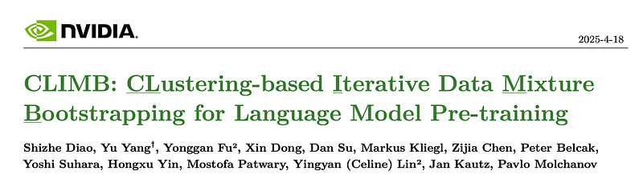
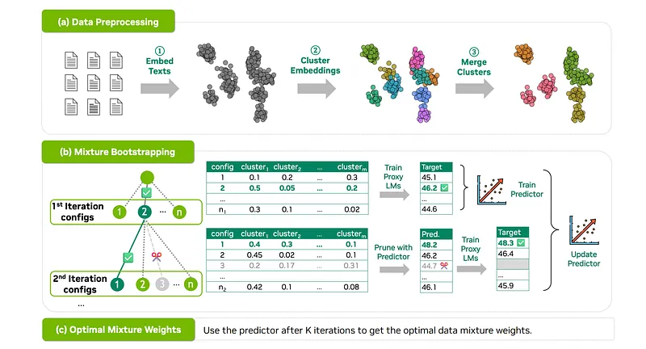
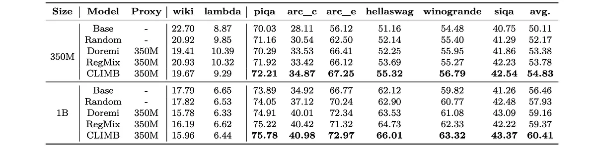
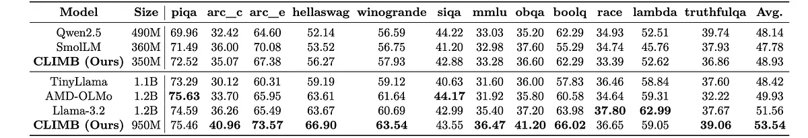
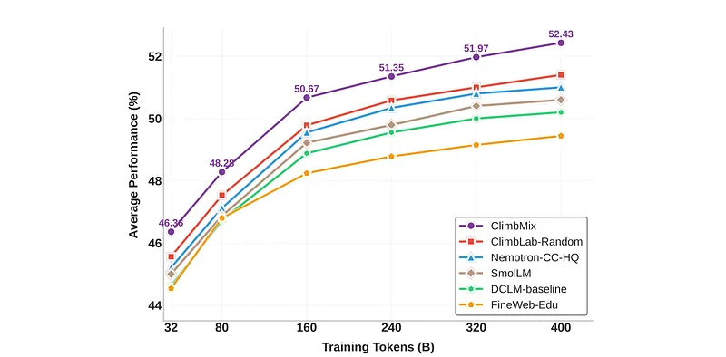

# Papers Explained 356 - CLIMB

Despite the success of pre-training, optimizing data mixtures for both general and domain-specific tasks remains a challenge:

This page ingests the source article into the wiki and connects it to [[Papers Explained Corpus]], [[Synthetic Data]], [[Reasoning Models]], [[Model Compression and Efficiency]], [[Evaluation and Benchmarks]], [[Embedding and Retrieval]].

## Source Metadata

- Source file: `raw/2025-05-01_Papers-Explained-356--CLIMB-875e43e8357e.md`
- Source title: Papers Explained 356: CLIMB
- Published: 2025-05-01
- Canonical: [https://medium.com/@ritvik19/papers-explained-356-climb-875e43e8357e](https://medium.com/@ritvik19/papers-explained-356-climb-875e43e8357e)

## Key Ideas

- Difficulty in extracting domain-relevant content from large-scale datasets: Datasets like Common Crawl offer vast amounts of data but lack explicit domain labels.
- Complexity in selecting optimal data mixtures from curated datasets: Even with domain annotations (e.g., The Pile), the relationship between dataset composition and model performance is complex and non-linear.
- To solve these problems, the paper proposes CLIMB (CLustering-based Iterative Data Mixture Bootstrapping), a framework for automating the search for optimal data mixtures during pre-training.
- The project is available [here](https://research.nvidia.com/labs/lpr/climb/).
- Embedding and clustering large-scale datasets

## Notes

Despite the success of pre-training, optimizing data mixtures for both general and domain-specific tasks remains a challenge:

- Difficulty in extracting domain-relevant content from large-scale datasets: Datasets like Common Crawl offer vast amounts of data but lack explicit domain labels. Existing filtering methods using heuristics like perplexity or educational value are insufficient for identifying high-quality, domain-specific content.

- Complexity in selecting optimal data mixtures from curated datasets: Even with domain annotations (e.g., The Pile), the relationship between dataset composition and model performance is complex and non-linear. Optimizing for a specific domain often requires incorporating complementary knowledge from related areas.

To solve these problems, the paper proposes CLIMB (CLustering-based Iterative Data Mixture Bootstrapping), a framework for automating the search for optimal data mixtures during pre-training.

The project is available [here](https://research.nvidia.com/labs/lpr/climb/).

## Method

*Figure: The CLIMB framework overview.*

CLIMB involves three key steps:

- Embedding and clustering large-scale datasets

- Constructing mixture-performance pairs by sampling and pruning data mixtures and training proxy models

- Fitting a predictor

By treating the data mixture as input features and performance metrics as target labels, we train a regression model as a predictor.

### Data Preprocessing

This phase aims to cluster semantically similar documents together. It involves three steps:

- Text Embedding: Each document in the raw dataset ^D is converted into an embedding vector using an embedding model M_e. This results in a set of embedding vectors E. This moves analysis from word-level comparison to a deeper semantic understanding.

- Embedding Clustering: The embedding vectors E are clustered using an algorithm like k-means. Initially, a large number of clusters (K_init, e.g., 1000) are created to ensure fine-grained distinctions between different domains.

- Cluster Merging: This step refines the initial clusters:

- Pruning: Low-quality clusters are removed based on a model-based classifier, resulting in K_pruned clusters. This eliminates noisy or irrelevant clusters.

- Merging: Similar clusters (based on centroid distance) are merged to reduce the number of domains to K_enhanced, where K_enhanced < K_pruned < K_init. This simplifies the subsequent mixture process. The final dataset is now D, refined from the original ^D.

### Iterative Bootstrapping: Mixture Weight Search

Given a set of data clusters 𝐷 and the objective function l(𝛼,𝜔) with model weights 𝜔 trained with mixture weights 𝛼, which outputs the achievable performance 𝑃 on a calibration set, the objective is to identify the optimal mixture weights 𝛼* ∈ 𝐴 that maximize the task performance l(𝛼, 𝜔). A straightforward approach to estimate the objective function l(𝛼, 𝜔) is to train a model for each 𝛼 across the entire design space 𝐴. However, this is computationally prohibitive. To address this challenge, a predictor 𝑓𝜃 (𝛼) is proposed to approximate l(𝛼, 𝜔) based on a subset of (mixture weights, performance) pairs, thereby significantly reducing the training cost.

Instead of uniformly sampling mixture weights and then training the predictor, CLIMB uses an iterative approach:

Initialization: Start with a small random sample of mixture weights S_1 and train proxy models to get their performance.

Iteration (k = 2 to K):

- Predict performance ˜P_k for all mixture weights not yet in S_k using the current predictor f_k.

- Randomly sample M new configurations from the top N predicted performers (balancing exploration and exploitation).

- Combine these new samples with S_k to form S_k+1.

- Train a new predictor f_k+1 using the expanded set of samples S_k+1. This predictor is used in the next iteration.

Final Selection: The best configuration predicted by the final predictor f_K is chosen as the optimal data mixture weight. The predictor used in the experiments is LightGBM.

## Experiment Setup

For training, Nemotron-CC and smollm-corpus are used as the source dataset. CLIMB- clustering yields 21 super-clusters containing 800B tokens. For evaluation, reasoning benchmarks: PIQA, ARC_C, ARC_E, HellaSwag, WinoGrande, and SIQA are used. Optimization is performed using PIQA, ARC_E, and HellaSwag validation data, then evaluation is conducted on test sets.

Phase-1 pre-training establishes a solid foundation. Three Transformer decoder-only models (62M, 350M, 1B) are trained with next-token prediction on 10T tokens, similar to Qwen 2.

For proxy models, 62M and 350M are used for efficiency. For target models, all three sizes are evaluated to assess the approach across scales. Once the optimal data mixture is found, the target model is trained on 40B tokens using this mixture and performance is compared.

The method is compared with (1) Random selection, and state-of-the-art data mixing methods, including (2) DoReMi, and (3) Reg- Mix.

textstella_en_400M_v5 is used as it efficiently encodes large-scale text with excellent performance.

The classic K-means clustering algorithm from the FAISS library is adopted, setting the initial number of clusters 𝐾init to 1000.

Several fasttext models are trained to evaluate the data quality across four important dimensions — overall quality, educational value, informational value, and advertisement score (1–5) — by annotating 1 million texts with Nemotron-340B with a carefully designed prompt template.

Then, cluster-level pruning is performed based on the fasttext scores, applying a relatively loose threshold of 3.0, which results in 240 (i.e., the value of 𝐾pruned) clusters. Finally, the clusters are grouped according to a Euclidean distance threshold of 1.5, resulting in 16 clusters.

The data mixture search runs for three iterations with 64, 32, and 16 searches.

## Evaluation

### Comparison with Data Mixture Baselines

*Figure: Comparison with data mixture methods.*

- CLIMB outperforms all baseline data mixture methods across different model sizes and benchmark tasks.

- With a 350M parameter model, CLIMB achieved 54.83% average accuracy, compared to 52.17% for Random and 53.78% for Regmix.

- With a 1B parameter model, CLIMB achieved 60.41% average accuracy, exceeding all baselines.

- The performance gains observed on the validation sets of PIQA, ARC_E, and HellaSwag generalized well to other benchmark tasks, demonstrating the robustness of CLIMB.

### Comparison with SOTA LMs

*Figure: Comparison with state-of-the-art language models on general reasoning benchmarks.*

- CLIMB achieves the best performance among all models with under 500 million and under 1.2 billion parameters.

- CLIMB consistently outperforms baseline models, including Llama-3.2 and AMD-OLMo, on most general reasoning benchmarks, particularly when comparing models of similar size (around 1 billion parameters).

- CLIMB achieves a 2.0% higher overall average score than the next best model (Llama-3.2).

- CLIMB demonstrates excellent generalization performance, consistently outperforming baselines on additional benchmarks (mmlu, gpqa, obqa, boolq, and race). This suggests the effectiveness of the authors’ data mixture approach for training language models.

## ClimbMix

CLIMB is applied to two existing datasets: Nemotron-CC and smollm-corpus, with the goal of constructing a powerful new pre-training dataset. Nemotron-CC and smollm-corpus are first combined, and then the proposed CLIMB-clustering method is employed to semantically reorganize and filter this combined dataset into 20 distinct clusters, leading to a 1.2-trillion-token high-quality corpus, named ClimbLab. Subsequently, CLIMB-search is utilized to identify an optimal data mixture from these clusters. Using this optimal mixture, a 400-billion-token high-quality dataset named ClimbMix is extracted. A 1B model is trained from scratch with ClimbMix and its performance is evaluated relative to models pretrained on other datasets under the same token budget.

*Figure: Pre-training a 1B model on ClimbMix shows better scaling effects than training on other datasets.*

- Models trained on ClimbMix significantly outperform those trained on existing datasets.

## Paper

CLIMB: CLustering-based Iterative Data Mixture Bootstrapping for Language Model Pre-training [2504.13161](https://arxiv.org/abs/2504.13161)

## Figures

Figures from the Medium HTML export (`raw/2025-05-01_Papers-Explained-356--CLIMB-875e43e8357e.md`); local copies under `wiki/assets/papers-explained-356-climb/` when download succeeded.

| Figure | Caption |
|--------|---------|
|  | Title card: CLIMB. |
|  | The CLIMB framework overview. |
|  | Comparison with data mixture methods. |
|  | Comparison with state-of-the-art language models on general reasoning benchmarks. |
|  | Pre-training a 1B model on ClimbMix shows better scaling effects than training on other datasets. |
## Related

- [[Papers Explained Corpus]]
- [[Synthetic Data]]
- [[Reasoning Models]]
- [[Model Compression and Efficiency]]
- [[Evaluation and Benchmarks]]
- [[Embedding and Retrieval]]
- [[Papers Explained Review 13 - Model Merging]]
- [[Papers Explained 357 - Long-To-Short LLM Reasoning With Model Merging]]

#summary #topic
