# Papers Explained 358 - Phi-4-Reasoning

Phi-4-reasoning is a 14-billion parameter reasoning model that achieves strong performance on complex reasoning tasks. It is trained via supervised fine-tuning of Phi-4 on a carefully curated set of “teachable” prompts–selected for the right level of complexity and diversity and reasoning demonstrations generated using o3-mini.

This page ingests the source article into the wiki and connects it to [[Papers Explained Corpus]], [[Reasoning Models]], [[Large Language Models]], [[Synthetic Data]], [[Reinforcement Learning Topic]], [[Model Compression and Efficiency]], [[Supervised Fine-Tuning]], [[Reinforcement Learning]].

## Source Metadata

- Source file: `raw/2025-05-05_Papers-Explained-358--Phi-4-Reasoning-98c1d3b5e52d.html`
- Source title: Papers Explained 358: Phi-4-Reasoning
- Published: 2025-05-05
- Canonical: [https://medium.com/@ritvik19/papers-explained-358-phi-4-reasoning-98c1d3b5e52d](https://medium.com/@ritvik19/papers-explained-358-phi-4-reasoning-98c1d3b5e52d)

## Key Ideas

- Phi-4-reasoning is a 14-billion parameter reasoning model that achieves strong performance on complex reasoning tasks.
- A variant, Phi-4-reasoning-plus, is enhanced through a short phase of outcome-based reinforcement learning, offering higher performance by generating longer reasoning traces.
- Interestingly, a non-trivial transfer of improvements to general-purpose benchmarks is observed.
- The models are available at [HuggingFace](https://huggingface.co/collections/microsoft/phi-4-677e9380e514feb5577a40e4/).
- The Phi-4 base model was pretrained using large innovative synthetic datasets specifically curated to prioritize reasoning and complex problem-solving.

## Notes

Phi-4-reasoning is a 14-billion parameter reasoning model that achieves strong performance on complex reasoning tasks. It is trained via supervised fine-tuning of Phi-4 on a carefully curated set of “teachable” prompts–selected for the right level of complexity and diversity and reasoning demonstrations generated using o3-mini.

A variant, Phi-4-reasoning-plus, is enhanced through a short phase of outcome-based reinforcement learning, offering higher performance by generating longer reasoning traces.

Interestingly, a non-trivial transfer of improvements to general-purpose benchmarks is observed. The benefit of careful data curation for supervised fine-tuning (SFT) extends to reasoning language models, and can be further amplified by reinforcement learning (RL).

The models are available at [HuggingFace](https://huggingface.co/collections/microsoft/phi-4-677e9380e514feb5577a40e4/).

## Data Curation

The Phi-4 base model was pretrained using large innovative synthetic datasets specifically curated to prioritize reasoning and complex problem-solving. To build on this foundation and unlock more structured reasoning behavior, a dataset of high-quality prompt–response pairs specialized for reasoning supervision was constructed.

A diverse and comprehensive dataset of questions is collected from various web-based sources. This is supplemented with synthetic questions grounded in high-quality, filtered web content. The resulting seed database spans a broad range of reasoning-heavy domains, particularly across STEM disciplines and coding, while also incorporating general-purpose question-answer style prompts.

Many of the initial seed questions are already handled competently by the base model Phi-4. To make further learning impactful, seeds situated at the edge of Phi-4’s current abilities are targeted. Additionally, prompts that demand complex multi-step reasoning, as opposed to those primarily testing factual recall, are prioritized to maximize the focus on reasoning skills in the datasets.

In cases where verifiable ground-truth solutions are unavailable, plurality responses from a strong reference model are used as a proxy for ground truth. Seed difficulty is then estimated based on the agreement rate of weaker models (e.g., Phi-4 or GPT-4o) generations with the (proxy) ground-truth solution. Seeds that show a meaningful gap, indicating room for improvement, are retained. Additionally, rubric-based LLM evaluators are used to assess the number and complexity of reasoning steps required to solve a prompt, providing further filtering and prioritization signals.

A subset of the filtered seeds are rewritten and transformed into new synthetic datasets that improve alignment with the targeted reasoning skills.

*Figure: Rewriting seed data from the web into verifiable synthetic questions for SFT and RL.*

Both reasoning traces and final responses are generated and combined into a structured format consisting of “thinking” and “answer” blocks.

## Phi-4-reasoning: Supervised Fine Tuning of Phi-4

Phi-4-reasoning is obtained by supervised finetuning (SFT) of the 14-billion parameter Phi-4 model. The architecture of Phi-4-reasoning is the same as Phi-4 model, with two key modifications.

- Reasoning tokens: Two placeholder tokens from the base model were repurposed as <think> and </think> tokens to mark the beginning and end of a reasoning (“thinking”) block, respectively.

- Increased Token Length: The base model (Phi-4) originally supported a maximum token length of 16K. To accommodate additional reasoning tokens, the RoPE base frequency was doubled, and the model was trained for a maximum length of 32K tokens.

The SFT data comprises over 1.4 million prompt-response pairs, totaling 8.3 billion unique tokens of reasoning domains such as math and coding, and alignment data for safety and Responsible AI. While a relatively long SFT stage with 2+ passes over reasoning data sources is used, catastrophic forgetting compared to the base Phi-4 model on more general capabilities is not observed. In fact, most general-purpose benchmarks improve significantly over Phi-4.

The model begins to use explicit “thinking” tokens very early in training, indicating the superficial structured format itself is learned quickly. To systematically evaluate different training strategies, fixed benchmarks — AIME 2024 and GPQA diamond — are used as progress indicators. At a high-level, the experimental methodology can be divided in two stages: exploration and scaling.

### Exploration Stage

During the exploration stage of SFT, the effect of various design choices on model performance are studied:

- Learning rate of 1e-5 provided the best balance in reasoning performance. Higher rates led to lower training loss but worse downstream evaluation.

- Synthetic seed data for math problems, designed to encourage concise answers, improved performance on complex math tasks by 3–10%.

- A reasoning-specific system message improved the consistency of chain-of-thought generation. While removing or replacing it during training increased robustness to different system messages at inference, it decreased performance when evaluated with the original reasoning message. A fixed reasoning-focused system message was ultimately used.

```text
You are Phi, a language model trained by Microsoft to help users.
Your role as an assistant involves thoroughly exploring questions through a systematic thinking process before providing the final precise and accurate solutions.
This requires engaging in a comprehensive cycle of analysis, summarizing, exploration, reassessment, reflection, backtracing, and iteration to develop well-considered thinking process.
Please structure your response into two main sections:
Thought and Solution using the specified format:
<think> Thought section </think> Solution section.
In the Thought section, detail your reasoning process in steps.
Each step should include detailed considerations such as analysing questions, summarizing relevant findings, brainstorming new ideas, verifying the accuracy of the current steps, refining any errors, and revisiting previous steps.
In the Solution section, based on various attempts, explorations, and reflections from the Thought section, systematically present the final solution that you deem correct.
The Solution section should be logical, accurate, and concise and detail necessary steps needed to reach the conclusion.
Now, try to solve the following question through the above guidelines.
```

- Optimal data mixtures exhibited an “additive property” across domains. Optimal mixtures for math and code could be determined independently and then combined without losing domain-specific gains. This allowed for a more modular and efficient tuning process.

- Both base models Phi-4 and Phi-4-base performed similarly on reasoning benchmarks. Phi-4 was chosen as the base model for Phi-4-reasoning due to its slightly better performance in safety and alignment, attributed to its additional safety-focused post-training.

### Scaling Stage

In addition to scaling data and compute, the effect of using different teacher models for data generation on reasoning performance and inference time compute usage is studied. o3-mini with medium “reasoning effort” effort is found to have a similar effect to DeepSeek-R1 when used as teachers, but o3-mini medium is more token efficient. o3-mini with high-effort is found to be a stronger teacher than medium-effort consistently across tasks, it also resulted in longer responses, increasing inference-time compute.

## Phi-4-reasoning-plus: A bit of RL on top of Phi-4-reasoning

Following the supervised fine-tuning (SFT) stage, outcome-based reinforcement learning (RL) specifically GRPO was applied to further enhance the reasoning capabilities of the Phi-4-reasoning model. The RL training focused exclusively on mathematical reasoning and contained no coding exercises, as perhaps evident by the LiveCodeBench scores of the model.

### Reward Function

The primary reward component is the length-aware accuracy score, Racc_scaled.

The raw binary accuracy score, Racc_raw ∈ {0,1}, is first determined by extracting the final answer (typically within a \boxed{} tag) and verifying it against the ground truth using equivalence checks and external LLM verifiers if simple answer extraction falls through, i.e., no \boxed{} tag in the response for answer regex matching.

The length-aware accuracy reward, Racc_scaled depends on Racc_raw and generation length L.

Let Lmax = 31,744 be the maximum response length (we reserve 1024 tokens for the prompt), Lpos_control = 25,600 be the maximum length that doesn’t incur length penalty for correct answers, and Lneg_control = 3,702 be the minimum length that doesn’t incur length penalty for incorrect answers.

For outputs with format violations, the length-aware accuracy reward is manually overridden.

- Incompleteness, or missing end-of-sequence token (<|im_end|>), incurs a penalty: Racc_scaled = −0.5.

- Invalid “thinking” block, including incorrect or missing use of <think> tag, incurs a penalty: Racc_scaled = −1.0.

Besides the accuracy-based reward, Repetition Penalty (Rrep) is considered, defined as a negative reward based on repeated 5-grams frequency, computed as:

The final RL reward is therefore computed as:

### Training Details and Experimental Observations

The verl framework is used for GRPO training and the model with the best observed AIME 2024 score is selected as the RL checkpoint, which is the model trained for 90 steps, over only ∼ 6k examples (and 8 trajectories of responses per example).

*Figure: Behaviour of Phi-4-reasoning-plus during the first 125 GRPO updates.*

- GRPO training for 90 steps improved AIME performance by over 10% compared to the SFT baseline.

- Further GRPO training beyond 90 steps did not yield significant additional gains, suggesting the pre-trained model was already near its performance ceiling. This might be partly due to the 31k token limit.

- Response length strongly correlated with AIME performance; longer responses generally led to better scores. This suggests the model benefits from more computation time for reasoning.

- AIME scores showed a weak correlation with reward, even though the reward was primarily based on accuracy.

- Incorrect answers tended to be longer than correct answers, especially as training progressed. This suggests potential for improvement using rejection sampling based on response length.

- The 31k token limit hindered performance as incorrect answers sometimes consumed the entire limit before the model could provide a final answer, leading to reward plateaus.

- Despite token clipping, the model maintained healthy entropy levels, indicating continued exploration of the solution space.

- Future work could explore using longer context windows (e.g., 64k tokens) to potentially further improve performance. This is hypothesized based on the observation of healthy entropy levels despite token clipping.

## Evaluation

### Reasoning Benchmarks

*Figure: Average Pass@1 accuracy (%) of models on selected reasoning benchmarks.*

*Figure: Average Pass@1 model performance across eight reasoning tasks across five independent runs.*

- Performance Improvements: Phi-4-reasoning and Phi-4-reasoning-plus demonstrate significant improvements over the earlier Phi-4 model across a wide range of reasoning tasks, including math, science, coding, algorithmic problem solving, and planning

- Competitive Performance: Despite being smaller models, the Phi models achieve comparable or better performance than larger models like DeepSeek-R1 and o1/o3-mini on math reasoning, and outperform Claude 3.7 Sonnet and Gemini 2 Flash Thinking on most tasks.

- Generalization Ability: The Phi models show strong generalization to diverse problem types within math and other domains, highlighting the effectiveness of their training approach.

*Figure: Distribution of pass@1 accuracy on AIME 2025.*

- Impact of RL: Phi-4-reasoning-plus, which incorporates reinforcement learning, shows further improvements over Phi-4-reasoning, particularly in math reasoning.

- Nondeterminism: Large language models exhibit significant nondeterminism in their generations, especially on smaller benchmarks like AIME 2025. Accuracy distributions reveal high variance across multiple runs, making single-run comparisons unreliable.

*Figure: Tradeoff between accuracy and token usage for all benchmarks.*

- Token Usage: Phi-4-reasoning-plus generates longer responses than Phi-4-reasoning and o3-mini, indicating a potential trade-off between performance and computational cost.

*Figure: Performance breakdown by years (from 1983 to 2025) for AIME on 5 independent runs.*

*Figure: GPQA accuracy and token usage by high-level domain.*

- Areas for Improvement: All models, including the Phi models, struggle with certain tasks, such as problems in biology and chemistry, discrete math, and more recent AIME problems. Performance tends to degrade over time on AIME. Reliably improving accuracy across multiple samplings from the same prompt remains a challenge for all models.

### General-purpose Benchmarks

*Figure: Average pass@1 accuracy of models across general-purpose benchmarks evaluated averaged over five generations.*

- Phi 4 Reasoning models show robustness to longer input lengths and the location of key information within the context in the FlenQA benchmark.

- On Kitab (information retrieval), Phi 4 reasoning models improve precision in the no-context setting but sometimes degrade recall. With context provided, performance improves significantly, almost reaching the level of o3-mini. Parametric knowledge (without context) remains a challenge for these models.

- Phi 4 Reasoning models significantly outperform the baseline Phi-4 model and even GPT-4o on the IFEval benchmark, which focuses on instruction following with verifiable compliance.

- Phi 4 Reasoning models show more than 10% improvement on ArenaHard, HumanEvalPlus, and PhiBench 2.21 compared to Phi-4. They also demonstrate a 3–5% improvement on MMLUPro.

- These improvements on general-purpose benchmarks suggest that training on reasoning also enhances performance on tasks involving simpler forms of reasoning and other skills. The improvements are considered encouraging and indicate well-rounded performance gains.

## Paper

Phi-4-reasoning Technical Report [2504.21318](https://arxiv.org/abs/2504.21318)

## Figures

Figures from the Medium HTML export (`raw/2025-05-05_Papers-Explained-358--Phi-4-Reasoning-98c1d3b5e52d.html`); local copies under `wiki/assets/papers-explained-358-phi-4-reasoning/` when download succeeded.

| Figure | Caption |
|--------|---------|
| 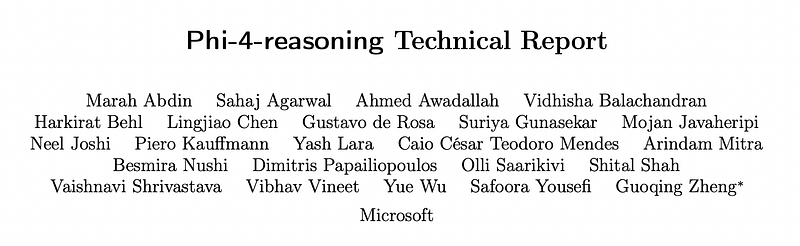 | Title card: Phi-4-Reasoning. |
| 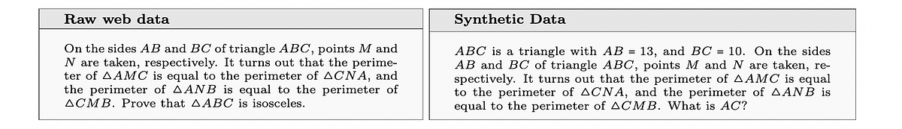 | Rewriting seed data from the web into verifiable synthetic questions for SFT and RL. |
| 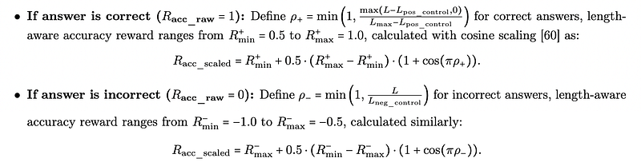 | For outputs with format violations, the length-aware accuracy reward is manually overridden. |
|  | Besides the accuracy-based reward, Repetition Penalty (Rrep) is considered, defined as a negative reward based on repeated 5-grams frequency, computed as. |
|  | The final RL reward is therefore computed as. |
| 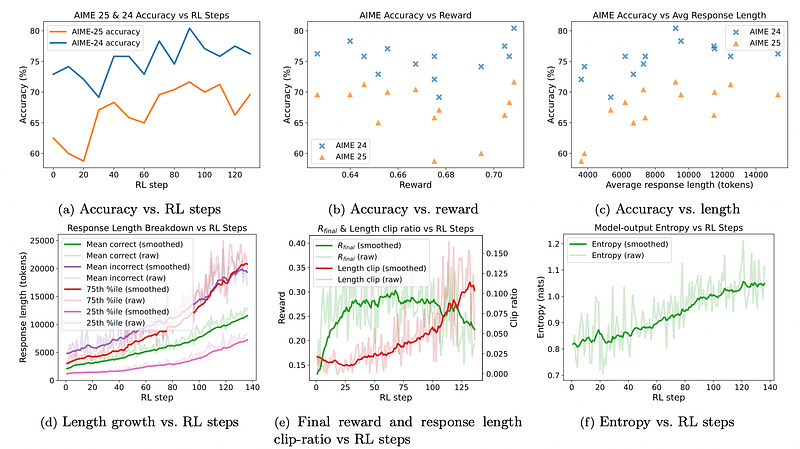 | Behaviour of Phi-4-reasoning-plus during the first 125 GRPO updates. |
| 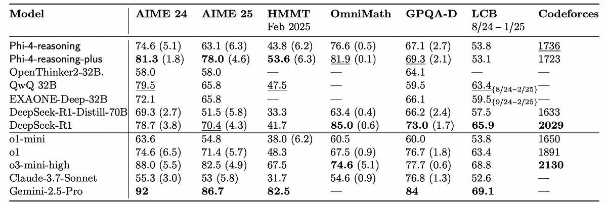 | Average Pass@1 accuracy (%) of models on selected reasoning benchmarks. |
| 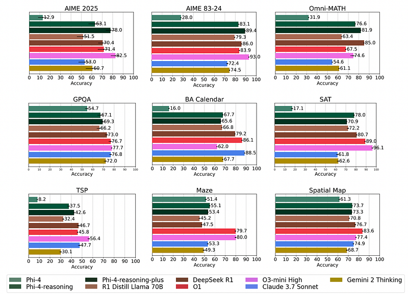 | Average Pass@1 model performance across eight reasoning tasks across five independent runs. |
| 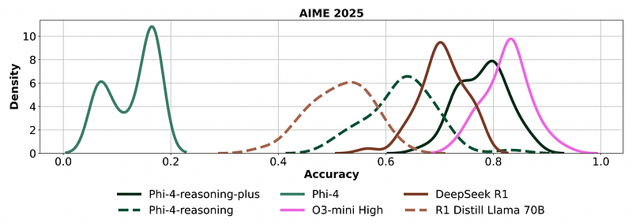 | Distribution of pass@1 accuracy on AIME 2025. |
| 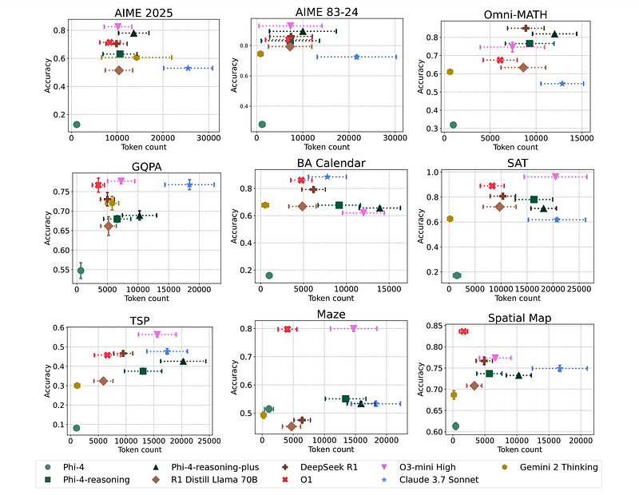 | Tradeoff between accuracy and token usage for all benchmarks. |
| 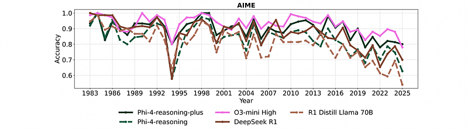 | Performance breakdown by years (from 1983 to 2025) for AIME on 5 independent runs. |
| 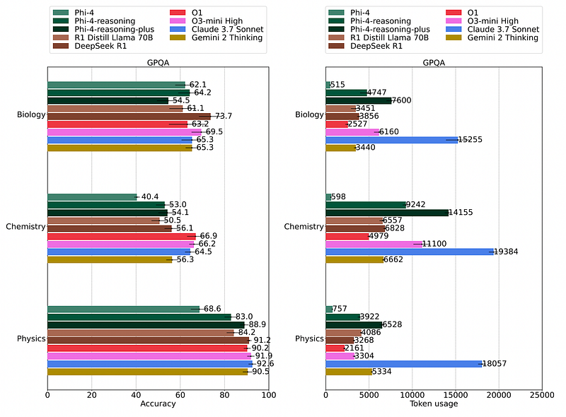 | GPQA accuracy and token usage by high-level domain. |
| 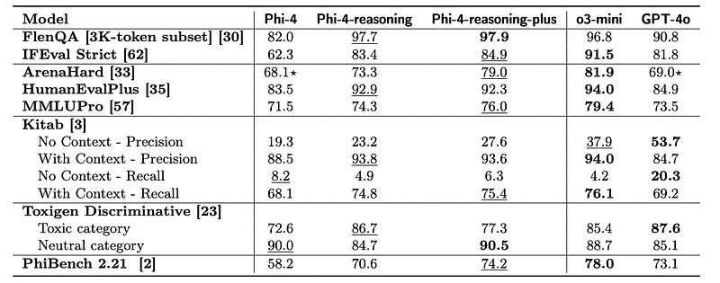 | Average pass@1 accuracy of models across general-purpose benchmarks evaluated averaged over five generations. |
## Related

- [[Papers Explained Corpus]]
- [[Reasoning Models]]
- [[Large Language Models]]
- [[Synthetic Data]]
- [[Reinforcement Learning Topic]]
- [[Model Compression and Efficiency]]
- [[Supervised Fine-Tuning]]
- [[Reinforcement Learning]]
- [[Papers Explained 357 - Long-To-Short LLM Reasoning With Model Merging]]
- [[Papers Explained 359 - Phi-4-Mini-Reasoning]]

#summary #topic
