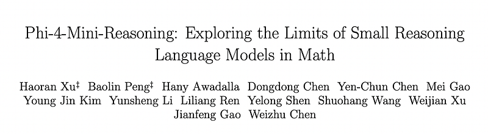
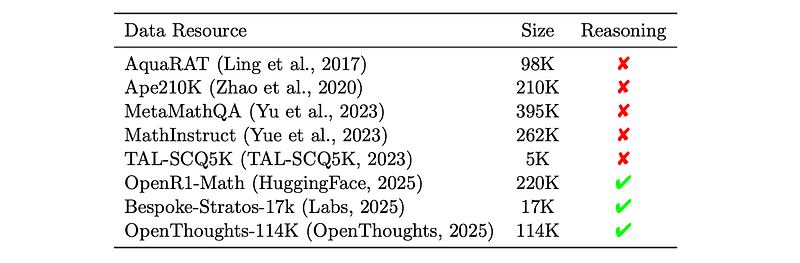
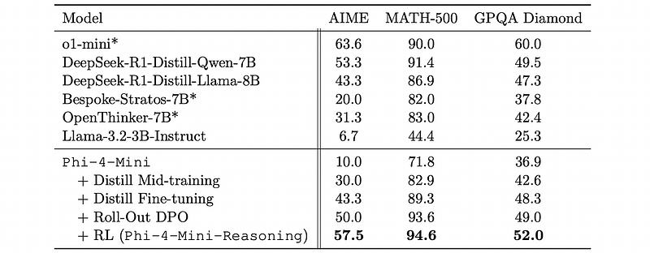

# Papers Explained 359 - Phi-4-Mini-Reasoning

This paper presents a systematic training recipe for SLMs that consists of four steps:

This page ingests the source article into the wiki and connects it to [[Papers Explained Corpus]], [[Reasoning Models]], [[Synthetic Data]], [[Reinforcement Learning Topic]], [[Model Compression and Efficiency]], [[Large Language Models]], [[Supervised Fine-Tuning]], [[Reinforcement Learning]], [[Verifier-Bounded Learning]].

## Source Metadata

- Source file: `raw/2025-05-06_Papers-Explained-359--Phi-4-Mini-Reasoning-251652be3e39.html`
- Source title: Papers Explained 359: Phi-4-Mini-Reasoning
- Published: 2025-05-06
- Canonical: [https://medium.com/@ritvik19/papers-explained-359-phi-4-mini-reasoning-251652be3e39](https://medium.com/@ritvik19/papers-explained-359-phi-4-mini-reasoning-251652be3e39)

## Key Ideas

- Large-scale mid-training on diverse distilled long-CoT data
- Supervised fine-tuning on high-quality long-CoT data
- Rollout DPO leveraging a carefully curated preference dataset
- Reinforcement Learning (RL) with Verifiable Reward.
- The method is applied on Phi-4-Mini. The resulting Phi-4-Mini-Reasoning model exceeds, on math reasoning tasks, much larger reasoning models.

## Notes

This paper presents a systematic training recipe for SLMs that consists of four steps:

- Large-scale mid-training on diverse distilled long-CoT data

- Supervised fine-tuning on high-quality long-CoT data

- Rollout DPO leveraging a carefully curated preference dataset

- Reinforcement Learning (RL) with Verifiable Reward.

The method is applied on Phi-4-Mini. The resulting Phi-4-Mini-Reasoning model exceeds, on math reasoning tasks, much larger reasoning models.

## Synthetic CoT Data Generation

Multiple public datasets — such as Bespoke, Openthoughts, and OpenR1-Math, along with several in-house seed datasets, are aggregated. For datasets that already include reasoning trajectories, the provided annotations are directly used. For datasets lacking such trajectories, only the math questions are retained and new chain-of-thought answers are generated using DeepSeek-R1. For each question, approximately eight rollouts are sampled. In total, around 10 million rollouts across 1.6 million samples, including contributions from public datasets, are collected. For math questions that are verifiable, a math-verification tool is first applied to assess the correctness of the answers.

*Figure: Overview of the data resources used for constructing the reasoning dataset.*

To maintain dataset balance, each data sample is annotated with attributes including the domain category, the difficulty level, and the presence of repetitive patterns. Domain categories cover a wide range of areas such as algebra, geometry, theory, probability, and calculus. Difficulty levels are categorized as elementary school, middle school, high school, college, and graduate level. The mid-training phase leverages the full dataset, while subsequent training steps operate on selected subsets.

## Multi-Stage Continual Training for Reasoning

### Distillation as Mid-Training

The base model is trained with next token prediction on an extensive corpus of synthetic chain-of-thought (CoT) data that covers questions from diverse domains and varying levels of difficulty. Each question is paired with its corresponding correct CoT answer and the base model is trained using the standard causal language modeling objective. Training occurs under a packing mode, i.e., multiple short examples are packed in the same input sequence to increase training efficiency. The goal of this mid-training step is to equip the small base model with general CoT reasoning capabilities that are not explicitly learned during model mid-training. It is effective to allow mid-training to iteratively use as much CoT training data as possible until model performance saturates on a validation dataset.

### Distillation as Supervised Fine-tuning

After learning extensive and diverse reasoning chains, the next step involves selecting a compact, yet representative, subset from the mid-training dataset for subsequent fine-tuning. Fine-tuning is performed in a non-packing mode where the model is taught to decide where to stop generating.

### Rollout Preference Learning

In this stage, rejected rollouts are used to enhance model performance. A preference dataset is constructed by designating correct answers as preferred rollouts and incorrect answers as dis-preferred rollouts for each question. Direct Preference Optimization (DPO) is then applied to the model.

### RL with Verifiable Reward

Although DPO improves the model’s alignment and reasoning ability using curated preference pairs, DPO is limited as an offline learning method using a fixed dataset. To improve model’s reasoning capability through online learning, RL is performed.

In a pilot study of applying GRPO to train a base model, three issues affecting the stability and effectiveness of model training are observed:

High Variance in Response Lengths: Even after mid-training, the base model generates responses with significant length variability within the same GRPO sampling group, even for the same prompt. This heterogeneity in response length (ranging from ~12k to ~20k tokens) leads to instability during GRPO optimization.

Vanishing Gradients under Uniform Rewards: GRPO’s reliance on advantage estimates makes it vulnerable to vanishing gradients when all sampled responses in a group receive identical rewards, resulting in zero variance in returns. While DAPO attempts to address this by oversampling and filtering prompts with 0 or 1 accuracy, two problems remain:

- Sensitivity to Intra-group Length Discrepancies: Even with intermediate accuracies (e.g., 0.1 or 0.9), response length variance still causes unstable gradient magnitudes.

- Imbalance in Positive and Negative Signals: For difficult math tasks, obtaining even a single positive reward sample may require increasing the GRPO batch size to 128, leading to an imbalance between positive and negative training signals and hindering RL convergence. This is hypothesized to be more pronounced in smaller language models with more fragile RL stability.

Exploration-Exploitation Tradeoff: A higher sampling temperature encourages exploration during training, while a lower temperature constraints output variance during evaluation for math and coding tasks. This discrepancy between exploration during training and exploitation during evaluation results in a significant performance gap.

To address the above challenges, a set of methods to improve the stability and effectiveness of RL training are introduced:

Prompt Optimization:

- Multiple rounds of sampling are performed using various candidate prompts intended for RL training with the distilled model.

- Only prompts generating responses with relatively uniform token lengths are retained.

- This mitigates instability caused by high intra-group response length variance during GRPO optimization.

Reward Rebalancing through Oversampling and Filtering: Inspired by DAPO:

- Oversampling: For difficult prompts, oversampling ensures sufficient response diversity within the group.

- Rebalancing: All positive-reward responses are kept, and an equal number of negative-reward responses are randomly sampled.

- Filtering: Prompts with group-level accuracy exceeding a threshold (e.g., 50%) are filtered out to reduce length variance and avoid instability from overly easy prompts.

Temperature Annealing:

- Initial Temperature: The sampling temperature starts at 1.0 to encourage exploration.

- Linear Decay: The temperature linearly decays to 0.6 over the first 50% of training steps.

- Fixed Temperature: For the remaining 50% of training, the temperature is fixed at 0.6 to promote exploitation.

- This strategy facilitates broader exploration early in training and gradually transitions to exploitation in the well-known state-action subspace. This addresses the exploration-exploitation tradeoff.

## Evaluation

*Figure: Pass@1 CoT Reasoning results.*

- Despite having only 3.8B parameters, outperforms all open-source baseline models, including those nearly twice its size.

## Paper

Phi-4-Mini-Reasoning: Exploring the Limits of Small Reasoning Language Models in Math [2504.21233](https://arxiv.org/abs/2504.21233)

## Figures

Figures from the Medium HTML export (`raw/2025-05-06_Papers-Explained-359--Phi-4-Mini-Reasoning-251652be3e39.html`); local copies under `wiki/assets/papers-explained-359-phi-4-mini-reasoning/` when download succeeded.

| Figure | Caption |
|--------|---------|
|  | Title card: Phi-4-Mini-Reasoning. |
|  | Overview of the data resources used for constructing the reasoning dataset. |
|  | Pass@1 CoT Reasoning results. |
## Related

- [[Papers Explained Corpus]]
- [[Reasoning Models]]
- [[Synthetic Data]]
- [[Reinforcement Learning Topic]]
- [[Model Compression and Efficiency]]
- [[Large Language Models]]
- [[Supervised Fine-Tuning]]
- [[Reinforcement Learning]]
- [[Verifier-Bounded Learning]]
- [[Papers Explained 358 - Phi-4-Reasoning]]
- [[Papers Explained 360 - Nemotron CrossThink]]

#summary #topic
