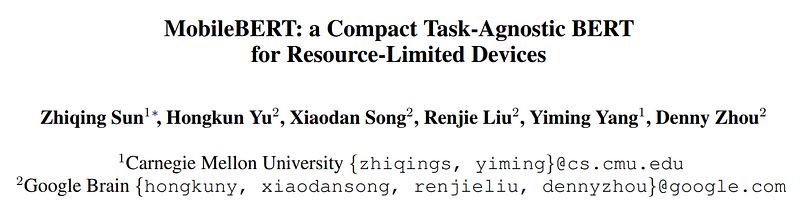
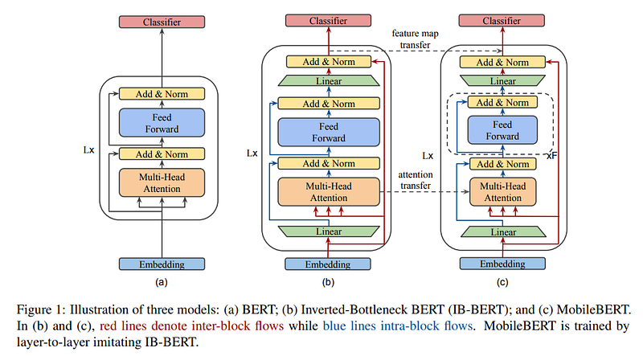
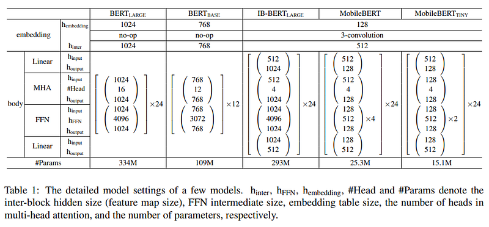
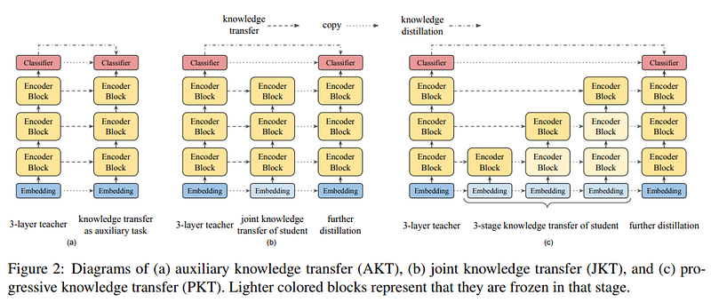
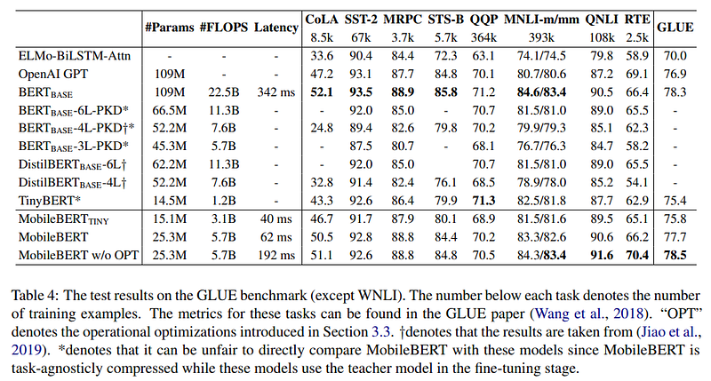

# Papers Explained 36 - MobileBERT

MobileBERT is as deep as BERTLARGE, but each building block is made much smaller, the hidden dimension of each building block is only 128. On the other hand, we introduce two linear transformations for each building block to adjust its input and output dimensions to 512. We refer to such an architecture as bottleneck.

This page ingests the source article into the wiki and connects it to [[Papers Explained Corpus]], [[Large Language Models]], [[Model Compression and Efficiency]].

## Source Metadata

- Source file: `raw/2023-03-15_Papers-Explained-36--MobileBERT-933abbd5aaf1.html`
- Source title: Papers Explained 36: MobileBERT
- Published: 2023-03-15
- Canonical: [https://medium.com/@ritvik19/papers-explained-36-mobilebert-933abbd5aaf1](https://medium.com/@ritvik19/papers-explained-36-mobilebert-933abbd5aaf1)

## Key Ideas

- MobileBERT is as deep as BERTLARGE, but each building block is made much smaller, the hidden dimension of each building block is only 128.
- It is challenging to train such a deep and thin network. To overcome the training issue, we first construct a teacher network and train it until convergence, and then conduct knowledge transfer from this teacher network to MobileBERT.
- The teacher network is just BERT-LARGE while augmented with inverted-bottleneck structures to adjust its feature map size to 512. We refer to the teacher network as IB-BERT-LARGE.
- A problem introduced by the bottleneck structure of MobileBERT is that the balance between the Multi-Head Attention (MHA) module and the FeedForward Network (FFN) module is broken.
- In original BERT, the ratio of the parameter numbers in MHA and FFN is always 1:2.

## Notes

MobileBERT is as deep as BERTLARGE, but each building block is made much smaller, the hidden dimension of each building block is only 128. On the other hand, we introduce two linear transformations for each building block to adjust its input and output dimensions to 512. We refer to such an architecture as bottleneck.

It is challenging to train such a deep and thin network. To overcome the training issue, we first construct a teacher network and train it until convergence, and then conduct knowledge transfer from this teacher network to MobileBERT.

The teacher network is just BERT-LARGE while augmented with inverted-bottleneck structures to adjust its feature map size to 512. We refer to the teacher network as IB-BERT-LARGE.

A problem introduced by the bottleneck structure of MobileBERT is that the balance between the Multi-Head Attention (MHA) module and the FeedForward Network (FFN) module is broken.

In original BERT, the ratio of the parameter numbers in MHA and FFN is always 1:2. But in the bottleneck structure, the inputs to the MHA are from wider feature maps (of inter-block size), while the inputs to the FFN are from narrower bottlenecks (of intra-block size). This results in that the MHA modules in MobileBERT relatively contain more parameters.

To fix this issue, we propose to use stacked feedforward networks in MobileBERT to re-balance the relative size between MHA and FFN.

### Operational Optimizations

By model latency analysis, we find that layer normalization and gelu activation accounted for a considerable proportion of total latency. Therefore, we propose to replace them with new operations in our MobileBERT.

We replace the layer normalization of a n-channel hidden state h with an element-wise linear transformation:

where γ, β ∈ R and ◦ denotes the Hadamard product.

We replace the gelu activation with simpler relu activation.

### Embedding Factorization

The embedding table in BERT models accounts for a substantial proportion of model size. To compress the embedding layer, we reduce the embedding dimension to 128 in MobileBERT. Then, we apply a 1D convolution with kernel size 3 on the raw token embedding to produce a 512 dimensional output.

### Training Objectives

- Feature Map Transfer (FMT): the most important thing in layerwise knowledge transfer is that the feature maps of each layer should be as close as possible to those of the teacher. The mean squared error between the feature maps of the MobileBERT student and the IB-BERT teacher is used as the knowledge transfer objective.

- Attention Transfer (AT): we minimize the KL-divergence between the per-head self-attention distributions of the MobileBERT student and the IB-BERT teacher:

- Pre-training Distillation (PD): Besides layerwise knowledge transfer, we can also use a knowledge distillation loss when pre-training MobileBERT. We use a linear combination of the original masked language modeling (MLM) loss, next sentence prediction (NSP) loss, and the new MLM Knowledge Distillation (KD) loss as our pretraining distillation loss.

### Training Strategies

Auxiliary Knowledge Transfer In this strategy, we regard intermediate knowledge transfer as an auxiliary task for knowledge distillation. We use a single loss, which is a linear combination of knowledge transfer losses from all layers as well as the pre-training distillation loss.

Joint Knowledge Transfer However, the intermediate knowledge of the IB-BERT teacher (i.e. attention maps and feature maps) may not be an optimal solution for the MobileBERT student. Therefore, we propose to separate these two loss terms, where we first train MobileBERT with all layerwise knowledge transfer losses jointly, and then further train it by pre-training distillation.

Progressive Knowledge Transfer One may also concern that if MobileBERT cannot perfectly mimic the IB-BERT teacher, the errors from the lower layers may affect the knowledge transfer in the higher layers. Therefore, we propose to progressively train each layer in the knowledge transfer. The progressive knowledge transfer is divided into L stages, where L is the number of layers.

### Evaluation

## Paper

MobileBERT: a Compact Task-Agnostic BERT for Resource-Limited Devices [2004.02984](https://arxiv.org/abs/2004.02984)

## Figures

Figures from the Medium HTML export (`raw/2023-03-15_Papers-Explained-36--MobileBERT-933abbd5aaf1.html`); local copies under `wiki/assets/papers-explained-36-mobilebert/` when download succeeded.

| Figure | Caption |
|--------|---------|
|  | Title card: MobileBERT. |
|  | It is challenging to train such a deep and thin network. |
|  | The teacher network is just BERT-LARGE while augmented with inverted-bottleneck structures to adjust its feature map size to 512. |
|  | We replace the layer normalization of a n-channel hidden state h with an element-wise linear transformation. |
|  | The embedding table in BERT models accounts for a substantial proportion of model size. |
|  | The embedding table in BERT models accounts for a substantial proportion of model size. |
|  | Evaluation. |
## Related

- [[Papers Explained Corpus]]
- [[Large Language Models]]
- [[Model Compression and Efficiency]]
- [[Papers Explained 35 - XLNet]]
- [[Papers Explained 37 - FastBERT]]

#summary #topic
