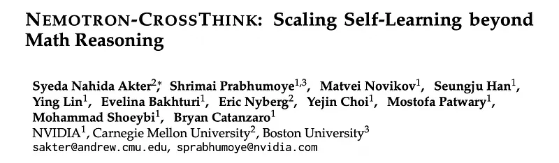
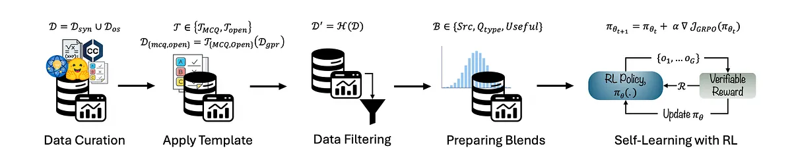
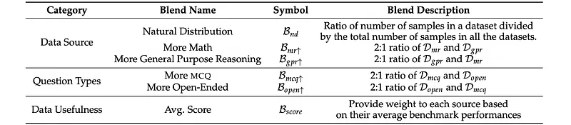
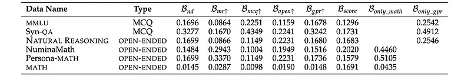
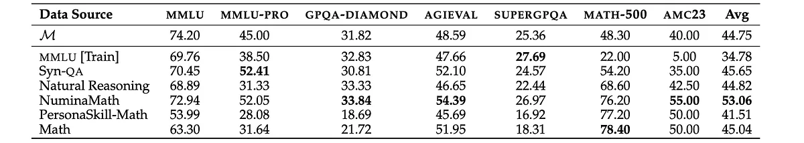
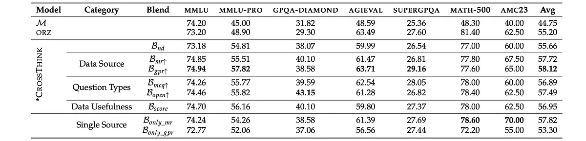

# Papers Explained 360 - Nemotron CrossThink

Nemotron-Crossthink is a framework that systematically incorporates multi-domain corpora, including both synthetic and real-world question-answer pairs, into RL training to improve generalization across diverse reasoning tasks.

This page ingests the source article into the wiki and connects it to [[Papers Explained Corpus]], [[Reasoning Models]], [[Synthetic Data]], [[Large Language Models]].

## Source Metadata

- Source file: `raw/2025-05-07_Papers-Explained-360--Nemotron-CrossThink-3e804e878541.md`
- Source title: Papers Explained 360: Nemotron CrossThink
- Published: 2025-05-07
- Canonical: [https://medium.com/@ritvik19/papers-explained-360-nemotron-crossthink-3e804e878541](https://medium.com/@ritvik19/papers-explained-360-nemotron-crossthink-3e804e878541)

## Key Ideas

- Datasets from multiple sources are carefully curated to ensure diversity in the training data The training dataset D comprises two sources:
- Dsyn → synthetically generated data from Common Crawl (CC)
- Dos → publicly available open-source QA datasets.
- Each sources of data further consists of question answer pairs related to general purpose reasoning and mathematics
- Open source QA datasets (Dos_gpr) Natural Reasoning and MMLU [Train] are combined.

## Notes

Nemotron-Crossthink is a framework that systematically incorporates multi-domain corpora, including both synthetic and real-world question-answer pairs, into RL training to improve generalization across diverse reasoning tasks.

Mathematical reasoning has benefited from clean and verifiable datasets. Extending RL to general-purpose reasoning domains remains underexplored due to the lack of structured, high-quality supervision. Incorporating a mix of structured and unstructured domains introduces a wide range of cognitive patterns and task-specific reasoning strategies which will further improve generalization. However, it introduces noise and ambiguity — particularly in open-ended formats — making it difficult to apply rule-based reward modeling reliably.

*Figure: Nemotron-Crossthink Overview.*

### Data Curation

Datasets from multiple sources are carefully curated to ensure diversity in the training data The training dataset D comprises two sources:

- Dsyn → synthetically generated data from Common Crawl (CC)

- Dos → publicly available open-source QA datasets.

Each sources of data further consists of question answer pairs related to general purpose reasoning and mathematics

General Purpose Reasoning, Dgpr:

- Open source QA datasets (Dos_gpr) Natural Reasoning and MMLU [Train] are combined.

- To enhance diversity, QA pairs are further synthesized from CC documents using the wide range of domains in MMLU as our seed domain. (Dsyn_gpr)

Mathematical Reasoning, Dmr:

- Open-source mathematical reasoning datasets (Dos_mr), such as MATH and Numina-Math, are combined.

- Additional math problems are generated using a similar technique as Persona Hub and are defined as Persona-MATH (Dsyn_mr).

### Apply Template

It is hypothesized that each question type elicits different thinking patterns, leading to diverse reasoning trajectories in the model. Training on different question types will enhance the model’s ability to generalize by exposing it to diverse answer formats, thereby fostering different reasoning pathways. To observe the effect of question type in RL training, Dgpr is synthesized using two templates: TMCQ — Multiple Choice Questions (MCQ), and TOpen — Open-Ended questions. The MCQ datasets (MMLU) are converted to open-ended by removing the options from the questions. Additionally, some MCQ questions are incomplete without options (e.g., Which of the following ways we can file taxes?). Such questions are discarded to avoid confusion during answer generation.

### Data Filtering

To ensure high-quality training data, a series of filtering and formatting steps, H, are applied to remove samples that are infeasible to evaluate with a simple rule-based reward function. For Dmcq, the correct answer appears within the question text itself. For Dopen, such as those in the Natural Reasoning dataset, samples that are challenging to evaluate with a rule-based reward function are discarded. Lastly, for the mathematical reasoning corpus, Dmr, entries that lack an associated answer are removed, ensuring that all retained questions q have a valid response.

### Preparing Blends

The impact of data diversity is studied in three paradigms:

- Data Source: Questions are gathered from diverse domains including math (Dmr), STEM, humanities, economics, history, law, social sciences, etc., (Dgpr) and the effect of each source on RL training is observed.

- Question Types: The impact of question types in downstream tasks is investigated.

- Data Usefulness: The contribution of each data source is further analyzed in downstream task performances, by initially running RL using individual data alone and then evaluating them across diverse downstream tasks. Based on their performances, a new blend is created.

*Figure: Overview of Data Blending Strategies.*

*Figure: Proportion of each dataset in different blends.*

### Self-Learning with RL

A pre-trained large language model M begins with a training blend B, where each sample contains only the input prompt and the final answer which is verifiable. Group Relative Policy Optimization (GRPO) approach is employed to guide the reinforcement learning process with a rule-based reward system designed for verifiable evaluation is used to guide this process.

- Accuracy Reward: The accuracy reward evaluates correctness based on whether the model’s response p is similar to the ground truth solution a to satisfy the correctness criteria

- Format Reward: The format reward ensures the response a is structured according to predefined tags, where the reasoning will reside in ‘<think></think>’ tokens and the final answer will be shown inside \boxed{}

Qwen2.5–7B and Qwen2.5–32B are used as the baseline models, M, which demonstrate strong generalization capabilities across various natural language reasoning tasks.

## Results

*Figure: Results of Self-Learning on Individual Datasets.*

- Individual datasets have varying impacts: NuminaMath showed the highest overall average accuracy across benchmarks, excelling in both mathematical and general reasoning tasks.

- Synthetic data generalizes well: Syn-QA demonstrated a slight improvement over the baseline, indicating that synthetic instruction-style data can generalize well.

- Reasoning-focused datasets contribute to math-adjacent tasks: Natural Reasoning performed well on math-related tasks despite modest performance on language-rich benchmarks.

- MMLU [Train] dataset alone is insufficient for generalization: It underperformed on most tasks, especially in math reasoning, but showed potential for capturing broad conceptual knowledge.

*Figure: Results across Blends.*

- Blending datasets improves performance: All blending strategies significantly outperformed the baseline model (M).

- Multi-domain blend achieves highest overall accuracy: The blend prioritizing general-purpose reasoning data (Bgpr↑) achieved the highest overall average accuracy, outperforming domain-specific and naturally sampled blends.

- General-purpose reasoning data offers strong cross-domain transfer: Bgpr↑ showed significant gains in non-math categories with minimal compromise on math accuracy

- Diversity in question formats benefits performance: Blends with more open-ended questions performed well on both general and math-focused tasks.

- Domain-aware blending is more effective than score-based selection: Blends prioritizing datasets based on domain knowledge outperformed the blend using average dataset scores (Bscore).

- Math data is transferable to structured reasoning tasks: The blend using only math reasoning data (Bonly_mr) achieved high performance in math and decent performance in general reasoning, indicating transferability of math skills to broader reasoning.

- General-purpose data alone is less effective: The blend using only general-purpose reasoning data (Bonly_gpr) underperformed in both math and general reasoning compared to the math-only blend.

- Including math data improves general-purpose reasoning: The best performing blend (Bgpr↑) included both math and general-purpose reasoning data, confirming the importance of math data for overall reasoning ability.

## Paper

NEMOTRON-CROSSTHINK: Scaling Self-Learning beyond Math Reasoning [2504.13941](https://arxiv.org/abs/2504.13941)

## Figures

Figures from the Medium HTML export (`raw/2025-05-07_Papers-Explained-360--Nemotron-CrossThink-3e804e878541.md`); local copies under `wiki/assets/papers-explained-360-nemotron-crossthink/` when download succeeded.

| Figure | Caption |
|--------|---------|
|  | Title card: Nemotron CrossThink. |
|  | Nemotron-Crossthink Overview. |
|  | Overview of Data Blending Strategies. |
|  | Proportion of each dataset in different blends. |
|  | Mathematical Reasoning, Dmr. |
|  | Mathematical Reasoning, Dmr. |
|  | Results of Self-Learning on Individual Datasets. |
|  | Results across Blends. |
## Related

- [[Papers Explained Corpus]]
- [[Reasoning Models]]
- [[Synthetic Data]]
- [[Large Language Models]]
- [[Papers Explained 359 - Phi-4-Mini-Reasoning]]
- [[Papers Explained 361 - OpenCodeReasoning]]

#summary #topic
