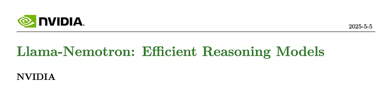
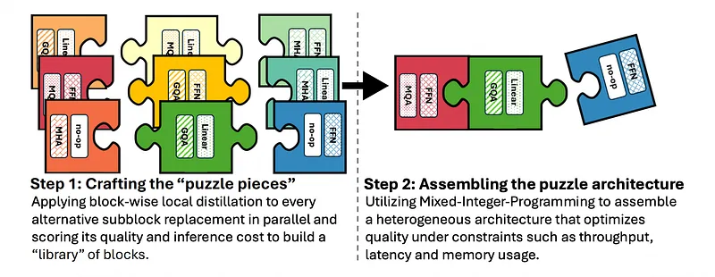
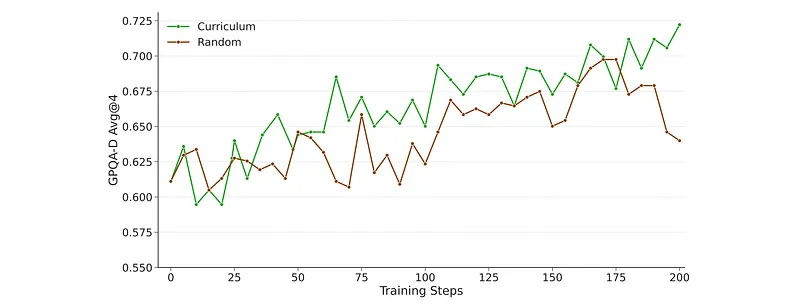
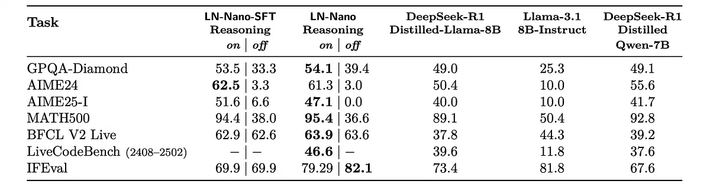
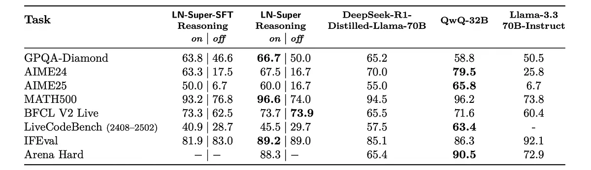
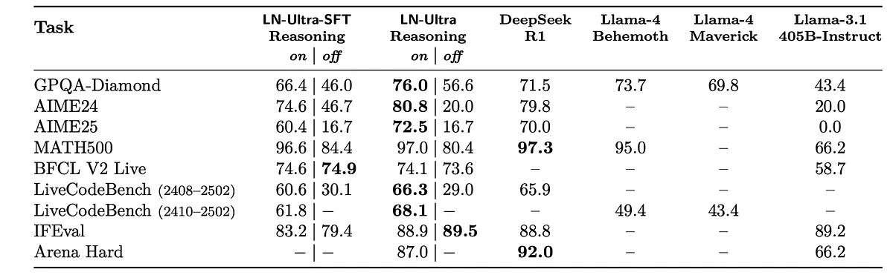
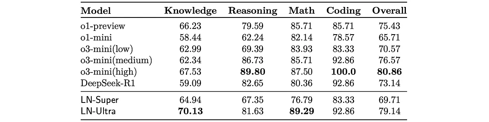

# Papers Explained 362 - Llama-Nemotron

Llama-Nemotron is an open family of heterogeneous reasoning models available in Nano (8B), Super (49B), and Ultra (253B) sizes, designed for exceptional reasoning capabilities and efficient inference.

This page ingests the source article into the wiki and connects it to [[Papers Explained Corpus]], [[Model Compression and Efficiency]], [[Large Language Models]], [[Reasoning Models]], [[Synthetic Data]], [[Evaluation and Benchmarks]], [[Model Distillation]].

## Source Metadata

- Source file: `raw/2025-05-09_Papers-Explained-362--Llama-Nemotron-d6b64f407e28.md`
- Source title: Papers Explained 362: Llama-Nemotron
- Published: 2025-05-09
- Canonical: [https://medium.com/@ritvik19/papers-explained-362-llama-nemotron-d6b64f407e28](https://medium.com/@ritvik19/papers-explained-362-llama-nemotron-d6b64f407e28)

## Key Ideas

- Attention removal: Some blocks omit the attention mechanism entirely, reducing both compute and KV-cache memory consumption.
- Variable FFN dimensions: The feed-forward network’s intermediate size is varied, enabling compression at different granularity levels (e.g., 87%, 75%, 50%, down to 10% of the original hidden size).
- While Puzzle supports additional operations — including grouped-query attention (GQA) with different numbers of key-value heads, linear alternatives to attention, and no-op substitutions — empirical evaluation showed that attention removal and FFN compression...
- Puzzle assembles a complete model by selecting one block per layer. This selection is governed by a mixed-integer programming (MIP) solver that identifies the most efficient configuration under a given set of constraints, such as hardware compatibility...
- Following the NAS phase, both LN-Super and LN-Ultra undergo additional training to improve inter-block compatibility and recover any quality loss introduced during blockwise substitution.

## Notes

Llama-Nemotron is an open family of heterogeneous reasoning models available in Nano (8B), Super (49B), and Ultra (253B) sizes, designed for exceptional reasoning capabilities and efficient inference. Llama-Nemotron models are the first open-source models to support a dynamic reasoning toggle, allowing users to switch between standard chat and reasoning modes during inference.

## Creating Inference-Optimized Models

*Figure: Overview of the Puzzle framework.*

The LN-Super and LN-Ultra models are optimized for efficient inference using the Puzzle framework. Puzzle is a neural architecture search (NAS) framework that transforms large language models into hardware-efficient variants under real-world deployment constraints. Starting from a Llama 3 Instruct model (Llama 3.3–70B-Instruct for LN-Super and Llama 3.1–405B-Instruct for LN-Ultra), Puzzle applies block-wise local distillation to build a library of alternative transformer blocks. Each block is trained independently and in parallel to approximate the function of its parent block while improving computational properties such as latency, memory usage, or throughput with a certain accuracy-efficiency tradeoff.

The block variants include:

- Attention removal: Some blocks omit the attention mechanism entirely, reducing both compute and KV-cache memory consumption.

- Variable FFN dimensions: The feed-forward network’s intermediate size is varied, enabling compression at different granularity levels (e.g., 87%, 75%, 50%, down to 10% of the original hidden size).

While Puzzle supports additional operations — including grouped-query attention (GQA) with different numbers of key-value heads, linear alternatives to attention, and no-op substitutions — empirical evaluation showed that attention removal and FFN compression were the most effective for optimizing the LN-Super and LN-Ultra models in terms of overall throughput and memory savings.

Puzzle assembles a complete model by selecting one block per layer. This selection is governed by a mixed-integer programming (MIP) solver that identifies the most efficient configuration under a given set of constraints, such as hardware compatibility, maximum allowed latency, total memory budget, or desired inference throughput.

For the LN-Ultra model, an additional compression technique called FFN Fusion is introduced, designed to reduce sequential depth and improve inference latency. This technique leverages a structural property that emerges after Puzzle removes some attention layers: the model often contains consecutive FFN blocks. FFN Fusion identifies such sequences and replaces them with fewer, wider FFN layers that can be executed in parallel. This reduces the number of sequential steps without compromising expressivity, and significantly improves compute utilization especially on multi-GPU setups where inter-layer communication overhead is non-negligible.

## Post-NAS Training: Knowledge Distillation and Continued Pretraining

Following the NAS phase, both LN-Super and LN-Ultra undergo additional training to improve inter-block compatibility and recover any quality loss introduced during blockwise substitution.

- LN-Super is trained for 40B tokens using a knowledge distillation objective over the Distillation Mix dataset introduced by Puzzle.

- LN-Ultra is first trained with knowledge distillation for 65B tokens using the same distillation dataset, followed by 88B tokens of continued training on the Nemotron-H phase 4 pretraining dataset.

This final pretraining step allows LN-Ultra to not only match but surpass the reference model Llama 3.1–405B-Instruct in key benchmarks.

## Synthetic Data

Data for supervised fine-tuning is curated in both reasoning and non-reasoning categories. Reasoning samples include the system instruction “detailed thinking on”. Non-reasoning samples utilize the instruction “detailed thinking off”.

### Math

To construct the math reasoning portion of the data, the pipeline described by OpenMath Nemotron is used. DeepSeek-R1 and Qwen2.5-Math-7B-Instruct are prompted to solve each problem multiple times, producing “reasoning” and “non-reasoning” solutions respectively. 16 generations per problem are used for DeepSeek-R1 and 64 generations per problem for Qwen2.5-Math-7B-Instruct. As the final filtering step, any solutions that do not reach the expected answer are removed. Predicted and expected answers are compared by prompting Qwen2.5–32B- Instruct to judge their equivalence in the context of the problem.

### Code

The code reasoning dataset is constructed via a multi-stage process involving question collection, solution generation, and post-processing steps, as described by OpenCodeReasoning. DeepSeek-R1 is used to generate multiple solutions per question, primarily in Python, with C++ solutions also generated for specific benchmark testing.

### Science

A diverse set of open-ended and multiple-choice questions (MCQs) are curated from both in-house and external sources. These include question-answer pairs extracted from StackOverflow and synthetically generated MCQ questions. Synthetic questions are created by defining a broad set of academic topics (e.g., physics, biology, chemistry) and their subtopics using Nemotron-4–340B- Instruct. Multiple difficulty levels are specified to ensure a diverse and scalable dataset. Qwen2.5 models are prompted to generate MCQs conditioned on the topic, subtopic, and difficulty level. Each question is verified for format compliance. The dataset is augmented by prompting Qwen2.5 to generate variations of the original questions, following the OpenMathInstruct-2 pipeline. For all questions in the dataset, DeepSeek-R1 is used to generate multiple reasoning traces. For questions without ground-truth answers, the most likely correct answer is inferred by applying majority voting across generated solutions.

### General

For general domain data, the generation pipeline established in Nemotron-4 340B is followed. For responses, DeepSeek-R1 is prompted for multiple generations and rejection sampling is performed using the Llama-3.1-Nemotron-70B reward model.

### Reasoning off

To train the model to follow the reasoning toggle instruction, paired data is constructed where each prompt has both a reasoning response and a non-reasoning response. Specifically, prompts are randomly sampled from the reasoning datasets above and corresponding non-reasoning responses are generated using Llama-3.1-Nemotron-70B-Instruct for general domain prompts and Llama-3.3–70B-Instruct for others.

### General-Domain Open-ended Inference-Time Scaling

To generate high-quality general-domain open-ended responses, Llama-3.1-Nemotron-70B- Instruct is employed in conjunction with a novel Feedback-Edit Inference-Time-Scaling system. The process begins with 20k first-turn prompts sourced from ShareGPT and WildChat-1M. Llama-3.1-Nemotron-70B- Instruct generates multiple initial responses for each prompt. These responses are refined through a three-stage process: a dedicated Feedback model identifies areas for improvement, a dedicated Edit model makes targeted edits based on the feedback, and a dedicated Select model chooses the best edited response. The resulting dataset comprises 20k first-turn prompts and their corresponding high-quality responses.

## Supervised Fine-Tuning

All models are trained using a token-level cross-entropy loss over the instruction-tuning data.

LN-Nano undergoes a three-stage SFT pipeline. In the first stage, the model is fine-tuned exclusively on reasoning data from code, math, and science domains with a learning rate of 1e−4 for four epochs. This prevents failure modes such as repetitive completions. In the second stage, non-reasoning data is introduced mixed with reasoning samples, allowing the model to learn reasoning control. In the final stage, a smaller blend focused on chat, instruction-following, and tool-calling is used.

LN-Super is trained on the full SFT dataset for a single epoch using a fixed learning rate of 5e−6, sequence length of 16k and a global batch size of 256. Smaller-scale runs suggest that performance improves up to 3–4 epochs with larger learning rates (5e−5), but training was constrained by computational and time limits.

LN-Ultra is trained on the full dataset using sequence packing with an effective sequence length of 24k. Initial ablation runs indicated that higher learning rates such as 5e−5 generally improve outcomes, but consistently high learning rates caused instability, including gradient explosions. To mitigate this, a linear warmup to 1e−5, followed by cosine decay to 1e−6 with a warmup ratio of 10% is implemented. Despite these measures, training encountered gradient explosions and numerical instability after the first epoch. This required training resumption with reinitialized optimizer states, after which successful convergence was achieved.

## RL for Reasoning

Using supervised fine-tuning, LN-Ultra can approach the performance of DeepSeek-R1 but not exceed it. To enable students to surpass their teachers, large-scale reinforcement learning is a viable approach, as it allows the model to continually explore new possibilities and engage in self-learning.

Preliminary experiments indicate that applying RL to smaller models yields suboptimal results compared to distillation. Due to resource constraints, reasoning RL is only applied to LN-Ultra, which results in a model that outperforms its teacher, leveraging the Group Relative Policy Optimization (GRPO) algorithm.

In this training phase, two types of rewards are used:

- Accuracy rewards: For each training example, a ground truth answer (a number, a sentence, or a paragraph) is provided. The Llama-3.3–70B-Instruct model is used to judge whether the policy’s predictions match the ground truth answer.

- Format rewards: a format reward is employed to ensure the model puts its thinking process between “<think>” and “</think>” tags when using “detailed thinking on” mode. We also check for the non-existence of thinking tags when using “detailed thinking off” mode.

To ensure that the model is adequately challenged, the data is preprocessed by independently generating 8 responses per question using LN-Super, calculating the pass rate, and then intentionally discarding prompts with a pass rate of 0.75 or higher.

Curriculum training is also found to be helpful, as it allows the model to gradually learn from a progression of tasks with increasing difficulty.

*Figure: Ablation on curriculum vs non-curriculum.*

## RL for Preference Optimization

After training for scientific reasoning, a short RL run optimizes instruction following capabilities for the LN-Super and LN-Ultra. RL is run with the RLOO algorithm, using the instruction following verifier as a reward. Such training boosts performance on conventional instruction following benchmarks as well as reasoning benchmarks.

RLHF is used to improve the model on general helpfulness and chat capabilities while carefully maintaining its proficiency in other areas.

For LN-Super, iterative online RPO is used to maximize the reward predicted by Llama-3.1-Nemotron-70B-Reward over prompts from HelpSteer2.

The same process is followed for LN-Ultra, except that GRPO is employed.

For LN-Nano, two rounds of offline RPO with on-policy data are conducted. A mixture of reasoning and non-reasoning data with appropriate system prompts is used in the first round of RPO to improve reasoning control, followed by a second round with on-policy generations targeting instruction following improvements.

## Evaluations

### LN-Nano

*Figure: LN-Nano and LN-Nano-SFT versus comparably sized models, split by Reasoning mode.*

- LN-Nano achieves strong performance across various reasoning benchmarks, including AIME25-I and LiveCodeBench, despite its small size.

- The curated SFT pipeline and datasets effectively transfer structured reasoning abilities to compact models.

- Balancing data distribution across math, coding, and STEM subjects in the SFT blend was crucial for achieving near state-of-the-art accuracy. Specifically, upsampling Chemistry-related data improved performance on the GPQA-D benchmark.

- RPO stages primarily focused on improving performance on the IFEval benchmark.

### LN-Super

*Figure: LN-Super versus comparably sized models, split by Reasoning mode.*

- LN-Super performs competitively across both, matching Llama-3.3–70B in reasoning-off mode and outperforming competitors like DeepSeek-R1-Distilled-Llama-70B in reasoning-on mode. This demonstrates its strong reasoning capabilities without sacrificing instruction following.

- Reasoning-focused SFT negatively impacts IFEval scores (instruction following). IFEval RL was used to mitigate this trade-off and recover instruction-following capabilities.

- Optimizing for IFEval can negatively affect conversationality (measured by Arena-Hard), and vice-versa. Model merging was applied to LN-Super to find a balance between these objectives, creating a model on the Pareto frontier. This approach was not successful for other models.

- LN-Super underperforms on LiveCodeBench due to using an older version of the dataset during SFT.

### LN-Ultra

*Figure: LN-Ultra versus the strongest open-weight models, split by reasoning mode.*

- LN-Ultra matches or surpasses the performance of all other open-weight models on both reasoning and non-reasoning benchmarks.

- LN-Ultra achieves state-of-the-art performance on the GPQA benchmark among open models, demonstrating the effectiveness of the large-scale reinforcement learning training.

- While the SFT stage provides a strong foundation for reasoning abilities, the RL stage is crucial for exceeding the performance of teacher models, especially on the GPQA benchmark.

- There’s a trade-off between extensive SFT training and the success of subsequent RL; initializing RL from an earlier SFT checkpoint, even with lower initial benchmark scores, can lead to better final RL results.

### Judging Capability

*Figure: Llama-Nemotron models demonstrate strong performance on JudgeBench.*

- The models outperform leading proprietary and open-source models in judging response quality.

- LN-Ultra achieves the highest performance among open-source models, significantly exceeding DeepSeek-R1 and performing comparably to o3-mini(high), a top proprietary model.

- LN-Super also outperforms o1-mini.

- These results demonstrate that the models possess strong generalization capabilities, effectively transferring their knowledge to tasks beyond their specific training data.

## Paper

Llama-Nemotron: Efficient Reasoning Models [2505.00949](https://arxiv.org/abs/2505.00949)

## Figures

Figures from the Medium HTML export (`raw/2025-05-09_Papers-Explained-362--Llama-Nemotron-d6b64f407e28.md`); local copies under `wiki/assets/papers-explained-362-llama-nemotron/` when download succeeded.

| Figure | Caption |
|--------|---------|
|  | Title card: Llama-Nemotron. |
|  | Overview of the Puzzle framework. |
|  | Ablation on curriculum vs non-curriculum. |
|  | LN-Nano and LN-Nano-SFT versus comparably sized models, split by Reasoning mode. |
|  | LN-Super versus comparably sized models, split by Reasoning mode. |
|  | LN-Ultra versus the strongest open-weight models, split by reasoning mode. |
|  | Llama-Nemotron models demonstrate strong performance on JudgeBench. |
## Related

- [[Papers Explained Corpus]]
- [[Model Compression and Efficiency]]
- [[Large Language Models]]
- [[Reasoning Models]]
- [[Synthetic Data]]
- [[Evaluation and Benchmarks]]
- [[Model Distillation]]
- [[Papers Explained 361 - OpenCodeReasoning]]
- [[Papers Explained 363 - UltraLong]]

#summary #topic
