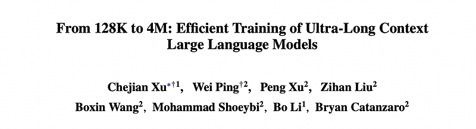
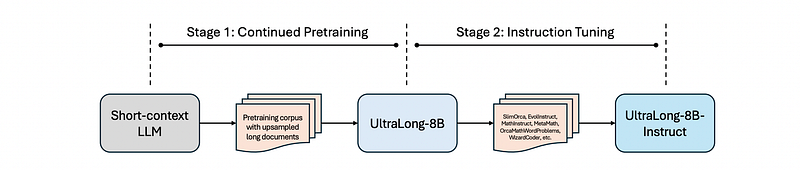
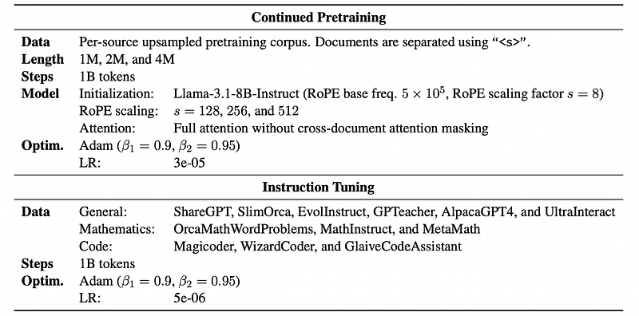
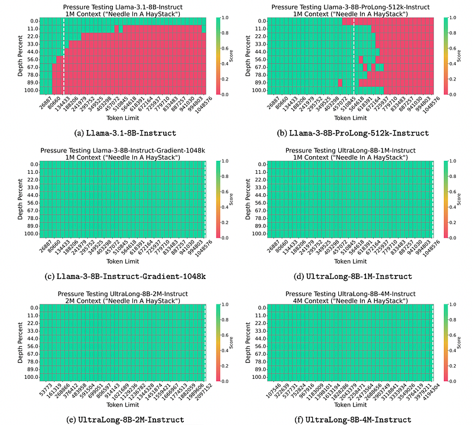
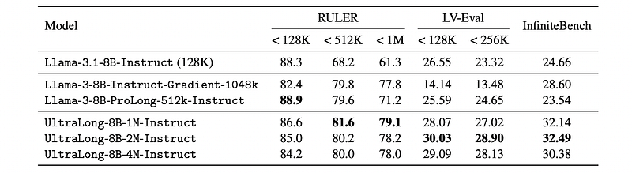
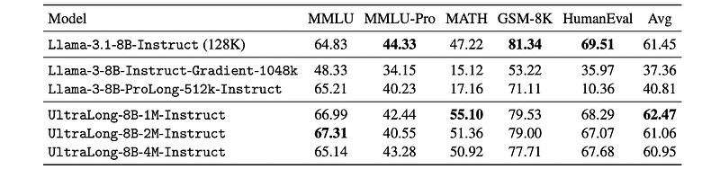

# Papers Explained 363 - UltraLong

This work introduces an efficient training recipe for building ultra-long context LLMs from aligned instruct models, pushing the boundaries of context lengths from 128K to 1M, 2M, and 4M tokens.

This page ingests the source article into the wiki and connects it to [[Papers Explained Corpus]], [[Long Context]], [[Model Compression and Efficiency]], [[Safety and Alignment]], [[Large Language Models]], [[Reasoning Models]], [[Supervised Fine-Tuning]].

## Source Metadata

- Source file: `raw/2025-05-12_Papers-Explained-363--UltraLong-981e997e4e19.html`
- Source title: Papers Explained 363: UltraLong
- Published: 2025-05-12
- Canonical: [https://medium.com/@ritvik19/papers-explained-363-ultralong-981e997e4e19](https://medium.com/@ritvik19/papers-explained-363-ultralong-981e997e4e19)

## Key Ideas

- The approach leverages efficient continued pretraining strategies to extend the context window and employs effective instruction tuning to maintain the instruction-following and reasoning abilities.
- Existing context extension strategies for long- context language models can be broadly categorized into three groups: exact attention methods, approximate attention methods, and approaches that incorporate additional modules:
- Exact attention methods enhance the parameterization of the attention mechanism to support longer sequences.
- Additionally, methods that introduce extra modules focus on compressing the information in the long input contexts.
- The proposed approach consists of two key stages: continued pre-training and instruction tuning.

## Notes

This work introduces an efficient training recipe for building ultra-long context LLMs from aligned instruct models, pushing the boundaries of context lengths from 128K to 1M, 2M, and 4M tokens.

The approach leverages efficient continued pretraining strategies to extend the context window and employs effective instruction tuning to maintain the instruction-following and reasoning abilities. UltraLong-8B, built on Llama-3.1-Instruct with this recipe, achieves state-of-the-art performance across a diverse set of long-context benchmarks.

## Background and Related Work

Existing context extension strategies for long- context language models can be broadly categorized into three groups: exact attention methods, approximate attention methods, and approaches that incorporate additional modules:

- Exact attention methods enhance the parameterization of the attention mechanism to support longer sequences. Techniques such as Position Interpolation (PI), NTK-aware, Dynamic NTK, YaRN, and CLEX — all based on RoPE — design position embeddings that enable length extension. These approaches can be applied either through fine-tuning or to frozen models.

- Approximate attention methods adopt structured approximations to mitigate the computational cost of long-context processing. For example, LongLoRA combines LoRA with Shifted Sparse Attention to reduce overhead, while LM-Infinite limits attention to a few tokens at the beginning of the text and a local window to remain within the pretrained length. Other approaches, such as Dual Chunk Attention, decompose attention into chunk-based modules to better capture the relative positional information.

- Additionally, methods that introduce extra modules focus on compressing the information in the long input contexts.

## Method

*Figure: Overview of the training pipeline.*

The proposed approach consists of two key stages: continued pre-training and instruction tuning.

*Figure: Overview of the training recipe for UltraLong-8B-Instruct models.*

### Continued Pre-training for Context Length Extension

To emphasize long-context data, documents shorter than 4K tokens are downsampled and those longer than 8K tokens are upsampled, resulting in a corpus of 1 billion tokens. These documents are then concatenated to form longer sequences corresponding to the target context lengths (e.g., 1M, 2M, and 4M tokens). During concatenation, individual documents are separated using special characters rather than the reserved beginning and ending tokens (“<|begin_of_text|>” and “<|end_of_text|>”).

Furthermore, the cross-document attention mask is not applied during continued pretraining, allowing the model to attend to the entire input sequence.

To support ultra-long context lengths, a YaRN-based scaling approach is adopted rather than the NTK-aware scaling strategies. The Llama-3.1 model’s performance degrades when the input length approaches the maximum limit. To mitigate this, a larger scaling factor for the RoPE embeddings is employed, thereby better accommodating extended sequences. Long-context models are built targeting three context lengths: 1M, 2M, and 4M tokens. The RoPE scaling factors are set to s = 128, 256, and 512 accordingly. Each model is trained on 1B tokens for one epoch.

### Instruction Tuning

A high-quality blend of SFT datasets is subsampled by integrating and refining multiple open-source SFT datasets spanning three key domains: general, mathematics, and code. To further enhance the quality of the SFT dataset, OpenAI’s GPT-4o and GPT-4o-mini are leveraged to refine the responses associated with these prompts.

## Evaluation Setup

The new “UltraLong” models (1M, 2M, and 4M context windows) are compared against existing long-context Llama models:

- Llama-3.1 (128K context): serves as the base model.

- ProLong (512K context): built on Llama-3 using two stages of continued pretraining and additional SFT, on a total of 41B tokens.

- Gradient (1M context): built on Llama-3 through four stages of continued pretraining on a total of 1.4B tokens, and additional SFT to strengthen its chat capabilities.

The model are evaluated using a “Needle in a Haystack” (NIAH) test for retrieval capability, long-context benchmarks (RULER, LV-Eval, InfiniteBench), and standard benchmarks (MMLU, MMLU-Pro, MATH, GSM-8K, HumanEval).

- Needle in a Haystack (NIAH): A synthetic test for evaluating long-context retrieval capability by locating a passkey in a long text sequence.

- RULER: Synthetic long-context benchmark with configurable sequence lengths across four task categories.

- LV-Eval: Long-context benchmark focusing on single and multi-hop question answering with varying input lengths up to 256K tokens.

- InfiniteBench: Long-context benchmark with average input length of ~200K and maximum exceeding 2M, including synthetic and real-world tasks.

- MMLU & MMLU-Pro: General domain benchmarks for evaluating 5-shot accuracy.

- MATH: Math domain benchmark evaluating 0-shot exact match accuracy.

- GSM-8K: Math domain benchmark evaluating 8-shot exact match accuracy.

- HumanEval: Code domain benchmark evaluating 0-shot pass@1 score.

## Results

### Needle in a Haystack

*Figure: Needle in a Haystack passkey retrieval test results.*

- UltraLong models achieved 100% accuracy in retrieving the passkey across all tested input lengths and depths, demonstrating robust long-context retrieval capabilities.

- Among the baseline models, only Llama-3–8B-Instruct-Gradient-1048k passed the NIAH test.

- Llama-3.1–8B-Instruct and Llama-3–8B-ProLong-512k-Instruct failed the test, exhibiting errors even within their claimed context lengths.

### Long context evaluation

*Figure: Long context evaluation results on the RULER, LV-Eval, and InfiniteBench benchmarks.*

- UltraLong models achieve the highest average scores on RULER for input lengths up to 1 million tokens.

- UltraLong models achieve the highest average F1 scores on LV-Eval for input lengths up to 256K tokens.

- UltraLong models achieve the best performance on InfiniteBench.

- The training recipe used for UltraLong models effectively extends the context window to ultra-long inputs while maintaining performance on shorter inputs.

- Baseline models designed for shorter context windows (e.g., Llama 3.1) show significant performance degradation with longer inputs.

- ProLong, a model trained on substantially more data than UltraLong, performs worse on 512K token inputs.

- Gradient, a baseline model designed for 1M token inputs, performs poorly on LV-Eval and InfiniteBench, suggesting over-tuning to synthetic tasks.

- The superior performance of UltraLong models across both synthetic and hybrid benchmarks demonstrates the effectiveness and scalability of the proposed approach.

### Standard capability evaluation

*Figure: Evaluation results on standard benchmarks including MMLU, MMLU-Pro, MATH, GSM-8K, and HumanEval.*

- The extended-context models achieved comparable or better performance than the base Llama model on standard benchmarks.

- The extended-context models showed clear improvements on the MMLU and MATH benchmarks and remained competitive on others like GSM-8K and HumanEval.

- Baseline long-context models (Gradient and ProLong) experienced significant performance degradation on standard tasks compared to both the base model and the extended-context models.

- Extending the context window using the proposed training recipe successfully maintains, and in some cases enhances, general task performance, unlike other methods.

## Paper

From 128K to 4M: Efficient Training of Ultra-Long Context Large Language Models [2504.06214](https://arxiv.org/abs/2504.06214)

## Figures

Figures from the Medium HTML export (`raw/2025-05-12_Papers-Explained-363--UltraLong-981e997e4e19.html`); local copies under `wiki/assets/papers-explained-363-ultralong/` when download succeeded.

| Figure | Caption |
|--------|---------|
|  | Title card: UltraLong. |
|  | Overview of the training pipeline. |
|  | Overview of the training recipe for UltraLong-8B-Instruct models. |
|  | Needle in a Haystack passkey retrieval test results. |
|  | Long context evaluation results on the RULER, LV-Eval, and InfiniteBench benchmarks. |
|  | Evaluation results on standard benchmarks including MMLU, MMLU-Pro, MATH, GSM-8K, and HumanEval. |
## Related

- [[Papers Explained Corpus]]
- [[Long Context]]
- [[Model Compression and Efficiency]]
- [[Safety and Alignment]]
- [[Large Language Models]]
- [[Reasoning Models]]
- [[Supervised Fine-Tuning]]
- [[Papers Explained 362 - Llama-Nemotron]]
- [[Papers Explained 364 - OmniMath]]

#summary #topic
