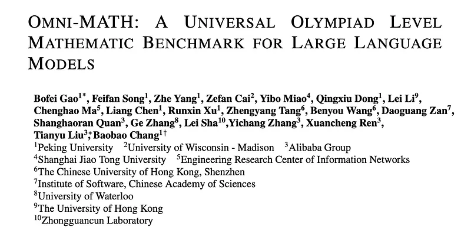
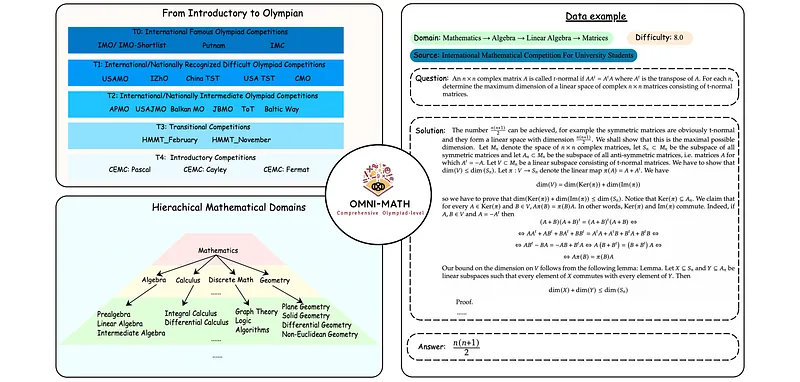
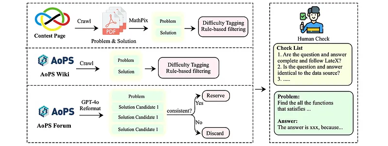
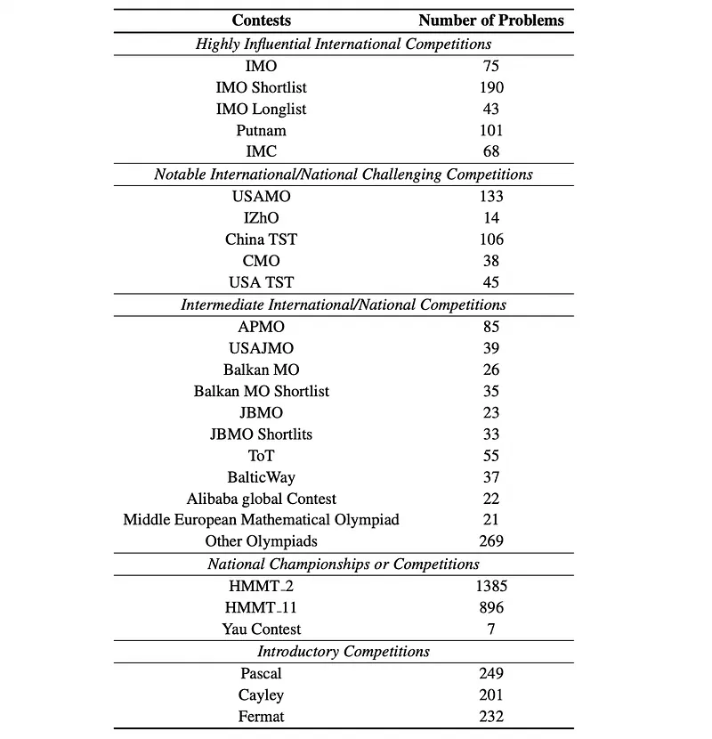
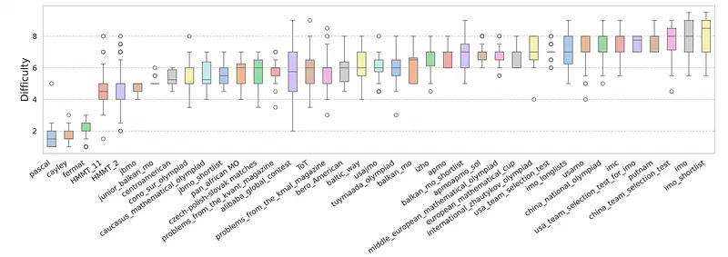
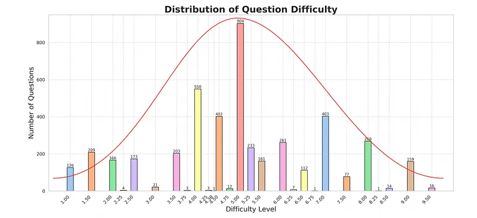
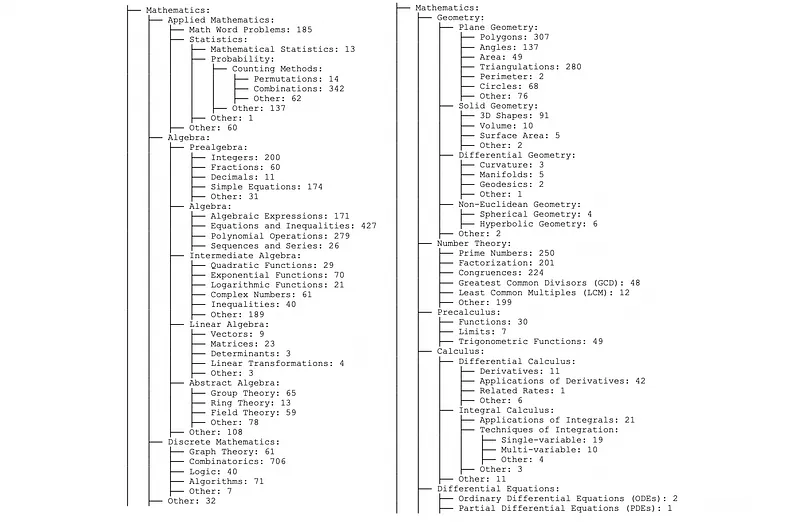
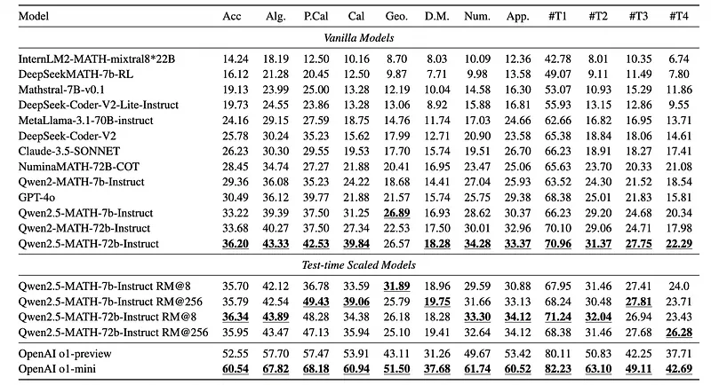

# Papers Explained 364 - OmniMath

OmniMath is a comprehensive and challenging benchmark specifically designed to assess LLMs’ mathematical reasoning at the Olympiad level. Unlike existing Olympiad-related benchmarks, the dataset focuses exclusively on mathematics and comprises a vast collection of 4428 competition-level problems with rigorous human annotation.

This page ingests the source article into the wiki and connects it to [[Papers Explained Corpus]], [[Reasoning Models]], [[Synthetic Data]], [[Evaluation and Benchmarks]], [[Verifier-Bounded Learning]].

## Source Metadata

- Source file: `raw/2025-05-13_Papers-Explained-364--OmniMath-bd2687c23e81.md`
- Source title: Papers Explained 364: OmniMath
- Published: 2025-05-13
- Canonical: [https://medium.com/@ritvik19/papers-explained-364-omnimath-bd2687c23e81](https://medium.com/@ritvik19/papers-explained-364-omnimath-bd2687c23e81)

## Key Ideas

- OmniMath is a comprehensive and challenging benchmark specifically designed to assess LLMs’ mathematical reasoning at the Olympiad level.
- Sources: Problems and solutions were gathered from official competition websites (e.g., IMO, IMC), AoPS Wiki (verified solutions), and AoPS Forum (user-uploaded solutions).
- Initial Filtering: Rules were applied to ensure data adhered to input/output formats.
- Verification: Professional annotators (graduate and doctoral students) verified solutions:
- Simple verification for official solutions from Contest Pages and AoPS Wiki.

## Notes

OmniMath is a comprehensive and challenging benchmark specifically designed to assess LLMs’ mathematical reasoning at the Olympiad level. Unlike existing Olympiad-related benchmarks, the dataset focuses exclusively on mathematics and comprises a vast collection of 4428 competition-level problems with rigorous human annotation.

*Figure: An overall illustration of Omni-MATH.*

### Data Collection and Annotation

*Figure: The overall data collection and annotation process of Omni-MATH.*

Sources: Problems and solutions were gathered from official competition websites (e.g., IMO, IMC), AoPS Wiki (verified solutions), and AoPS Forum (user-uploaded solutions).

Initial Filtering: Rules were applied to ensure data adhered to input/output formats.

Verification: Professional annotators (graduate and doctoral students) verified solutions:

- Simple verification for official solutions from Contest Pages and AoPS Wiki.

- Thorough verification for AoPS Forum solutions:

- Initial screening narrowed down the dataset to 1100 problems.

- Four annotators assessed the most frequent forum responses against expected outputs.

- Cross-validation ensured reliability (92.7% accuracy initially, improved to 97.3% after further manual sampling).

*Figure: The number of data in the construction process.*

*Figure: The hierarchical data source of the Omni-MATH.*

### Difficulty Classification

Source: AoPS: Rating page, providing difficulty scores (0–10) for some problems.

GPT-4o for Missing Ratings: For problems without ratings, GPT-4o was prompted to assign difficulty scores based on in-context learning from existing ratings.

*Figure: Difficulty distribution across contests.*

*Figure: The difficulty distribution of Omni-MATH.*

### Domain Classification

Mathematical domains were organized into a hierarchical tree structure based on competition guidebooks. GPT-4o was used to classify problems into specific domains based on this hierarchy

*Figure: The total domain tree of Omni-MATH.*

## Evaluation On Existing Llms

- 15 LLMs are selected for their strong mathematical reasoning capabilities. Prompts are formatted according to each model’s guidelines.

- GPT-4o is used to evaluate the correctness of the model outputs.

- Best-of-N (specifically RM@8 and RM@256) scaling is applied to Qwen2.5 models.

*Figure: Main Result.*

- Qwen2.5-MATH-72b-Instruct and OpenAI o1-mini performed best in the vanilla and test-time scaled categories, respectively. OpenAI models significantly outperformed other models in overall accuracy.

- Olympiad-level math problem-solving remains a significant challenge for all LLMs. Even the best-performing model (OpenAI o1-mini with test-time enhancement) achieved only 60.54% accuracy.

- Open-source models like Qwen2.5-MATH outperformed GPT-4o in this specific task.

- Models performed better in domains like algebra, calculus, and number theory, likely due to the greater prevalence of these topics in training datasets. Performance was weaker in discrete mathematics, likely due to the scarcity of related training data.

- Best-of-N scaling techniques, while commonly used, did not consistently improve performance, suggesting limitations in the reward model’s ability to supervise complex mathematical tasks and/or the policy model’s ability to find correct solutions. However, OpenAI models with limited inference tokens still outperformed vanilla models, highlighting the need for more efficient test-time enhancement approaches.

*Figure: The performance of the policy model under Pass@K and the proportion of correct COT.*

- While increasing the number of samples (K) improves the ability of the policy model to solve problems, a significant portion (33.8%) remains unsolved even with 32 samples.

- As the number of samples increases, the proportion of correct COTs within the solved problems decreases, indicating increasing difficulty for the reward model to identify the correct reasoning path amidst the growing number of candidate traces. This suggests interference in RM selection.

## Paper

Omni-MATH: A Universal Olympiad Level Mathematic Benchmark For Large Language Models [2410.07985](https://arxiv.org/abs/2410.07985)

## Figures

Figures from the Medium HTML export (`raw/2025-05-13_Papers-Explained-364--OmniMath-bd2687c23e81.md`); local copies under `wiki/assets/papers-explained-364-omnimath/` when download succeeded.

| Figure | Caption |
|--------|---------|
|  | Title card: OmniMath. |
|  | An overall illustration of Omni-MATH. |
|  | The overall data collection and annotation process of Omni-MATH. |
|  | The number of data in the construction process. |
|  | The hierarchical data source of the Omni-MATH. |
|  | Difficulty distribution across contests. |
|  | The difficulty distribution of Omni-MATH. |
|  | The total domain tree of Omni-MATH. |
|  | Main Result. |
|  | The performance of the policy model under Pass@K and the proportion of correct COT. |
## Related

- [[Papers Explained Corpus]]
- [[Reasoning Models]]
- [[Synthetic Data]]
- [[Evaluation and Benchmarks]]
- [[Verifier-Bounded Learning]]
- [[Papers Explained 363 - UltraLong]]
- [[Papers Explained 365 - DeepMath]]

#summary #topic
