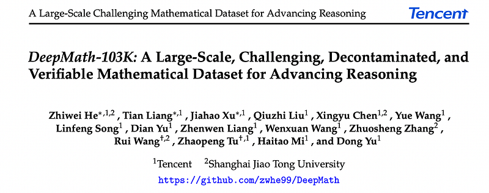
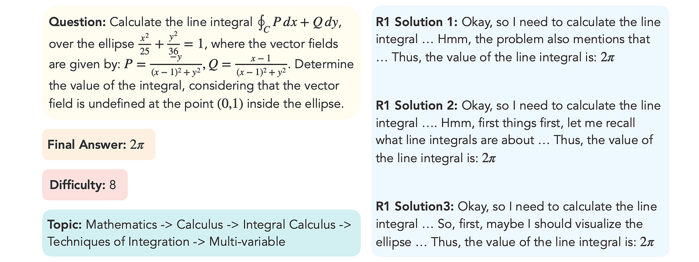
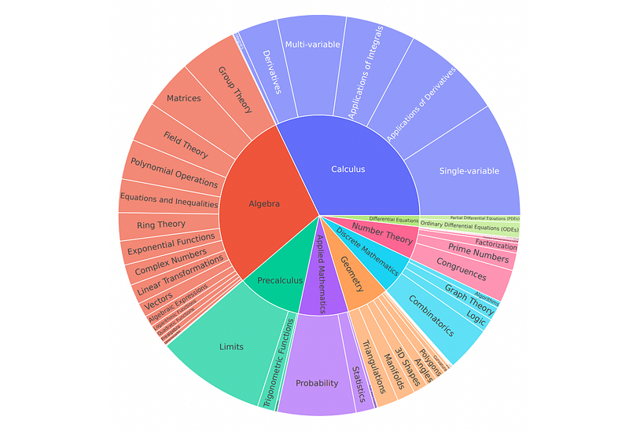
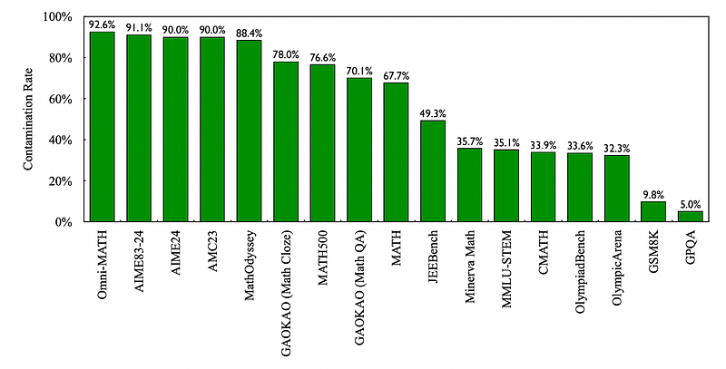
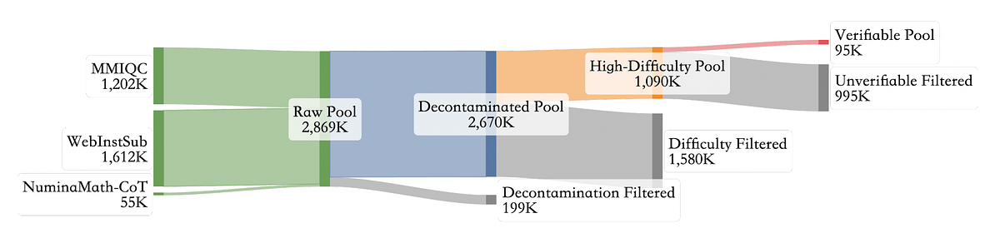
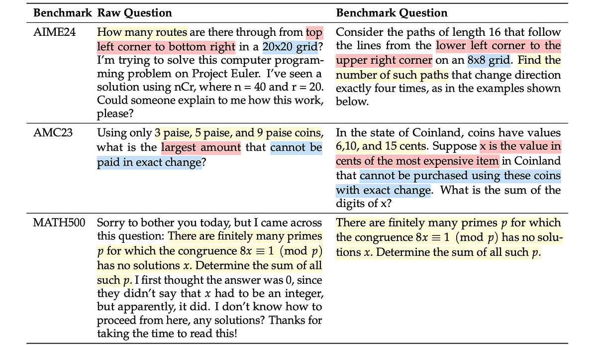
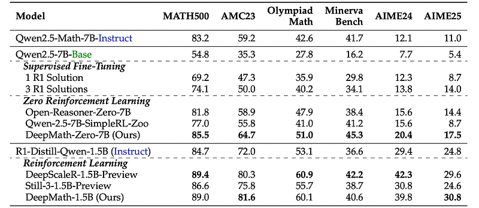
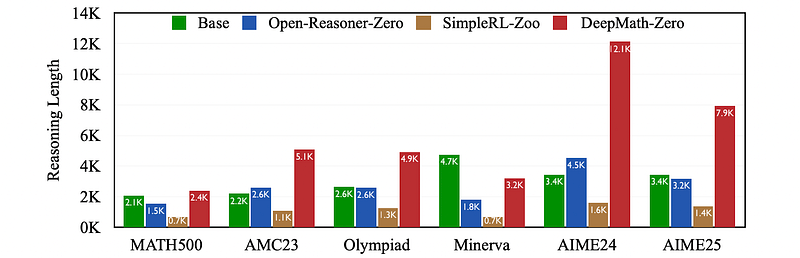
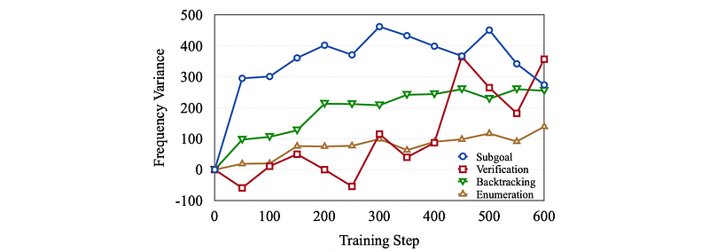

# Papers Explained 365 - DeepMath

DeepMath-103K is a new dataset designed for advancing mathematical reasoning research. It comprises 103,000 mathematical problems with a focus on higher difficulty levels (3–10) and broad topical diversity. The dataset is carefully constructed to support various training paradigms in machine learning, particularly reinforcement learning.

This page ingests the source article into the wiki and connects it to [[Papers Explained Corpus]], [[Synthetic Data]], [[Reinforcement Learning Topic]], [[Reasoning Models]], [[Reinforcement Learning]], [[Verifier-Bounded Learning]].

## Source Metadata

- Source file: `raw/2025-05-14_Papers-Explained-365--DeepMath-496109878202.html`
- Source title: Papers Explained 365: DeepMath
- Published: 2025-05-14
- Canonical: [https://medium.com/@ritvik19/papers-explained-365-deepmath-496109878202](https://medium.com/@ritvik19/papers-explained-365-deepmath-496109878202)

## Key Ideas

- DeepMath-103K is a new dataset designed for advancing mathematical reasoning research. It comprises 103,000 mathematical problems with a focus on higher difficulty levels (3–10) and broad topical diversity.
- Question: The mathematical problem statement.
- Final Answer: A verifiable final answer for rule-based reward functions.
- Difficulty: A numerical score (3–10) enabling difficulty-aware training.
- Topic: Hierarchical topic classification (e.g., Prealgebra, Calculus, Abstract Algebra).

## Notes

DeepMath-103K is a new dataset designed for advancing mathematical reasoning research. It comprises 103,000 mathematical problems with a focus on higher difficulty levels (3–10) and broad topical diversity. The dataset is carefully constructed to support various training paradigms in machine learning, particularly reinforcement learning.

*Figure: An example data sample.*

Each sample includes:

- Question: The mathematical problem statement.

- Final Answer: A verifiable final answer for rule-based reward functions.

- Difficulty: A numerical score (3–10) enabling difficulty-aware training.

- Topic: Hierarchical topic classification (e.g., Prealgebra, Calculus, Abstract Algebra).

- R1 Solutions: Three distinct reasoning paths generated by the DeepSeek-R1 model.

Higher Difficulty:

- 95K problems with difficulty levels 5–10.

- 8K problems (levels 3–5) from SimpleRL for broader coverage.

- Significantly more challenging than existing datasets like Open-RS, DAPO-17K, DeepScaleR-Preview, ORZ-129K, and Open-R1.

Broad Topical Diversity:

*Figure: Hierarchical breakdown of covered mathematical topics in DeepMath-103K.*

- Covers a wide range of mathematical topics, from Prealgebra to advanced Calculus and Abstract Algebra.

- Categorized using a hierarchical topic structure.

Rigorous Data Decontamination:

*Figure: Contamination rates of common mathematical and STEM benchmarks detected in the raw data sources before decontamination.*

- Built using training splits of existing open-source datasets.

- Underwent a decontamination process to remove overlap with common evaluation benchmarks (AIME24, AMC23, MATH500, Minerva Math, OlympiadBench) ensuring the integrity of future benchmark results. Contamination rates in source datasets were as high as 90%.

Suitable for Diverse Training Paradigms: Supports:

- Supervised Fine-Tuning: Three distinct R1 solutions enable learning diverse problem-solving strategies.

- Model Distillation: Multiple solution paths facilitate effective knowledge transfer from teacher to student models.

- Rule-based Reinforcement Learning (e.g., RL-Zero): Verifiable final answers allow for direct reward assignment based on correctness.

- Reward Modeling: Multiple solutions enable designing reward models that differentiate between solution quality and compare alternative reasoning paths.

## Construction of DeepMath-103K

*Figure: The data curation pipeline for DeepMath-103K.*

The DeepMath-103K dataset was meticulously constructed in four stages:

Source Analysis and Collection:

- Analyzed difficulty distributions of existing open mathematical reasoning datasets. Datasets like Meta-MathQA, dart-math-hard, and OpenMathInstruct-2, derived from GSM8K and MATH, were skewed towards lower difficulty levels. NuminaMath-CoT also fell into this category.

- MMIQC and WebInstructSub, sourced from web content, exhibited flatter distributions with more mid-to-high difficulty problems. NuminaMath-CoT was included for topical diversity.

- These three sources (MMIQC, WebInstructSub, NuminaMath-CoT), after basic filtering, yielded 2,869K raw questions.

Data Decontamination:

- To ensure evaluation integrity, data was decontaminated against a comprehensive set of benchmarks (MATH, AIME, AMC, Minerva Math, OlympiadBench, Omni-MATH, MathOdyssey, GAOKAO, JEEBench, MMLU-STEM, CMATH, OlympicArena, GSM8K, and GPQA).

- Embedding Similarity Search: Employed paraphrase-multilingual-MiniLM-L12-v2 to find top-5 most similar examples from benchmark test sets for each candidate question.

- LLM-Judge Comparison: Used Llama-3.3–70B-Instruct to compare each candidate with its top-5 benchmark examples, evaluating twice with swapped order, to identify paraphrases or duplicates. Discarded any flagged questions.

- This semantic approach detected subtle conceptual overlaps, ensuring minimal benchmark leakage.

*Figure: Examples of contamination detected between the raw data pool and benchmarks using semantic comparison.*

Difficulty Filtering:

- Used GPT-4o to assign difficulty levels (1–9) based on Art of Problem Solving (AoPS) guidelines, querying six times per problem and averaging the results.

- Retained only problems with difficulty level 5 or higher, aligning with prior work emphasizing the importance of challenging problems for powerful models.

Answer Verification:

- Addressed challenges of unverifiable answers (proofs, open-ended questions) and complex answers.

- Question Formatting and Filtering: GPT-4o filtered out unsuitable problem types and standardized question format to seek specific numerical or symbolic answers.

- Answer Verification via Consistency Check: DeepSeek-R1 generated three solution paths per question. A rule-based verifier extracted final answers from these and the original source solution. Questions were retained only if all extracted answers were identical.

## Effectiveness of DeepMath-103K

### Results on Challenging Mathematical Benchmarks

Different training paradigms are used to train models starting from two initial checkpoints: a base LLM (Qwen-2.5–7B-Base) and a model already fine-tuned for mathematical reasoning (R1-Distill-Qwen-1.5B). Supervised fine-tuning (SFT) is performed using either one or three R1-generated solutions from DeepMath-103K. Reinforcement learning with binary rewards (RL-Zero) is also employed, leveraging DeepMath-103K’s verified answers for rule-based rewards.

*Figure: Results of RL and SFT using different training datasets.*

- DeepMath-103K significantly improves mathematical reasoning abilities of LLMs.

- Supervised fine-tuning with DeepMath-103K substantially enhances base model performance, and using multiple solutions provides further gains.

- RL-Zero training with DeepMath-103K leads to state-of-the-art performance. Models trained with DeepMath-103K using RL-Zero (DeepMath-Zero) outperform both SFT models and models trained on other RL datasets.

- DeepMath-Zero also achieves state-of-the-art results for the 1.5B parameter model on certain benchmarks and performs competitively on others.

- DeepMath-103K’s design principles, including high-difficulty problems, verifiable answers, rigorous decontamination, scale, and topical diversity, contribute to its effectiveness in training advanced mathematical reasoning models.

### Analysis of RL-Zero Using DeepMath-103K

Qualitative analysis of the reasoning steps generated by DeepMath-Zero-7B compared to other models (base model, models trained on other RL datasets). Analysis focused on the length of solutions and the frequency of specific cognitive behaviors (subgoal setting, verification, backtracking, enumeration) during the RL-Zero training process.

*Figure: Average reasoning length on different benchmarks for models trained with RL-Zero using various datasets, starting from Qwen-2.5–7B-Base.*

- Models trained on DeepMath-103K, particularly DeepMath-Zero-7B, generate significantly longer and more detailed reasoning steps compared to models trained on other datasets, especially on complex mathematical problems. This suggests deeper processing and more elaborate derivations are being employed.

*Figure: Variance of beneficial cognitive behaviors observed during RL-Zero training on DeepMath-103K.*

- Training on DeepMath-103K leads to an increased use of beneficial cognitive behaviors such as subgoal setting, verification, backtracking, and enumeration. This indicates that the model is learning to employ more structured and robust problem-solving strategies, moving beyond pattern matching towards more deliberate reasoning.

## Paper

DeepMath-103K: A Large-Scale, Challenging, Decontaminated, and Verifiable Mathematical Dataset for Advancing Reasoning [2504.11456](https://arxiv.org/abs/2504.11456)

## Figures

Figures from the Medium HTML export (`raw/2025-05-14_Papers-Explained-365--DeepMath-496109878202.html`); local copies under `wiki/assets/papers-explained-365-deepmath/` when download succeeded.

| Figure | Caption |
|--------|---------|
|  | Title card: DeepMath. |
|  | An example data sample. |
|  | Hierarchical breakdown of covered mathematical topics in DeepMath-103K. |
|  | Contamination rates of common mathematical and STEM benchmarks detected in the raw data sources before decontamination. |
|  | The data curation pipeline for DeepMath-103K. |
|  | Examples of contamination detected between the raw data pool and benchmarks using semantic comparison. |
|  | Results of RL and SFT using different training datasets. |
|  | Average reasoning length on different benchmarks for models trained with RL-Zero using various datasets, starting from Qwen-2.5–7B-Base. |
|  | Variance of beneficial cognitive behaviors observed during RL-Zero training on DeepMath-103K. |
## Related

- [[Papers Explained Corpus]]
- [[Synthetic Data]]
- [[Reinforcement Learning Topic]]
- [[Reasoning Models]]
- [[Reinforcement Learning]]
- [[Verifier-Bounded Learning]]
- [[Papers Explained 364 - OmniMath]]
- [[Papers Explained 366 - Math Shepherd]]

#summary #topic
