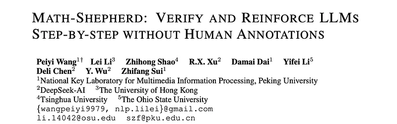
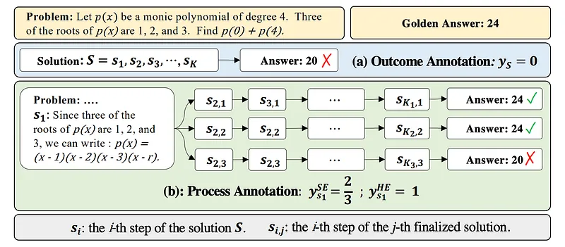
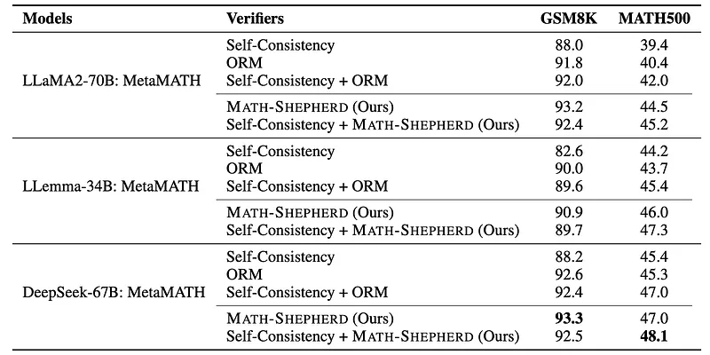
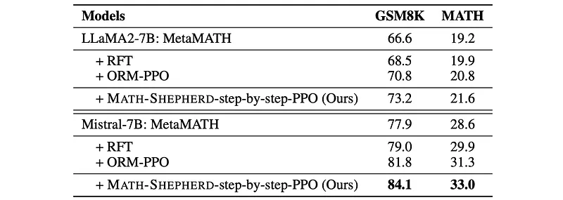
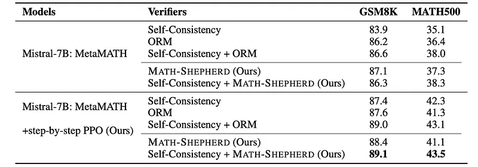

# Papers Explained 366 - Math Shepherd

Given a problem p in the testing set, N candidate solutions are sampled from a generator. These candidates are then scored using a reward model, and the highest-scoring solution is selected as the final answer.

This page ingests the source article into the wiki and connects it to [[Papers Explained Corpus]], [[Reasoning Models]], [[Reinforcement Learning Topic]], [[Reinforcement Learning]].

## Source Metadata

- Source file: `raw/2025-05-15_Papers-Explained-366--Math-Shepherd-234b1bdfbcae.md`
- Source title: Papers Explained 366: Math Shepherd
- Published: 2025-05-15
- Canonical: [https://medium.com/@ritvik19/papers-explained-366-math-shepherd-234b1bdfbcae](https://medium.com/@ritvik19/papers-explained-366-math-shepherd-234b1bdfbcae)

## Key Ideas

- Given a mathematical problem p and its solution s, ORM (P × S → R) assigns a single real-value to s to indicate whether s is correct. ORM is usually trained with a cross-entropy loss:
- where ys is the golden answer of the solution s, ys = 1 if s is correct, otherwise ys = 0. rs is the sigmoid score of s assigned by ORM.
- As the math problem usually has a certain answer, the training set of ORM can be automatically constructed in two steps:
- sampling some candidate solutions for a problem from a generator
- assigning the label to each sampling solution by checking whether its answer is correct.

## Notes

Math Shepherd is a process-oriented math process reward model that assigns a reward score to each step of a math problem solution, enabling step-by-step verification and reinforcement learning for LLMs. Unlike previous methods relying on costly manual annotations for training, Math Shepherd utilizes automatically constructed process-wise supervision data. This is achieved by leveraging a Monte Carlo Tree Search-inspired approach, where the quality of an intermediate step is defined by its potential to lead to the correct final answer.

## Task Formulation

Given a problem p in the testing set, N candidate solutions are sampled from a generator. These candidates are then scored using a reward model, and the highest-scoring solution is selected as the final answer.

### Reward Models For Mathematical Problem

Outcome Reward Model

Given a mathematical problem p and its solution s, ORM (P × S → R) assigns a single real-value to s to indicate whether s is correct. ORM is usually trained with a cross-entropy loss:

where ys is the golden answer of the solution s, ys = 1 if s is correct, otherwise ys = 0. rs is the sigmoid score of s assigned by ORM.

As the math problem usually has a certain answer, the training set of ORM can be automatically constructed in two steps:

- sampling some candidate solutions for a problem from a generator

- assigning the label to each sampling solution by checking whether its answer is correct.

Although false positive solutions that reach the correct answer with incorrect reasoning will be misgraded, previous studies have proven that it is still effective for training a good ORM.

Process Reward Model

Take a step further, PRM (P × S → R+) assigns a score to each reasoning step of s, which is usually trained with:

where ysi is the golden answer of si (the i-th step of s), rsi is the sigmoid score of si assigned by PRM and K is the number of reasoning steps for s.

## Automatic Process Annotation

### Definition

Inspired by Monte Carlo Tree Search, the quality of a reasoning step is defined as its potential to deduce the correct answer.

### Solution

For each step s_i in a reasoning process, the model generates multiple complete solutions from that step onward. This results in a set of solutions: {(s_i+1,j, …, s_K_j,j, a_j)}^N_j=1, where:

- a_j is the final answer of the j-th completed solution.

- K_j is the total number of steps in the j-th completed solution.

- N is the number of completed solutions generated for step s_i.

Two methods are used to estimate the quality (y_si) of a step s_i based on the correctness of the final answers of the completed solutions:

Hard Estimation: HE supposes that a reasoning step is good as long as it can reach the correct answer a∗:

Soft Estimation: SE assumes the quality of a step as the frequency with which it reaches the correct answer:

The quality scores (from HE or SE) are used to train a PRM using cross-entropy loss. This model learns to predict the quality of a reasoning step.

### Ranking For Verification

The lowest score assigned by the PRM across all steps of a solution is used as the overall score for that solution. Solutions are grouped by their final answers. The combined score from self-consistency and a reward model (either the Outcome Reward Model (ORM) or the PRM) is used to select the best group (and thus the predicted answer). The equation below shows how the final answer is selected:

### Reinforcement Learning With Process Supervision

Instead of providing a reward only at the end of the entire process (as with traditional PPO using ORM), this method provides a reward after each reasoning step, guided by the PRM. This allows for more granular feedback and potentially more efficient learning. The key difference here is that the reward signal at each step is derived from the PRM, allowing the model to learn from each step’s quality assessment. This contrasts with traditional RL approaches that only reward the final outcome.

## Experiment Setup

Experiments are based on LLaMA2- 7B/13B/70B, LLemma-7B/34B, Mistral-7B and DeepSeek-67B.

The generator and completer are trained for 3 epochs on MetaMATH.

To construct the training dataset of ORM and PRM, 7B and 13B models are trained for a single epoch on the GSM8K and MATH training sets. Subsequently, 15 solutions per problem are sampled from each model for the training set.

LLemma-7B is used as the completer with the decoded number N=8. Consequently, around 170k solutions are obtained for GSM8K and 270k solutions for MATH.

For verification, LLaMA2–70B and LLemma-34B are chosen as the base models to train reward models for GSM8K and MATH, respectively.

For reinforcement learning, Mistral-7B is chosen as the base model to train reward models and use it to supervise LLama2–7B and Mistral-7B generators. The reward model is trained in 1 epoch.

## Evaluation

*Figure: Performances of different LLMs on GSM8K and MATH with different verification strategies.*

- Math Shepherd consistently outperforms self-consistency and ORM as a verifier across different LLMs and datasets.

- PRM shows a greater advantage over ORM on the more challenging MATH dataset compared to GSM8K, suggesting ORM’s effectiveness is limited to simpler problems.

- Combining self-consistency with a strong reward model can negatively impact verification performance.

*Figure: Performances of different 7B models on GSM8K and MATH with greedy decoding.*

- Step-by-step PPO using Math Shepherd as a reward model significantly improves the performance of supervised fine-tuned LLMs.

- Standard PPO with ORM also improves performance but not as much as step-by-step PPO with Math Shepherd, highlighting the benefit of step-by-step supervision.

- Reinforcement Fine-Tuning (RFT) shows limited improvement, potentially due to pre-existing data augmentation in the training data.

*Figure: Results of reinforcement learning and verification combination.*

- Combining reinforcement learning with verification leads to complementary improvements in performance.

- Using self-consistency as a verifier after reinforcement learning with Math Shepherd results in better performance than using the initial reward model alone for verification, suggesting the need for stronger verification methods after reinforcement learning.

## Paper

Math-Shepherd: Verify and Reinforce LLMs Step-by-step without Human Annotations [2312.08935](https://arxiv.org/abs/2312.08935)

## Figures

Figures from the Medium HTML export (`raw/2025-05-15_Papers-Explained-366--Math-Shepherd-234b1bdfbcae.md`); local copies under `wiki/assets/papers-explained-366-math-shepherd/` when download succeeded.

| Figure | Caption |
|--------|---------|
|  | Title card: Math Shepherd. |
|  | Given a mathematical problem p and its solution s, ORM (P × S → R) assigns a single real-value to s to indicate whether s is correct. |
|  | Take a step further, PRM (P × S → R+) assigns a score to each reasoning step of s, which is usually trained with. |
|  | Process Reward Model. |
|  | Hard Estimation: HE supposes that a reasoning step is good as long as it can reach the correct answer a∗. |
|  | Soft Estimation: SE assumes the quality of a step as the frequency with which it reaches the correct answer. |
|  | The lowest score assigned by the PRM across all steps of a solution is used as the overall score for that solution. |
|  | Performances of different LLMs on GSM8K and MATH with different verification strategies. |
|  | Performances of different 7B models on GSM8K and MATH with greedy decoding. |
|  | Results of reinforcement learning and verification combination. |
## Related

- [[Papers Explained Corpus]]
- [[Reasoning Models]]
- [[Reinforcement Learning Topic]]
- [[Reinforcement Learning]]
- [[Papers Explained 365 - DeepMath]]
- [[Papers Explained 367 - Gemini Models]]

#summary #topic
