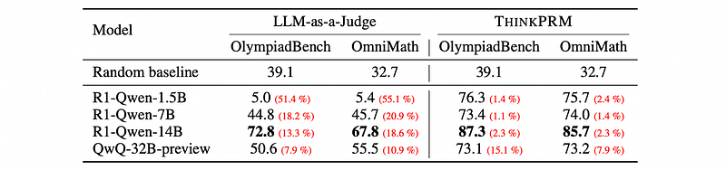
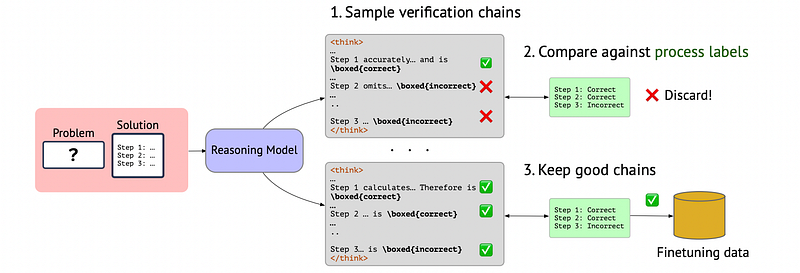
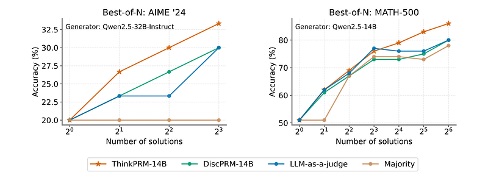
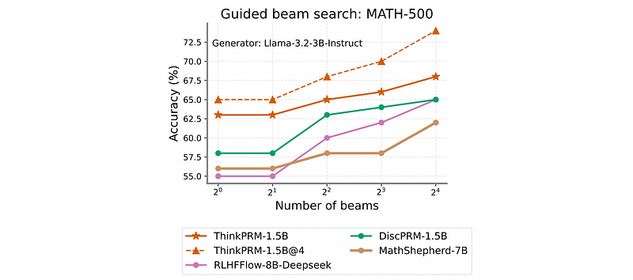
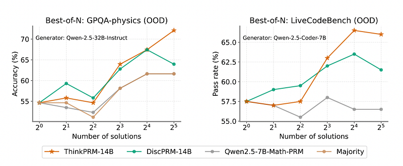
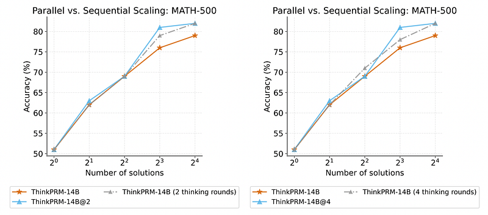

# Papers Explained 368 - ThinkPRM

ThinkPRM, a long CoT verifier fine-tuned on orders of magnitude fewer process labels than those required by discriminative PRMs.

This page ingests the source article into the wiki and connects it to [[Papers Explained Corpus]], [[Reasoning Models]], [[Model Compression and Efficiency]], [[Large Language Models]], [[Evaluation and Benchmarks]], [[Verifier-Bounded Learning]], [[Reinforcement Learning]].

## Source Metadata

- Source file: `raw/2025-05-19_Papers-Explained-368--ThinkPRM-0f530cc98ca4.html`
- Source title: Papers Explained 368: ThinkPRM
- Published: 2025-05-19
- Canonical: [https://medium.com/@ritvik19/papers-explained-368-thinkprm-0f530cc98ca4](https://medium.com/@ritvik19/papers-explained-368-thinkprm-0f530cc98ca4)

## Key Ideas

- The project is available on [GitHub](https://github.com/mukhal/thinkprm/).
- The goal is to obtain a data-efficient, yet powerful, verbalized PRM. Given a problem-solution pair, the generative PRM should verify every step in the solution via an extended chain-of-thought (CoT). Generating such CoT has several advantages.
- It opens a window to the reasoning process of the verifier, enabling better interpretability of its decisions.
- It capitalizes on the capabilities of reasoning models and enables strong verifiers with minimal training.
- This thinking process enables scaling up the verifier compute either by parallely sampling multiple CoTs and aggregating their decisions, or by allowing the model to revise itself in-context by forcing it to reconsider or double-check its verification.

## Notes

ThinkPRM, a long CoT verifier fine-tuned on orders of magnitude fewer process labels than those required by discriminative PRMs. This approach capitalizes on the inherent reasoning abilities of long CoT models, and outperforms LLM-as-a-Judge and discriminative verifiers, using only 1% of the process labels in PRM800K, across several challenging benchmarks.

The project is available on [GitHub](https://github.com/mukhal/thinkprm/).

## ThinkPRM

The goal is to obtain a data-efficient, yet powerful, verbalized PRM. Given a problem-solution pair, the generative PRM should verify every step in the solution via an extended chain-of-thought (CoT). Generating such CoT has several advantages.

- It opens a window to the reasoning process of the verifier, enabling better interpretability of its decisions.

- It capitalizes on the capabilities of reasoning models and enables strong verifiers with minimal training.

- This thinking process enables scaling up the verifier compute either by parallely sampling multiple CoTs and aggregating their decisions, or by allowing the model to revise itself in-context by forcing it to reconsider or double-check its verification.

### LLM-as-a-judge PRMs are suboptimal

The F1-score is reported over the two most challenging subsets of ProcessBench: OlympiadBench and OmniMath, each comprising 1K problem-prefix pairs.

*Figure: Average F1-score on OlympiadBench and OmniMath subsets of ProcessBench.*

- The verification quality is highly sensitive to the instruction wording, e.g., changing a few words in the instruction could affect the F1-score by up to 3–4 points in some cases.

- A substantial number of the generated chains include invalid judgments, i.e., chains without an extractable overall label.

- In some cases, the final decision was in the wrong format than instructed e.g., the model tries to solve the problem from scratch rather than verify the given solution, a behavior likely stemming from the model training process.

- Multiple instances of overthinking are noted, which prevents the model from terminating within the maximum token budget, and infinite looping/repetitions,

### Fine Tuning on synthetic verification chains boosts LLM-as-a-judge verification

*Figure: Collecting verification chains for finetuning.*

Collecting real data would be expensive, so filtered synthetic data is used, also known as rejection sampling finetuning. Specifically, synthetic verification CoTs are sampled from QwQ-32B-Preview, prompting it to verify each step in a solution prefix.

```text
You are given a math problem and a proposed multiple-step solution (with a step on each line):
[Math Problem]
{problem}
[Solution]
{solution}
Review and critique the proposed solution steps and determine whether each step is correct.
If the solution is incomplete, only critique the steps that are provided.
Your output must be in the following format:
Let’s verify step by step:
Step 1: <critique>...The step is \boxed{correct/incorrect}
Step 2: <critique>...The step is \boxed{correct/incorrect}
. . .
Step n: <critique>...The step is \boxed{correct/incorrect}
Once you find an incorrect step, you should stop since you don’t need to analyze the remaining steps.
```

The problems and corresponding step-by-step solutions come from the PRM800K dataset, which provides both model-generated solutions and human-verified step-level labels.

Sampling continues until 1K verification CoTs are obtained that satisfy the following criteria:

- they must follow the expected format

- these step decisions match the gold step labels from PRM800K

- are under a certain token length, to avoid the excessive overthinking behaviour.

ThinkPRM trains R1-Distill-Qwen- 1.5B and R1-Distill-Qwen-14B on the 1K chains and are referred as ThinkPRM-1.5B and ThinkPRM-14B, respectively

## Evaluation

*Figure: Best-of-N on AIME ’24 and MATH-500.*

- ThinkPRM consistently outperforms DiscPRM and LLM-as-a-Judge methods across various benchmarks and sampling budgets.

*Figure: Comparison to Off-the-shelf PRMs.*

- ThinkPRM surpasses strong off-the-shelf PRMs (RLHFFlow-Deepseek-PRM and MATH-Shepherd-PRM) despite having fewer parameters and being trained on less data.

*Figure: Best-of-N on two out-of-domain tasks: science QA (GPQA-Physics) and code generation (LiveCodeBench).*

- ThinkPRM demonstrates strong out-of-domain (OOD) generalization capabilities, outperforming DiscPRM on GPQA-physics and LiveCodeBench. This highlights the fragility of discriminative PRMs under domain shifts compared to generative PRMs.

*Figure: Parallel vs. sequential scaling of ThinkPRM compute under the same generation budget with Qwen-2.5–14B generator.*

- Both parallel and sequential scaling of verifier compute yield comparable performance improvements, with a slight advantage observed for parallel scaling in some cases.

## Paper

Process Reward Models That Think [2504.16828](https://arxiv.org/abs/2504.16828)

## Figures

Figures from the Medium HTML export (`raw/2025-05-19_Papers-Explained-368--ThinkPRM-0f530cc98ca4.html`); local copies under `wiki/assets/papers-explained-368-thinkprm/` when download succeeded.

| Figure | Caption |
|--------|---------|
|  | Title card: ThinkPRM. |
|  | Average F1-score on OlympiadBench and OmniMath subsets of ProcessBench. |
|  | Collecting verification chains for finetuning. |
|  | Best-of-N on AIME ’24 and MATH-500. |
|  | Comparison to Off-the-shelf PRMs. |
|  | Best-of-N on two out-of-domain tasks: science QA (GPQA-Physics) and code generation (LiveCodeBench). |
|  | Parallel vs. sequential scaling of ThinkPRM compute under the same generation budget with Qwen-2.5–14B generator. |
## Related

- [[Papers Explained Corpus]]
- [[Reasoning Models]]
- [[Model Compression and Efficiency]]
- [[Large Language Models]]
- [[Evaluation and Benchmarks]]
- [[Verifier-Bounded Learning]]
- [[Reinforcement Learning]]
- [[Papers Explained 367 - Gemini Models]]
- [[Papers Explained 369 - RM-R1]]

#summary #topic
