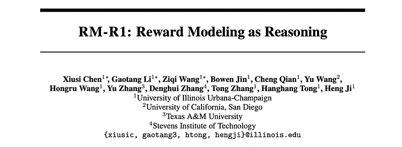
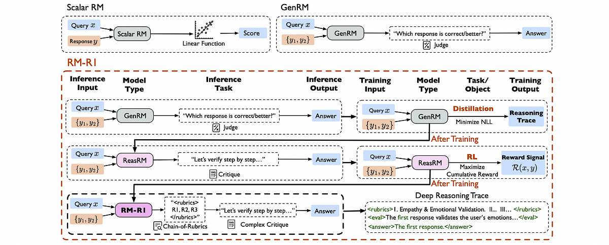
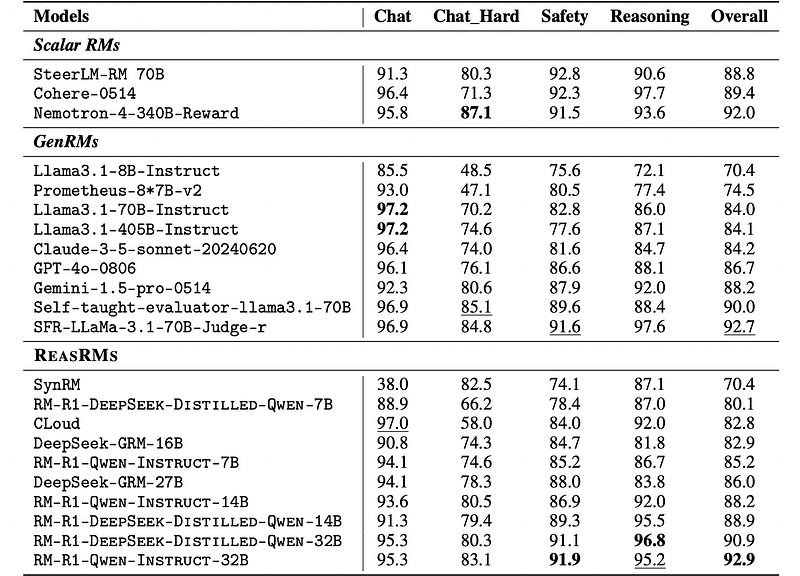
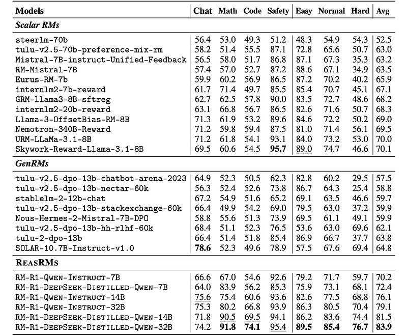
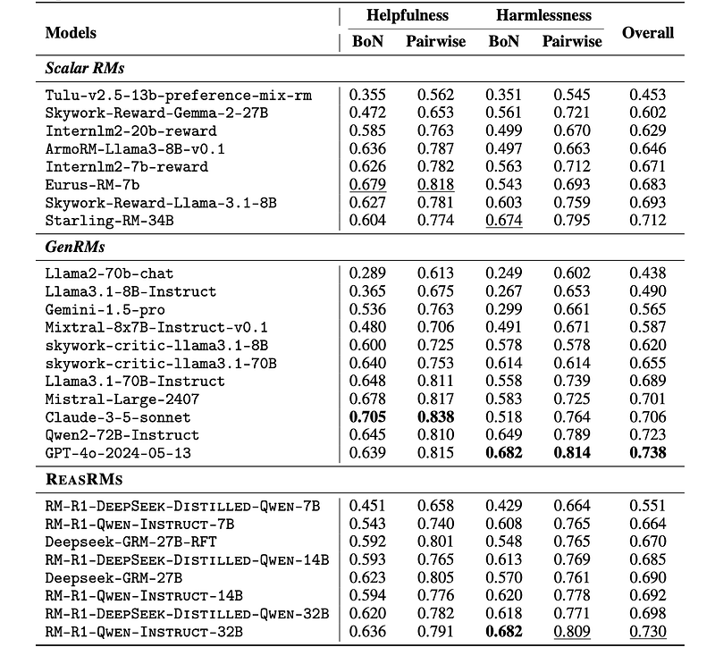

# Papers Explained 369 - RM-R1

Starting from any off-the-shelf instruction-tuned model (e.g., Qwen-2.5–14b-instruct), high-quality reasoning traces are synthesized and RM-R1 is distilled on the synthesized reasoning traces. After distillation, RM-R1 unlocks the basic reasoning ability for reward modeling.

This page ingests the source article into the wiki and connects it to [[Papers Explained Corpus]], [[Reasoning Models]], [[Reinforcement Learning Topic]], [[Large Language Models]], [[Model Compression and Efficiency]], [[Synthetic Data]], [[Reinforcement Learning]], [[Model Distillation]], [[Supervised Fine-Tuning]].

## Source Metadata

- Source file: `raw/2025-05-20_Papers-Explained-369--RM-R1-5a1b5f7ff27a.html`
- Source title: Papers Explained 369: RM-R1
- Published: 2025-05-20
- Canonical: [https://medium.com/@ritvik19/papers-explained-369-rm-r1-5a1b5f7ff27a](https://medium.com/@ritvik19/papers-explained-369-rm-r1-5a1b5f7ff27a)

## Key Ideas

- Starting from any off-the-shelf instruction-tuned model (e.g., Qwen-2.5–14b-instruct), high-quality reasoning traces are synthesized and RM-R1 is distilled on the synthesized reasoning traces.
- An instruct model like Qwen-2.5–14b-instruct can be prompted to act as a Generative Reward Model (GenRM), but it may lack consistency without fine-tuning on reasoning traces.
- For each sample (x(i), ya(i), yb(i), l(i)) in Dsub, an “oracle” model such as o3 or claude-3–7-sonnet generates a structured reasoning trace r(i) to justify the correct answer y(i) for the prompt x(i).
- The objective of distillation is to adjust the model parameters θ to maximize the likelihood of generating the desired reasoning trace and response y given the prompt x.
- Although distilling is a proper way to turn a general generative model into a GenRM, it often suffers from overfitting to certain patterns and constrains the model’s ability to generalize its reasoning abilities for critical thinking.

## Notes

RM-R1 is a family of Reasoning Reward Models designed to improve the interpretability and performance of large language models (LLMs) by formulating reward modeling as a reasoning task. Trained with a two-stage process involving structured reasoning distillation and reinforcement learning with verifiable rewards (RLVR), RM-R1 leverages a novel Chain-of-Rubrics (CoR) prompting framework. This framework allows the model to classify tasks as either reasoning or chat-based. For chat tasks, RM-R1 generates evaluation rubrics with justifications and tailored evaluations. For reasoning tasks, it prioritizes correctness by solving the problem before evaluating responses.

## RM-R1

*Figure: Training pipeline of RM-R1.*

Starting from any off-the-shelf instruction-tuned model (e.g., Qwen-2.5–14b-instruct), high-quality reasoning traces are synthesized and RM-R1 is distilled on the synthesized reasoning traces. After distillation, RM-R1 unlocks the basic reasoning ability for reward modeling. Distilled models often still suffer from overfitting to certain patterns in the distillation data, thus, the model’s ability to generalize may be limited. To further improve RM-R1’s performance, RL is used.

### Distillation of Reasoning Trace

An instruct model like Qwen-2.5–14b-instruct can be prompted to act as a Generative Reward Model (GenRM), but it may lack consistency without fine-tuning on reasoning traces. To improve this, the model is trained using long reasoning traces synthesized specifically for reward modeling.

For each sample (x(i), ya(i), yb(i), l(i)) in Dsub, an “oracle” model such as o3 or claude-3–7-sonnet generates a structured reasoning trace r(i) to justify the correct answer y(i) for the prompt x(i). The reasoning trace ground truth is constructed by concatenating r(i) with y(i).

The objective of distillation is to adjust the model parameters θ to maximize the likelihood of generating the desired reasoning trace and response y given the prompt x. This is achieved by minimizing the negative log-likelihood (NLL) loss over the distillation dataset.

### RL Training

Although distilling is a proper way to turn a general generative model into a GenRM, it often suffers from overfitting to certain patterns and constrains the model’s ability to generalize its reasoning abilities for critical thinking. To address this, RL, specifically GRPO is used to enhance the model’s ability to conduct reward-based reasoning. To be specific, the reward model rθ(j | x,ya,yb) is directly treated as if it is a policy model.

The reward formulation of DeepSeek-R1 is further simplified and merely focuses on the correctness-based component. Adding the format reward to the overall reward was also attempted, but found that the task performance did not have a significant difference.

To facilitate the distilled models to proactively generate critical reasoning traces, a system prompt is designed during rollout.

```text
Please act as an impartial judge and evaluate the quality of the responses provided by two AI Chatbots to the Client’s question displayed below.
First, classify the task into one of two categories: <type> Reasoning </type> or <type> Chat </type>.
- Use <type> Reasoning </type> for tasks that involve math, coding, or require domain knowledge, multi-step inference, logical deduction, or combining information to reach a conclusion.
- Use <type> Chat </type> for tasks that involve open-ended or factual conversation, stylistic rewrites, safety questions, or general helpfulness requests without deep reasoning.
If the task is Reasoning:
1. Solve the Client’s question yourself and present your final answer within <solution> ... </solution> tags.
2. Evaluate the two Chatbot responses based on correctness, completeness, and reasoning quality, referencing your own solution.
3. Include your evaluation inside <eval> ... </eval> tags, quoting or summarizing the Chatbots using the followingtags:
- <quote_A> ... </quote_A> for direct quotes from Chatbot A
- <summary_A> ... </summary_A> for paraphrases of Chatbot A
- <quote_B> ... </quote_B> for direct quotes from Chatbot B
- <summary_B> ... </summary_B> for paraphrases of Chatbot B
4. End with your final judgment in the format: <answer>\[\[A\]\]</answer> or <answer>\[\[B\]\]</answer>
If the task is Chat:
1. Generate evaluation criteria (rubric) tailored to the Client’s question and context, enclosed in <rubric>...</rubric> tags.
2. Assign weights to each rubric item based on their relative importance.
3. Inside <rubric>, include a <justify>...</justify> section explaining why you chose those rubric criteria and weights.
4. Compare both Chatbot responses according to the rubric.
5. Provide your evaluation inside <eval>...</eval> tags, using <quote_A>, <summary_A>, <quote_B>, and <summary_B> as described above.
6. End with your final judgment in the format: <answer>\[\[A\]\]</answer> or <answer>\[\[B\]\]</answer>
Important Notes:
- Be objective and base your evaluation only on the content of the responses.
- Do not let response order, length, or Chatbot names affect your judgment.
- Follow the response format strictly depending on the task type.
```

Large reasoning models such as DeepSeek-R1-distilled models do not have a system prompt, so the user prompt is used for rollouts.

```text
Please act as an impartial judge and evaluate the quality of the responses provided by two AI Chatbots to the Client question displayed below.
... [Pairwise Input Content] ...
Output your final verdict at last by strictly following this format: ’<answer>\[\[A\]\]</answer>’ if Chatbot
A is better, or ’<answer>\[\[B\]\]</answer>’ if Chatbot B is better.
```

## Training Data

- Skywork Reward Preference 80K is a high-quality collection of pairwise preference data drawn from a variety of domains, including chat, safety, mathematics, and code. It employs an advanced data filtering technique to ensure preference reliability across tasks. However, a notable issue with this dataset is that all samples from the magpie_ultra source exhibit a strong spurious correlation, where rejected responses consistently contain the token “<im_start>,” while accepted responses do not. Additionally, responses from this source show a systematic bias — accepted responses are typically single-turn, while rejected responses are multi-turn. This problematic subset constitutes approximately 30% of the Skywork dataset and primarily covers mathematics and code domains. To avoid introducing spurious correlations into training, all magpie_ultra data is excluded and only the cleaned subset is retained for experiments.

- Code-Preference-Pairs is a high-quality coding preference dataset. It is constructed by prompting a model with original code, introducing deliberate bugs, and manipulating examples (e.g., swapping broken and corrected versions, removing error comments) to generate fine-grained preference pairs. 8K examples from this dataset are subsampled for use in experiments.

- Math-DPO-10K is a high-quality stepwise preference dataset focused on mathematical reasoning. The full dataset is used in experiments.

## Evaluation

*Figure: Results on RewardBench.*

*Figure: Results onRM-Bench.*

*Figure: Leaderboard of RMB.*

- RM-R1 achieves state-of-the-art performance: RM-R1 models outperform existing state-of-the-art models, including larger commercial models like GPT-4 and Gemini.

- Reasoning training is effective: The reasoning-based training pipeline significantly improves performance, as evidenced by RM-R1-Qwen-Instruct-14B outperforming the larger DeepSeek-GRM-27B.

- RM-R1 generalizes across domains: The Qwen-2.5-Instruct based RM-R1 models demonstrate strong performance across various domains without obvious bias. The DeepSeek-Distilled-Qwen based models excel in reasoning-centric benchmarks, particularly in math and code tasks on RM-Bench.

- Data efficiency: While DeepSeek-Distilled-Qwen based models achieve strong reasoning performance, the Qwen-2.5-Instruct based models achieve competitive results with significantly fewer training examples (8.7K vs 800K).

## Paper

RM-R1: Reward Modeling as Reasoning [2505.02387](https://arxiv.org/abs/2505.02387)

## Figures

Figures from the Medium HTML export (`raw/2025-05-20_Papers-Explained-369--RM-R1-5a1b5f7ff27a.html`); local copies under `wiki/assets/papers-explained-369-rm-r1/` when download succeeded.

| Figure | Caption |
|--------|---------|
|  | Title card: RM-R1. |
|  | Training pipeline of RM-R1. |
|  | The reward formulation of DeepSeek-R1 is further simplified and merely focuses on the correctness-based component. |
|  | Results on RewardBench. |
|  | Results onRM-Bench. |
|  | Leaderboard of RMB. |
## Related

- [[Papers Explained Corpus]]
- [[Reasoning Models]]
- [[Reinforcement Learning Topic]]
- [[Large Language Models]]
- [[Model Compression and Efficiency]]
- [[Synthetic Data]]
- [[Reinforcement Learning]]
- [[Model Distillation]]
- [[Supervised Fine-Tuning]]
- [[Papers Explained 368 - ThinkPRM]]
- [[Papers Explained 370 - Test Time Reinforcement Learning (TTRL)]]

#summary #topic
