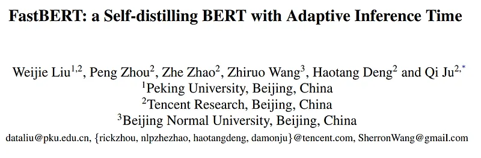
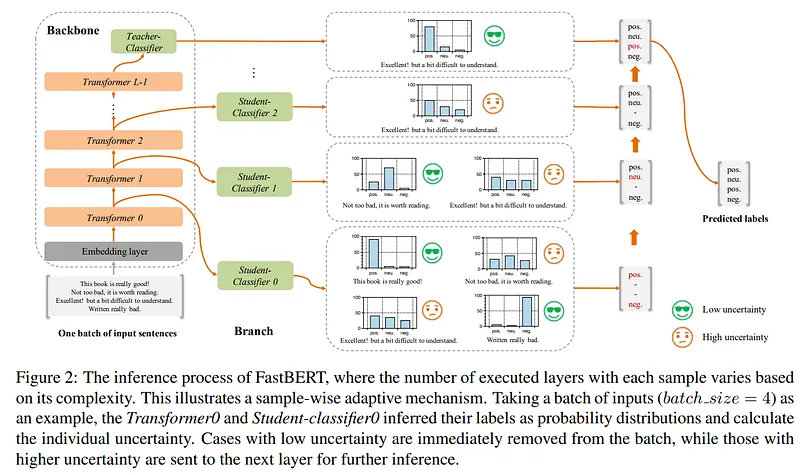
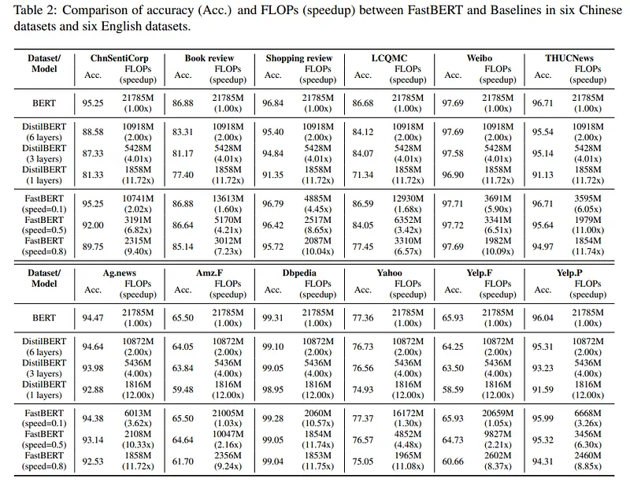
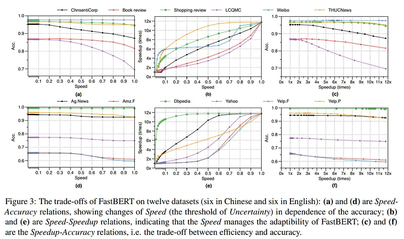

# Papers Explained 37 - FastBERT

FastBERT is a novel speed-tunable language transformer with adaptive inference time.

This page ingests the source article into the wiki and connects it to [[Papers Explained Corpus]], [[Large Language Models]], [[Embedding and Retrieval]], [[Supervised Fine-Tuning]].

## Source Metadata

- Source file: `raw/2023-03-17_Papers-Explained-37--FastBERT-5bd246c1b432.md`
- Source title: Papers Explained 37: FastBERT
- Published: 2023-03-17
- Canonical: [https://medium.com/@ritvik19/papers-explained-37-fastbert-5bd246c1b432](https://medium.com/@ritvik19/papers-explained-37-fastbert-5bd246c1b432)

## Key Ideas

- FastBERT consists of backbone and branches. The backbone is built upon 12-layers Transformer encoder with an additional teacher-classifier, while the branches include student-classifiers which are appended to each Transformer output to enable early outputs.
- The backbone consists of three parts: the embedding layer, the encoder containing stacks of Transformer blocks, and the teacher classifier. The structure of the embedding layer and the encoder conform with those of BERT.
- The teacher classifier extracts in-domain features for downstream inferences. It has a fully-connected layer narrowing the dimension from 768 to 128, a self-attention joining a fully-connected layer without changes in vector size, and a fully-connected layer...
- To provide FastBERT with more adaptability, multiple branches, i.e. the student classifiers, in the same architecture as the teacher are added to the output of each Transformer block to enable early outputs, especially in those simple cases.
- The pre-training of backbone resembles that of BERT in the same way that our backbone resembles BERT. FastBERT does not even need to perform pre-training by itself, for it can load high-quality pre-trained models freely.

## Notes

FastBERT is a novel speed-tunable language transformer with adaptive inference time.

FastBERT consists of backbone and branches. The backbone is built upon 12-layers Transformer encoder with an additional teacher-classifier, while the branches include student-classifiers which are appended to each Transformer output to enable early outputs.

The backbone consists of three parts: the embedding layer, the encoder containing stacks of Transformer blocks, and the teacher classifier. The structure of the embedding layer and the encoder conform with those of BERT.

The teacher classifier extracts in-domain features for downstream inferences. It has a fully-connected layer narrowing the dimension from 768 to 128, a self-attention joining a fully-connected layer without changes in vector size, and a fully-connected layer with a softmax function projecting vectors to an N-class indicator pt.

### Branches

To provide FastBERT with more adaptability, multiple branches, i.e. the student classifiers, in the same architecture as the teacher are added to the output of each Transformer block to enable early outputs, especially in those simple cases.

### PreTraining

The pre-training of backbone resembles that of BERT in the same way that our backbone resembles BERT. FastBERT does not even need to perform pre-training by itself, for it can load high-quality pre-trained models freely.

### Fine-tuning for backbone

For each downstream task, we plug the task-specific data into the model, fine-tuning both the major backbone and the teacher classifier. At this stage, all student classifiers are not enabled.

### Self-distillation for branch

With the backbone well-trained for knowledge extraction, its output, as a high-quality soft-label containing both the original embedding and the generalized knowledge, is distilled for training student classifiers.

As students are mutually independent, their predictions ps are compared with the teacher soft-label pt respectively, with the differences measured by KL-Divergence.

As there are L - 1 student classifiers in the FastBERT, the sum of their KL-Divergences is used as the total loss for self-distillation.

Since this process only requires the teachers output, we are free to use an unlimited number of unlabeled data, instead of being restricted to the labeled ones.

Moreover, our method differs from the previous distillation method, for the teacher and student outputs lie within the same model.

Adaptive inference

FastBERT performs inference in an adaptive manner, which means we can adjust the number of executed encoding layers within the model according to the sample complexity.

### Evaluation

## Paper

FastBERT: a Self-distilling BERT with Adaptive Inference Time [2004.02178](https://arxiv.org/abs/2004.02178)

## Figures

Figures from the Medium HTML export (`raw/2023-03-17_Papers-Explained-37--FastBERT-5bd246c1b432.md`); local copies under `wiki/assets/papers-explained-37-fastbert/` when download succeeded.

| Figure | Caption |
|--------|---------|
|  | Title card: FastBERT. |
|  | FastBERT consists of backbone and branches. |
|  | Adaptive inference. |
|  | Adaptive inference. |
## Related

- [[Papers Explained Corpus]]
- [[Large Language Models]]
- [[Embedding and Retrieval]]
- [[Supervised Fine-Tuning]]
- [[Papers Explained 36 - MobileBERT]]
- [[Papers Explained 38 - Longformer]]

#summary #topic
