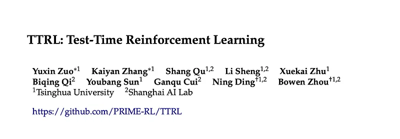
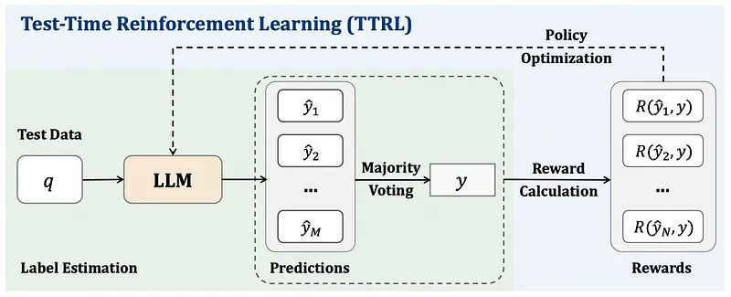
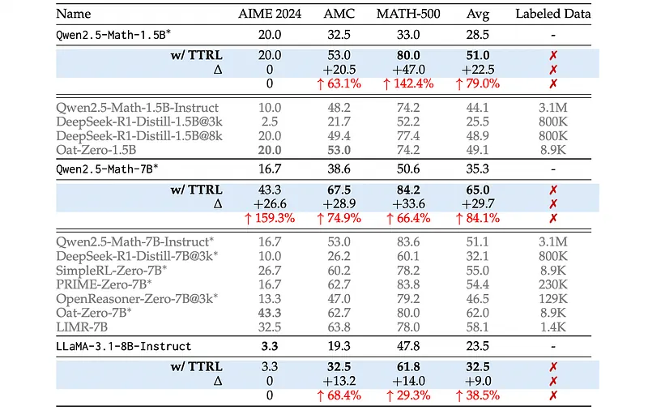
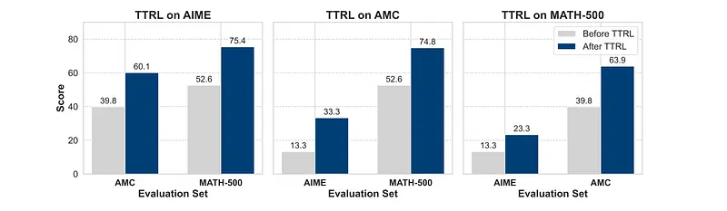
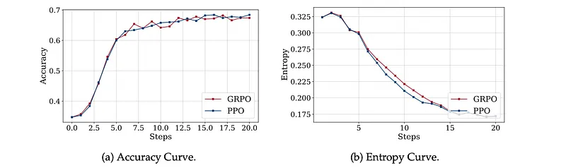
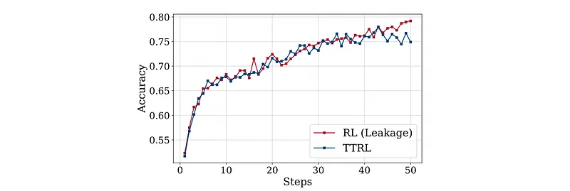
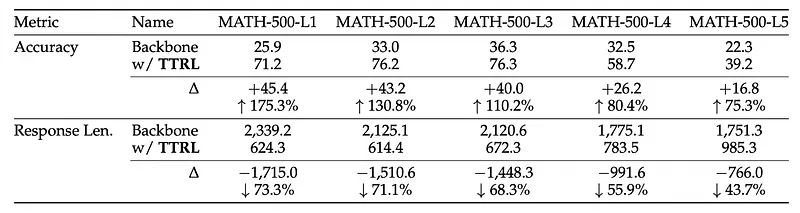

# Papers Explained 370 - Test Time Reinforcement Learning (TTRL)

Test-Time Reinforcement Learning (TTRL) is a method for training LLMs using RL on unlabeled data. TTRL enables self-evolution of LLMs by utilizing the priors in the pre-trained models, only supervised by the Maj@N metric.

This page ingests the source article into the wiki and connects it to [[Papers Explained Corpus]], [[Reinforcement Learning Topic]], [[Reasoning Models]], [[Safety and Alignment]], [[Large Language Models]], [[Reinforcement Learning]].

## Source Metadata

- Source file: `raw/2025-05-21_Papers-Explained-370--Test-Time-Reinforcement-Learning--TTRL--48416da31110.md`
- Source title: Papers Explained 370: Test Time Reinforcement Learning (TTRL)
- Published: 2025-05-21
- Canonical: [https://medium.com/@ritvik19/papers-explained-370-test-time-reinforcement-learning-ttrl-48416da31110](https://medium.com/@ritvik19/papers-explained-370-test-time-reinforcement-learning-ttrl-48416da31110)

## Key Ideas

- The project is available at [GitHub](https://github.com/PRIME-RL/TTRL).
- TTRL is applied to different base and instruct LLMs and evaluated on three mathematical reasoning benchmarks (AIME 2024, AMC, and MATH-500). Different RL algorithms like GRPO, PPO are tested with TTRL.
- TTRL significantly improves the mathematical reasoning performance of LLMs, achieving comparable or superior results to existing RL-based models trained on large labeled datasets.
- TTRL demonstrates natural scaling: larger models benefit more from self-improvement due to their capacity for more accurate majority voting rewards. LLaMA-3.1–8B-Instruct and Qwen2.5-Math-1.5B showed limited gains likely due to limited capacity.
- TTRL generalizes well beyond the target task, showing improvements across different benchmarks even when trained on a single one.

## Notes

Test-Time Reinforcement Learning (TTRL) is a method for training LLMs using RL on unlabeled data. TTRL enables self-evolution of LLMs by utilizing the priors in the pre-trained models, only supervised by the Maj@N metric.

The project is available at [GitHub](https://github.com/PRIME-RL/TTRL).

## Methodology

TTRL operates on unlabeled test data. Given a state represented by the prompt x, the model acts by producing an output y sampled from a policy πθ(y | x) parameterized by θ. To construct a reward signal without ground-truth labels, multiple candidate outputs {y1, y2, . . . , yN } are generated from the model through repeated sampling. A consensus output y∗ is derived by majority voting. This estimated label is then used to calculate rule-based rewards, which serve as the final rewards. The environment then provides a reward r(y, y∗ ) based on the alignment between the sampled action y and the consensus action y∗. The RL objective is thus to maximize the expected reward.

TTRL is applied to different base and instruct LLMs and evaluated on three mathematical reasoning benchmarks (AIME 2024, AMC, and MATH-500). Different RL algorithms like GRPO, PPO are tested with TTRL.

## Evaluation

*Figure: Main results of TTRL. ∗ indicates results from Dr. GRPO.*

- TTRL significantly improves the mathematical reasoning performance of LLMs, achieving comparable or superior results to existing RL-based models trained on large labeled datasets.

- TTRL demonstrates natural scaling: larger models benefit more from self-improvement due to their capacity for more accurate majority voting rewards. LLaMA-3.1–8B-Instruct and Qwen2.5-Math-1.5B showed limited gains likely due to limited capacity.

*Figure: Out-of-distribution performance before and after TTRL.*

- TTRL generalizes well beyond the target task, showing improvements across different benchmarks even when trained on a single one.

*Figure: Comparison over steps of different RL algorithms, GRPO vs PPO on MATH-500.*

- TTRL is compatible with different reinforcement learning algorithms, as demonstrated by similar performance achieved using both GRPO and Proximal Policy Optimization (PPO).

## Analysis

### Q1: How Well Can TTRL Perform?

The performance of TTRL is analyzed using two upper bounds:

- Maj@N, which is used to compute rewards during TTRL training.

- Direct training on benchmark datasets, which assumes access to ground-truth labels and thus leaks label information to the policy model.

*Figure: Comparison of RL (Leakage) vs TTRL.*

- Exceeding Expectations: TTRL surpasses both its training signal (Maj@N) and the performance of direct RL trained with labeled test data. This improvement is attributed to TTRL’s ability to enhance supervision quality by converting pseudo-labels into rewards, decoupling learning from the limitations of Maj@N.

- Empirical Upper Bound: Training on the test data (RL with Leakage) serves as the empirical upper bound for TTRL, highlighting its potential for exceeding standard training-evaluation protocols in efficacy.

- Efficiency in Smaller Models: Even smaller LLMs (e.g., 1.5B parameter model) can effectively self-improve and reach the empirical upper bound using TTRL, demonstrating the potential for unbounded lifelong learning on large-scale datasets. This suggests that TTRL enables efficient self-evolution in LLMs.

### Q2: Why Does TTRL Work?

TTRL’s success in achieving stable and effective reinforcement learning in unsupervised settings stems from two key aspects: label estimation and reward calculation. While TTRL introduces reward inaccuracies due to label estimation, it remains effective for several reasons.

- RL’s Tolerance to Inaccuracy and Generalization Ability: Reinforcement learning is inherently more tolerant to reward inaccuracies than supervised fine-tuning (SFT). This robustness stems from the fact that rewards in RL primarily act as directional signals for exploration rather than precise targets. Unlike SFT, which often relies on memorizing training data.

- Reward Model Accuracy vs. Teaching Effectiveness: Research indicates that more accurate reward models don’t necessarily translate to better teaching. The reward signals estimated by the policy model itself, even with inaccuracies, can provide suitable learning guidance.

### Q3: When Might TTRL Fail?

TTRL (Test-Time RL) can fail due to issues at both the algorithmic and implementation levels. It inherits characteristics from existing RL algorithms, making it sensitive to data difficulty, reliant on priors, and susceptible to collapse. Its constraints, like majority voting for label estimation and reliance on sparse, unseen test data, amplify these issues.

- Lack of Prior Knowledge on Target Task: Prior knowledge is crucial for TTRL’s success, especially since test data is usually more difficult and introduces new features. If the model’s prior knowledge is insufficient for the data’s complexity, TTRL fails.

*Figure: Performance of TTRL across the five difficulty levels of MATH-500.*

- As difficulty increases, performance improvement and length reduction from TTRL decrease, indicating insufficient prior knowledge for harder questions.

- Inappropriate RL Hyperparameters: Two key hyperparameters significantly affect TTRL’s stability and success:

- Temperature: A temperature of 1.0 (vs. 0.6) increases output entropy, promoting exploration and leveraging prior knowledge, especially for challenging benchmarks.

- Episodes: Smaller, more difficult datasets require more training episodes for sufficient exploration due to their size and complexity variations.

*Figure: Failed attempts.*

## Paper

TTRL: Test-Time Reinforcement Learning [2504.16084](https://arxiv.org/abs/2504.16084)

## Figures

Figures from the Medium HTML export (`raw/2025-05-21_Papers-Explained-370--Test-Time-Reinforcement-Learning--TTRL--48416da31110.md`); local copies under `wiki/assets/papers-explained-370-test-time-reinforcement-learning-ttrl/` when download succeeded.

| Figure | Caption |
|--------|---------|
|  | Title card: Test Time Reinforcement Learning (TTRL). |
|  | The project is available at GitHub. |
|  | Main results of TTRL. ∗ indicates results from Dr. GRPO. |
|  | Out-of-distribution performance before and after TTRL. |
|  | Comparison over steps of different RL algorithms, GRPO vs PPO on MATH-500. |
|  | Comparison of RL (Leakage) vs TTRL. |
|  | Performance of TTRL across the five difficulty levels of MATH-500. |
|  | Failed attempts. |
## Related

- [[Papers Explained Corpus]]
- [[Reinforcement Learning Topic]]
- [[Reasoning Models]]
- [[Safety and Alignment]]
- [[Large Language Models]]
- [[Reinforcement Learning]]
- [[Papers Explained 369 - RM-R1]]
- [[Papers Explained 371 - ReasonIR]]

#summary #topic
