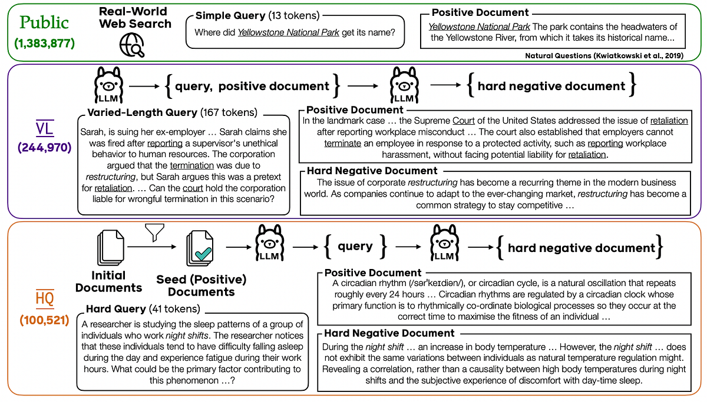
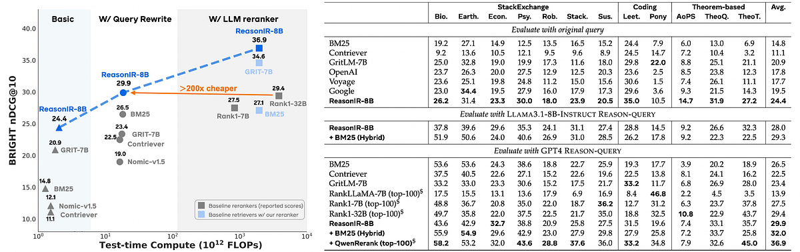
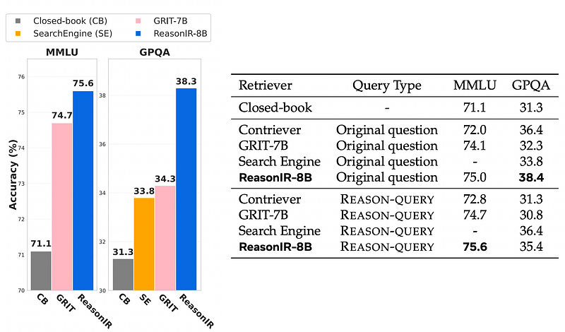

# Papers Explained 371 - ReasonIR

The project is available at [GitHub](https://github.com/facebookresearch/ReasonIR/).

This page ingests the source article into the wiki and connects it to [[Papers Explained Corpus]], [[Reasoning Models]], [[Embedding and Retrieval]].

## Source Metadata

- Source file: `raw/2025-05-22_Papers-Explained-371--ReasonIR-7ae7a6ceb54b.html`
- Source title: Papers Explained 371: ReasonIR
- Published: 2025-05-22
- Canonical: [https://medium.com/@ritvik19/papers-explained-371-reasonir-7ae7a6ceb54b](https://medium.com/@ritvik19/papers-explained-371-reasonir-7ae7a6ceb54b)

## Key Ideas

- A pilot study is conducted to investigate the limitations of existing retrievers in handling reasoning-intensive tasks and explores the potential of query rewriting as a test-time scaling technique.
- Gap between Factual and Reasoning-Intensive Retrieval: Existing public training datasets (NQ, MS MARCO) focus on short, simple factual queries, while reasoning benchmarks (BRIGHT) feature significantly longer and more complex queries requiring inference.
- Average query length in NQ and MS MARCO is 20 and 21 tokens respectively, compared to 194 tokens in BRIGHT.
- Reasoning is crucial for retrieving relevant documents in BRIGHT, unlike the simpler lexical/semantic matching sufficient for NQ and MS MARCO.
- Impact of Query Rewriting and Context Length: Longer, rewritten queries (REASON-QUERY) generally improve retrieval performance up to a point.

## Notes

ReasonIR-8B is a novel bi-encoder retriever specifically designed for reasoning-intensive retrieval tasks. It addresses the limitations of existing retrievers, which struggle with complex reasoning due to training on datasets with simple factual queries and straightforward document matches. Trained on a blend of synthetic and public data, ReasonIR-8B achieves state-of-the-art results on BRIGHT, a reasoning-intensive benchmark and also significantly improves performance on reasoning-intensive RAG tasks like MMLU and GPQA.

The project is available at [GitHub](https://github.com/facebookresearch/ReasonIR/).

## Pilot Study

A pilot study is conducted to investigate the limitations of existing retrievers in handling reasoning-intensive tasks and explores the potential of query rewriting as a test-time scaling technique.

Gap between Factual and Reasoning-Intensive Retrieval: Existing public training datasets (NQ, MS MARCO) focus on short, simple factual queries, while reasoning benchmarks (BRIGHT) feature significantly longer and more complex queries requiring inference. This discrepancy leads to a performance gap between retrievers optimized for factual retrieval and those needed for reasoning tasks. Specifically:

- Average query length in NQ and MS MARCO is 20 and 21 tokens respectively, compared to 194 tokens in BRIGHT.

- Reasoning is crucial for retrieving relevant documents in BRIGHT, unlike the simpler lexical/semantic matching sufficient for NQ and MS MARCO.

Impact of Query Rewriting and Context Length: Longer, rewritten queries (REASON-QUERY) generally improve retrieval performance up to a point.

- Increasing REASON-QUERY length from 64 to 256 tokens benefits all retrievers.

- Beyond a certain length, improvements plateau for dense retrievers (GRIT-7B, Nomic-v1.5) but continue for BM25.

- GRIT-7B’s 256-token training limit hinders its ability to handle longer reasoning queries.

- Nomic-v1.5, trained on long contexts (≥10,000 tokens), doesn’t fully translate to optimal performance with typical reasoning query lengths (64–2048 tokens). This suggests that effective context length tailored to reasoning query length is crucial.

Query Decomposition is Less Effective: Decomposing complex queries into shorter subqueries, a technique effective in multi-hop retrieval, proved detrimental in BRIGHT, reduced performance for both Nomic and GRIT-7B compared to using the original, longer query. This highlights that a single information-rich query is preferable over multiple decomposed short queries for reasoning tasks like BRIGHT.

## ReasonIR: Synthesizing Hard and Varied-length Retriever Training Data

The pilot study suggests two directions for improving retriever performance: training on reasoning intensive queries and improving the effective context length of the retriever.

Three types of training data are considered:

- public data to specifically train a general autoregressive LLM for retrieval

- varied-length (VL) data to extend the effective context length of the retriever for input queries

- hard query (HQ) data to improve the retriever’s ability to handle reasoning-intensive queries

### Public Data

Popular public training data, including MS MARCO, Natural Questions, DUReader, FEVER, HotpotQA, MIRACL, Mr. Tydi, QUORA, Squad, T2Ranking, and TriviaQA, are used. These datasets provide a diverse base data for adapting an autoregressive LLM into a bidirectional encoder for embedding tasks.

### Varied-length Synthetic Query and Positive Document Generation

An LLM is first prompted to brainstorm a list of instructions that define potential scenarios.

```text
Brainstorm a list of text matching tasks where the queries are long documents.
Here are a few examples:
- Given a document that supports a debatable argument, find another document that contains opposite arguments.
- Provided a lengthy business proposal, retrieve competitive business strategies in the same industry.
- Provided a stackexchange lengthy question, retrieve relevant STEM knowledge from scientific papers. - Given a reasoning-intensive math or coding question, retrieve demonstrations from the textbooks that can help answer the questions.
Your output must always be a python list of strings only, with about 20 elements, and each element corresponds to a distinct task in one sentence.
Do not explain yourself or output anything else.
Be creative!
```

Then the LLM is prompted to further generate the query and positive document

```text
You have been assigned a text matching task: {instruction}
Your mission is to write one example for this task in JSON format. The JSON object must contain the following keys:
- "input": a string, a random input specified by the task.
- "positive_document": a string, a relevant document for the "input" according to the task.
Please adhere to the following guidelines:
- The values of all fields should be in English.
- Both the "input" and "positive_document" should be long documents (at least {length} words), avoid substantial word overlaps, otherwise the task would be too easy.
- The "input" and "positive_document" should be independent of each other.
Your output must always be a JSON object only, do not explain yourself or output anything else.
Be creative!
```

### Reasoning-intensive Document-to-query Generation

To improve diversity and eliminate the need for human effort, reasoning-intensive training data is synthesized by generating hard queries (HQ) from high-quality documents using a “human-like brainstorm guideline” for hard query generation.

A reasoning-worthy document is defined as one that contains knowledge that can potentially aid in understanding and solving reasoning tasks. The documents collected by BRIGHT cover a diverse range of scientific domains, such as biology, economics, mathematics, and coding, and many of them have been cited in human answers to reasoning-intensive questions on forums. Therefore, these documents are used as the initial knowledge pool and further applied the FineWeb-Edu classifier to score each document based on its educational value. Documents with scores lower than 2 are removed.

An ideal set of reasoning-intensive queries has three properties: (1) challenging — demanding reasoning beyond simple lexical or superficial semantic matching; (2) self-contained — understandable without the presence of the seed document; (3) diverse — imitating diverse question styles in various problem-solving scenarios.

The LLM is provided with a reasoning-worthy document and then instructed to come up with hard queries following a human-like brainstorming guideline.

```text
# Context
You are tasked with generating {num_questions} reasoning-intensive questions with scenarios based on a given document. These questions must be standalone (meaningful without the document) while being answerable using information from the document as supporting evidence. The questions should specifically engage with core concepts and principles from the document's domain.
# Question Requirements
1. Each question MUST:
- Present a complete scenario or context within itself
- Be answerable through logical reasoning and critical thinking
- Remain valid and meaningful even if the source document didn't exist
- Target higher-order thinking skills (analysis, evaluation, synthesis)
- Be domain-relevant but not document-specific
- Incorporate key concepts, terminology, and principles from the document's field - Challenge understanding of domain-specific problem-solving approaches
2. Each question MUST NOT:
- Directly reference the document or its contents
- Be answerable through simple fact recall
- Require specific knowledge only found in the document
- Be a reading comprehension question
- Stray from the core subject matter of the document's domain
# Domain Alignment Guidelines
Before generating questions:
1. Identify the primary domain (e.g., programming, medicine, economics)
2. Extract key concepts and principles from the document
3. List common problem-solving patterns in this domain
When crafting questions:
1. Frame scenarios using domain-specific contexts
2. Incorporate relevant technical terminology naturally
3. Focus on problem-solving approaches typical to the field
4. Connect theoretical concepts to practical applications within the domain
After generating the questions step by step, reformat all questions including the corresponding scenarios in JSON with key "hard_query":
'''json
{{
"hard_query": [ Q1, Q2, Q3, …] }}
'''
```

```text
The document is given below:
<document> {document} </document>
Please start generating the questions.
```

### Multi-turn Hard Negative Generation

New hard negatives are directly generated for reasoning-intensive queries. It is found that prompting the LLM to generate queries and hard negatives simultaneously often results in short and easy negatives, hence the hard negatives are generated in a separate turn, conditioning on the previously obtained query and positive document.

```text
You will be provided an incomplete data with the below information
- "input": a string, a random input specified by one task.
- "positive_document": a string, a relevant document for the "input" according to the task.
Your task is to generate a "hard_negative_document" in a JSON format:
- The "hard_negative_document" contains some relevant information with superficial lexical overlapping, but it should be not helpful to address the question in the input and is less relevant to the input compared with the "positive_document".
Please adhere to the following guidelines:
- The values of "hard_negative_document" should be in English.
- The "hard_negative_document" should be long documents (at least 300 words), avoid substantial word overlaps, otherwise the task would be too easy.
- The "input", "positive_document", and "hard_negative_document" should be independent of each other.
Your output must always be a JSON object only, do not explain yourself or output anything else. Be creative!
Now process the below data following the above instruction: 'input': \{query\}
'positive_document': \{positive_document\}
Your response:
```

### ReasonIR-Rerank: A Simple but Effective Tie-Breaking LLM Reranking Method

Retrieve-then-rerank is a common practice for better retrieval performance, where LLM rerankers have been shown to be effective on reasoning-intensive retrieval. Naive LLM reranker uses an off-the-shelf LLM to give an integer helpfulness score within a range (e.g., 0–5). Naive LLM reranker has poor performance mainly because it results in too many ties in its reranking results. To resolve this, REASONIR-Rerank is proposed, which interpolates the reranking scores with the scores given by the base retriever. This interpolation effectively breaks the ties and results in even higher performance than existing reasoning-based reranker baselines on BRIGHT.

## Experiment Setup

Llama3.1–70b-Instruct is used for synthetic data generation and a bi-encoder retriever, ReasonIR-8B, is trained using Llama3.1–8b as the base model. Training data includes 1,383,877 public training samples, 244,970 VL samples, and 100,521 HQ samples. To enhance the quality of the embedding, the attention mask of Llama3.1–8b is modified from a causal attention mask to a bi-directional attention mask. QwenRerank is implemented using Qwen2.5–32b-Instruct.

## Results

- ReasonIR-8B achieves state-of-the-art (SOTA) performance on the BRIGHT dataset, outperforming both existing retrievers and more computationally expensive LLM rerankers.

- ReasonIR-8B is significantly more efficient than LLM rerankers, using 200x less compute.

- ReasonIR-8B effectively leverages the information in long, rewritten queries, showing continued performance gains with increasing query length, unlike other dense retrievers.

- Performance can be further improved by ensembling ReasonIR-8B with BM25 (interpolation of scores) and by combining it with an LLM-based reranker like QwenRerank. The combination with QwenRerank achieved particularly high performance while being more efficient and simpler than other LLM rerankers.

- ReasonIR-8B outperforms all baselines (GRIT-7B and you.com search API) on both MMLU and GPQA.

- ReasonIR-8B improves the performance of the base LLM by 3.9 points on MMLU and 7.1 points on GPQA.

- Using a high-quality in-house datastore with a strong retriever like ReasonIR-8B is beneficial for reasoning-intensive RAG tasks, even compared to using a large-scale search engine like you.com.

- Query rewriting improves performance on MMLU for both GRIT-7B and ReasonIR-8B.

- Query rewriting improves the performance of the you.com search API on GPQA.

- Query rewriting hurts the performance of dense retrievers on GPQA, potentially due to the limitations of the smaller reader model used for rewriting.

## Paper

ReasonIR: Training Retrievers for Reasoning Tasks [2504.20595](https://arxiv.org/abs/2504.20595)

## Figures

Figures from the Medium HTML export (`raw/2025-05-22_Papers-Explained-371--ReasonIR-7ae7a6ceb54b.html`); local copies under `wiki/assets/papers-explained-371-reasonir/` when download succeeded.

| Figure | Caption |
|--------|---------|
|  | Title card: ReasonIR. |
|  | Three types of training data are considered. |
|  | Llama3.1–70b-Instruct is used for synthetic data generation and a bi-encoder retriever, ReasonIR-8B, is trained using Llama3.1–8b as the... |
|  | Llama3.1–70b-Instruct is used for synthetic data generation and a bi-encoder retriever, ReasonIR-8B, is trained using Llama3.1–8b as the... |
## Related

- [[Papers Explained Corpus]]
- [[Reasoning Models]]
- [[Embedding and Retrieval]]
- [[Papers Explained 370 - Test Time Reinforcement Learning (TTRL)]]
- [[Papers Explained 372 - QALIGN]]

#summary #topic
