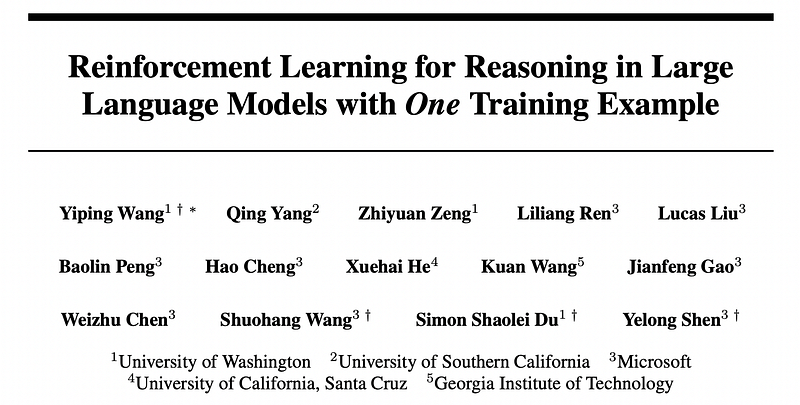
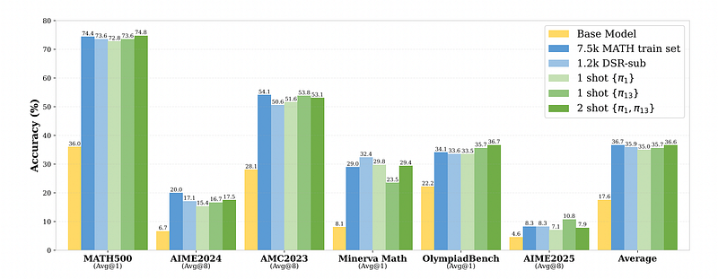
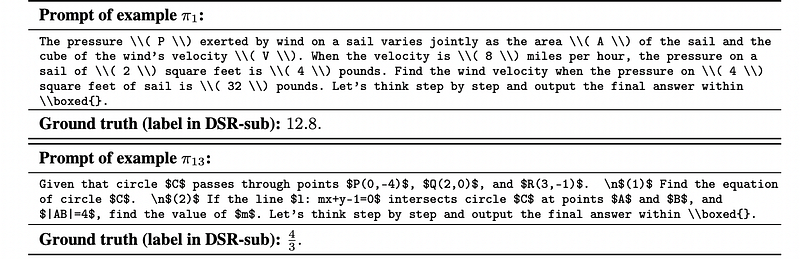
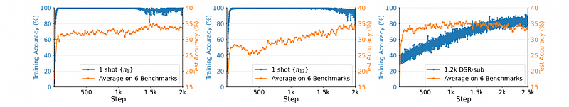
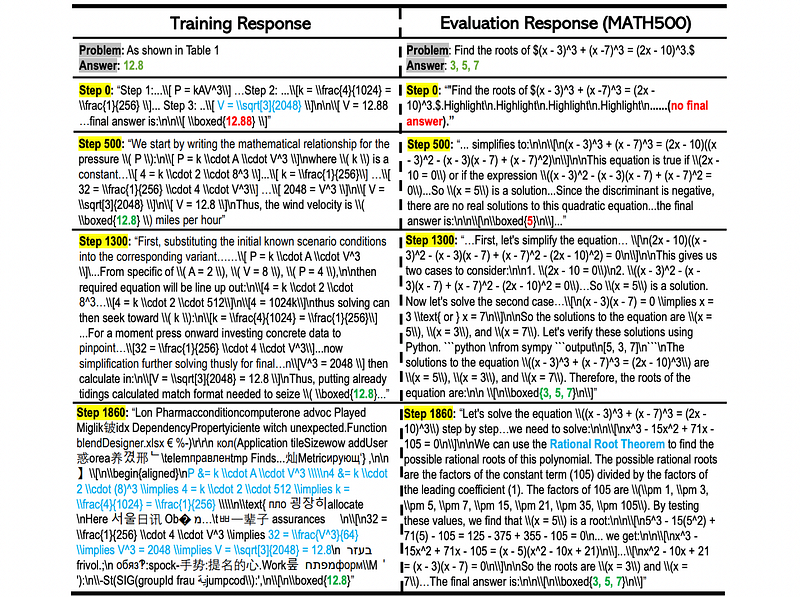
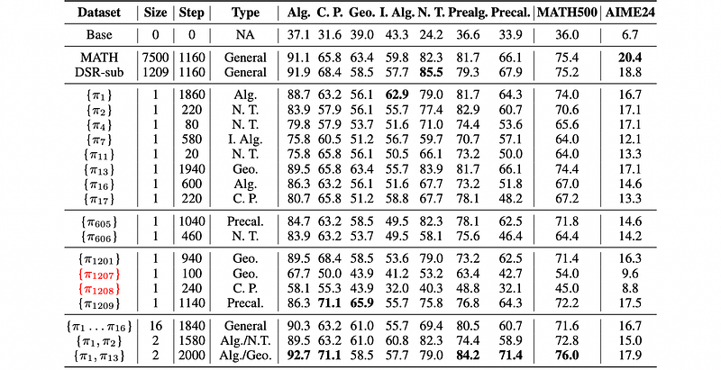
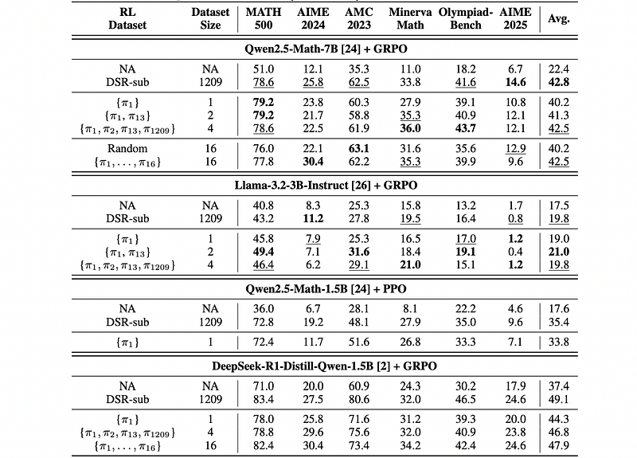

# Papers Explained 373 - One-Shot RLVR

Experiments are run on Qwen2.5-Math-1.5B, Qwen2.5-Math-7B, Llama-3.2–3B-Instruct, and DeepSeek-R1-Distill-Qwen-1.5B.

This page ingests the source article into the wiki and connects it to [[Papers Explained Corpus]], [[Reasoning Models]], [[Reinforcement Learning Topic]], [[Large Language Models]], [[Synthetic Data]], [[Reinforcement Learning]], [[Verifier-Bounded Learning]].

## Source Metadata

- Source file: `raw/2025-05-26_Papers-Explained-373--One-Shot-RLVR-2258fffd857f.html`
- Source title: Papers Explained 373: One-Shot RLVR
- Published: 2025-05-26
- Canonical: [https://medium.com/@ritvik19/papers-explained-373-one-shot-rlvr-2258fffd857f](https://medium.com/@ritvik19/papers-explained-373-one-shot-rlvr-2258fffd857f)

## Key Ideas

- The project is available on [GitHub](https://github.com/ypwang61/One-Shot-RLVR).
- A subset of 1209 examples from DeepScaleR-Preview-Dataset, denoted π1, . . . , π1209, is randomly selected as an instance pool for data selection after ranking the data based on the historical variance score due to resource limitations.
- Qwen2.5-Math-1.5B is trained for 500 steps, and its historical variance score and corresponding ranking are obtained for data selection.
- The maximum prompt length is set to 1024, and the maximum response length is 3072, considering that the Qwen2.5-Math-1.5B/7B model has a 4096 context length. For DeepSeek-R1-Distill-Qwen-1.5B, the maximum response length is 8192.
- Training continues for 2000, 1000, 1000, and 1200 steps for Qwen2.5-Math-1.5B, Qwen2.5-Math-7B, Llama-3.2–3B-Instruct, and DeepSeek-R1-Distill-Qwen-1.5B, respectively, unless a significant drop in performance is observed.

## Notes

This paper shows that Reinforcement Learning with Verifiable Reward (RLVR), using only one training example (1-shot), significantly improves large language models’ (LLMs) mathematical reasoning abilities. This improvement was observed across various models, RL algorithms, and examples. Furthermore, the study revealed “post-saturation generalization,” where test accuracy continued improving even after training accuracy plateaued. Other findings include cross-domain generalization, increased self-reflection, the primary role of policy gradient loss (not “grokking”), and the critical role of entropy loss in exploration, which alone, without reward, significantly improved performance.

The project is available on [GitHub](https://github.com/ypwang61/One-Shot-RLVR).

## Method

### Data Selection: Historical Variance Score

To explore how extensively the RLVR training dataset can be reduced, a simple data selection approach for ranking training examples is proposed. The model is first trained for E epochs on the full dataset using RLVR. Then for each example i ∈ [N] = {1,…,N}, a list of historical training accuracy Li = [si,1,…,si,E] can be obtained, which records its average training accuracy for every epoch. Data is simply ranked by their historical variance of training accuracy, which is directly related to the reward. Examples are then selected according to this straightforward ranking criterion. Importantly, this criterion is not necessarily optimal for selecting single examples for 1-shot RLVR.

### Experiment Setup

Experiments are run on Qwen2.5-Math-1.5B, Qwen2.5-Math-7B, Llama-3.2–3B-Instruct, and DeepSeek-R1-Distill-Qwen-1.5B.

A subset of 1209 examples from DeepScaleR-Preview-Dataset, denoted π1, . . . , π1209, is randomly selected as an instance pool for data selection after ranking the data based on the historical variance score due to resource limitations. The MATH training set, consisting of 7500 instances, provides a comparison.

Qwen2.5-Math-1.5B is trained for 500 steps, and its historical variance score and corresponding ranking are obtained for data selection. To enable RLVR with one or very few examples, the chosen data are duplicated until they reach the training batch size (e.g., 128) and stored as a new dataset.

The maximum prompt length is set to 1024, and the maximum response length is 3072, considering that the Qwen2.5-Math-1.5B/7B model has a 4096 context length. For DeepSeek-R1-Distill-Qwen-1.5B, the maximum response length is 8192.

Training continues for 2000, 1000, 1000, and 1200 steps for Qwen2.5-Math-1.5B, Qwen2.5-Math-7B, Llama-3.2–3B-Instruct, and DeepSeek-R1-Distill-Qwen-1.5B, respectively, unless a significant drop in performance is observed.

## Results

*Figure: Detailed performance of 1/2-shot RLVR for Qwen2.5-Math-1.5B.*

- 1/Few-shot RLVR is effective: RLVR with 1 or 2 examples can achieve comparable performance to RLVR trained on large datasets.

*Figure: Example π1 and π13.*

- Simple examples can be powerful: The examples leading to strong performance (π1 and π13) are relatively simple algebra and geometry problems, and the base model can often already solve key steps.

*Figure: Post-saturation generalization in 1-shot RLVR.*

- Post-saturation generalization: Even after training accuracy saturates, test performance continues to improve. This suggests that the model is still learning to generalize beyond the training example.

*Figure: The model can still generalize on test data after overfitting training example for 1-shot RLVR’s post-saturation generalization.*

- Overfitting occurs late: Overfitting to the single training example happens after a significant number of training steps (millions of rollouts), and test performance remains strong even after overfitting.

*Figure: 1(Few)-Shot RLVR performance (%) for different domains in MATH500.*

- Cross-domain improvement: 1-shot RLVR improves performance across different mathematical domains, not just the domain of the training example.

- Most examples are effective: Almost all examples, regardless of their difficulty or domain, lead to performance improvement in 1-shot RLVR.

- Data selection insights: The varying performance of different examples provides insights for future data selection methods. Combining examples arbitrarily may not always lead to the best results.

*Figure: Number of reflection words detected in evaluation tasks.*

- Increased self-reflection: 1-shot RLVR leads to an increase in self-reflection (e.g., “rethink,” “recheck”) in model responses during training, indicating more complex reasoning processes. This is observed even with overfitting on the training data and decreasing response length on other datasets.

*Figure: 1(few)-shot RLVR is still viable for different models and RL algorithm.*

- Few-shot RLVR is effective across different models and RL algorithms, achieving comparable or even superior performance to full-set RLVR.

- For Qwen2.5-Math-7B, 1-shot RLVR improves performance by 17.8% and 4-shot RLVR matches the performance of using a large demonstration subset. Selecting demonstrations based on historical variance outperforms random sampling.

- For Llama-3.2–3B-Instruct3, few-shot RLVR matches or surpasses full-set RLVR, but the absolute performance gain is smaller. The RLVR training process is less stable with this model.

- For Qwen2.5-Math-1.5B with PPO, 1-shot RLVR improves performance by 16.2%.

- For DeepSeek-R1-Distill-Qwen-1.5B, few-shot RLVR shows improvements (6.9% for 1-shot and 9.4% for 4-shot), but the performance gap compared to full-set RLVR is larger. The distilled model may require more examples for stable RL training.

- Selecting demonstrations based on historical variance is a more effective strategy than random sampling.

## Paper

Reinforcement Learning for Reasoning in Large Language Models with One Training Example [2504.20571](https://arxiv.org/abs/2504.20571)

## Figures

Figures from the Medium HTML export (`raw/2025-05-26_Papers-Explained-373--One-Shot-RLVR-2258fffd857f.html`); local copies under `wiki/assets/papers-explained-373-one-shot-rlvr/` when download succeeded.

| Figure | Caption |
|--------|---------|
|  | Title card: One-Shot RLVR. |
|  | Detailed performance of 1/2-shot RLVR for Qwen2.5-Math-1.5B. |
|  | Example π1 and π13. |
|  | Post-saturation generalization in 1-shot RLVR. |
|  | The model can still generalize on test data after overfitting training example for 1-shot RLVR’s post-saturation generalization. |
|  | 1(Few)-Shot RLVR performance (%) for different domains in MATH500. |
|  | Number of reflection words detected in evaluation tasks. |
|  | 1(few)-shot RLVR is still viable for different models and RL algorithm. |
## Related

- [[Papers Explained Corpus]]
- [[Reasoning Models]]
- [[Reinforcement Learning Topic]]
- [[Large Language Models]]
- [[Synthetic Data]]
- [[Reinforcement Learning]]
- [[Verifier-Bounded Learning]]
- [[Papers Explained 372 - QALIGN]]
- [[Papers Explained 374 - Sarvam-M]]

#summary #topic
