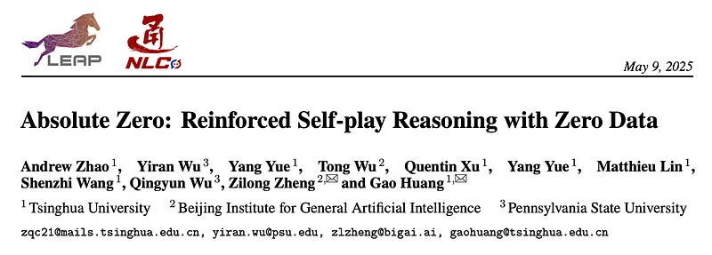
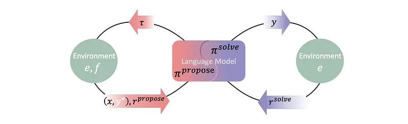
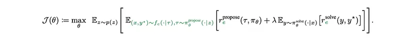
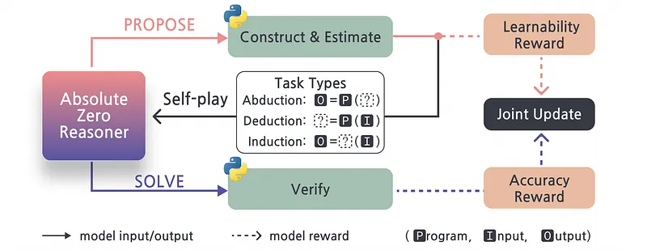
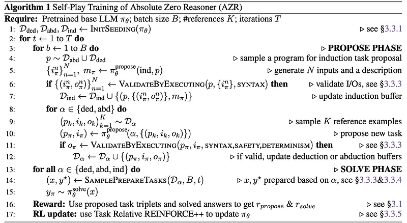
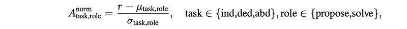
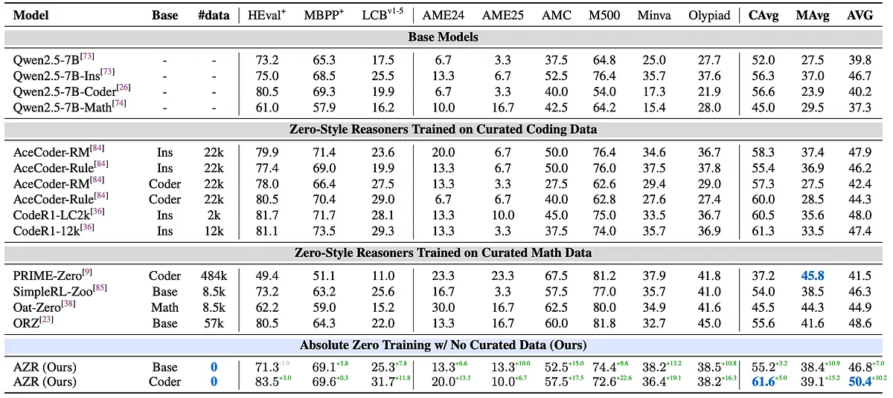
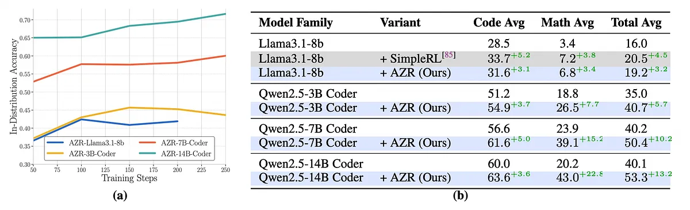
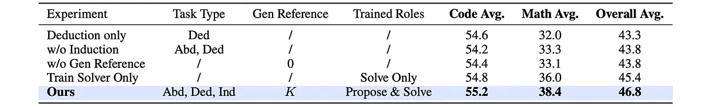

# Papers Explained 375 - Absolute Zero

The Absolute Zero paradigm is a novel approach to training models that eliminates the need for human-curated data. It relies on self-play and experience, aided by an environment, where the model simultaneously proposes tasks, solves them, and learns from both stages.

This page ingests the source article into the wiki and connects it to [[Papers Explained Corpus]], [[Reasoning Models]], [[Verifier-Bounded Learning]], [[Reinforcement Learning]].

## Source Metadata

- Source file: `raw/2025-05-28_Papers-Explained-375--Absolute-Zero-dc2e175488c3.md`
- Source title: Papers Explained 375: Absolute Zero
- Published: 2025-05-28
- Canonical: [https://medium.com/@ritvik19/papers-explained-375-absolute-zero-dc2e175488c3](https://medium.com/@ritvik19/papers-explained-375-absolute-zero-dc2e175488c3)

## Key Ideas

- The Absolute Zero paradigm is a novel approach to training models that eliminates the need for human-curated data.
- The model learns entirely through self-generated tasks and solutions, without any external data.
- Proposer (π_θ_propose): Proposes tasks conditioned on a variable z. The variable z can be instantiated by sampling a small subset of past (task, answer) pairs from a continually updated task memory.
- Solver (π_θ_solve): Solves the proposed tasks.
- The proposer samples a proposed task τ conditioned on variable z: τ ~ π_θ_propose (z).

## Notes

The Absolute Zero paradigm is a novel approach to training models that eliminates the need for human-curated data. It relies on self-play and experience, aided by an environment, where the model simultaneously proposes tasks, solves them, and learns from both stages.

The model learns entirely through self-generated tasks and solutions, without any external data.

*Figure: The Absolute Zero Loop.*

The model plays two roles:

- Proposer (π_θ_propose): Proposes tasks conditioned on a variable z. The variable z can be instantiated by sampling a small subset of past (task, answer) pairs from a continually updated task memory.

- Solver (π_θ_solve): Solves the proposed tasks.

### Process

- The proposer samples a proposed task τ conditioned on variable z: τ ~ π_θ_propose (z).

- The proposed task τ is transformed by a function f with the environment e into a validated problem (x, y⋆), where x is the task query and y⋆ is the gold label: (x, y⋆) ~ f_e(τ).

- The solver produces an answer y to the task query x: y ~ π_θ_solve(x).

- The environment e serves as a verifier, providing a solution reward r_solve(y, y⋆) for the solver’s answer.

- The learnability of the proposed task τ is scored by a function r_propose(τ, π_θ), which captures the expected improvement in π_θ after training on the task query x.

### Objective Function

- z is a conditional variable that seeds generation of tasks.

- r_propose(τ, π_θ) measures how much the model is expected to improve by solving a proposed task τ.

- r_solve(y, y⋆) evaluates the correctness of the model’s output.

- λ is a nonnegative coefficient that balances the trade-off between exploring new, learnable tasks and improving the model’s reasoning and problem-solving abilities.

## Absolute Zero Reasoner

Absolute Zero Reasoner (AZR) is the first attempt to embrace the Absolute Zero Paradigm. Within this self-play training paradigm, the model learns from three distinct types of coding tasks, corresponding to three fundamental modes of reasoning: abduction, deduction and induction. Using coding tasks is motivated by the Turing-completeness of programming languages and empirical evidence that code-based training improves reasoning.

A single model is rewarded for both generating high learning potential tasks and solving them effectively, as specified by the Absolute Zero objective. At each iteration of the online rollout, AZR proposes new reasoning tasks by conditioning on the task type and K past self-generated examples. The model is explicitly prompted to generate tasks that differ from these examples, promoting diversity and broader coverage of the task space. These task proposals are filtered and transformed into valid reasoning tasks that can be verified using the environment. AZR then attempts to solve these newly proposed tasks, receiving grounded feedback for its model responses. Both task proposal and problem solving are trained using reinforcement learning.

*Figure: Absolute Zero Reasoner Training Overview.*

### Reward Design

The reward function for the proposer is designed such that it encourages generation of tasks with meaningful learning potential — neither too easy nor unsolvable for the current solver. Concretely, the same language model is used in its solver role to estimate the learnability of a proposed task. n Monte Carlo rollouts of the solver are performed and the average success rate is computed as:

The proposer’s reward is then defined as:

For the solver, a simple binary reward based on the correctness of its final output is assigned,

where y⋆ is the ground-truth answer, and equality is evaluated based on value equality in Python.

With the primary rewards for the proposing and solving roles defined, the following composite reward structure is adpoted, which integrates r_propose and r_solve with a format-aware penalty

where yπ is the response of the language model.

### Learning Different Modes of Reasoning

Give program space P, input space I and output space O of a coding language, we define an AZR reasoning task as a triplet (p,i,o), where p ∈ P is a program, i ∈ I is an input, and o ∈ O is the corresponding output produced by running program on input, o = p(i). AZR learns by reasoning about different parts of this task triplet, using three distinct core reasoning modes:

Deduction

- Goal: Predict the output ‘o’ given a program ‘p’ and an input ‘i’.

- Process: This mode captures step-by-step logical reasoning. The model receives (p, i) and predicts the output oπ. The predicted output is verified using type-aware value equality.

- Proposer: Generates a pair (p, i). The environment executes p(i) to compute o, completing the triplet (p, i, o).

- Solver: Receives (p, i) and predicts the output oπ.

Induction

- Goal: Synthesize a program ‘p’ from a set of input-output examples.

- Process: The model is shown the first half of the input-output pairs and a message ‘m’, and must synthesize a program pπ that correctly maps the remaining hidden inputs to their outputs.

- Proposer: Samples a valid program p from deduction, generates N new inputs and a message m, and uses the environment to compute corresponding outputs. This forms an extended task representation (p, in, on, m).

- Solver: Synthesizes a program pπ.

Abduction

- Goal: Infer a plausible input ‘i’ given the program ‘p’ and an output ‘o’.

- Process: This mode resembles trial-and-error or online search. The model receives (p, o) and predicts iπ. The solution is verified by checking whether p(iπ) = o, using output value equivalence.

- Proposer: Generates a pair (p, i). The environment executes p(i) to compute o, completing the triplet (p, i, o).

- Solver: Receives (p, o) and predicts iπ.

[ FIG 34–39 in the paper]

## Absolute Zero Reasoner Learning Algorithm

The AZR algorithm involves the following key steps:

- Initialization: Initialize buffers for deduction, abduction, and induction tasks.

- Self-Play Loop: Iterate through a series of training steps.

- Propose Phase: Generate new reasoning tasks using the LLM.

- Solve Phase: Solve the proposed tasks using the LLM.

- Reward and Update: Calculate rewards based on task success and update the LLM using Task-Relative REINFORCE++ (TRR++).

### Buffer Initialization

Seed Set Generation: The algorithm starts by generating a seed set of valid triplets using the base language model.

Deduction and Abduction Buffers: The LLM is prompted to generate (p, i) pairs (program and input), which are then filtered, executed, and stored as valid triplets in the deduction and abduction buffers.

D0_abduction = D0_deduction = Dseed, where |Dseed| = B * S.

B is the batch size.

S = 4 is a fixed factor.

Seed triplet programs are stripped of global variables and comments.

Induction Buffer: Programs are sampled from Dseed, matching input sets and messages are generated, and valid examples are collected to initialize the induction buffer.

|D0_induction| = B * S.

Zero Triplet Fallback: If the seed buffer is empty at time 0, the algorithm falls back to a zero triplet (an identity function triplet).

No Model Updates: No model updates occur during the buffer initialization phase.

### Task Proposal Inputs and Buffer Management

Proposer for Abduction and Deduction:

- K past triplets are uniformly sampled from the buffer.

- These triplets are presented as in-context examples to the proposer.

- The proposer generates a new task, promoting diversity.

Induction Proposer:

- One triplet is sampled from the union of abduction and deduction buffers (Dded ∪ Dabduction).

- The program p from that triplet is presented to the induction proposer.

- The proposer generates a set of N matching inputs and a natural language message m.

Buffer Growth:

- For abduction and deduction, the buffer grows whenever the proposer generates a valid triplet (p, i, o), regardless of the task reward.

- For induction, all valid triplets (p, {in, on}, m) are added to the buffer.

Batch Filling: If a batch of solver problems contains fewer than B valid proposed tasks, the remainder is filled by uniformly sampling from the corresponding task buffer of previously validated triplets.

### Constructing Valid Tasks

Deduction and Abduction:

- Each proposal consists of a program and an input (p, i).

- The task validation procedure is used to obtain the correct output o, resulting in a complete triplet (p, i, o).

Induction:

- The policy proposes a set of inputs {in} given a program p and message m.

- The task validation procedure is used on each input to obtain a corresponding output on, forming a set of input-output pairs {(in, on)}.

- The task is considered valid only when all inputs yield valid outputs and the formatting requirements are satisfied.

Task Validation Procedure:

- Program Integrity: Run the program p with the input i using Python. If no errors are raised and something is returned, the program has valid syntax, and the output o is gathered.

- Program Safety: Check whether the program is safe for execution by restricting the use of sensitive packages (e.g., os.sys, sys, shutil).

- Check for Determinism: Only deterministic programs are considered valid. This is approximated by independently running the program j = 2 times and checking that all the outputs are equal.

Solving Task Construction:

- If a task proposal passes the three checks, it is deemed a valid task.

- For deduction, x = (p, i).

- For abduction, x = (p, o).

- For induction, x = ({in, on}N/2, m).

- All valid tasks from timestep t are used; if the batch B is not full, previously validated tasks are uniformly sampled to fill the batch.

### Answer Verification

- Abduction: The solver policy provides iπ. Equivalence matching is performed using p(iπ) = p(i⋆), where i⋆ is the privileged gold information.

- Deduction: The solver policy provides oπ. Matching is performed using oπ = o⋆.

- Induction: The solver policy provides pπ. Matching is performed using all(pπ(i⋆n) = o⋆n).

### Task-Relative REINFORCE++ (TRR++)

AZR trains the combination of roles and task types in a multitask reinforcement learning setup.

Instead of a single global baseline, separate baselines are computed for each of the six task-role configurations (deduction proposer, deduction solver, abduction proposer, abduction solver, induction proposer, induction solver).

The normalized advantage is computed as:

The mean (µtask,role) and standard deviation (σtask,role) are computed within each task type and role, yielding six baselines.

## Experiment Setup

Models AZR-base-7B and AZR-Coder-7B are trained on Qwen2.5–7B and Qwen2.5–7B-Coder, respectively. Additional experiments include training Qwen2.5-Coder-3B, Qwen2.5-Coder-14B, Qwen2.5–14B, and Llama-3.1–8B.

## Evaluation

*Figure: Performance of RL-Trained Reasoner on Reasoning Benchmarks Based on Qwen2.5–7B Models.*

RQ1: How does AZR compare to other zero setting models trained with human expert data?

- AZR-Coder-7B achieves state-of-the-art performance in both the 7B overall average and coding average categories.

- AZR surpasses the previous best model by 1.8 absolute percentages, despite being out-of-distribution for math and code reasoning benchmarks.

- AZR outperforms models trained with expert-curated human data in the coding category by 0.3 absolute percentages, despite never having access to such data.

- AZR models demonstrate stronger generalized reasoning improvements compared to expert code models, with gains of 10.9 and 15.2 percentage points in math performance after training.

- AZR models improved by 3.2 and 5.0 points on human-defined code generation tasks, while math models showed moderate increases in coding (+2.0 on average).

RQ 2: How do initializing from different base model variants (base vs. coder) affect performance?

- The “coder” variant achieved better overall performance in both math and coding after the AZR self-play process.

- Despite starting with lower initial math performance, the “coder” variant ultimately outperformed the “base” variant after AZR training.

- This suggests that initial code competency is a crucial factor in improving broader reasoning abilities within the AZR approach.

*Figure: (a) In-Distribution & (b) Out-of-Distribution Reasoning Task Performances.*

RQ3: How does varying model size affect AZR’s in-distribution and out-of-distribution capabilities?

- Larger AZR models demonstrate greater performance gains compared to smaller models, both in-distribution and out-of-distribution.

- In-distribution, 7B and 14B models continue to improve with more training steps, while the 3B model plateaus.

- Out-of-distribution, the performance gains are +5.7, +10.2, and +13.2 for the 3B, 7B, and 14B models, respectively.

- Scaling model size enhances the effectiveness of the AZR method.

RQ 4: Any interesting observations by changing the model class?

- AZR produces moderate improvements (+3.2) over the SimpleRL baseline, demonstrating its effectiveness even on relatively weaker models.

- The performance gains are more limited compared to the Qwen2.5 models, suggesting that performance improvements tend to scale with the initial base model potency.

RQ 5: Any interesting behaviors or patterns observed during AZR training?

- The AZR model demonstrates the ability to propose diverse programs and solve them through trial-and-error.

- The model exhibits distinct reasoning patterns depending on the task type (e.g., trial-and-error for abduction, structured intermediate results for output prediction, systematic test case checking for program induction).

- The model sometimes interleaves code outputs with comments resembling step-by-step plans, similar to the ReAct prompting framework.

- Emergent cognitive patterns were observed in Absolute Zero Reasoner-Llama3.1–8B, including state-tracking behavior.

- Unusual and potentially concerning chains of thought were observed in the Llama model trained with AZR.

- Token length increases over the course of training, with clear distinctions in token length growth across different types of cognitive tasks.

*Figure: Ablation Results.*

RQ 6: Are all task types essential for good performance (Ablation)?

- Removing either induction or abduction tasks significantly degrades math performance, with the most severe degradation occurring when both are excluded. This indicates that all three task types play a complementary and essential role in improving general reasoning capability.

RQ 7: How much do the designs of the proposer contribute to the overall performance (Ablation)?

- Removing dynamic conditioning on historical reference triplets resulted in a 5-point drop in math performance and a 1-point drop in code performance. This suggests that dynamically conditioning on reference programs improves performance, possibly by increasing diversity and achieving better coverage of the reasoning problem space.

- Removing proposer training resulted in a moderate drop in overall performance (-1.4). This suggests that while proposer training is beneficial, it may not be the most critical factor in the AZR framework.

## Paper

Absolute Zero: Reinforced Self-play Reasoning with Zero Data [2505.03335](https://www.arxiv.org/abs/2505.03335)

## Figures

Figures from the Medium HTML export (`raw/2025-05-28_Papers-Explained-375--Absolute-Zero-dc2e175488c3.md`); local copies under `wiki/assets/papers-explained-375-absolute-zero/` when download succeeded.

| Figure | Caption |
|--------|---------|
|  | Title card: Absolute Zero. |
|  | The Absolute Zero Loop. |
|  | The model plays two roles. |
|  | Absolute Zero Reasoner Training Overview. |
|  | The proposer’s reward is then defined as. |
|  | The proposer’s reward is then defined as. |
|  | For the solver, a simple binary reward based on the correctness of its final output is assigned,. |
|  | The proposer’s reward is then defined as:: where yπ is the response of the language model. |
|  | The AZR algorithm involves the following key steps. |
|  | The normalized advantage is computed as. |
|  | Performance of RL-Trained Reasoner on Reasoning Benchmarks Based on Qwen2.5–7B Models. |
|  | (a) In-Distribution & (b) Out-of-Distribution Reasoning Task Performances. |
|  | Ablation Results. |
## Related

- [[Papers Explained Corpus]]
- [[Reasoning Models]]
- [[Verifier-Bounded Learning]]
- [[Reinforcement Learning]]
- [[Papers Explained 374 - Sarvam-M]]
- [[Papers Explained 376 - REFINE-AF]]

#summary #topic
