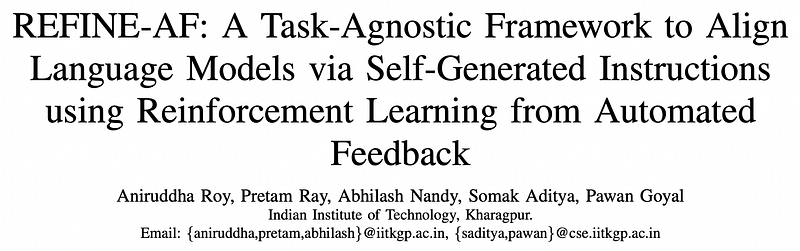
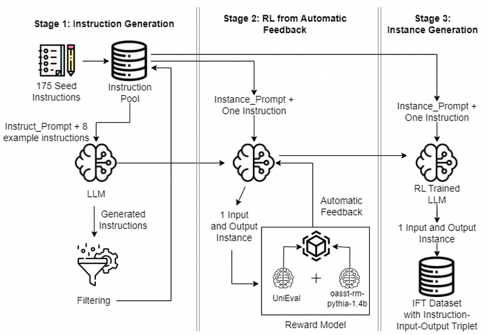
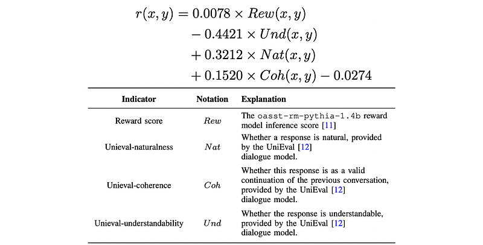
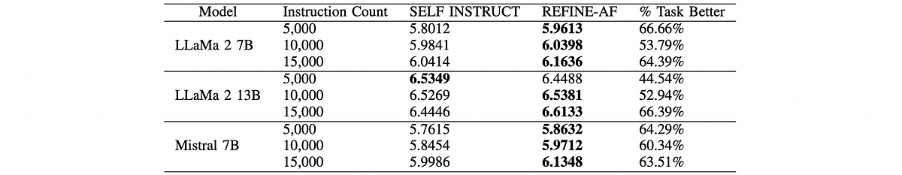
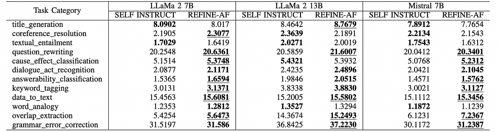
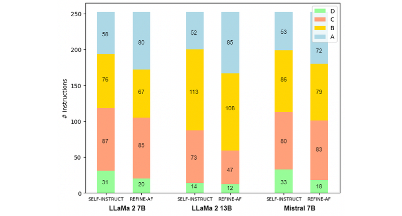
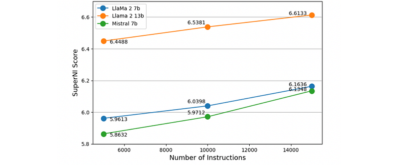

# Papers Explained 376 - REFINE-AF

This paper explores the use of open-source small LLMs (LLaMA 2–7B, LLaMA 2–13B, and Mistral 7B) within a semi-automated framework to generate instruction datasets for fine-tuning LLMs, and examines the effectiveness of Reinforcement Learning from Automated Feedback (RLAF) in the instruction-generation pipeline.

This page ingests the source article into the wiki and connects it to [[Papers Explained Corpus]], [[Large Language Models]], [[Reinforcement Learning Topic]], [[Synthetic Data]], [[Evaluation and Benchmarks]], [[Reinforcement Learning]], [[Supervised Fine-Tuning]].

## Source Metadata

- Source file: `raw/2025-05-29_Papers-Explained-376--REFINE-AF-7879070779b2.html`
- Source title: Papers Explained 376: REFINE-AF
- Published: 2025-05-29
- Canonical: [https://medium.com/@ritvik19/papers-explained-376-refine-af-7879070779b2](https://medium.com/@ritvik19/papers-explained-376-refine-af-7879070779b2)

## Key Ideas

- This paper explores the use of open-source small LLMs (LLaMA 2–7B, LLaMA 2–13B, and Mistral 7B) within a semi-automated framework to generate instruction datasets for fine-tuning LLMs, and examines the effectiveness of Reinforcement Learning from Automated...
- REFINE-AF generates synthetic instructional data from a small seed of human-written instructions by bootstrapping instructions using LLM inference, followed by training the LLM to align it to automated preferences in generated (input, output) pairs.
- Using RL from Automated Feedback to generate input-output pairs
- In REFINE-AF, human effort is minimized by replacing human feedback with automated feedback. The quality of instruction data can be viewed as its ability to efficiently steer language models in learning to generate responses in a particular manner.
- The model output is then passed to the reward model described above and an automatic score is generated which serves as the feedback to the LLM. Maximum is achieved for the following objective function in RL training using the PPO algorithm.

## Notes

This paper explores the use of open-source small LLMs (LLaMA 2–7B, LLaMA 2–13B, and Mistral 7B) within a semi-automated framework to generate instruction datasets for fine-tuning LLMs, and examines the effectiveness of Reinforcement Learning from Automated Feedback (RLAF) in the instruction-generation pipeline. The proposed framework, REFINE-AF, utilizes a small seed set of tasks, employs reinforcement learning to improve the quality of input-output pairs, and constructs an instruction fine-tuning dataset.

*Figure: Schematic diagram of the stages in REFINE-AF pipeline.*

REFINE-AF generates synthetic instructional data from a small seed of human-written instructions by bootstrapping instructions using LLM inference, followed by training the LLM to align it to automated preferences in generated (input, output) pairs. The pipeline consists of 3 stages:

- Instruction Generation

- Using RL from Automated Feedback to generate input-output pairs

- Instance Generation

## Instruction Generation

REFINE-AF generates additional instructions by iteratively building upon a limited set of initial human-written instructions. The initial pool of instructions is initiated using 175 seed instructions. At every step, 8 instructions are randomly selected from the pool to serve as in-context examples. 6 of the 8 instructions are written by humans, while the remaining 2 are generated by the LLM in the preceding steps to ensure diversity. To promote diversity, a new instruction is introduced into the instruction pool only if its ROUGE-L similarity score with any existing instruction is below 0.7. Additionally, instructions containing certain keywords (such as image, picture, graph) that are typically not processable by LLMs are eliminated.

```text
You are asked to come up with a set of diverse task instructions.
These task instructions will be given to a LLM and we will evaluate the LLM for completing the instructions.
Here are the requirements:
1. Try not to repeat the verb for each instruction to maximize diversity.
2. The language used for the instruction also should be diverse. For example, you should combine questions with imperative instructions.
3. The type of instructions should be diverse.
4. The list should include diverse types of tasks like open-ended generation, classification, editing, etc.
5. A language model should be able to complete the instruction. For example, do not ask the assistant to create any visual or audio output. For another example, do not ask the assistant to wake you up at 5 pm or set a reminder because it cannot perform any action.
6. The instructions should be in English.
7. The instructions should be 1 to 2 sentences long. Either an imperative sentence or a question is permitted.
Task 1: {instruction for existing task 1}
Task 2: {instruction for existing task 2}
Task 3: {instruction for existing task 3}
Task 4: {instruction for existing task 4}
Task 5: {instruction for existing task 5}
Task 6: {instruction for existing task 6}
Task 7: {instruction for existing task 7}
Task 8: {instruction for existing task 8}
Task 9:
```

## Using RL from Automated Feedback to generate input-output pairs

In REFINE-AF, human effort is minimized by replacing human feedback with automated feedback. The quality of instruction data can be viewed as its ability to efficiently steer language models in learning to generate responses in a particular manner. This can be estimated by various indicators. The reward score for any instruction, input, output triplet is calculated as:

This score acts as a scalar notion of preferability for a particular instruction-input-output triplet. It is directly proportional to the oasst-rm-pythia-1.4b model reward, the natural-ness and the coherence of the triplet and inversely proportional to the understandability which represents the complexity in the sentence. In the training phase, the LLM is engaged through a specifically designed prompt containing examples of Instruction-Input-Output Instances and instructions to generate such instances given an instruction.

The model output is then passed to the reward model described above and an automatic score is generated which serves as the feedback to the LLM. Maximum is achieved for the following objective function in RL training using the PPO algorithm.

## Instance Generation

After training the LLM using RL with automated feedback in the previous stage, the same prompt used while training followed by 1 instruction from the instruction pool at a time is used. This generates a (input, output) pair corresponding to each input instruction. At the end of this stage, an Instruction Fine Tuning (IFT) dataset of (instruction, input, output) triplets is obtained, as desired in a semi-automated fashion. Following the instance generation phase, the generated IFT dataset serves as the foundation for refining the model through Supervised Fine Tuning (SFT), a technique prevalently adopted for instruction finetuning.

## Experimental Setup

The same set of 175 seed examples utilized by Self-Instruct are used as human-annotated seed data for bootstrapping in the initial stage. LLaMa 2 model with 7B, 13B parameters, and Mistral with 7B parameters are used as the base models for generating the instruction dataset. The PPO Trainer from the Transformer Reinforcement Learning (TRL) library is used. The model is loaded in 4-bit mode and trained with LoRA. For the supervised fine-tuning step (using the generated instruction dataset), the model is trained for 3 epochs, using the HuggingFace Trainer.

## Results

*Figure: Comparative results (Average ROUGE-L Scores) of REFINE-AF with Self Instruct method for different base models on 119 tasks in SUPER-NI.*

- REFINE-AF consistently outperforms the SELF-INSTRUCT baseline across various instruction set sizes on the SUPER-NI benchmark.

*Figure: Task Category Wise Comparison of the average ROUGE-L Scores between the pipelines.*

- REFINE-AF shows superior performance across different tasks, surpassing the baseline in the majority of them on the SUPER-NI benchmark.

- REFINE-AF demonstrates enhanced performance compared to the baseline in 10 out of 12 task categories on the SUPER-NI benchmark.

- The performance consistency across different models suggests the scalability of the approach.

*Figure: Human Evaluation results using LLaMA 7B, LLaMA 2–13B, and Mistral 7B models trained on 15k instructions utilizing Self Instruct and our pipeline.*

- REFINE-AF performs better than SELF-INSTRUCT in generating valid and satisfactory answers to user-oriented instructions, with fewer irrelevant responses.

*Figure: Effect of data size on the performance of the model.*

- Increasing the number of instructions gradually increases the score on the SUPER-NI benchmark.

## Paper

REFINE-AF: A Task-Agnostic Framework to Align Language Models via Self-Generated Instructions using Reinforcement Learning from Automated Feedback [2505.06548](https://arxiv.org/abs/2505.06548)

## Figures

Figures from the Medium HTML export (`raw/2025-05-29_Papers-Explained-376--REFINE-AF-7879070779b2.html`); local copies under `wiki/assets/papers-explained-376-refine-af/` when download succeeded.

| Figure | Caption |
|--------|---------|
|  | Title card: REFINE-AF. |
|  | Schematic diagram of the stages in REFINE-AF pipeline. |
|  | In REFINE-AF, human effort is minimized by replacing human feedback with automated feedback. |
|  | The model output is then passed to the reward model described above and an automatic score is generated which serves as the feedback to the... |
|  | Comparative results (Average ROUGE-L Scores) of REFINE-AF with Self Instruct method for different base models on 119 tasks in SUPER-NI. |
|  | Task Category Wise Comparison of the average ROUGE-L Scores between the pipelines. |
|  | Human Evaluation results using LLaMA 7B, LLaMA 2–13B, and Mistral 7B models trained on 15k instructions utilizing Self Instruct and our pipeline. |
|  | Effect of data size on the performance of the model. |
## Related

- [[Papers Explained Corpus]]
- [[Large Language Models]]
- [[Reinforcement Learning Topic]]
- [[Synthetic Data]]
- [[Evaluation and Benchmarks]]
- [[Reinforcement Learning]]
- [[Supervised Fine-Tuning]]
- [[Papers Explained 375 - Absolute Zero]]
- [[Papers Explainedv377 - Fathom-R1]]

#summary #topic
