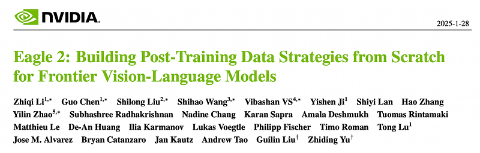
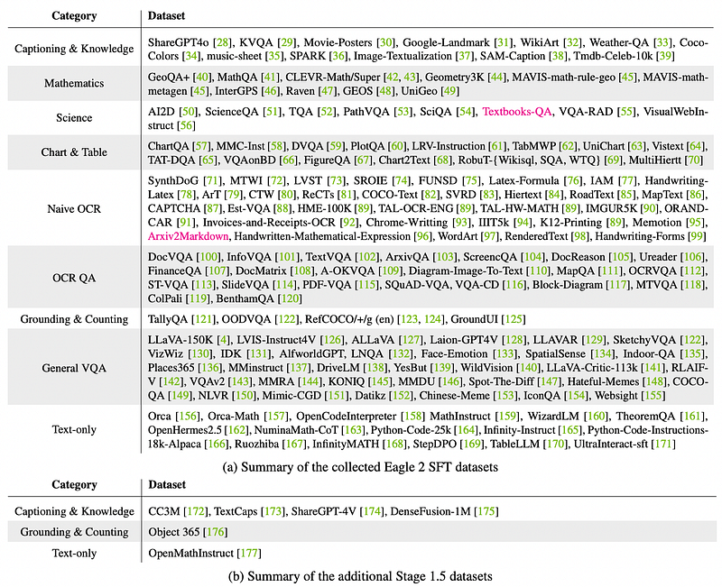
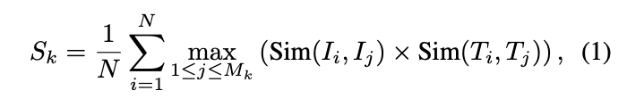
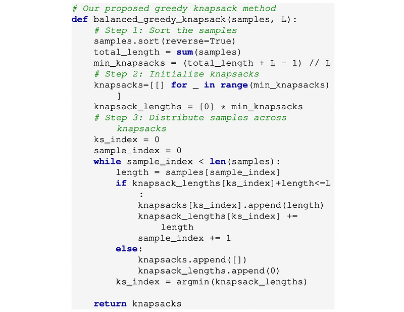
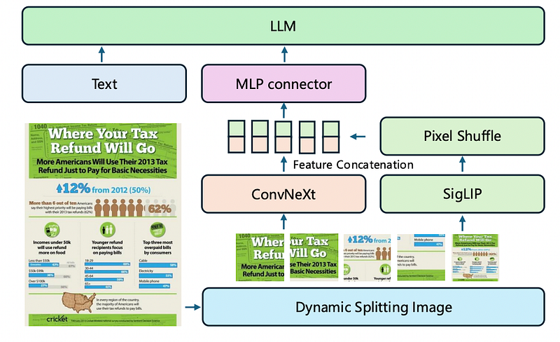
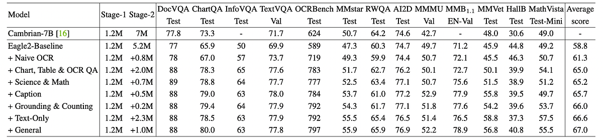
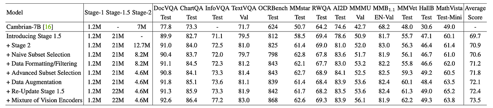
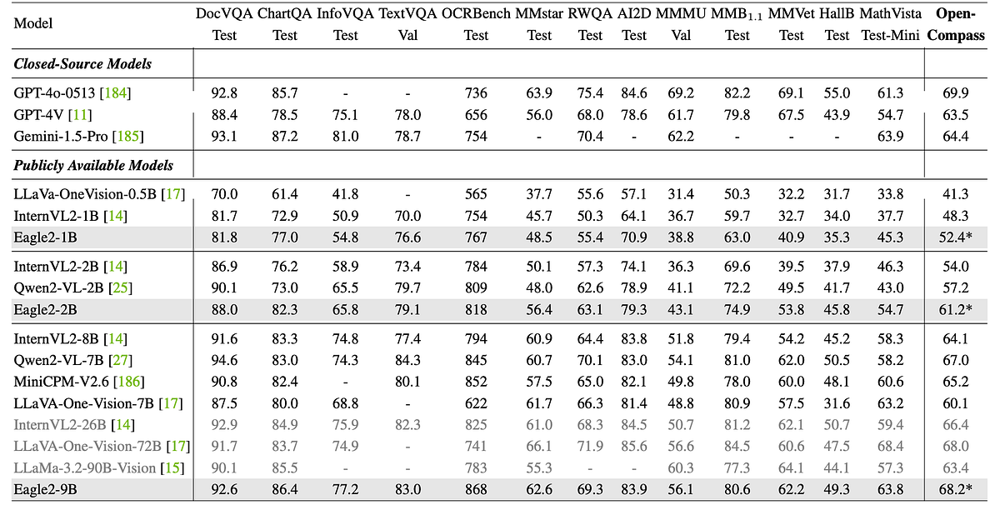

# Papers Explained 378 - Eagle 2

Eagle 2 is a family of performant vision-language models. It addresses VLM post-training from a data-centric perspective, detailing the process of building a post-training data strategy from scratch to benefit the open-source community.

This page ingests the source article into the wiki and connects it to [[Papers Explained Corpus]], [[Vision Language Models]], [[Large Language Models]], [[Synthetic Data]], [[Evaluation and Benchmarks]].

## Source Metadata

- Source file: `raw/2025-06-02_Papers-Explained-378--Eagle-2-cda1e612c0b4.html`
- Source title: Papers Explained 378: Eagle 2
- Published: 2025-06-02
- Canonical: [https://medium.com/@ritvik19/papers-explained-378-eagle-2-cda1e612c0b4](https://medium.com/@ritvik19/papers-explained-378-eagle-2-cda1e612c0b4)

## Key Ideas

- The project is available at [GitHub](https://github.com/NVlabs/EAGLE/).
- The initial baseline for this work starts with the Cambrian dataset and uses LLaVA’s two-stage training recipe. Some low-quality data is removed from Cambrian-7M, specifically ShareGPT-4V, GPT-77K, and Data-Engine-161K, resulting in a subset of 5.2M samples.
- Passive Gathering: Monitoring the latest related datasets from arXiv manuscripts and HuggingFace Datasets and adding them to the candidate list.
- Proactive Searching: Addressing the bucket effect by performing error analysis to identify model weaknesses and conducting targeted searches for new data with each update of the data pool.
- Non-QA Data Conversion: Collecting a large amount of public non-QA data, such as Google Landmark, and converting them into VQA data using specific rules or auto-labeling tools.

## Notes

Eagle 2 is a family of performant vision-language models. It addresses VLM post-training from a data-centric perspective, detailing the process of building a post-training data strategy from scratch to benefit the open-source community. Eagle2–9B achieves competitive results across various multimodal benchmarks, matching models with significantly more parameters.

The project is available at [GitHub](https://github.com/NVlabs/EAGLE/).

## Baseline

*Figure: Baseline Settings.*

The initial baseline for this work starts with the Cambrian dataset and uses LLaVA’s two-stage training recipe. Some low-quality data is removed from Cambrian-7M, specifically ShareGPT-4V, GPT-77K, and Data-Engine-161K, resulting in a subset of 5.2M samples. The model incorporates an MLP connector to bridge the vision encoder with the LLM and employs image tiling for dynamic resolution.

## Data Strategy

### Data Collection

- Passive Gathering: Monitoring the latest related datasets from arXiv manuscripts and HuggingFace Datasets and adding them to the candidate list.

- Proactive Searching: Addressing the bucket effect by performing error analysis to identify model weaknesses and conducting targeted searches for new data with each update of the data pool.

- Non-QA Data Conversion: Collecting a large amount of public non-QA data, such as Google Landmark, and converting them into VQA data using specific rules or auto-labeling tools.

- Batch Addition: Datasets with similar domains are added in batches to the data pool when meeting the following criteria:

- Maintaining overall accuracy without noticeable regression for every considered benchmark.

- Introducing meaningful diversity to the current domains.

A metric is defined to quantify the diversity and measure the relevance between a new data source and the current data pool:

Where:

- i is the index of a new data source with N samples.

- j is the index of the existing pool with M samples.

- k denotes the data category.

- Image embeddings 𝐼𝑖 and 𝐼𝑗 are generated from SSCD.

- Text embeddings 𝑇𝑖 and 𝑇𝑗 are generated from all-mpnet-base-v2.

- Similarity scores are computed only within the same category.

### Data Filtering

- Mismatching question-answer pair.

- Irrelevant image-question pair with unrelated image and question.

- Repeated texts.

- Numeric formatting issue: Excessive decimal precision or overly precise numerical answers lacking corresponding information in the image).

- Rule-based filtering is used to remove low-quality data, which are often generated from synthesis.

### Subset Selection

- Subset Quantity Determination: Data source diversity and distribution determine the sample quantity. Auto-labeled sources are featured by larger sizes, but often contain errors and lack diversity. Datasets with larger original sizes are generally applied with smaller sampling ratios. In Stage-2 data, the average size per source is around 20K, with the largest subset VisualWebInstruct having 263K samples.

- K-means Clustering Selection: Unsupervised K-means clustering is applied on SSCD image embeddings to select samples, ensuring balance across different types of data (e.g., chart types).

### Data augmentation

- Using third-party VLMs to generate fine-grained descriptions of the images.

- Adding CoT (Chain-of-Thought) explanations.

- Rule-based QA generation.

- Expanding short answers into longer responses.

### Data formatting

Transforming data into the correct format based on the principle: “same task, similar format; different tasks, clearly distinct formats.” Formatting includes:

- Removing unnecessary decorations.

- Appending more specific instructions.

### Training Recipe

The training recipe is built upon the following core points and significantly impacts the final results, even with the same data pool.

Post-Pretraining Stage is Necessary: The process starts with LLaVA’s two-stage training strategy (MLP connector training followed by full model training with SFT data). However, this approach is unsuitable for quick SFT data updates because expanding SFT data makes it harder to track the impact of new data and reduces experimental efficiency. To address the lack of robust pre-training, an additional pre-training stage (Stage-1.5) is added. Stage-1.5 pre-trains the model on a larger dataset to reduce dependency on SFT data in subsequent training.

Balance-Aware Data Packing Matters: Data packing speeds up training by concatenating shorter samples, reducing padding use. Experiments show that packing accelerates training by 2–3 times. A key step in packing is arranging N short samples of varying lengths into M long samples without exceeding the max length.

Existing frameworks use a naive greedy knapsack algorithm, which often produces packs with uneven length distributions (long and short samples grouped separately).

A balance-aware greedy knapsack algorithm is designed to create packs with a more uniform length distribution, ensuring that each pack contains both long and short samples. This method prioritizes balanced length distribution over packing efficiency, helping balance loss weights between long and short samples.

### Tiled Mixture of Vision Encoders

Following Eagle, SigLIP and ConvNeXt-XXLarge are used as vision encoders. Image tiling is employed to handle arbitrarily high-resolution images, following InternVL-1.5.

The input resolution of every image tile of SigLIP is 448x448, while the input size of ConvNeXt is 512x512.

PixelShuffle is used to conduct a 2x downsampling on the image features from SigLIP, resulting in a feature shape of 16x16, matching the output size of ConvNeXt (32x downsampling of input).

These features are then concatenated along the channel dimension and aligned with the LLM via an MLP layer.

## Experiments

### Stage-2 Data Scaling

*Figure: Data ablation under 2-Stage training.*

Increasing the amount of Stage-2 training data generally improves performance, with significant gains from including 2M VQA samples focused on charts, tables, and OCR. However, the cost increases sharply beyond 10M samples, and performance fluctuations are observed across benchmarks like MMMU, MathVista, and MMVet. The data-performance growth trend suggests it would be difficult to reach the performance of frontier VLMs like Qwen2-VL through data scaling alone.

### Stage-1.5 Introduction

A new Stage-1.5 is implemented to maximize data utilization and strengthen the model’s foundational capabilities. The Stage-1.5 checkpoint is competitive on its own, and subsequent Stage-2 training improves performance by an average of 3.9%.

### Naive Data Selection

Reducing the training data to 8.6M using a naive data selection strategy (maximum thresholds and random sampling) leads to a performance decline, possibly due to the exclusion of valuable samples and an unbalanced data distribution.

### Data Formatting & Filtering

Filtering low-quality data and formatting the training set results in improvements on 8 out of 14 benchmarks, including a 45-point gain on OCRBench.

### Advanced Data Selection

Using a comprehensive data selection strategy, the dataset is further reduced to 4.6M samples, resulting in improved average score due to a more balanced and higher-quality data subset.

### Data Augmentation

Employing data augmentation, particularly automatically generated CoT training data, leads to performance improvements on MMMU and MathVista. Rule-based data augmentation on chart data also improves ChartQA by 1 point.

### Re-updating Stage-1.5

Applying effective data strategies from Stage-2 (filtering, formatting, augmentation) to update the Stage-1.5 data further enhances the model’s capabilities, with improvements on ChartQA, MMVet, and MathVista.

### Mixture of Vision Encoders

Introducing a mixture of vision encoders improves performance on 12 out of 14 benchmarks, especially those related to documents, charts, and OCR, indicating enhanced understanding of visual spaces.

## Results

*Figure: Comparison with SoTA models on Various Benchmarks.*

- Eagle2–9B outperforms InternVL2–8B and MiniCPM-v2.6 across all 14 benchmarks.

- Eagle2–9B outperforms Qwen2-VL-7B in 9 out of 14 benchmarks and beats it on OpenCompass.

- Eagle2–9B performs competitively against much larger VLMs like InternVL2–26B, LLaVa-OneVision-72B, and LLaMa-3.2–90B-Vision.

- Eagle2–9B comprehensively surpasses GPT-4V, except on MMVet and MMMU.

- Eagle2–9B surpasses GPT-4o on ChartQA, OCRBench, and MathVista, and achieves near GPT-4o performance on DocVQA, MMStar, AI2D, and OpenCompass.

## Paper

Eagle 2: Building Post-Training Data Strategies from Scratch for Frontier Vision-Language Models [2501.14818](https://arxiv.org/abs/2501.14818)

## Figures

Figures from the Medium HTML export (`raw/2025-06-02_Papers-Explained-378--Eagle-2-cda1e612c0b4.html`); local copies under `wiki/assets/papers-explained-378-eagle-2/` when download succeeded.

| Figure | Caption |
|--------|---------|
|  | Title card: Eagle 2. |
|  | Baseline Settings. |
|  | A metric is defined to quantify the diversity and measure the relevance between a new data source and the current data pool. |
|  | A metric is defined to quantify the diversity and measure the relevance between a new data source and the current data pool. |
|  | Where. |
|  | Where:: Following Eagle, SigLIP and ConvNeXt-XXLarge are used as vision encoders. |
|  | Data ablation under 2-Stage training. |
|  | Where. |
|  | Comparison with SoTA models on Various Benchmarks. |
## Related

- [[Papers Explained Corpus]]
- [[Vision Language Models]]
- [[Large Language Models]]
- [[Synthetic Data]]
- [[Evaluation and Benchmarks]]
- [[Papers Explainedv377 - Fathom-R1]]
- [[Papers Explained 379 - Eagle 2.5]]

#summary #topic
