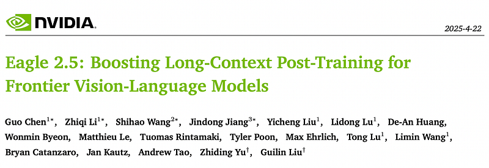
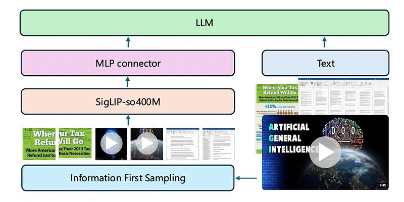
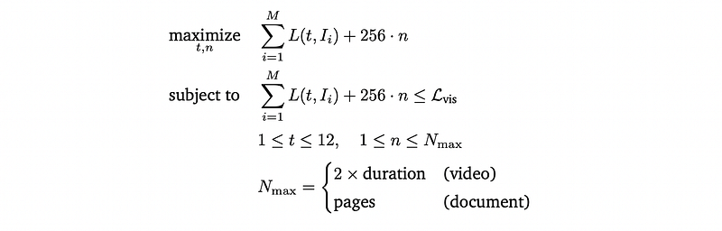
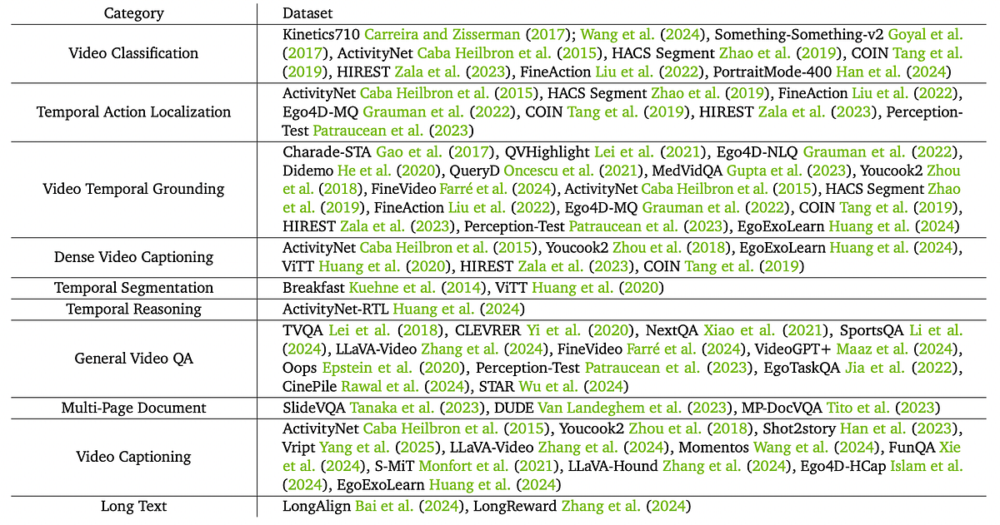
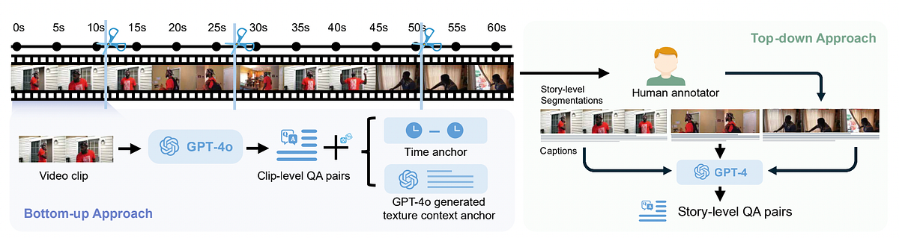
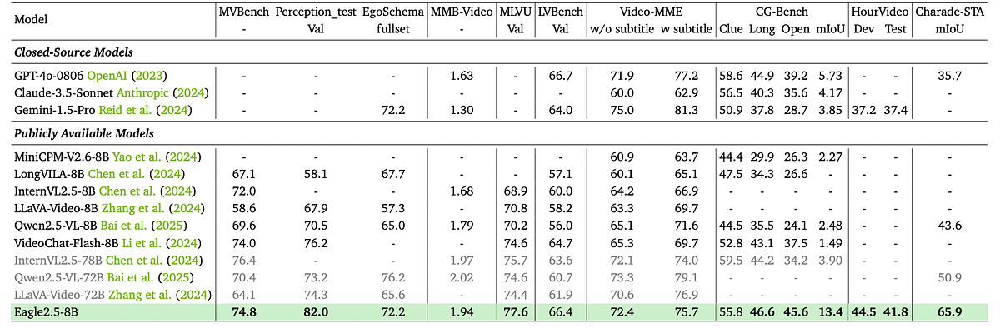
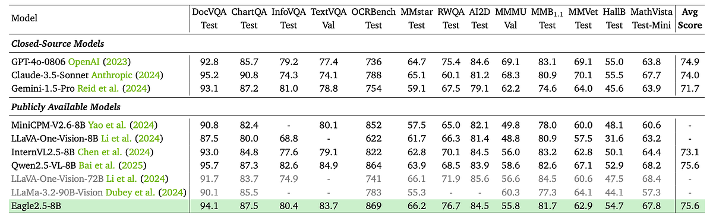
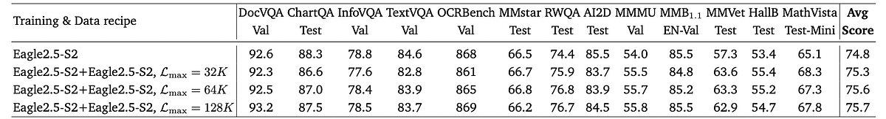
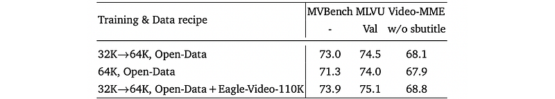

# Papers Explained 379 - Eagle 2.5

Following the architecture of LLaVA, an MLP projection layer is employed to align vision embeddings from SigLIP with the LLM representation space. The Qwen2.5 series models are used as language backbones. To effectively handle any-resolution images, the image tiling strategy is adopted, inspired by LLaVA-1.5 and InternVL.

This page ingests the source article into the wiki and connects it to [[Papers Explained Corpus]], [[Vision Language Models]], [[Large Language Models]], [[Embedding and Retrieval]], [[Long Context]].

## Source Metadata

- Source file: `raw/2025-06-03_Papers-Explained-379--Eagle-2-5-73ffe73dc009.html`
- Source title: Papers Explained 379: Eagle 2.5
- Published: 2025-06-03
- Canonical: [https://medium.com/@ritvik19/papers-explained-379-eagle-2-5-73ffe73dc009](https://medium.com/@ritvik19/papers-explained-379-eagle-2-5-73ffe73dc009)

## Key Ideas

- Following the architecture of LLaVA, an MLP projection layer is employed to align vision embeddings from SigLIP with the LLM representation space. The Qwen2.5 series models are used as language backbones.
- Addresses the limitations of traditional tiling methods that divide images into rigid grids, often distorting the original image geometry due to improper aspect ratio handling.
- Area Preservation: Encourages maintaining at least 60% of the original image area in the tiled version.
- Aspect Ratio Fidelity: Aligns the tiling ratio with the original aspect ratio.
- The optimal tiling configuration is selected by maximizing the following expression:

## Notes

Eagle 2.5 is a family of frontier vision-language models (VLMs) for long-context multimodal learning. It addresses the challenges in long video comprehension and high-resolution image understanding, introducing a generalist framework for both tasks. The proposed training framework incorporates Automatic Degrade Sampling and Image Area Preservation, two techniques that preserve contextual integrity and visual details. The framework also includes numerous efficiency optimizations in the pipeline for long-context data training.

## Model Architecture

Following the architecture of LLaVA, an MLP projection layer is employed to align vision embeddings from SigLIP with the LLM representation space. The Qwen2.5 series models are used as language backbones. To effectively handle any-resolution images, the image tiling strategy is adopted, inspired by LLaVA-1.5 and InternVL.

## Training Strategy

### Information-First Sampling

Image Area Preservation (IAP):

Addresses the limitations of traditional tiling methods that divide images into rigid grids, often distorting the original image geometry due to improper aspect ratio handling.

Optimizes two key objectives:

- Area Preservation: Encourages maintaining at least 60% of the original image area in the tiled version.

- Aspect Ratio Fidelity: Aligns the tiling ratio with the original aspect ratio.

The optimal tiling configuration is selected by maximizing the following expression:

Where:

- rw and rh are the tiling ratios.

- Anew is the area of the tiled version.

- Aorig is the area of the original image.

- rt is the tiling ratio (rw/rh).

- rorig is the original aspect ratio (W/H).

This formulation penalizes configurations where Anew is less than 60% of Aorig and rewards configurations where rt is close to rorig.

Automatic degradation sampling

Addresses the need for careful allocation of sequence length budgets between visual and textual inputs. It is an all-context-centric strategy that dynamically optimizes the balance between visual and textual content.

Given a training sample 𝒮 = {𝑆visual, 𝑆text} with max sequence length ℒmax:

- Compute fixed text token length ℒtext.

- Derive fixed visual token budget: ℒvisual = ℒmax − ℒtext.

For visual content optimization under ℒvisual, it distinguishes between images and temporal content (videos/documents):

- Images: Optimize maximal tile count per image t to maximize spatial information of M images.

- Temporal content (videos/documents): Optimize sampling count n to maximize temporal coverage.

The constrained optimization problem is formulated as:

Where:

- t is the tile count per image.

- n is the temporal sampling count.

- M is the total image instances.

- L(t, Ii) is the token function used to calculate the tokens of the i-th image Ii under maximal tiling number t.

- ℒvis is the visual token budget.

- Tmax = 12 (max tiles per image).

- Nmax = 2 * duration / 1 * pages (video/doc constraints).

ADS employs a dual-phase degradation process:

- Temporal degradation:

- Fix the max tile number t = 1 and focus on temporal sampling.

- Target a sampling rate of 2 FPS for videos and the usage of all images for multi-image documents.

- Require that each visual input has at least Nmin frames; if this minimum cannot be met within the visual context budget, the sample is discarded.

- The maximally sampled temporal units is: 𝑛* = ⌊ (ℒvisual − 𝑀 256) / 256 ⌋

- Tiling degradation:

- After deciding the number of frames, dynamically adjust the tiling to maximize the use of available context.

- Let 𝒯 = {12, 8, 6, 4, 2, 1} represent the possible tile configurations in decreasing order.

- Choose the highest tile configuration t* such that: 𝑡* = max 𝑡 ∈ 𝒯 : 𝑚 ∑︁ 𝑖=1 𝐿(𝑡, 𝐼𝑖) ≤ (ℒ𝑉 − 𝑛* · 256)

### Post-Training Schedule

Two complementary strategies are introduced:

Mixed Post-Training

- To ensure the model can efficiently process multimodal inputs of diverse lengths and maintain consistent performance across variable context sizes.

- Adaptive Adjustment: The Automatic Degradation Sampling (ADS) method is used to adaptively adjust each training sample to the maximum sequence length (ℒmax). This provides a frame-agnostic training paradigm.

- Length-Balanced Packing: A mixed training strategy with length-balanced packing is implemented to optimize performance uniformly across the entire spectrum of context lengths.

Progressive Mixed Post-Training

- To address the computational challenges and performance optimization issues associated with large ℒmax values by gradually exposing the model to increasingly larger context lengths.

- Gradual Exposure: The model is progressively exposed to larger ℒmax values, systematically enhancing its capacity to process extended contexts.

- Sequential Training: The training process involves sequentially setting ℒmax to 32K, 64K, and 128K, allowing the model to adapt to longer sequences over time.

## Data Recipe

### Open-Source Long-Context Data

*Figure: Video, multi-page document, and long text dataset used in Eagle-2.5.*

### Eagle-Video-110K

*Figure: Overview of the video annotation framework.*

Eagle-Video-110K is curated to enhance long video understanding capabilities. A diversity-driven strategy is used for the initial video collection. Story-level and fine-grained clip-level annotations are then automatically generated using both top-down and bottom-up approaches.

Several data sources are utilized for video collection: Vidchapters, MiraData, InternVid-10M, Panda-70M, Vript, Shot2story, ViTT, and WebVid-10M, collectively referred to as 𝐴.

For the current training dataset 𝐵, CLIP is used to extract temporal features at a rate of 1 frame per second. Videos from both 𝐴 and 𝐵 are segmented into 10-second clips. A pooling operation is performed on each clip’s frames to derive a representative feature vector. The pairwise cosine similarity between clips from 𝐵 and 𝐴 is calculated. For each clip in 𝐴, its maximum similarity with any clip in 𝐵 is identified. A similarity threshold 𝜏 = 0.5 is introduced. Clips in 𝐴 with 𝑆max below this threshold are considered most novel relative to 𝐵. The clips in 𝐴novel and their corresponding original videos are selected to enhance the diversity of the collection.

Story-level Video Data:

- A top-down approach is used, leveraging human-annotated chapters as video segments instead of shot detection to avoid over-segmentation.

- Videos with fewer than two chapters are filtered out.

- Chapter-level dense captions are generated using GPT-4o, guided by segment titles and sampled frames (up to 2 frames per second, max 50 frames).

- Long-form QA pairs are generated by GPT-4 using compiled captions, time intervals, and chapter titles.

Clip-level Video Data:

- A bottom-up, computationally efficient automatic annotation method is used to focus on localized spatiotemporal details.

- Clip-level video QA is generated by sampling frames (up to 2 frames per second) and using GPT-4o to create question-answer pairs based on randomly selected question types from a predefined pool (5 question types).

- Clip-to-video QA conversion addresses potential conflicts when extending clip-level queries to the entire video by incorporating:

- Temporal anchors (time intervals in questions).

- Textual context anchors (generated by GPT-4o to provide additional information without revealing answers).

## Evaluation

*Figure: Comparison with SoTA models on Various Video Benchmarks.*

- Eagle2.5–8B demonstrates strong performance across multiple video understanding benchmarks, outperforming similar-sized models and even surpassing larger models in some cases.

*Figure: Comparison with SoTA models on Various Image Benchmarks.*

- Eagle2.5–8B shows competitive performance across diverse image understanding benchmarks, demonstrating balanced capabilities across multimodal general perception and reasoning tasks.

*Figure: Impact of long-context data on performance of image benchmarks.*

- Increasing long-context data, under the training recipe, does not harm and may slightly benefit short-context image benchmark performance.

*Figure: The impact of image data and pretraining on the performance of video benchmarks.*

- Extensive image pre-training significantly enhances performance on short video benchmarks (MVBench) and a simpler long video benchmark (MLVU), but less so on a more challenging long video benchmark (Video-MME).

*Figure: The impact of information-first sampling on performance of image and video benchmarks.*

- The information-first sampling strategy, specifically the Image Area Preservation strategy, is crucial for maintaining performance on high-resolution image benchmarks (InfoVQA) and fine-grained video benchmarks (Perception-test).

*Figure: The impact of Eagle-Video-110K dataset and different post-training schedules on the performance of video benchmarks.*

- Progressive mixed training (32K to 64K) outperforms direct 64K mixed training on video benchmarks, possibly because it avoids diluting focus on shorter contexts and allows for a gradual learning process.

## Paper

Eagle 2.5: Boosting Long-Context Post-Training for Frontier Vision-Language Models [2504.15271](https://arxiv.org/abs/2504.15271)

## Figures

Figures from the Medium HTML export (`raw/2025-06-03_Papers-Explained-379--Eagle-2-5-73ffe73dc009.html`); local copies under `wiki/assets/papers-explained-379-eagle-2-5/` when download succeeded.

| Figure | Caption |
|--------|---------|
|  | Title card: Eagle 2.5. |
|  | Eagle 2.5 is a family of frontier vision-language models (VLMs) for long-context multimodal learning. |
|  | The optimal tiling configuration is selected by maximizing the following expression. |
|  | The constrained optimization problem is formulated as. |
|  | Video, multi-page document, and long text dataset used in Eagle-2.5. |
|  | Overview of the video annotation framework. |
|  | Comparison with SoTA models on Various Video Benchmarks. |
|  | Comparison with SoTA models on Various Image Benchmarks. |
|  | Impact of long-context data on performance of image benchmarks. |
|  | The impact of image data and pretraining on the performance of video benchmarks. |
|  | The impact of information-first sampling on performance of image and video benchmarks. |
|  | The impact of Eagle-Video-110K dataset and different post-training schedules on the performance of video benchmarks. |
## Related

- [[Papers Explained Corpus]]
- [[Vision Language Models]]
- [[Large Language Models]]
- [[Embedding and Retrieval]]
- [[Long Context]]
- [[Papers Explained 378 - Eagle 2]]
- [[Papers Explained 380 - Self-Evolved Preference Optimization (SPHERE)]]

#summary #topic
