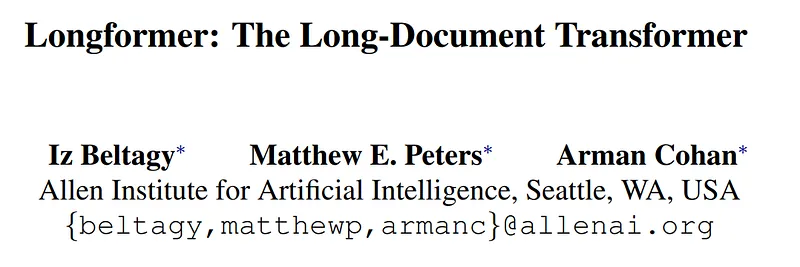
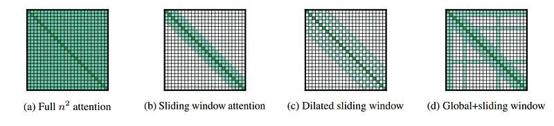
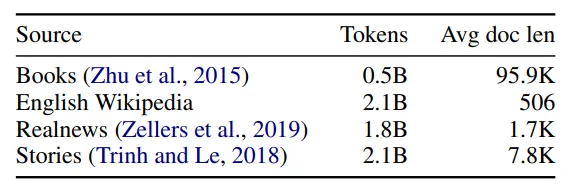

# Papers Explained 38 - Longformer

The original Transformer model has a self-attention component with O(n²) time and memory complexity where n is the input sequence length. To address this challenge, we sparsify the full self-attention matrix according to an “attention pattern” specifying pairs of input locations attending to one another.

This page ingests the source article into the wiki and connects it to [[Papers Explained Corpus]], [[Large Language Models]], [[Model Compression and Efficiency]].

## Source Metadata

- Source file: `raw/2023-03-20_Papers-Explained-38--Longformer-9a08416c532e.md`
- Source title: Papers Explained 38: Longformer
- Published: 2023-03-20
- Canonical: [https://medium.com/@ritvik19/papers-explained-38-longformer-9a08416c532e](https://medium.com/@ritvik19/papers-explained-38-longformer-9a08416c532e)

## Key Ideas

- The original Transformer model has a self-attention component with O(n²) time and memory complexity where n is the input sequence length.
- Given the importance of local context, our attention pattern employs a fixed-size window attention surrounding each token.
- To further increase the receptive field without increasing computation, the sliding window can be “dilated”. This is analogous to dilated CNNs where the window has gaps of size dilation d.
- We add “global attention” on few pre-selected input locations. Importantly, we make this attention operation symmetric: that is, a token with a global attention attends to all tokens across the sequence, and all tokens in the sequence attend to it.
- We use two sets of projections, Qs, Ks, Vs to compute attention scores of sliding window attention, and Qg, Kg, Vg to compute attention scores for the global attention.

## Notes

The original Transformer model has a self-attention component with O(n²) time and memory complexity where n is the input sequence length. To address this challenge, we sparsify the full self-attention matrix according to an “attention pattern” specifying pairs of input locations attending to one another. Unlike the full self-attention, our proposed attention pattern scales linearly with the input sequence, making it efficient for longer sequences.

### Sliding Window

Given the importance of local context, our attention pattern employs a fixed-size window attention surrounding each token. Using multiple stacked layers of such windowed attention results in a large receptive field, where top layers have access to all input locations and have the capacity to build representations that incorporate information across the entire input, similar to CNNs.

### Dilated Sliding Window

To further increase the receptive field without increasing computation, the sliding window can be “dilated”. This is analogous to dilated CNNs where the window has gaps of size dilation d.

### Global Attention

We add “global attention” on few pre-selected input locations. Importantly, we make this attention operation symmetric: that is, a token with a global attention attends to all tokens across the sequence, and all tokens in the sequence attend to it.

### Linear Projections for Global Attention

We use two sets of projections, Qs, Ks, Vs to compute attention scores of sliding window attention, and Qg, Kg, Vg to compute attention scores for the global attention. The additional projections provide flexibility to model the different types of attention, which we show is critical for best performance on downstream tasks. Qg, Kg, Vg are all initialized with values that match Qs, Ks, Vs.

## Implementation

In regular transformers, the expensive operation is the matrix multiplication QK^T because both Q and K have n (sequence length) projections. For Longformer, the dilated sliding window attention computes only a fixed number of the diagonals of QK^T

For autoregressive language modeling we use our dilated sliding window attention. We use differing window sizes across the layers. In particular, we use small window sizes for the lower layers and increase window sizes as we move to higher layers. This allows the top layers to learn higher-level representation of the entire sequence while having the lower layers capture local information.

We do not use dilated sliding windows for lower layers to maximize their capacity to learn and utilize the immediate local context.

## Training

In the first phase we start with a short sequence length and window size, then on each subsequent phase, we double the window size and the sequence length, and halve the learning rate. This makes training fast, while keeping the slow part to the end. We train the model over 5 total phases with starting sequence length of 2,048 and ending sequence length of 23,040 on the last phase.

## Evaluation

We evaluate with sequences of length 32,256. We split the dataset into overlapping sequences of size 32,256 with a step of size 512, and report the performance on the last 512 tokens on the sequence.

## Pretraining

We pretrain Longformer with masked language modeling (MLM). Since MLM pretraining is expensive, we continue pretraining from the RoBERTa released checkpoint, while only making the minimal changes necessary to support Longformer’s attention mechanism. Note that our attention pattern can be plugged into any pretrained transformer model without the need to change the model architecture.

### Attention Pattern

We use sliding window attention with window size of 512, therefore using the same amount of computation as RoBERTa.

### Position Embeddings

RoBERTa uses learned absolute position embeddings with the maximum position being 512. To support longer documents, we add extra position embeddings to support up to position 4,096.

### Continued MLM Pretraining

We pretrain Longformer using fairseq on a corpus of long documents.

### Frozen RoBERTa Weights

We also pretrained Longformer while freezing all RoBERTa weights, and only training the new position embeddings.

## Longformer-Encoder-Decoder (LED)

To facilitate modeling long sequences for seq2seq learning, we propose a Longformer variant that has both the encoder and decoder Transformer stacks but instead of the full self-attention in the encoder, it uses the efficient local+global attention pattern of the Longformer. The decoder uses the full self-attention to the entire encoded tokens and to previously decoded locations.

Since pre-training LED is expensive, we initialize LED parameters from the BART, and follow BART’s exact architecture in terms of number of layers and hidden sizes. The only difference is that to process longer inputs, we extend position embedding to 16K tokens (up from BART’s 1K tokens).

## Paper

Longformer: The Long-Document Transformer [2004.05150](https://arxiv.org/abs/2004.05150)

## Figures

Figures from the Medium HTML export (`raw/2023-03-20_Papers-Explained-38--Longformer-9a08416c532e.md`); local copies under `wiki/assets/papers-explained-38-longformer/` when download succeeded.

| Figure | Caption |
|--------|---------|
|  | Title card: Longformer. |
|  | The original Transformer model has a self-attention component with O(n²) time and memory complexity where n is the input sequence length. |
|  | We pretrain Longformer using fairseq on a corpus of long documents. |
## Related

- [[Papers Explained Corpus]]
- [[Large Language Models]]
- [[Model Compression and Efficiency]]
- [[Papers Explained 37 - FastBERT]]
- [[Papers Explained 39 - DeiT]]

#summary #topic
