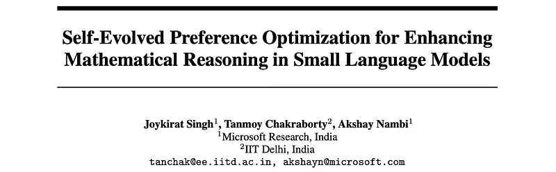
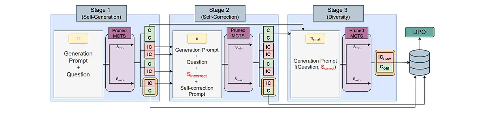
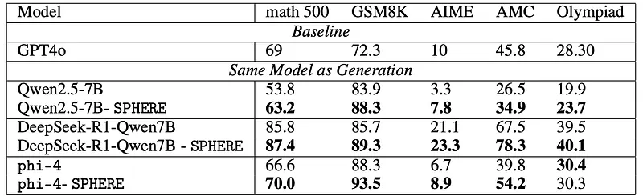
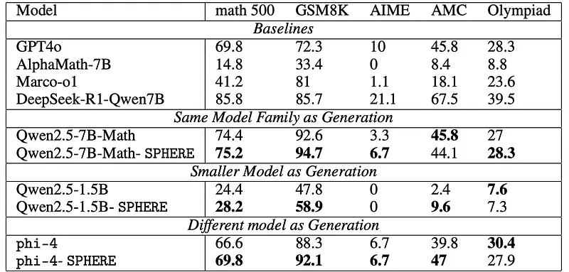

# Papers Explained 380 - Self-Evolved Preference Optimization (SPHERE)

The first stage of SPHERE constructs structured reasoning trajectories by using a base SLM to explore diverse problem-solving paths. Given a policy π and a dataset D with question-answer pairs, π generates multi-step reasoning sequences at a high temperature to enhance variability.

This page ingests the source article into the wiki and connects it to [[Papers Explained Corpus]], [[Reasoning Models]], [[Reinforcement Learning Topic]], [[Synthetic Data]], [[Safety and Alignment]], [[Model Compression and Efficiency]].

## Source Metadata

- Source file: `raw/2025-06-04_Papers-Explained-380--Self-Evolved-Preference-Optimization--SPHERE--f256c1a7bb0f.md`
- Source title: Papers Explained 380: Self-Evolved Preference Optimization (SPHERE)
- Published: 2025-06-04
- Canonical: [https://medium.com/@ritvik19/papers-explained-380-self-evolved-preference-optimization-sphere-f256c1a7bb0f](https://medium.com/@ritvik19/papers-explained-380-self-evolved-preference-optimization-sphere-f256c1a7bb0f)

## Key Ideas

- The first stage of SPHERE constructs structured reasoning trajectories by using a base SLM to explore diverse problem-solving paths.
- To ensure efficient exploration, only two steps per rollout are retained:
- St_max: The step most likely to lead to the correct final answer.
- St_min: The step least likely to lead to the correct final answer but still plausible.
- These steps are scored using PRM, πprm, which evaluates their likelihood of leading to the correct solution:

## Notes

SPHERE is a self-evolution framework that enhances multi-step reasoning in SLMs by generating high-quality preference data without human supervision. It leverages MCTS to explore reasoning trajectories efficiently while using a process-based reward model to assign step-wise correctness scores. To mitigate computational costs, SPHERE prunes suboptimal branches, retaining only the highest-reward (Smax) and lowest-reward (Smin) paths per rollout. This selective sampling produces high-quality preference pairs, enabling models to learn both optimal strategies and systematic failure patterns.

*Figure: Illustration of all stages in Pruned MCTS.*

## Stage 1: Self-Generation of Reasoning Trajectories

The first stage of SPHERE constructs structured reasoning trajectories by using a base SLM to explore diverse problem-solving paths. Given a policy π and a dataset D with question-answer pairs, π generates multi-step reasoning sequences at a high temperature to enhance variability. At each time step t, the model generates E distinct reasoning steps:

To ensure efficient exploration, only two steps per rollout are retained:

- St_max: The step most likely to lead to the correct final answer.

- St_min: The step least likely to lead to the correct final answer but still plausible.

These steps are scored using PRM, πprm, which evaluates their likelihood of leading to the correct solution:

where R(St) assigns a reward score. The process continues recursively until reaching a final answer or a predefined depth limit, forming two complete reasoning trajectories:

- Sol_max : A sequence of steps composed of Smax, forming the most optimal reasoning trajectory.

- Sol_min : A sequence of steps composed of Smin, forming the weakest but still structured reasoning trajectory.

A Process Reward Model (PRM) πprm is used to assign scores between [0, 1], where 1 indicates a high likelihood of leading to the correct final answer, and 0 indicates a highly unreliable reasoning step. For an initial step s0, the reward is directly assigned as: R(s0) = πprm(s0). For subsequent steps st, we incorporate an advantage reward that accounts for progress made:

In some cases, both Smax and Smin may be missing due to:

- All solutions being incorrect: The model fails to produce any invalid reasoning paths, preventing the identification of a meaningful Smin.

- All solutions being correct: The generated reasoning steps exhibit only valid problem-solving approaches, leading to a lack of contrastive training pairs.

To address the gaps, Stage 2: Self-Correction and Stage 3: Diversity are introduced, respectively.

## Stage 2: Self-Correction for Preference Data Generation

In this stage, the model’s self-correction capability is enhanced by prompting it to reflect on its own reasoning, identify mistakes, and regenerate improved solutions. The self-correction dataset is specifically constructed from cases where both Solmax or Solmin result in an incorrect final answer, meaning the model initially fails to produce a valid reasoning trajectory. To generate preference pairs for self-correction, the same MCTS-guided exploration approach used in Stage 1 is applied.

## Stage 3: Enhancing Diversity in Preference Data

To introduce more diversity, we utilize a smaller model πsmall, which shares the same architecture as the original policy π but has fewer parameters. This smaller model explores alternative reasoning paths with a higher likelihood of generating incorrect yet plausible solutions.

- Targeting Overlapping Correct Solutions: We identify instances where both Solmax and Solmin in previous stages resulted in correct final answers.

- Wider Exploration with πsmall: The smaller model πsmall is tasked with generating reasoning trajectories for these cases, using an expanded exploration budget of 2E to increase the probability of producing diverse errors.

- Filtering via MCTS-Guided Selection: The same MCTS mechanism is applied to extract the most and least promising reasoning steps, ensuring structured error diversity.

## Experimental Setup

- Generation Policy (π): Qwen/Qwen2.5–7B-Instruct, is responsible for generating multi-step reasoning trajectories.

- Diversity Augmentation Model (πsmall): Qwen/Qwen2.5–3B-Instruct, is used to enhance diversity by generating alternative reasoning steps and incorrect solutions.

- Process Reward Model (PRM, πprm): Qwen/Qwen2.5-Math-PRM-7B, is used to assess the quality of intermediate reasoning steps.

During reasoning trajectory generation, the base policy π generates 5 reasoning steps per prompt at a sampling temperature of 0.8. πsmall explores a larger set of 10 reasoning steps to introduce more variation and enhance the dataset’s diversity. Additional dataset is generated using Pruned MCTS for training phi-4 and DeepSeek-R1-Distill-Qwen-7B on their own generated dataset using SPHERE.

A large dataset of 20K math word problems with final answer ground-truth labels, primarily sampled from NuminaMath and MetaMath is used.

## Evaluation

### Same Model as Generation Policy

- SPHERE consistently improves the mathematical reasoning performance across all tested LLMs and benchmark datasets.

- SPHERE significantly boosts the performance of Qwen2.5–7B, phi-4, and DeepSeek-R1-Qwen 7B, leading to substantial accuracy gains on tasks like Math 500, GSM8K, AIME, and AMC.

- DeepSeek-R1-Qwen 7B, already a high-performing model exceeding GPT-4o in some cases, also benefits from SPHERE.

### Different Model as Generation Policy

*Figure: Performance of SPHERE on Pass@1 accuracy (Qwen2.5–7B as the generation policy).*

- SPHERE significantly enhances performance even with models already specialized for math reasoning, such as Qwen2.5–7B-Math, achieving improvements on Math 500, GSM8K, AIME, and Olympiad datasets.

- SPHERE substantially improves the reasoning abilities of smaller models like Qwen2.5–1.5B, demonstrating its effectiveness even with limited-capacity architectures, achieving significant gains on GSM8K, AMC, and Math 500.

- SPHERE’s applicability extends beyond Qwen models, as demonstrated by its success in improving the performance of phi-4, a 14B instruct-tuned model, on Math 500, GSM8K, and AMC. This highlights the versatility of SPHERE in enhancing diverse model architectures.

## Paper

Self-Evolved Preference Optimization for Enhancing Mathematical Reasoning in Small Language Models

## Figures

Figures from the Medium HTML export (`raw/2025-06-04_Papers-Explained-380--Self-Evolved-Preference-Optimization--SPHERE--f256c1a7bb0f.md`); local copies under `wiki/assets/papers-explained-380-self-evolved-preference-optimization-sphere/` when download succeeded.

| Figure | Caption |
|--------|---------|
|  | Title card: Self-Evolved Preference Optimization (SPHERE). |
|  | Illustration of all stages in Pruned MCTS. |
|  | To ensure efficient exploration, only two steps per rollout are retained. |
|  | These steps are scored using PRM, πprm, which evaluates their likelihood of leading to the correct solution. |
|  | In some cases, both Smax and Smin may be missing due to. |
|  | A large dataset of 20K math word problems with final answer ground-truth labels, primarily sampled from NuminaMath and MetaMath is used. |
|  | Performance of SPHERE on Pass@1 accuracy (Qwen2.5–7B as the generation policy). |
## Related

- [[Papers Explained Corpus]]
- [[Reasoning Models]]
- [[Reinforcement Learning Topic]]
- [[Synthetic Data]]
- [[Safety and Alignment]]
- [[Model Compression and Efficiency]]
- [[Papers Explained 379 - Eagle 2.5]]
- [[Papers Explained 381 - AceReason-Nemotron]]

#summary #topic
