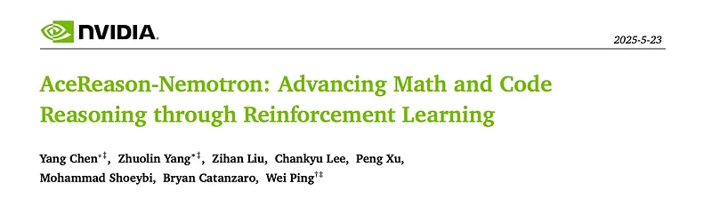
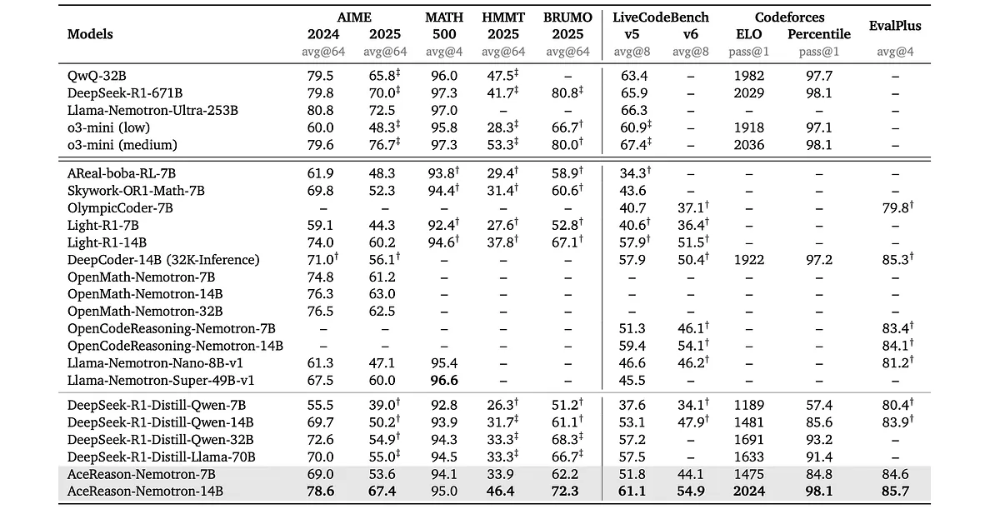

# Papers Explained 381 - AceReason-Nemotron

The models are available at [HuggingFace](https://huggingface.co/nvidia/AceReason-Nemotron-14B/).

This page ingests the source article into the wiki and connects it to [[Papers Explained Corpus]], [[Code Models]], [[Reasoning Models]], [[Large Language Models]], [[Safety and Alignment]], [[Model Compression and Efficiency]], [[Verifier-Bounded Learning]], [[Reinforcement Learning]], [[On-Policy Distillation]].

## Source Metadata

- Source file: `raw/2025-06-05_Papers-Explained-381--AceReason-Nemotron-0b3bd6495890.md`
- Source title: Papers Explained 381: AceReason-Nemotron
- Published: 2025-06-05
- Canonical: [https://medium.com/@ritvik19/papers-explained-381-acereason-nemotron-0b3bd6495890](https://medium.com/@ritvik19/papers-explained-381-acereason-nemotron-0b3bd6495890)

## Key Ideas

- For verification of math problems, a rule-based Python verification function built on top of sympy is employed. Specifically, it relies on antlr4-python3-runtime (v4.11.1) and sympy (v1.12).
- For coding problem verification, a local sandbox verifier is utilized. Given the model’s output, the code generated within the ‘‘‘python[code]‘‘‘ code block that follows the <\think> token is extracted.
- Due to a significant difference in verification time between math and code, conducting math-only and code-only RL separately is proposed.
- The RL pipeline focuses on enhancing reliability and efficiency through three primary strategies
- strict on-policy training to maintain stable training and prevent entropy collapse

## Notes

This work demonstrates that large-scale RL can significantly enhance the reasoning capabilities of strong, small and mid-sized models, achieving results that surpass those of state-of-the-art distillation-based models. Training first on math-only prompts, then on code-only prompts. Notably, math-only RL not only significantly enhances the performance of strong distilled models on math benchmarks, but also code reasoning tasks. In addition, extended code-only RL iterations further improve code benchmark performance with minimal or no degradation in math results. RL not only elicits the foundational reasoning capabilities acquired during pretraining and supervised fine-tuning (e.g., distillation), but also pushes the limits of the model’s reasoning ability, enabling it to solve problems that were previously unsolvable.

The models are available at [HuggingFace](https://huggingface.co/nvidia/AceReason-Nemotron-14B/).

## Framework

The GRPO algorithm is adopted.

For verification of math problems, a rule-based Python verification function built on top of sympy is employed. Specifically, it relies on antlr4-python3-runtime (v4.11.1) and sympy (v1.12). This specific configuration is crucial for ensuring accurate symbolic equivalence. The answer from appearing after the <\think> token is extracted and rewards are assigned strictly based on the correctness of this answer (1 for correct, 0 for incorrect), without applying any format-based rewards or length penalties.

For coding problem verification, a local sandbox verifier is utilized. Given the model’s output, the code generated within the ‘‘‘python[code]‘‘‘ code block that follows the <\think> token is extracted. Binary rewards are then assigned based on code execution outcome on a full set of test cases. A positive reward will be granted if and only if the extracted code successfully passes all test cases within the specific time limit.

Due to a significant difference in verification time between math and code, conducting math-only and code-only RL separately is proposed.

## Math-only RL

### Data Curation

The dataset combines DeepScaler and NuminaMath, applying 9-gram filtering to prevent contamination with common math benchmarks. Rules are implemented to exclude unsuitable data, such as questions with multiple sub-questions, multiple-choice or true/false formats, overly long or complex answers, proof-based questions, non-English content, references to figures, or excessively brief prompts. NuminaMath data, often sourced online and processed through OCR and parsing tools, contains significant noise from incorrect questions or answers. To mitigate this, the DeepSeek-R1 model is used, making up to eight attempts per question and retaining only those with correct majority-voted solutions verified by rules. Questions consistently unsolvable by DeepSeek-R1, often due to ambiguity or OCR errors, are discarded. Questions requiring fewer than 2,000 R1 response tokens are also filtered out, considering them solvable without extensive reasoning, and problems with 2,000–4,000 tokens are downsampled to balance the dataset. The final, rigorously verified dataset includes approximately 49,000 high-quality math problems suitable for RL training.

### Training Process

The RL pipeline focuses on enhancing reliability and efficiency through three primary strategies

- strict on-policy training to maintain stable training and prevent entropy collapse

- stage-wise length extension from 8K to 32K tokens

- curriculum training using increasingly difficult prompts at later stages.

## Code-only RL

### Data Curation

The code-only RL training dataset is meticulously curated from modern competitive programming platforms, adhering to strict selection criteria to ensure high-quality coding problems. The dataset includes both function-calling and standard input/output (stdin/stdout) formats, covering a wide range of algorithmic topics such as graph theory, data structures, number theory, greedy algorithms, and more. To ensure stability for RL training, problems incompatible with standard output comparison (e.g., multi-solution or interactive problems requiring special judges) or those needing platform-specific templates are excluded, thereby minimizing potential false negative rewards. Additionally, robust test cases that cover tricky edge cases or extreme cases under input limitations are curated, ensuring that incorrect solutions would fail, thus eliminating potential false positive rewards. To gauge difficulty, each problem is evaluated using DeepSeek-R1–671B with 8 rollouts, assigning a difficulty score from 0 to 8. Careful benchmark decontamination and problem deduplication across platforms are performed using n-gram context analysis and original URL matching. After this rigorous filtering process, 8,520 problems remained, forming the final training set.

### Training Process

The two-stage code-only RL pipeline is designed to accommodate models of varying scales.

- Stage 1 initiates the code RL process, launching after prior math-only RL to ensure training stability. In Stage 1, training data is constructed by difficulty: problems with difficulty up to level 5 are used for the 7B model, while problems up to level 7 are used for the 14B model. The maximum response length is set as 24,000, temperature as 0.6, and the number of rollouts as 8 for Stage 1 training.

- Stage 2 employs the full set of training problems with a 32,768 maximum response length. In this stage, an epoch-wise filtering strategy is implemented by filtering out relatively easy problems with respect to prior epoch checkpoints and gradually increasing the sampling temperature from 0.6 to 1.0, and the number of rollouts from 8 to 16 across epochs. This aims to encourage policy convergence while encouraging exploration.

## Evaluation

### Math RL improves code reasoning

*Figure: Math only RL.*

- Math RL boosts LiveCodeBench v5 score to 44.4% (6.8% increase) for 7B model and 58.9% (5.8% increase) for 14B model.

- The 14B model with math RL outperforms DeepCoder-14B (57.9%).

- Math-only RL improves coding performance across all problem topics, not just math-related ones.

### Main Results

*Figure: Math and Code reasoning evaluation.*

- RL significantly improves reasoning capabilities compared to SFT models, especially at the 14B parameter scale. AceReason-Nemotron-7B/14B models showed significant accuracy improvements over the initial SFT models on both math and coding tasks.

- AceReason-Nemotron models demonstrate superior or competitive performance compared to state-of-the-art open RL-based reasoning models with similar parameter scales. The 14B model provides best-in-class results in math reasoning.

- AceReason-Nemotron-14B outperforms the latest SOTA specialized distilled models in math and code performance, indicating that RL can lead to a higher upper bound of model performance than distillation.

- The effectiveness of distillation versus RL depends on model size and task domain. RL offers the potential for significantly higher accuracy at the 14B scale and beyond.

## Paper

AceReason-Nemotron: Advancing Math and Code Reasoning through Reinforcement Learning [2505.16400](https://arxiv.org/abs/2505.16400)

## Figures

Figures from the Medium HTML export (`raw/2025-06-05_Papers-Explained-381--AceReason-Nemotron-0b3bd6495890.md`); local copies under `wiki/assets/papers-explained-381-acereason-nemotron/` when download succeeded.

| Figure | Caption |
|--------|---------|
|  | Title card: AceReason-Nemotron. |
|  | Math only RL. |
|  | Math and Code reasoning evaluation. |
## Related

- [[Papers Explained Corpus]]
- [[Code Models]]
- [[Reasoning Models]]
- [[Large Language Models]]
- [[Safety and Alignment]]
- [[Model Compression and Efficiency]]
- [[Verifier-Bounded Learning]]
- [[Reinforcement Learning]]
- [[On-Policy Distillation]]
- [[Papers Explained 380 - Self-Evolved Preference Optimization (SPHERE)]]
- [[Papers Explained 381 - KL Divergence VS MSE for Knowledge Distillation]]

#summary #topic
