# Papers Explained 381 - KL Divergence VS MSE for Knowledge Distillation

Typically, KD uses the Kullback-Leibler (KL) divergence loss between the softened probability distributions of the teacher and student models, with the temperature scaling hyperparameter τ .

This page ingests the source article into the wiki and connects it to [[Papers Explained Corpus]], [[Model Compression and Efficiency]], [[Model Distillation]], [[KL Regularization]].

## Source Metadata

- Source file: `raw/2025-06-06_Papers-Explained-381--KL-Divergence-VS-MSE-for-Knowledge-Distillation-97988e80de3e.md`
- Source title: Papers Explained 381: KL Divergence VS MSE for Knowledge Distillation
- Published: 2025-06-06
- Canonical: [https://medium.com/@ritvik19/papers-explained-381-kl-divergence-vs-mse-for-knowledge-distillation-97988e80de3e](https://medium.com/@ritvik19/papers-explained-381-kl-divergence-vs-mse-for-knowledge-distillation-97988e80de3e)

## Key Ideas

- The paper shows that the MSE loss outperforms the KL divergence loss, mainly due to differences in the penultimate layer representations between the two loss functions.
- Image classification on CIFAR-100 with a family of Wide-ResNet (WRN) and ImageNet with a family of of ResNet (RN).
- We investigate the training and test accuracies according to the change in α in L and τ in L_KL.
- First, we empirically observe that the generalization error of a student model decreases as α in L increases.
- This result is consistent with prior studies that addressed the efficacy of “soft” targets. Therefore, we focus on the situation where “soft” targets are used to train a student model solely, that is, α = 1.0, in the remainder of this paper.

## Notes

Typically, KD uses the Kullback-Leibler (KL) divergence loss between the softened probability distributions of the teacher and student models, with the temperature scaling hyperparameter τ .

The authors theoretically demonstrate that as the temperature scaling hyperparameter (τ) increases, the KL divergence loss focuses more on logit matching, while as τ approaches 0, it emphasizes label matching. Empirical results suggest that logit matching is positively correlated with performance improvement in general. Based on this observation, the authors propose an alternative KD loss function: the mean squared error (MSE) between the logit vectors, allowing the student model to directly learn from the teacher model’s logits.

The paper shows that the MSE loss outperforms the KL divergence loss, mainly due to differences in the penultimate layer representations between the two loss functions. Additionally, the authors demonstrate that sequential distillation can further enhance performance, and using KD with a small τ can help mitigate label noise.

## Experimental Setup

Image classification on CIFAR-100 with a family of Wide-ResNet (WRN) and ImageNet with a family of of ResNet (RN).

## Hyperparameter τ in L_KL

We investigate the training and test accuracies according to the change in α in L and τ in L_KL.

*Figure: Grid maps of accuracies according to the change of α and τ on CIFAR-100.*

First, we empirically observe that the generalization error of a student model decreases as α in L increases. This means that “soft” targets are more efficient than “hard” targets in training a student if “soft” targets are extracted from a well-trained teacher.

This result is consistent with prior studies that addressed the efficacy of “soft” targets. Therefore, we focus on the situation where “soft” targets are used to train a student model solely, that is, α = 1.0, in the remainder of this paper.

When α = 1.0, the generalization error of the student model decreases as τ in L_KL increases.

These consistent tendencies according to the two hyperparameters, α and τ , are the same across various teacher-student pairs.

Specifically, a larger τ is linked to a larger L_KL, making the logit vector of the student similar to that of the teacher (i.e., logit matching). Hence, “soft” targets are being fully used as τ increases.

On the other hand, when τ is close to 0, the gradient of L_KL does not consider the logit distributions and only identifies whether the student and the teacher share the same output (i.e., label matching), which transfers limited information.

In addition, there is a scaling issue when τ approaches 0. As τ decreases, L_KL increasingly loses its quality and eventually becomes less involved in learning. The scaling problem can be easily fixed by multiplying 1/τ by LKL when τ is close to zero.

## Comparison of L_KL and L_MSE

We empirically compared the objectives L_KL and L_MSE in terms of performance gains and measured the distance between the logit distributions.

*Figure: Top-1 test accuracies on CIFAR-100. WRN-28–4 is used as a teacher*

Distillation with L_MSE is the best training scheme for various teacher-student pairs, We also found the consitent improvements in ensemble distillations.

Moreover, the model trained with L_MSE has similar or beetter performance when compared to existing KD methods.

*Figure: Test accuracy of various KD methods on CIFAR-100. All student models share the same teacher model as WRN-28–4.*

The logit distribution of the student with a large τ is closer to that of the teacher than with a small τ when L_KL is used. Moreover, L_MSE is more efficient in transferring the teacher’s information to a student than L_KL.

Optimizing L_MSE aligns the student’s logit with the teacher’s logit. On the other hand when τ becomes significantly large L_KL makes the sudent’s logit mean deviate from that of the teacher’s logit mean

*Figure: (a) Probabilistic density function (pdf) for ||z s − z t ||2 on CIFAR-100 training dataset; (b) The pdf for the 2-norm of prelogit (i.e., ||r s ||2) on CIFAR-100 training dataset. We use a (teacher, student) pair of (WRN-28–4, WRN-16–2).*

When the student s is trained with L_KL with infinite τ or with L_MSE, both representations attempt to follow the shape of the teacher’s representations but differ in the degree of cohesion. . Therefore, L_MSE can shrink the representations more than L_KL along with the teacher.

*Figure: Visualizations of pre-logits on CIFAR-100 according to the change of loss function. Here, we use the classes “apple,” “aquarium fish,” and “baby.”*

### Effects of a Noisy Teacher

We investigate the effects of a noisy teacher (i.e., a model poorly fitted to the training dataset). It is believed that the label matching (L_KL with a small τ ) is more appropriate than the logit matching (L_KL with a large τ or the L_MSE) under a noisy teacher. This is because label matching neglects the negative information of the outputs of an untrained teacher.

*Figure: Top-1 test accuracies on CIFAR-100. WRN-28–4 is used as a teacher for LKL and LMSE. Here, the teacher (WRN-28–4) was not fully trained. The training accuracy of the teacher network is 53.77%.*

*Figure: Test accuracy on the ImageNet dataset. We used a (teacher, student) pair of (ResNet-152, ResNet-50). The training accuracy of the teacher network is 81.16%.*

## Sequential Distillation

Sequential KD (large network → medium network → small network) is not conducive to generalization. In other words, the best approach is a direct distillation from the medium model to the small model.

When L_KL with τ = 3 is used to train the small network iteratively, the direct distillation from the intermediate network to the small network is better (i.e., WRN-16–4 → WRN-16–2, 74.84%) than the sequential distillation (i.e., WRN-28–4 → WRN-16–4 → WRN-16- 2, 74.52%) and direct distillation from a large network to a small network (i.e., WRN-28–4 → WRN-16–2, 74.24%). The same trend occurs in L_MSE iterations.

On the other hand, we find that the medium-sized teacher can improve the performance of a smaller-scale student when L_KL and L_MSE are used sequentially.

*Figure: Test accuracies of sequential knowledge distillation. In each entry, we note the objective function that used for the training. ‘X’ indicates that distillation was not used in training.*

## Robustness to Noisy Labels

Modern deep neural networks even attempt to memorize samples perfectly hence, the teacher might transfer corrupted knowledge to the student in this situation. Therefore, it is thought that logit matching might not be the best strategy when the teacher is trained using a noisy label dataset.

The best generalization performance is achieved when we use L_KL with τ ≤ 1.0

*Figure: Test accuracy graph as τ changes on CIFAR-100. We use the (teacher, student) as (WRN-28–4, WRN-16–2)*

As expected, logit matching might transfer the teacher’s overconfidence, even for incorrect predictions. However, the proper objective derived from both logit matching and label matching enables similar effects of label smoothing, as studied in. Therefore, L_KL with τ = 0.5 appears to significantly mitigate the problem of noisy labels.

## Conclusion

- As τ goes to 0, the trained student has the label matching property. In contrast, as τ goes to ∞, the trained student has the logit matching property.

- Nevertheless, L_KL with a sufficiently large τ cannot achieve complete logit matching. To achieve this goal, we proposed a direct logit learning framework using L_MSE and improved the performance based on this loss function.

- Model trained with L_MSE followed the teacher’s penultimate layer representations more than that with L_KL.

- Sequential distillation can be a better strategy when the capacity gap between the teacher and the student is large.

- In the noisy label setting, using L_KL with τ near 1 mitigates the performance degradation rather than extreme logit matching, such as L_KL with τ = ∞ or L_MSE.

## Paper

Comparing Kullback-Leibler Divergence and Mean Squared Error Loss in Knowledge Distillation [2105.08919](https://arxiv.org/abs/2105.08919)

Check out all the threads in this series [here](https://ritvik19.github.io/papers-explained)

## Figures

Figures from the Medium HTML export (`raw/2025-06-06_Papers-Explained-381--KL-Divergence-VS-MSE-for-Knowledge-Distillation-97988e80de3e.md`); local copies under `wiki/assets/papers-explained-381-kl-divergence-vs-mse-for-knowledge-distillation/` when download succeeded.

| Figure | Caption |
|--------|---------|
| 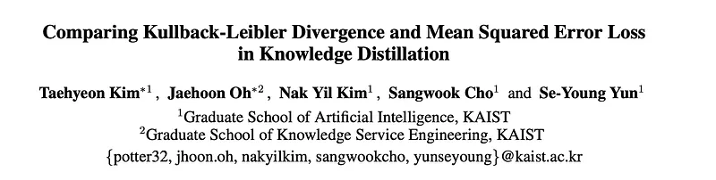 | Title card: KL Divergence VS MSE for Knowledge Distillation. |
| 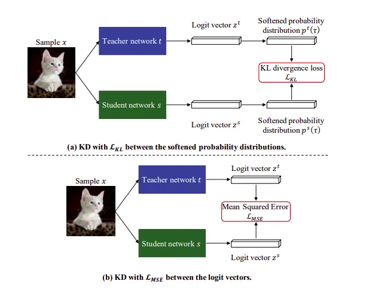 | Papers Explained 381: KL Divergence VS MSE for Knowledge Distillation. |
| 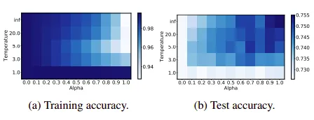 | Grid maps of accuracies according to the change of α and τ on CIFAR-100. |
| 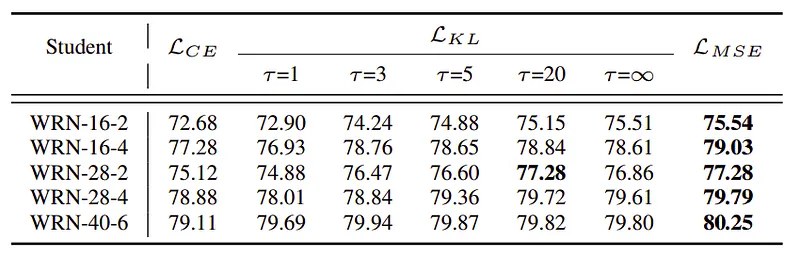 | Top-1 test accuracies on CIFAR-100. WRN-28–4 is used as a teacher. |
| 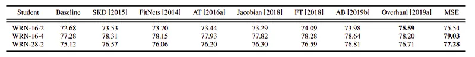 | Test accuracy of various KD methods on CIFAR-100. All student models share the same teacher model as WRN-28–4. |
| 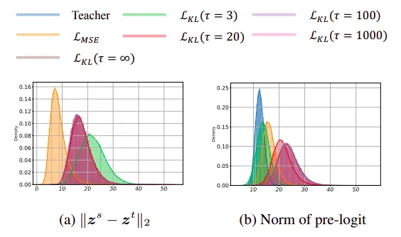 | (a) Probabilistic density function (pdf) for ||z s − z t ||2 on CIFAR-100 training dataset; (b) The pdf for the 2-norm of prelogit (i.e., ||r s ||2) on CIFAR-100 training dataset. We use a (teacher, student) pair of (WRN-28–4, WRN-16–2). |
| 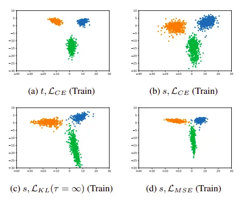 | Visualizations of pre-logits on CIFAR-100 according to the change of loss function. Here, we use the classes “apple,” “aquarium fish,” and “baby.”. |
| 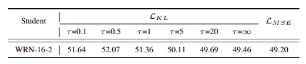 | Top-1 test accuracies on CIFAR-100. WRN-28–4 is used as a teacher for LKL and LMSE. Here, the teacher (WRN-28–4) was not fully trained. The training accuracy of the teacher network is 53.77%. |
| 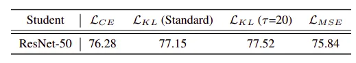 | Test accuracy on the ImageNet dataset. We used a (teacher, student) pair of (ResNet-152, ResNet-50). The training accuracy of the teacher network is 81.16%. |
| 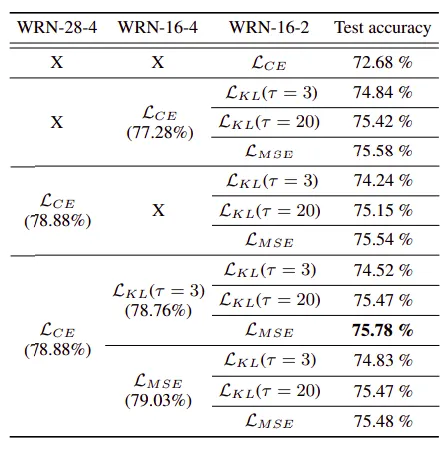 | Test accuracies of sequential knowledge distillation. In each entry, we note the objective function that used for the training. ‘X’ indicates that distillation was not used in training. |
| 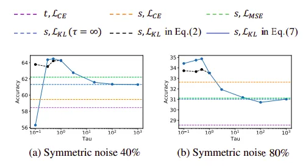 | Test accuracy graph as τ changes on CIFAR-100. We use the (teacher, student) as (WRN-28–4, WRN-16–2). |
## Related

- [[Papers Explained Corpus]]
- [[Model Compression and Efficiency]]
- [[Model Distillation]]
- [[KL Regularization]]
- [[Papers Explained 381 - AceReason-Nemotron]]
- [[Papers Explained 383 - Perception Encoder]]

#summary #topic
