# Papers Explained 383 - Perception Encoder

There are two objectives: first, to enhance the scalability and data efficiency of contrastive training; and second, to create a unified model effective on both image and video.

This page ingests the source article into the wiki and connects it to [[Papers Explained Corpus]], [[Model Compression and Efficiency]], [[Vision Language Models]], [[Synthetic Data]], [[Embedding and Retrieval]], [[Computer Vision]].

## Source Metadata

- Source file: `raw/2025-06-09_Papers-Explained-383--Perception-Encoder-86dda5791ddf.md`
- Source title: Papers Explained 383: Perception Encoder
- Published: 2025-06-09
- Canonical: [https://medium.com/@ritvik19/papers-explained-383-perception-encoder-86dda5791ddf](https://medium.com/@ritvik19/papers-explained-383-perception-encoder-86dda5791ddf)

## Key Ideas

- Notably, a unique quirk of contrastive training is the loss for a given sample depends on the other samples in the batch.
- Baseline: The starting point is a vanilla CLIP model using an OpenCLIP ViT-L/14 architecture at 224 resolution, trained on a 2.3B image-text dataset for 12B samples with a batch size of 32K, AdamW optimizer, and class token.
- Progressive Resolution: Training FLOPs are halved by using a progressive resolution schedule (98, 154, and 224) with 4B samples per stage, maintaining performance.
- Increased Batch Size: The batch size is doubled from 32K to 64K, increasing the total samples seen from 12B to 24B. This improves ImageNet validation by +0.6% and robustness by +1.1%.
- LAMB Optimizer: Switching to the LAMB optimizer allows for a higher learning rate (2 × 10−3) and stabilizes large batch training, resulting in +0.4% on ImageNet validation and +0.7% on robustness.

## Notes

Traditionally, vision encoders have relied on a variety of pretraining objectives, each tailored to specific downstream tasks such as classification, captioning, or localization. Perception Encoder contrastive vision-language training alone can produce strong, general embeddings for all of these downstream tasks, through carefully tuned image pretraining recipe and refining with a robust video data engine. There is only one caveat: these embeddings are hidden within the intermediate layers of the network. To draw them out, two alignment methods are introduced: language alignment for multimodal language modeling, and spatial alignment for dense prediction.

*Figure: Perception Encoder.*

## Perception Encoder: Core

There are two objectives: first, to enhance the scalability and data efficiency of contrastive training; and second, to create a unified model effective on both image and video.

These goals are somewhat conflicting: image-text data is plentiful and training on images is efficient, but video-text data is scarce and video training is expensive. Thus, image and video training are decoupled into two stages. A strong image pretraining recipe with several regularization techniques is first developed to create a robust starting point. Then, the resulting image model is used as a frame encoder to develop a video data engine supported by a human-refined video-text dataset to generate aligned captions for video clips.

### Robust Image Pretraining

Notably, a unique quirk of contrastive training is the loss for a given sample depends on the other samples in the batch. Because each batch is different, there is potential to learn new information every time an example is sampled, even if that sample has been seen before. Thus, we find contrastive learning to benefit from a long training schedule.

*Figure: Robust Image Pretraining.*

Baseline: The starting point is a vanilla CLIP model using an OpenCLIP ViT-L/14 architecture at 224 resolution, trained on a 2.3B image-text dataset for 12B samples with a batch size of 32K, AdamW optimizer, and class token.

Progressive Resolution: Training FLOPs are halved by using a progressive resolution schedule (98, 154, and 224) with 4B samples per stage, maintaining performance.

Increased Batch Size: The batch size is doubled from 32K to 64K, increasing the total samples seen from 12B to 24B. This improves ImageNet validation by +0.6% and robustness by +1.1%.

LAMB Optimizer: Switching to the LAMB optimizer allows for a higher learning rate (2 × 10−3) and stabilizes large batch training, resulting in +0.4% on ImageNet validation and +0.7% on robustness.

Increased Final Resolution: A fourth 336 resolution stage is added at the end of training, with the schedule adjusted to 10B samples at 98 resolution, 8B at 154, 4B at 224, and 2B at 336. This improves ImageNet validation by +0.5% and robustness by +1.4%.

RoPE (Rotary Position Embedding): Adding 2D RoPE to each attention layer improves extrapolation, enhancing robustness by +0.9% while only improving ImageNet validation by +0.3%.

Attention Pooling: Using an attention probing transformer block for CLIP embedding, while keeping the class token as input, improves ImageNet validation by +0.3% and robustness by +0.9%.

Tuned Data Augmentation: Adding heavy random cropping, brightness/saturation jitter, and horizontal flip improves robustness by +0.7%, particularly on ObjectNet (+2.4%).

Mask Regularization: MaskFeat is converted into a regularization loss by duplicating and masking 1/16th of the batch, aligning masked tokens to their unmasked counterparts.

### Bootstrapping a Video Data Engine with Perception Encoder

*Figure: Video Data Engine.*

To bootstrap contrastive video finetuning, focus is placed on synthesizing video captions. This is accomplished in three stages:

Phase 1: Base Video Captioner (PLM). A data engine is built on an early version of PLM, a multimodal large language model with PE as the vision encoder and Llama as the language decoder. PLM is trained on a large-scale collection of open-access image and video datasets. In total, the training dataset consists of 64.7M images and videos covering natural images, charts, documents, exocentric and egocentric videos.

Phase 2: PLM + Refined Data. To further boost captioning performance, a set of 265K videos (105K from PVD) are collected, captioned with the base PLM model, and human raters refine the captions. The base PLM model is then fine-tuned with this data, significantly improving captioning quality.

Phase 3: LLM Summarization. The final aligned video captions are synthesized by incorporating the PLM video captions, Llama 3.2 image-only frame captions, and the existing video metadata of video titles and descriptions. Combining these two leads to more comprehensive captions. The Llama 3.3 70B model summarizes video captions, frame captions, and video metadata together to provide the final captions.

```text
Create a concise caption of a video using the provided metadata, video caption, and frame captions.
TASK: Extract key information from the captions and combine it into an alt text format using single phrase or set of phrases that includes all relevant details.
Steps to Follow:
1. Review the metadata (title and description) for general context, you can rely it for entity names but do not rely on it as the primary source of information for your caption.
2. Blend title / description with video caption and frame captions for the main storyline
3. Extract the most relevant and concise information.
4. Combine extracted information into a alt text format using short phrase or set of phrases with approximately 120 tokens, considering special characters like comma as part of the token count.
5. Prioritize including all key information over sentence structure or grammar.
6. Minimize the use of special characters and focus of key information.
What to Avoid:
- Avoid adding or inferring information not present in the original metadata and captions.
- Avoid using complex sentence structures or prioritizing sentence flow.
Create a concise caption of the video based on the metadata, video caption, and frame captions.
```

Finally, an image-only checkpoint of PE is used to generate well-aligned, information-dense captions for a diverse set of 22M videos for contrastive finetuning. To encode videos, N = 8 frames are uniformly sampled from video clips and frame-level embeddings are extracted with the image encoder. Average pooling is then applied over these frame embeddings to obtain video embeddings, which are used for contrastive learning with encoded video captions by the text encoder.

### PE Video Dataset (PVD)

PVD comprises of 1M high-quality and diverse videos with accompanying tags and descriptions. The videos are motion-centered, covering both first-person and third-person views with a wide coverage of scenes. 120K of these videos with the highest degree of motion are annotated with detailed captions. Synthetic captions are generated using a video captioner and 200 annotators verify and refine them.

Two versions of annotations are released for the 120K PVD subset:

- Human verified captions: extended summaries with an average length of 57.1 words that provide a high-level description of each video. These captions are suitable for CLIP-style training.

- Long automated captions: detailed and fine-grained descriptions with an average length of 111.7 words that capture spatial and temporal events. These captions are ideal for fine-grained video understanding.

15K of the human-refined video-caption pairs are used as a held-out test set, introduced as a new video retrieval benchmark, PVD Benchmark, to evaluate fine-grained video-caption alignment. The benchmark follows the format of MSR-VTT. Videos are selected from 10 different categories, including hand actions, object interactions, food preparation, work activities, outdoor scenes, animals, water scenes, object handling, close-up shots, and nature scenes, with an overall average caption length of 51.7 words.

### A Unified Encoder for Image and Video

*Figure: PE Model Configurations.*

To capitalize on the promising scaling behavior, the largest PEcore model is scaled to 2B parameters. To maximize the performance of smaller models (B and L scales), a distillation finetuning approach using PEcoreG as the teacher is employed. The training process of PEcore involves three stages:

- Image pretraining. Image pretraining is scaled up to 5.4B publicly available image alt-text pairs curated with MetaCLIP and a total of 86B samples seen to ensure convergence (58B for B and L). A global batch size of 131K is used, with progressive resolution from 98 to up to 448 depending on the model.

- Image and video finetuning. Following the initial pretraining, the model is subsequently finetuned at max resolution with a short schedule for 50M samples on the image pretraining data (as cooldown) followed by 22M samples on the recaptioned videos with a smaller learning rate and batch size. The video captions are produced using the proposed video data engine. For each video clip, 8 frames are uniformly sampled, encoded, and their average is taken to produce a single video embedding. These are aligned with the corresponding video captions using the same contrastive objective in image training.

- Smaller model distillation. The 2B model (G scale) is distilled into smaller contrastive pretrained models at B and L scales under their final resolutions, using a short schedule that covers approximately 4B samples seen (∼8% of the pretraining schedule) with a lower learning rate and no weight decay.

## Perception Encoder: Language Alignment

PEcore already possesses useful features for vision-language modeling. we lift these features through alignment tuning to construct a new encoder, PElang, specialized for multimodal large language models (MLLMs).

The process begins with a “warmup” training stage using autoregressive next-token prediction loss on 1M image-text samples, freezing all parameters except the projector. All parameters are then finetuned on 70M data samples covering natural images, documents/charts/diagrams, and videos, using the same next-token prediction loss.

Ablation studies are conducted on a 20M subset of the data to optimize the training configuration. These studies involve varying:

- LLM sizes (1B or 3B parameters) and freezing weights. Increasing size and unfreezing improves performance.

- Vision projector types (2-layer MLP vs. linear layer). MLP projector performs better.

- Output layers to project (layers 41, 47, and 50). Layer 47 is optimal.

- Encoder regularization (LayerScale and DropPath). Regularization improves stability and performance.

*Figure: Language Alignment.*

Optimal Configuration: The final alignment setup uses a pretrained Llama3.2 3B, unfrozen, with a 2-layer MLP as a vision projector on top of PEcoreG layer 47, and regularizes the encoder with LayerScale and DropPath.

Scaling Up: This recipe is scaled up to 70M samples, resulting in a +2.1 point improvement to 82.2 on average across OCR Q&A, Captioning, Visual Q&A, and Video Q&A.

*Figure: Language Alignment.*

Effects of Alignment: Language alignment successfully lifts the strong features from intermediate layers of PEcore to the end of the network. The best performing layer for the aligned model becomes the last layer, regardless of the original checkpoint’s performance. Grounding performance is significantly improved even without grounding data in the training mix. Specific domains like OCR Q&A see a significant performance boost.

## Perception Encoder: Spatial Alignment

PEcore already has features that perform well for spatial tasks. However, the layer that performs the best for higher level spatial tasks like detection or depth estimation (layer ∼40) is vastly different than the layer that performs the best for a pure spatial task like tracking (layer ∼30). While we were able to ignore this disparity during language alignment by aligning to an LLM decoder that could do all tasks, classical spatial tasks have decoders that come in all shapes and sizes. It would be impractical to simply align the model using all downstream decoders mirroring language alignment.

Analysis of PEcoreG features revealed that the tracking performance peak at layer 32 is due to the attention maps remaining local until layer 32. From layer 33 onwards, “global tokens” appear, which aggregate global information and are useful for tasks relying on semantic understanding but detrimental to zero-shot tracking.

There are two objectives in creating a spatial alignment method:

- preserving the optimal semantic information of the model (including the global tokens) that peaks around layer 40.

- emphasizing local alignment in service of spatial tasks with shallow decoders.

The first objective can be easily achieved by aligning with the model’s own features (e.g., with MaskFeat), but the second is more challenging. To accomplish this, the Segment Anything Model (SAM) 2.1 is employed in a novel way to enforce spatial correspondence information in PE.

Retaining Semantics: To retain the strong semantic features from PEcore, the model is finetuned with itself as a teacher. The model is trained to minimize the cosine similarity between its last layer and the frozen layer 41 features of its initialization. Heavy regularization is applied to the student: DropPath and LayerScale similar to language alignment, as well as performing MaskFeat with 75% masking.

Encouraging Locality: Several works have shown SAM to not be an effective teacher when distilling from multiple sources. Upon observation of the raw features of SAM 2.1-L, the main problem may be SAM has global tokens as well! In this case, they appear as dark spots in a grid-like arrangement.

*Figure: SAM 2.1 Feature Similarity.*

SAM 2.1-L is queried with 1024 points arranged in a 32 × 32 grid. For each point, SAM returns a H × W mask logit the size of the image, which is normally thresholded and NMS. Instead, those logits are concatenated into a H × W × 1024 tensor and used as the feature map for alignment. This explicitly produces locally well-aligned features compared to the underlying feature space and has no spatial artifacts caused by global tokens.

Spatial correspondences between tokens are distilled by computing their pairwise cosine similarity for both the student and the teacher (creating a HW ×HW matrix for each) and aligning them with MSE loss. Unlike SAM’s underlying feature space, the mask logit features are robust to interpolation, so they are simply interpolated down and trained at the PEcore model’s original 448px resolution. Finally, like for self-distillation, the same masking and regularization are added. For both teachers, loss is applied to all tokens and no extra parameters other than LayerScale are added.

## Evaluation

### Core Results

*Figure: Zero-Shot Image Results.*

- PEcore outperforms all other contrastive models on zero-shot image classification and retrieval tasks, including the average of zero-shot ImageNet robustness metrics. It is the first model in over 3 years to achieve this without access to Google’s JFT-3B or WebLI datasets.

- PEcore exceeds the existing state-of-the-art on image-text retrieval and significantly improves on fine-grained classification, simultaneously holding state-of-the-art on all common zero-shot categories.

- Training with video data leads to substantial gains in image benchmarks, particularly on more difficult benchmarks and fine-grained classification.

- Zero-shot retrieval is significantly boosted due to the high level of detail and alignment of the synthetic captions.

*Figure: Zero-Shot Video Results.*

- PEcore’s base image encoder outperforms all other image-only encoders on zero-shot video classification and retrieval.

- With video finetuning, PEcore significantly outperforms even native video models on video classification and nearly matches the state-of-the-art on video retrieval, despite using a simple frame-level encoder and less video data.

*Figure: Additional Zero-Shot Results.*

- PEcore demonstrates strong performance on additional zero-shot benchmarks, including the full ObjectNet dataset, iNaturalist, Dollar Street, and TextCaps. It also performs well on the PVD benchmark for video retrieval.

*Figure: Encoder Probing Results.*

- PEcore outperforms all existing open encoders on ImageNet-1k when evaluated using k-nearest neighbors, linear probing, and attention probing.

- The synergy between robust image pretraining and a powerful video data engine enables PEcore to effectively leverage the strengths of both image and video data.

### Language Alignment Results

*Figure: MLLM Results with Llama 3.1 8B.*

- PElang outperforms other vision encoders by a significant margin on various benchmarks when using Llama 3.1 8B, even against models 3x its size.

- PElang demonstrates strong performance even when tiling images.

*Figure: MLLM Results with QwenLM 2.5 7B.*

- PElang outperforms other vision encoders when using QwenLM 2.5 7B, even outperforming InternViT2.5, which is specifically aligned to QwenLM 2.

- PElang’s language alignment generalizes well to different language models.

*Figure: MLLM System-Level Comparison.*

- PLM-8B, using PElangG as the vision encoder, outperforms other open-access MLLMs in a system-level comparison.

- PElangG can be used to achieve strong results across a wide range of tasks.

### Spatial Alignment Results

*Figure: Frozen Feature Dense Prediction.*

- PEspatial outperforms other spatial models on dense prediction tasks, with better alignment between its best and last layers.

*Figure: End-to-End Finetuning Detection and Segmentation.*

- PEspatial achieves state-of-the-art performance among various vision backbones in end-to-end finetuning detection and segmentation. This is significant because contrastive encoders usually perform poorly on detection, and PEspatial achieves this without using detection data for alignment.

*Figure: System-Level Comparison on Detection.*

- PEspatial can match the performance of more complex models tuned for detection with only Object365 as extra detection data in system-level detection, marking it as the first general, contrastively pretrained model to accomplish this.

## Paper

Perception Encoder: The best visual embeddings are not at the output of the network [2504.13181](https://arxiv.org/abs/2504.13181)

## Figures

Figures from the Medium HTML export (`raw/2025-06-09_Papers-Explained-383--Perception-Encoder-86dda5791ddf.md`); local copies under `wiki/assets/papers-explained-383-perception-encoder/` when download succeeded.

| Figure | Caption |
|--------|---------|
| 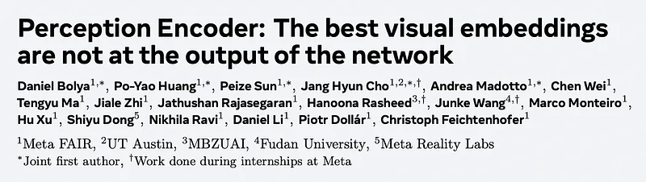 | Title card: Perception Encoder. |
| 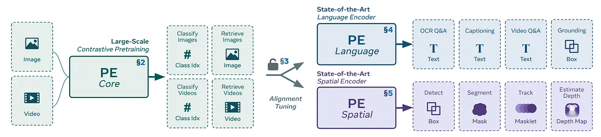 | Perception Encoder. |
| 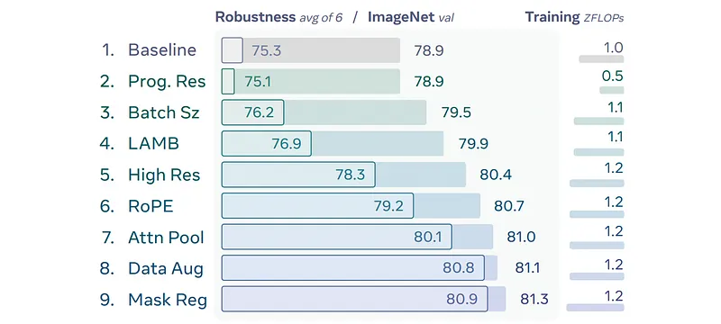 | Robust Image Pretraining. |
| 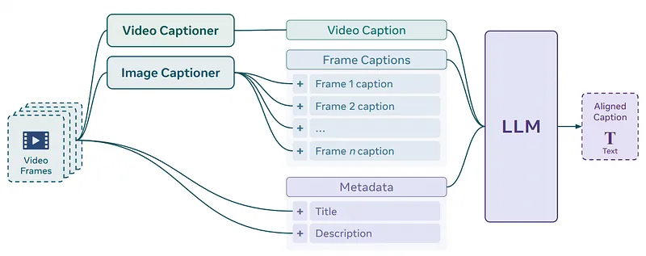 | Video Data Engine. |
|  | PE Model Configurations. |
| 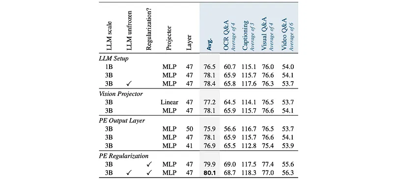 | Language Alignment. |
| 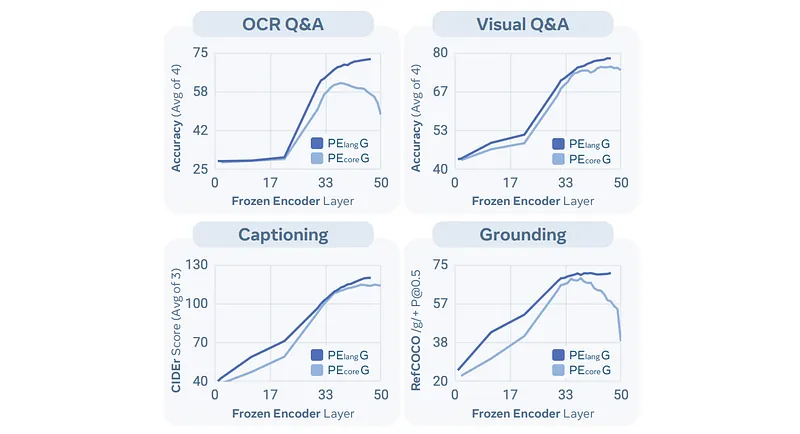 | Language Alignment. |
| 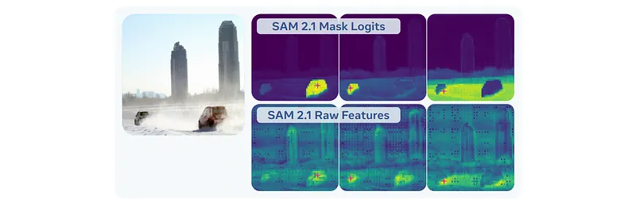 | SAM 2.1 Feature Similarity. |
| 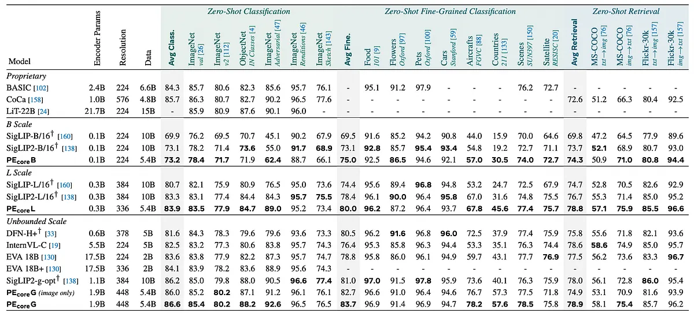 | Zero-Shot Image Results. |
| 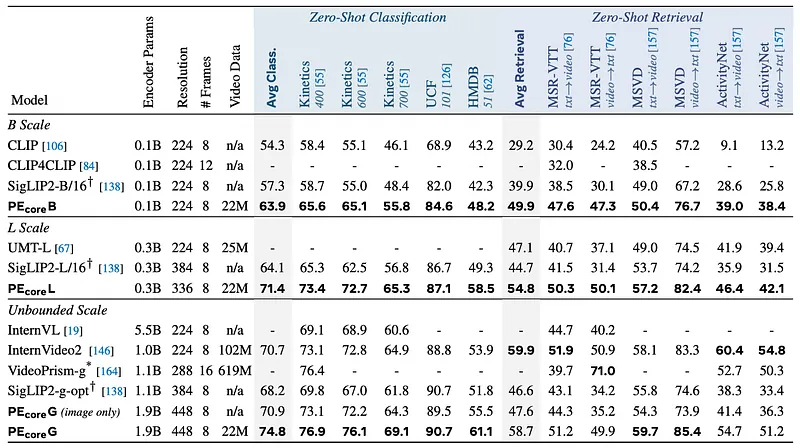 | Zero-Shot Video Results. |
| 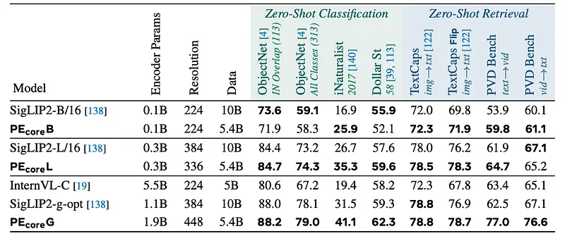 | Additional Zero-Shot Results. |
| 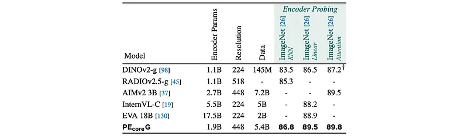 | Encoder Probing Results. |
| 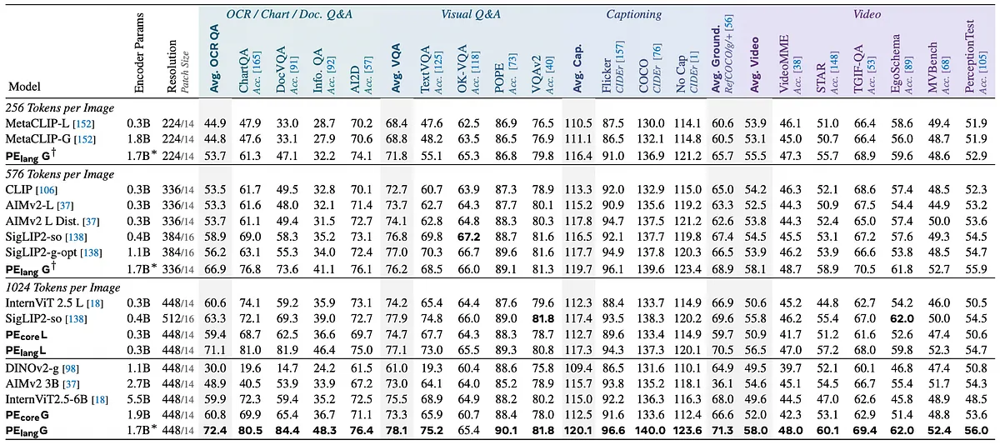 | MLLM Results with Llama 3.1 8B. |
| 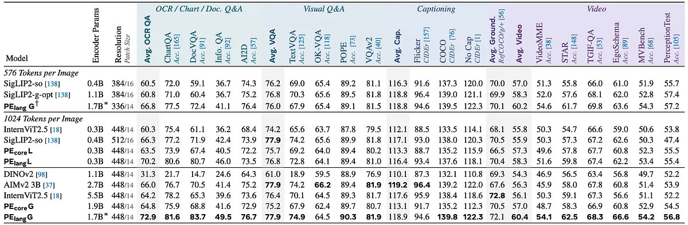 | MLLM Results with QwenLM 2.5 7B. |
| 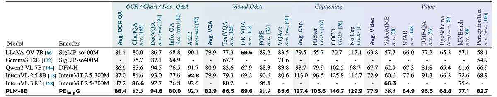 | MLLM System-Level Comparison. |
| 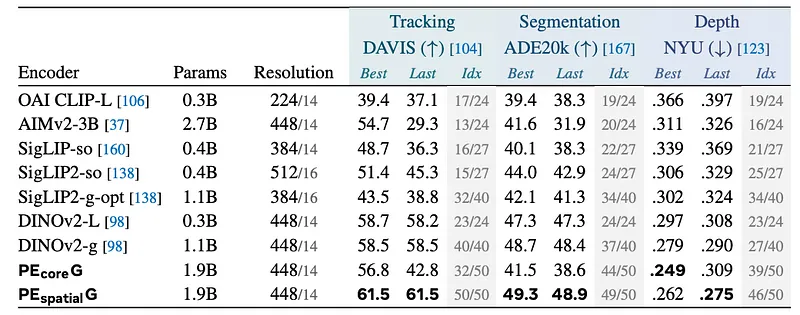 | Frozen Feature Dense Prediction. |
| 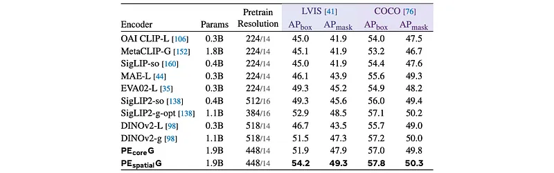 | End-to-End Finetuning Detection and Segmentation. |
|  | System-Level Comparison on Detection. |
## Related

- [[Papers Explained Corpus]]
- [[Model Compression and Efficiency]]
- [[Vision Language Models]]
- [[Synthetic Data]]
- [[Embedding and Retrieval]]
- [[Computer Vision]]
- [[Papers Explained 381 - KL Divergence VS MSE for Knowledge Distillation]]
- [[Papers Explained 384 - PerceptionLM]]

#summary #topic
