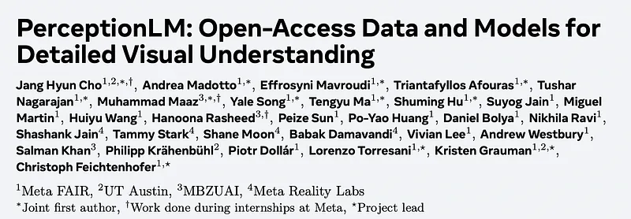
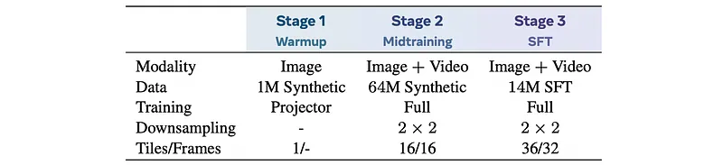
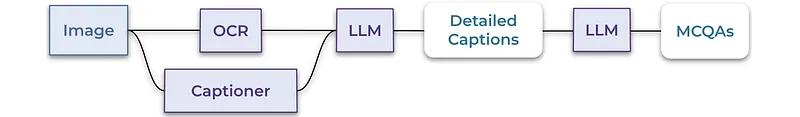
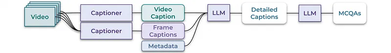
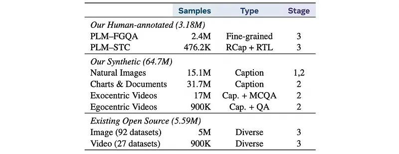
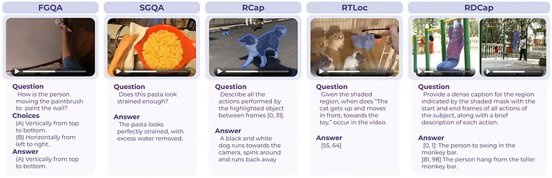
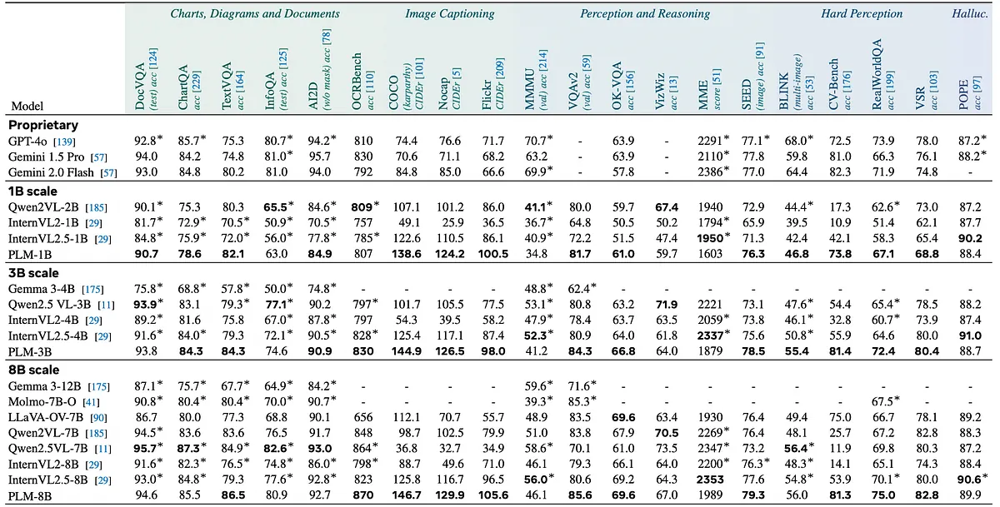
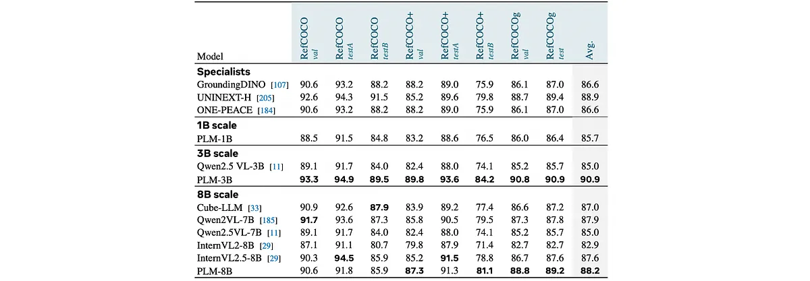
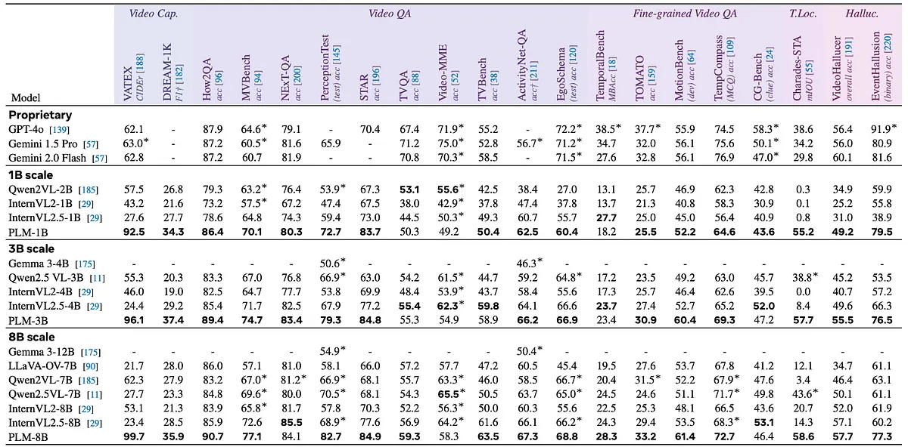
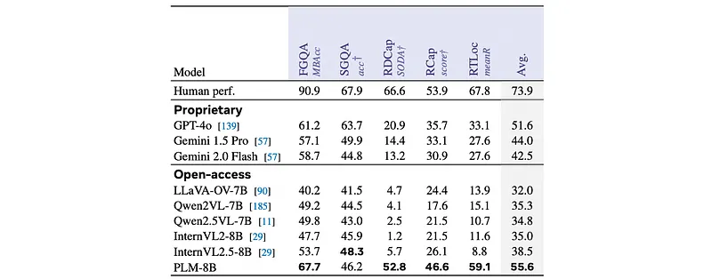

# Papers Explained 384 - PerceptionLM

Perception Language Model (PLM) is an open and reproducible framework for transparent research in image and video understanding, addressing the limitations of closed-source vision-language models (VLMs) and the issues associated with distillation from proprietary models.

This page ingests the source article into the wiki and connects it to [[Papers Explained Corpus]], [[Large Language Models]], [[Synthetic Data]], [[Vision Language Models]], [[Model Compression and Efficiency]], [[Document AI]], [[Model Distillation]], [[Supervised Fine-Tuning]].

## Source Metadata

- Source file: `raw/2025-06-10_Papers-Explained-384--PerceptionLM-15787f8950f6.md`
- Source title: Papers Explained 384: PerceptionLM
- Published: 2025-06-10
- Canonical: [https://medium.com/@ritvik19/papers-explained-384-perceptionlm-15787f8950f6](https://medium.com/@ritvik19/papers-explained-384-perceptionlm-15787f8950f6)

## Key Ideas

- Perception Language Model (PLM) is an open and reproducible framework for transparent research in image and video understanding, addressing the limitations of closed-source vision-language models (VLMs) and the issues associated with distillation from...
- The data used to train the PLM consists of synthetic and human-annotated samples. Synthetic data enhances the general capabilities of PLM, while human-annotated data broadens these capabilities to encompass more complex tasks.
- Projector warm-up. First, the vision encoder and LLM are frozen, and only the vision projector is trained on a small amount of synthetic image data. This warms up the newly initialized parameters in the projector and improves stability for later stages.
- Large-scale midtraining with synthetic data. Next, PLM is trained on diverse domains of images and videos at scale, using a maximum of 16 tiles for images and 16 frames for videos.
- Supervised finetuning with human-annotated data. Finally, PLM is trained with higher image resolutions and more video frames, using up to 36 tiles for images and 32 frames for videos.

## Notes

Perception Language Model (PLM) is an open and reproducible framework for transparent research in image and video understanding, addressing the limitations of closed-source vision-language models (VLMs) and the issues associated with distillation from proprietary models. This work also introduces PLM–VideoBench, a suite for evaluating challenging video understanding tasks, and provides data, training recipes, code, and models for full reproducibility.

### Model

PLM consists of a vision encoder and language decoder. The pre-trained vision encoder Perception Encoder (PE) is connected to the Llama 3 language decoder (1B, 3B, or 8B parameters) with a 2-layer MLP projector. PE L/14 is used for Llama3.2 1B and 3B, and PE G/14 for Llama3.1 8B. For image input, PLM incorporates dynamic tiling to support high resolution images for up to 36 tiles of 448x448 resolution, where each tile undergoes 2 × 2 average pooling to compress the visual tokens. For video input, PLM uses 32 frames at 448x448 resolution, where the same pooling is applied across the spatial dimensions of each video frame.

### Data

The data used to train the PLM consists of synthetic and human-annotated samples. Synthetic data enhances the general capabilities of PLM, while human-annotated data broadens these capabilities to encompass more complex tasks. Data engines are designed for each data modality (e.g., natural images, charts, documents, figures, egocentric and exocentric videos) to efficiently scale up, creating ∼64.7M samples.

### Training stages

*Figure: Summary of three training stages to train PLM.*

PLM is trained in three stages:

- Projector warm-up. First, the vision encoder and LLM are frozen, and only the vision projector is trained on a small amount of synthetic image data. This warms up the newly initialized parameters in the projector and improves stability for later stages. 1M SA-1B with image captions generated by the data engine are used.

- Large-scale midtraining with synthetic data. Next, PLM is trained on diverse domains of images and videos at scale, using a maximum of 16 tiles for images and 16 frames for videos. PLM sees around 64.7M images and videos with synthetically generated captions and question-answer pairs.

- Supervised finetuning with human-annotated data. Finally, PLM is trained with higher image resolutions and more video frames, using up to 36 tiles for images and 32 frames for videos. More challenging video tasks are tackled using the data collection and final data mix (20M total).

## Synthetic Data Generation and Scaling

The data engine is designed to target base capabilities of VLMs for image and video understanding. Different pipelines for images and videos are developed, and includes different levels of metadata to generate captions and QAs.

Image Captions: High-quality images are captioned using Llama 3.1V 90B. This pipeline is used to caption SA1B, Object365, and OpenImages.

OCR QAs: Pre-extracted OCR is leveraged and used as input for a LLM (i.e., Llama 3.3 70B) to generate a set of five question-answer pairs. This pipeline is used to generate QAs for PDFAcc, and UCSF.

Image Captioning plus QAs: In cases for which OCR does not provide enough information to create questions (e.g., scientific figures), the image is futher caption using Llama 3.1V 90B. Then the caption with auxiliary metadata (e.g., OCR) is passed to a LLM (i.e., Llama 3.3 70B) to generate question-answers pairs. This pipeline is used to generate captions and QAs for ArxivQA, DocVQA, InfoVQA and Ai2d.

Video Captioning plus QAs: An image captioner is run on key-frames of the video, as well as a video captioner on the overall video at 1 fps. The result captions are passed to a LLM (i.e., Llama 3.3 70B, or Llama 3 405B) with additional metadata (e.g., video title etc.), so to generate a detailed caption and a multiple-choices question answers pair. This pipeline is used to generate captions and QAs for YT-1B, Ego4d, DiDeMo, Charades, and Kinetics710.

## Human-annotated High Quality Data

*Figure: Summary of the data mix for training PLM.*

Two large-scale, human-annotated video datasets are introduced:

PLM-FGQA: This dataset is a large-scale, fine-grained video question answering dataset comprising 2.4M question-answer pairs. It focuses on “what” activities humans perform and “how” they perform them, capturing nuanced details through specially designed questions. The questions cover fine-grained recognition (action and object), fine-grained temporal perception (direction of movements, repetition counts, hand pose etc.), and fine-grained spatial understanding (object locations and spatial relationships). The data is collected using a multi-stage data engine involving video segment extraction, question and answer generation using LLMs, and human verification/refinement. The dataset spans over 780k unique video clips from diverse domains and viewpoints, making it significantly larger than existing video QA datasets and containing a large number of annotations about fine-grained details.

PLM-STC: This dataset is a spatio-temporal video captioning dataset containing 476.2K captions, offering detailed activity descriptions for each video. It includes timestamps (“when”) of each activity and focuses on specific subjects identified by a masklet (“where”), which is a segmentation mask applied to each frame of the video. The captions describe the activities performed by a subject (human, animal, or object) associated with a spatio-temporal segmentation mask. The data is collected using a two-stage annotation process involving object selection and mask generation/refinement, followed by temporally localized description writing. It is the first existing large-scale dense video-region captioning dataset.

### Supervised Finetuning with Human data

Data is converted into a supervised finetuning (SFT) format as follows:

- For PLM–FGQA, the model is provided with the video and question, and trained to generate the paired answer.

- For PLM–STC, spatio-temporal caption annotations are transformed into three distinct SFT tasks:

- Given a video and a masked region across the whole video, the model generates both the timestamps and corresponding captions that describe the object’s actions within those timestamps.

- Given a video, a masked region across the whole video, and a caption, the model generates the start and end timestamps corresponding to the caption.

- Given a video, a masked region across the whole video, and specific timestamps, the model generates the caption that describes the object’s actions during those timestamps.

These three tasks leverage the same underlying spatio-temporal data, but offer different ways to utilize it for SFT, allowing the model to learn a more comprehensive understanding of the video content.

## PLM–VideoBench

Existing video benchmarks are not adequately equipped to evaluate a broader range of capabilities for holistic video understanding. Towards this, PLM–VideoBench is introduced, a new and challenging video benchmark for detailed video understanding that comprehensively covers all these aspects. The benchmark includes:

*Figure: Overview of PLM–VideoBench tasks.*

- Fine-Grained Question Answering (FGQA): Answering multiple-choice questions that require nuanced understanding of fine-grained activities. Evaluated using multi-binary accuracy (MBAcc). The test set consists of 4,371 question-answer pairs.

- Smart Glasses Question Answering (SGQA): Answering open-ended questions about activities and objects in egocentric videos recorded with smart glasses. Evaluated using LLM-judge accuracy with Llama3.3 70B. The test set consists of 665 human-annotated question-answer pairs.

- Video Region Captioning (RCap): Generating detailed descriptions of events involving a subject of interest within a specified time interval and region. Evaluated using LLM-judge accuracy with Llama3.3 70B. The test set contains 10,060 human-annotated instances.

- Region Temporal Localization (RTLoc): Identifying the precise time interval when a specified event takes place for a given subject, given a video, region masklet, and text description. Evaluated using average recall@1 over IoU thresholds (0.3, 0.5, 0.7, 0.9). The test set size is 7,910 instances.

- Region Dense Video Captioning (RDCap): Generating a detailed description of all events involving a specific subject in a video, producing a sequence of (start, end, caption) tuples covering the entire video duration. Evaluated using SODA score. The test set contains 2,620 video instances.

## Evaluation

### Image Benchmark Results

*Figure: Image benchmark results.*

- PLM achieves competitive performance across all benchmarks compared to baselines.

- PLM outperforms existing state-of-the-art models on image captioning tasks and hard perception benchmarks.

- PLM performs on-par with state-of-the-art models (Qwen2.5 VL, GPT-4o, Gemini 2.0 Flash) on charts, diagrams, and documents understanding tasks.

- PLM demonstrates strong performance on a wide spectrum of image benchmarks using only open-access data.

- Strong performance on hard perception tasks highlights the importance of a strong pre-trained vision encoder.

*Figure: Image Grounding results on RefCOCO/+/g.*

- PLM outperforms specialist models and VLM baselines on Image Grounding tasks (RefCOCO/+/g datasets).

- PLM-3B largely outperforms across all model scales with the overal average score of 90.9 % on RefCOCO/+/g benchmark.

- Strong performance on Image Grounding tasks is attributed to the strong pre-trained vision encoder.

### Video Benchmark Results

*Figure: Video benchmark results on general video understanding benchmarks.*

- PLM achieved strong results on widely adopted benchmarks, including state-of-the-art performance on PerceptionTest (82.7 %), MVBench (77.1 %), TVBench (63.5 %), and ActivityNet-QA (67.3 %). It also demonstrated competitive performance on challenging benchmarks like EgoSchema, MotionBench, TOMATO, TempCompass, TemporalBench, and Charades-STA.

- PLM models at all scales outperformed existing approaches on captioning tasks and hallucination detection tasks.

- PLM exhibits strong performance across all model scales on a variety of video understanding tasks, particularly in captioning and hallucination detection, and achieves competitive or state-of-the-art results on several benchmarks compared to both open-access and proprietary models.

### PLM-VideoBench Results

*Figure: PLM-VideoBench results.*

- The PLM shows a significant performance gap compared to the baselines on FGQA tasks.

- On SGQA, the PLM performs reasonably well, but is slightly behind the best open-access model (InternVL2.5) and significantly behind the best proprietary model (GPT-4o).

- On spatio-temporal tasks (RDCap, DCap, RTLoc), open-source baselines struggle with grounded reasoning. Proprietary models perform better, but still fall short of human performance.

- Overall, the PLM demonstrates competitive performance across all sub-tasks of PLM-VideoBench compared to both proprietary and open-access baselines.

## Paper

PerceptionLM: Open-Access Data and Models for Detailed Visual Understanding [2504.13180](https://arxiv.org/abs/2504.13180)

## Figures

Figures from the Medium HTML export (`raw/2025-06-10_Papers-Explained-384--PerceptionLM-15787f8950f6.md`); local copies under `wiki/assets/papers-explained-384-perceptionlm/` when download succeeded.

| Figure | Caption |
|--------|---------|
|  | Title card: PerceptionLM. |
|  | Summary of three training stages to train PLM. |
|  | The data engine is designed to target base capabilities of VLMs for image and video understanding. |
|  | Image Captions: High-quality images are captioned using Llama 3.1V 90B. |
|  | OCR QAs: Pre-extracted OCR is leveraged and used as input for a LLM (i.e., Llama 3.3 70B) to generate a set of five question-answer pairs. |
|  | PLM is trained in three stages. |
|  | Summary of the data mix for training PLM. |
|  | Overview of PLM–VideoBench tasks. |
|  | Image benchmark results. |
|  | Image Grounding results on RefCOCO/+/g. |
|  | Video benchmark results on general video understanding benchmarks. |
|  | PLM-VideoBench results. |
## Related

- [[Papers Explained Corpus]]
- [[Large Language Models]]
- [[Synthetic Data]]
- [[Vision Language Models]]
- [[Model Compression and Efficiency]]
- [[Document AI]]
- [[Model Distillation]]
- [[Supervised Fine-Tuning]]
- [[Papers Explained 383 - Perception Encoder]]
- [[Papers Explained 385 - J1]]

#summary #topic
