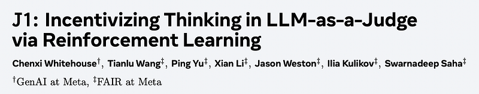
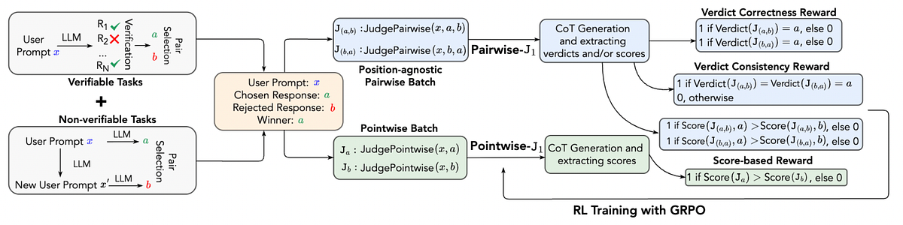
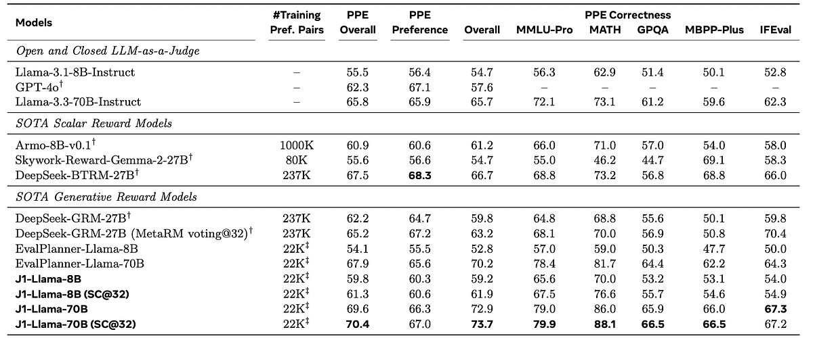
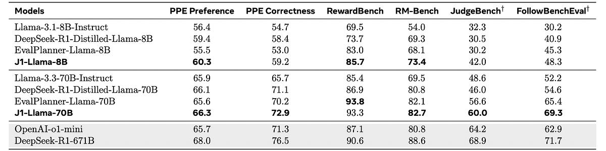
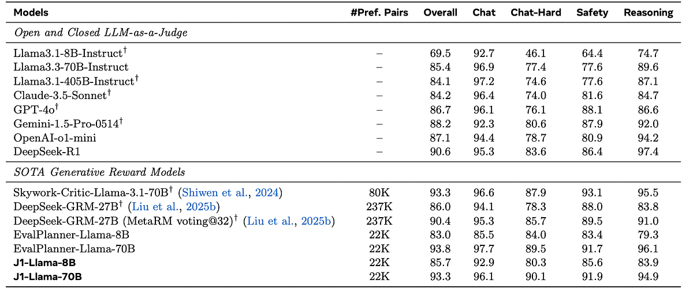
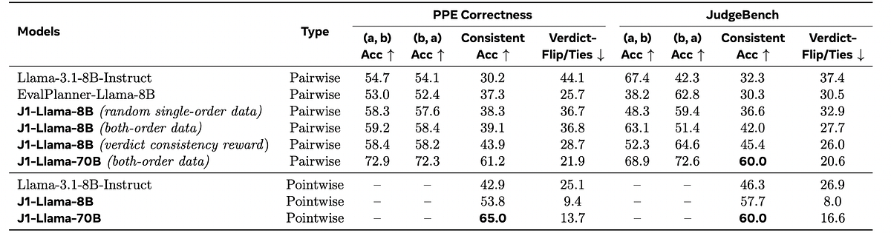
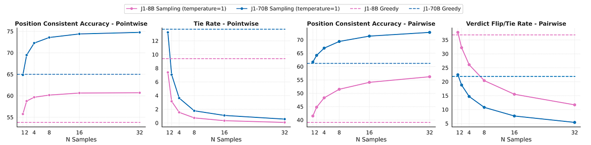
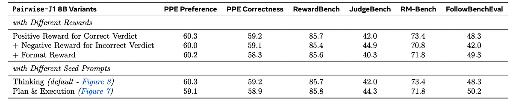
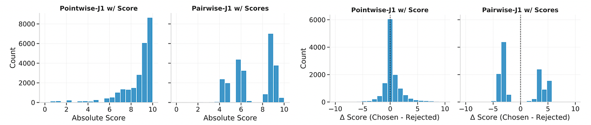
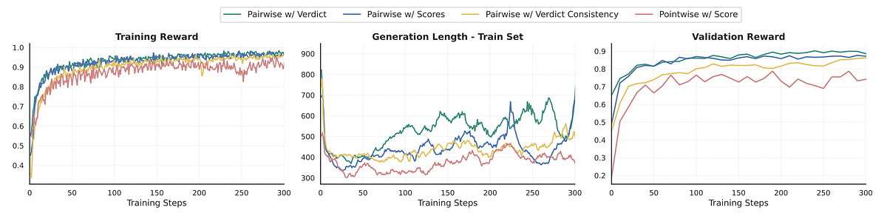

# Papers Explained 385 - J1

J1 is a reinforcement learning approach for training LLM-as-a-Judge models that converts both verifiable and non-verifiable prompts into judgment tasks with verifiable rewards to incentivize thinking and mitigate judgment bias.

This page ingests the source article into the wiki and connects it to [[Papers Explained Corpus]], [[Reinforcement Learning Topic]], [[Evaluation and Benchmarks]], [[Reasoning Models]], [[Large Language Models]], [[Synthetic Data]], [[Reinforcement Learning]], [[Verifier-Bounded Learning]].

## Source Metadata

- Source file: `raw/2025-06-11_Papers-Explained-385--J1-8245b6ee64df.html`
- Source title: Papers Explained 385: J1
- Published: 2025-06-11
- Canonical: [https://medium.com/@ritvik19/papers-explained-385-j1-8245b6ee64df](https://medium.com/@ritvik19/papers-explained-385-j1-8245b6ee64df)

## Key Ideas

- The primary evaluation setting is pairwise. An LLM judge takes an instruction x and a pair of model responses a, b as input and generates a preference judgment y, indicating the better response.
- Pairwise LLM judges frequently suffer from a phenomenon called position bias, wherein the verdict changes if the order of the responses is swapped.
- A rule-based reward system consisting of two main types of rewards is adopted.
- Verdict Correctness Reward. J1’s primary reward is based on the accuracy of the final verdict. If a judge correctly predicts the better response, it receives a reward of 1 and 0, otherwise.
- Verdict Consistency Reward. To further encourage consistent reasoning and judgment, a verdict (positional) consistency reward is introduced.

## Notes

J1 is a reinforcement learning approach for training LLM-as-a-Judge models that converts both verifiable and non-verifiable prompts into judgment tasks with verifiable rewards to incentivize thinking and mitigate judgment bias. The method constructs synthetic data with high and low-quality responses for both types of prompts and trains the reasoning steps and judgment using the Group Relative Policy Optimization Algorithm (GRPO).

## Method

*Figure: Reinforcement Learning recipes for training Pairwise-J1 and Pointwise-J1 models.*

The primary evaluation setting is pairwise. An LLM judge takes an instruction x and a pair of model responses a, b as input and generates a preference judgment y, indicating the better response. The judge is conditioned on a seed thinking prompt and generates intermediate thought tokens t, before deriving the final verdict.

### Synthetic Training Data Generation

The goal of J1 is to train a generalist judge that can evaluate LLM responses for both verifiable and non-verifiable tasks. J1’s final 22K training data consists of 17K WildChat and 5K MATH prompts, along with their corresponding preference pairs. For WildChat, rejected responses are obtained by prompting an LLM to first generate a “noisy” variant of the original instruction and then produce a response to this noisy instruction. For MATH, rejected responses are sampled from generations by an LLM that do not lead to the gold answer. Given these preference pairs, the evaluation task is converted into a verifiable task (i.e., predicting the better response), enabling the use of RL with verifiable rewards.

Pairwise LLM judges frequently suffer from a phenomenon called position bias, wherein the verdict changes if the order of the responses is swapped. To mitigate this issue, training data is constructed with both orders of response pairs — (x, a, b) and (x, b, a). Crucially, position-agnostic batches of training data are constructed; i.e., for the same input, both orders of responses are processed in one batch.

### Reward Modeling

A rule-based reward system consisting of two main types of rewards is adopted.

- Verdict Correctness Reward. J1’s primary reward is based on the accuracy of the final verdict. If a judge correctly predicts the better response, it receives a reward of 1 and 0, otherwise.

- Verdict Consistency Reward. To further encourage consistent reasoning and judgment, a verdict (positional) consistency reward is introduced. In particular, a reward of 1 is only assigned when the model produces correct judgments for both input orders of the same response pair (i.e., (x, a, b) and (x, b, a)).

Similar to DeepSeek-R1, experiments are also conducted with format rewards to ensure that the thought tokens are enclosed in “<think>” and “</think>” tags, but do not observe noticeable improvements.

### J1 Recipe and Models

J1 jointly optimizes thoughts and judgments using GRPO, which makes RL training more efficient by removing the dependency on a separate critic model and instead estimating the baseline from group scores.

Pairwise LLM-as-a-Judge with Verdict (PaV): The primary recipe, J1PaV : promptPaV(x, a, b) → (t, y), receives a user question and a response pair, and generates thought tokens and the preferred response (as the final verdict). Using this recipe, two models, J1-Llama-8B and J1-Llama-70B, are developed, starting from Llama-3.1–8B-Instruct and Llama-3.3–70B-Instruct, respectively.

```text
You are given a user question and two responses from two AI assistants.
Your task is to act as an impartial judge and evaluate which response better follows the user's instructions and provides a higher-quality answer.
First, provide your reasoning within <think> and </think> tags.
This should include your evaluation criteria for a high-quality response, a detailed comparison of the two responses, and when helpful, a reference answer as part of your evaluation.
Be explicit in your thought process, referencing your criteria and explaining how each response aligns with or deviates from them.
Avoid any position biases and ensure that the order in which the responses were presented does not influence your decision.
Do not allow the length of the responses to influence your evaluation.
Do not favor certain names of the assistants.
Be as objective as possible.
Finally, provide your verdict within <answer> and </answer> tags, strictly following this format:
- <answer> \[\[A\]\] </answer> if Assistant A is better
- <answer> \[\[B\]\] </answer> if Assistant B is better
Below are the user's question and the two responses:
[User Question]
{instruction}
[The Start of Assistant A's Answer]
{response A}
[The End of Assistant A's Answer]
[The Start of Assistant B's Answer]
{response B}
[The End of Assistant B's Answer]
```

Pairwise LLM-as-a-Judge with Scores (PaS): Instead of directly generating a verdict, the pairwise score-based variant J1PaS : promptPaS(x, a, b) → (t, sa, sb), generates real-valued scores sa, sb for response a and b, respectively. The response that obtains the higher score is chosen as the final verdict. To train a model with this recipe, a binary reward is assigned depending on whether the predicted scores are consistent with the gold verdict.

```text
You are given a user question and two responses from two AI assistants.
Your task is to act as an impartial judge and evaluate which response better follows the user's instructions and provides a higher-quality answer.
First, provide your reasoning within <think> and </think> tags.
This should include your evaluation criteria for a high-quality response, a detailed comparison of the two responses, and when helpful, a reference answer as part of your evaluation.
Be explicit in your thought process, referencing your criteria and explaining how each response aligns with or deviates from them.
Avoid any position biases and ensure that the order in which the responses were presented does not influence your decision.
Do not allow the length of the responses to influence your evaluation.
Do not favor certain names of the assistants. Be as objective as possible.
Finally, assign the assistant's response a score from 0 to 10, using either an integer or a decimal with up to 0.1 precision, with a higher score indicating a higher-quality response that better satisfies the criteria.
Enclose the scores within the tags <score_A> </score_A>, and <score_B> </score_B>.
Format your output like this:
<think> your_thinking_process </think>
<score_A> your_score_a </score_A> <score_B> your_score_b </score_B>
Below are the user's question and the two responses:
[User Question]
{instruction}
[The Start of Assistant A's Answer]
{response A}
[The End of Assistant A's Answer]
[The Start of Assistant B's Answer]
{response B}
[The End of Assistant B's Answer]
```

Pairwise LLM-as-a-Judge with Scores&Verdict (PaVS): In this pairwise variant J1PaVS, promptPaVS (x, a, b) → (t,sa,sb,y), the model generates scores for both responses as well as the final verdict, where the generated scores are interpreted as observations of unknown latent variables to help with the pairwise judgment task. Consequently, y is directly used as the final verdict. The reward is also computed using only the final verdict (and not the intermediate scores).

```text
You are given a user question and two responses from two AI assistants.
Your task is to act as an impartial judge and evaluate which response better follows the user's instructions and provides a higher-quality answer.
First, provide your reasoning within <think> and </think> tags.
This should include your evaluation criteria for a high-quality response, a detailed comparison of the two responses, and when helpful, a reference answer as part of your evaluation.
Be explicit in your thought process, referencing your criteria and explaining how each response aligns with or deviates from them.
Avoid any position biases and ensure that the order in which the responses were presented does not influence your decision.
Do not allow the length of the responses to influence your evaluation.
Do not favor certain names of the assistants.
Be as objective as possible.
Finally, assign the assistant's response a score from 0 to 10, using either an integer or a decimal with up to 0.1 precision, with a higher score indicating a higher-quality response that better satisfies the criteria.
Enclose the scores within the tags <score_A> </score_A>, and <score_B> </score_B>.
Finally, provide your verdict within <answer> and </answer> tags, strictly following this format:
- <answer> \[\[A\]\] </answer> if Assistant A is better
- <answer> \[\[B\]\] </answer> if Assistant B is better
Below are the user's question and the two responses:
[User Question]
{instruction}
[The Start of Assistant A's Answer]
{response A}
[The End of Assistant A's Answer]
[The Start of Assistant B's Answer]
{response B}
[The End of Assistant B's Answer]
```

Pointwise LLM-as-a-Judge (PoS): A pointwise judge, J1PoS : promptPoS(x, a) → (t, s), is introduced. This judge takes an instruction x and a single response a as input, and outputs a score s that reflects the quality or reward of the response. Unlike pairwise judges, pointwise judges are inherently consistent. J1PoS is trained via distant supervision with the same pairwise training data as used for all pairwise variants. Each preference pair is split into two separate pointwise samples and the model is trained with a seed thinking prompt that assigns a score between 0 and 10 to a given response. Both scores are evaluated jointly, and the model receives a reward of 1 if the scores are consistent with the gold verdict.

```text
You are given a user question and a response from an AI assistant.
Your task is to act as an impartial judge and evaluate how well the response fulfills the user's instructions.
You will be shown multiple responses to the same prompt, but only one at a time.
Evaluate each response independently.
Think carefully about how to assess the quality of the response, and enclose your reasoning within <think> and </think> tags.
Your reasoning should include your evaluation criteria, a clear understanding of what an ideal response would look like for this particular question, and a concrete example of such an ideal or reference answer if possible.
Then compare the assistant's response to your ideal or reference answer, explaining how it aligns with or deviates from your expectations.
Be specific and avoid vague or overly general judgments.
Remain as objective as possible.
Finally, assign the assistant's response a score from 0 to 10, using either an integer or a decimal with up to 0.1 precision.
A higher score should indicate a higher-quality response. Enclose the score within <score> and </score> tags.
Format your output like this:
<think> your_thinking_process </think>
<score> your_score </score>
Below are the user's question and the assistant's response:
[User Question]
{instruction}
[The Start of the Assistant's Answer]
{response}
[The End of the Assistant's Answer]
```

All variants are trained on the same 22K synthetic preference pairs

## Evaluation

### Main Results on Benchmarks with Pairwise-J1

*Figure: Results on PPE.*

*Figure: Results on five reward modeling benchmarks.*

- J1-Llama-70B achieved an overall accuracy of 69.6 on the PPE benchmark, outperforming previous methods. It also outperformed EvalPlanner and DeepSeek-GRM on other benchmarks. J1-Llama-8B was competitive with Armo-8B and outperformed EvalPlanner-8B and Skywork-Reward-Gemma-2–27B. Test-time scaling with self-consistency further improved performance.

*Figure: Results on RewardBench.*

- J1’s training methodology and use of online RL (GRPO), along with high-quality synthetic preference pairs, contribute to its effectiveness. J1 shows strong results on the PPE Correctness subset, highlighting its utility for Best-of-N alignment. J1 outperforms DeepSeek-R1-Distilled-Llama across all benchmarks, demonstrating its superiority even with the same base models. J1 is a generalist judge suitable for evaluating responses to both verifiable and non-verifiable prompt tasks.

### Ablations and Analyses of Pairwise-J1 and Pointwise-J1

Pairwise-J1 vs Pointwise-J1

*Figure: Results on PPE Correctness and JudgeBench.*

- Pointwise-J1 outperforms Pairwise-J1 in position-consistent accuracy and has a lower fraction of ties.

- Pairwise-J1 models still suffer from significant inconsistencies, whereas Pointwise-J1 models show improved consistency, especially when scaled up to 70B.

Effect of Test-time Scaling

*Figure: Test-time scaling of Pairwise-J1 and Pointwise-J1 on the PPE Correctness benchmark.*

- Both Pairwise- and Pointwise-J1 models show improved position-consistent accuracy and reduced ties with increased number of generations.

Effect of Reward Schemes and Seed Prompts

*Figure: Results of Pairwise-J1 models trained with different reward schemes and seed prompts.*

- Best results for Pairwise-J1 are obtained with positive rewards for correct verdicts; additional rewards for format or negative rewards for incorrect verdicts degrade performance.

- J1 models perform comparably with different seed prompts, with the simpler Thinking prompt generating richer reasoning traces.

Score Distribution

*Figure: Distribution of Absolute Scores and ∆Score (Chosen − Rejected) generated by the 8B Pairwise-J1 (w/ Scores) and Pointwise-J1 models on the PPE Correctness benchmark.*

- Pairwise-J1 exhibits a sparser score distribution and larger score differences between chosen and rejected responses compared to Pointwise-J1.

Reward and Thought Length Analysis

*Figure: Reward and average generation length during training for different J1-Llama-8B models.*

- Pairwise judges converge at around 500 tokens in thought length, while pointwise judges generate shorter outputs (300–400 tokens).

- Training rewards for pairwise variants show a steady increase before converging.

## Paper

J1: Incentivizing Thinking in LLM-as-a-Judge via Reinforcement Learning [2505.10320](https://arxiv.org/abs/2505.10320)

## Figures

Figures from the Medium HTML export (`raw/2025-06-11_Papers-Explained-385--J1-8245b6ee64df.html`); local copies under `wiki/assets/papers-explained-385-j1/` when download succeeded.

| Figure | Caption |
|--------|---------|
|  | Title card: J1. |
|  | Reinforcement Learning recipes for training Pairwise-J1 and Pointwise-J1 models. |
|  | Results on PPE. |
|  | Results on five reward modeling benchmarks. |
|  | Results on RewardBench. |
|  | Results on PPE Correctness and JudgeBench. |
|  | Test-time scaling of Pairwise-J1 and Pointwise-J1 on the PPE Correctness benchmark. |
|  | Results of Pairwise-J1 models trained with different reward schemes and seed prompts. |
|  | Distribution of Absolute Scores and ∆Score (Chosen − Rejected) generated by the 8B Pairwise-J1 (w/ Scores) and Pointwise-J1 models on the PPE Correctness benchmark. |
|  | Reward and average generation length during training for different J1-Llama-8B models. |
## Related

- [[Papers Explained Corpus]]
- [[Reinforcement Learning Topic]]
- [[Evaluation and Benchmarks]]
- [[Reasoning Models]]
- [[Large Language Models]]
- [[Synthetic Data]]
- [[Reinforcement Learning]]
- [[Verifier-Bounded Learning]]
- [[Papers Explained 384 - PerceptionLM]]
- [[Papers Explained 386 - ProRL]]

#summary #topic
