# Papers Explained 386 - ProRL

This work challenges the idea that RL only amplifies existing outputs and demonstrates that prolonged RL training (ProRL) can uncover novel reasoning strategies not accessible to base models. The ProRL methodology incorporates KL divergence control, reference policy resetting, and a diverse suite of tasks.

This page ingests the source article into the wiki and connects it to [[Papers Explained Corpus]], [[Reinforcement Learning Topic]], [[Safety and Alignment]], [[Reasoning Models]], [[Vision Language Models]], [[Reinforcement Learning]], [[KL Regularization]].

## Source Metadata

- Source file: `raw/2025-06-12_Papers-Explained-386--ProRL-261c9ac00bc7.md`
- Source title: Papers Explained 386: ProRL
- Published: 2025-06-12
- Canonical: [https://medium.com/@ritvik19/papers-explained-386-prorl-261c9ac00bc7](https://medium.com/@ritvik19/papers-explained-386-prorl-261c9ac00bc7)

## Key Ideas

- This work challenges the idea that RL only amplifies existing outputs and demonstrates that prolonged RL training (ProRL) can uncover novel reasoning strategies not accessible to base models.
- Group Relative Policy Optimization (GRPO) is adopted as the core RL algorithm. Compared with Proximal Policy Optimization (PPO), it removes the value model and instead uses baseline estimates based on group scores.
- τ is the response sampled from the current policy πθ.
- rθ(τ) =πθ(τ) / πold(τ) is the probability ratio between the current policy and old policy before each actor update.
- The advantage used in GRPO foregoes the critic model of PPO, and instead estimates baseline from group scores {Ri}

## Notes

This work challenges the idea that RL only amplifies existing outputs and demonstrates that prolonged RL training (ProRL) can uncover novel reasoning strategies not accessible to base models. The ProRL methodology incorporates KL divergence control, reference policy resetting, and a diverse suite of tasks.

## ProRL: Prolonged Reinforcement Learning

Group Relative Policy Optimization (GRPO) is adopted as the core RL algorithm. Compared with Proximal Policy Optimization (PPO), it removes the value model and instead uses baseline estimates based on group scores. Formally, the GRPO maximizes the following objective:

where:

- τ is the response sampled from the current policy πθ.

- rθ(τ) =πθ(τ) / πold(τ) is the probability ratio between the current policy and old policy before each actor update.

The advantage used in GRPO foregoes the critic model of PPO, and instead estimates baseline from group scores {Ri}

### Mitigating Entropy Collapse

A key challenge in prolonged policy optimization is entropy collapse, a phenomenon where the model’s output distribution becomes overly peaked early in training, resulting in sharply reduced entropy. When entropy collapses, the policy prematurely commits to a narrow set of outputs, severely limiting exploration. This is particularly detrimental in methods like GRPO, where the learning signal depends on having a diverse set of sampled outputs to effectively estimate relative advantages. Without sufficient exploration, policy updates become biased, leading to stagnation in training. A common mitigation strategy is to increase the sampling temperature during rollouts. However, this approach only delays the onset of entropy collapse rather than preventing it altogether, as entropy continues to decline steadily as training progresses. Nonetheless, a high rollout temperature is employed.

### Decoupled Clip and Dynamic Sampling Policy Optimization (DAPO)

To address entropy collapse, several components from the DAPO algorithm are adopted, which are specifically designed to maintain exploration and output diversity. First, DAPO introduces decoupled clipping, where the lower and upper clipping bounds in the PPO objective are treated as separate hyper-parameters.

By setting a higher value for ϵhigh, the algorithm promotes ‘clip-higher’, uplifting the probabilities of previously unlikely tokens and encouraging broader exploration. This modification helps retain entropy and reduces premature mode collapse.

Additionally, DAPO employs dynamic sampling, filtering out prompts for which the model consistently succeeds or fails (i.e., accuracy 1 or 0), as these provide no learning signal. This focus on intermediate difficulty examples further helps maintain a diverse learning signal during training.

### KL Regularization and Reference Policy Reset

While DAPO and temperature adjustment help slow entropy collapse, explicit regularization via a KL divergence penalty provides a stronger and more stable solution. Specifically, a KL penalty is incorporated between the current policy πθ and a reference policy πref.

This penalty not only helps maintain entropy but also serves as a regularizer to prevent the online policy from drifting too far from a stable reference, stabilizing learning and mitigating overfitting to spurious reward signals.

Recent works have argued for the removal of the KL penalty, citing that models naturally diverge during training on chain-of-thought reasoning tasks. This perspective often applies to base models prior to any supervised fine-tuning. In contrast, beginning from a well-initialized checkpoint already capable of generating coherent CoT outputs, retaining a KL penalty is still beneficial for both stability and sustained entropy.

As training progresses, the KL term may increasingly dominate the loss, leading to diminishing policy updates. To alleviate this, a simple yet effective technique is introduced: reference policy reset. Periodically, the reference policy πref is hard-reset to a more recent snapshot of the online policy πθ, and the optimizer states are reinitialized. This allows the model to continue improving while maintaining the benefits of KL regularization. This reset strategy is applied throughout training to avoid premature convergence and encourage prolonged training.

## Nemotron-Research-Reasoning-Qwen-1.5B

Nemotron-Research-Reasoning-Qwen-1.5B is a generalist model trained via reinforcement learning DeepSeek-R1-Distill-Qwen-1.5B on a diverse, verifiable dataset of 136K problems across math, code, STEM, logic puzzles, and instruction following.

### Training Dataset

The training dataset encompasses a wide range of tasks designed to provide verifiable reward signals. These tasks span from traditional reasoning domains like mathematical problem solving and code generation to more complex and open-ended domains, including STEM-related problem solving, logical puzzles, and instruction following.

Math:

- Utilizes high-quality, community-curated datasets from DeepScaleR.

- Consists of 40K math problems from national and international math competitions.

- Employs DeepScaleR’s original verifier, augmented with an improved math-verify4.

- Uses a binary reward signal (1 for correct, 0 for incorrect or improperly formatted answers).

- LLM’s answers are obtained by prompting the model with Let’s think step by step and output the final answer within \boxed{}.

Code:

- Utilizes publicly available reinforcement learning datasets comprising 24K coding problems from programming competitions.

- Improves code execution environment to run all test cases rather than terminating on the first error and assign rewards based on the fraction of test cases passed to support continuous reward feedback.

- Submissions that fail to compile, contain syntax errors, or exceed a 5 second total timeout are assigned a reward of zero.

- Instructions for the LLM to enclose its final code response with triple backticks.

STEM:

- Uses SCP-116K, a large-scale dataset containing 274k scientific problem-solution pairs.

- Covers diverse fields such as physics, chemistry, biology, and mathematics.

- Each problem is accompanied by a corresponding solution extracted from the original source text, along with model-generated responses and reasoning paths produced by DeepSeek-R1.

- Rigorous data filtering was applied, including removing problems lacking a retrievable ground-truth solution and using GPT-4o to assess the alignment of DeepSeek-R1 responses with the ground-truth answer, reducing the dataset to 25K.

Logical Puzzles (Reasoning Gym):

- Utilizes the Reasoning Gym project, which offers approximately 100 tasks across various domains.

- Domains include algebra, arithmetic, computation, cognition, geometry, graph theory, logic, and popular games.

- Consists of 37K synthetic training samples and 9600 validation samples, spanning 96 tasks.

- Employs the verifier provided by the Reasoning Gym repository for both model evaluation and reinforcement learning training signals.

- Uses recommended default prompts which instruct models to enclose answers between <answer> </answer> tags.

Instruction Following:

- Leverages synthetic generated data from Llama-Nemotron, similar to IFEval.

- Contains synthetic prompts that pair tasks with randomly chosen instructions.

- The dataset contains synthetic prompts that pair tasks with randomly chosen instructions.

- The model’s response is obtained after thinking (</think> token).

### Training Recipe

Verl is used for reinforcement learning training. Enhancements of GRPO proposed by DAPO are adopted, decoupling clipping hyperparameters with ϵlow = 0.2, ϵhigh = 0.4, and dynamic sampling for filtering prompts that are too easy or difficult (with accuracy equal to 1 and 0). For rollout, n=16 responses are sampled for each prompt with a context window limit of 8096 and a high sampling temperature of 1.2 is used.

Validation Monitoring: A validation data blend is used to monitor training progress, including subsets from AIME2024, Codeforces, GPQA-diamond, IFEval, and the logic puzzle graph_color from Reasoning Gym.

Reference Model and Optimizer Reset: Hard resets of the reference model and optimizer are performed when validation metrics degrade or plateau. These resets also allow for adjustments to hyperparameters and the introduction of new training data and reward shaping.

*Figure: KL divergence across training runs.*

Run 1:

- Instruction-following data is not included initially.

- Response length is limited to 8k tokens (base model’s sequence length is 128k).

- Instability and degradation in validation performance are observed toward the end.

Run 2:

- A hard reset of the reference policy is performed.

- Training resumes with the same setup as Run 1.

- The maximum response length remains at 8k.

Run 3:

- Instruction-following data is incorporated into the training mix.

- Training continues until a sudden increase in response length is observed, due to the model repeating answers and failing to terminate with an <eos> token.

Run 4 and 5:

- Reward shaping is introduced by penalizing responses that do not terminate correctly.

- This encourages proper generation behavior, resulting in a modest reduction in response length.

Runs 6 and 7:

- The rollout count is increased from 16 to 32.

- Two hard resets are performed.

- Response length begins to rise again alongside improvements in validation metrics.

Run 8:

- The context window is extended to 16k tokens, and the rollout count is reduced to 16.

- The model quickly adapts to the extended context window.

- Marginal improvements are observed in hard math tasks like AIME, with more substantial gains in other domains.

## Evaluation

*Figure: Performance (pass@1) comparison for benchmarks across Math domain.*

- The Nemotron-Research-Reasoning-Qwen-1.5B model consistently outperformed the base model (DeepSeek-R1-Distill-Qwen-1.5B) in the math domain, with an average improvement of 15.7%.

*Figure: Performance (pass@1) comparison across benchmarks for Code.*

- The model surpassed the base model in competitive programming tasks, achieving a 14.4% improvement in pass@1 accuracy.

- The model showed substantial gains in STEM reasoning and instruction following, with improvements of 25.9% on GPQA Diamond and 22.0% on IFEval.

- The model achieved high accuracy on Reasoning Gym logic puzzles, improving reward by 54.8%.

- The model demonstrated comparable or better performance than a much larger model (DeepSeek-R1-Distill-Qwen-7B) across multiple domains.

*Figure: Performance comparison on STEM reasoning (GPQA Diamond), instruction following (IFEval), and logic puzzles (Reasoning Gym) tasks.*

- The model showed significant improvements on out-of-distribution (OOD) tasks in Reasoning Gym, demonstrating stronger generalization.

- The model achieved superior pass@1 scores on both math (+4.6%) and code (+6.5%) benchmarks compared to domain-specialized models (DeepScaleR-1.5B and DeepCoder-1.5B).

## ProRL V2

ProRLv2 is the updated iteration of the ProRL regime, designed to test the effects of extended RL training on LLMs, pushing beyond typical training schedules with advanced algorithms, regularization, and domain coverage.

At ProRL’s core is the clipped PPO loss, which stabilizes policy updates by restricting how much the new policy can diverge from the old ones:

A higher upper bound of PPO’s clipping range is used to mitigate policy entropy collapse and promote sampling diversity

Prompts with group responses with all 1 (fully correct) or 0 (fully incorrect) rewards to are discarded reduce noise in gradient estimates.

To promote concise, token-efficient outputs, a scheduled cosine penalty is applied:

The length reward is incorporated into the total reward:

The penalty cycles on and off at regular intervals (e.g., 100 updates on, 500 off) to balance informativeness and conciseness.

A KL penalty is used to keep the policy close to a reference policy, preventing large, unstable updates.

KL divergence in REINFORCE++-baseline is regularized using a k_2 estimator:

where the function clamp(z, -10, 10) limits z to the range [-10, 10] to improve the value stability.

To prevent overfitting and ensure stability, the reference policy (πrefπref) is periodically reset every 200–500 RL steps, or upon detection of KL spikes or stalled validation performance.

The optimizer state is not cleared during these resets. This allows the model to avoid being constrained by outdated guidance and continue learning effectively.

### Evaluation

ProRL was evaluated across math, code generation, and diverse reasoning gym benchmarks. Scores are reported for:

- Base: DeepSeek-R1-Distill-Qwen-1.5B

- ProRL-2k: 2,000 RL steps (trained with 16k context)

- ProRL-3k: 3,000 RL steps (trained with 8k context)

- Across all tasks on the mathematics and IFEVAL benchmarks, the 2K-step model significantly outperforms the base model, and the 3K-step model further outperforms the 2K-step model

- Across all tasks on the code generation benchmarks, the 2K-step model significantly outperforms the base model, and the 3K-step model further outperforms the 2K-step model

- On the Reasoning Gym benchmark, the 2K-step model significantly outperforms the base model, and the 3K-step model further outperforms the 2K-step model

- In addition to improved performance, the 3K-step model reduces output length by 17.54%, leading to more efficient inference

## Paper

ProRL: Prolonged Reinforcement Learning Expands Reasoning Boundaries in Large Language Models [2505.24864](https://arxiv.org/abs/2505.24864)

[ProRL V2 — Prolonged Training Validates RL Scaling Laws](https://developer.nvidia.com/blog/scaling-llm-reinforcement-learning-with-prolonged-training-using-prorl-v2/)

## Figures

Figures from the Medium HTML export (`raw/2025-06-12_Papers-Explained-386--ProRL-261c9ac00bc7.md`); local copies under `wiki/assets/papers-explained-386-prorl/` when download succeeded.

| Figure | Caption |
|--------|---------|
| 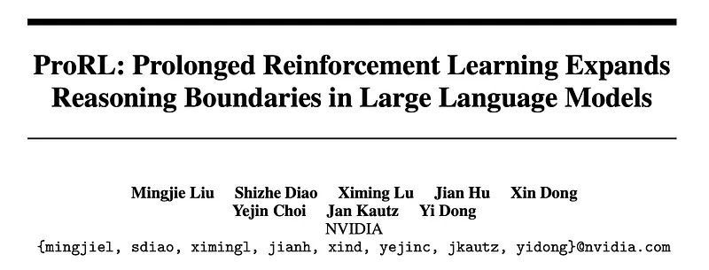 | Title card: ProRL. |
| 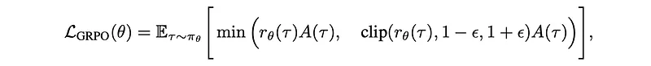 | where. |
|  | The advantage used in GRPO foregoes the critic model of PPO, and instead estimates baseline from group scores {Ri}. |
|  | where. |
|  | where. |
| 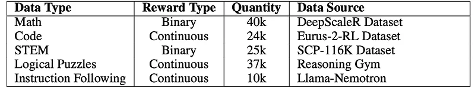 | Math. |
| 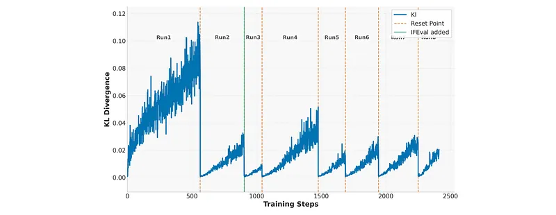 | KL divergence across training runs. |
| 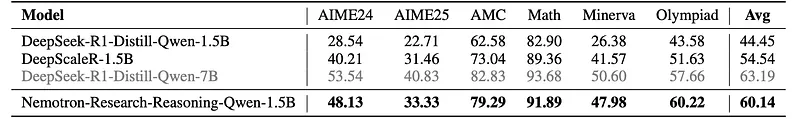 | Performance (pass@1) comparison for benchmarks across Math domain. |
| 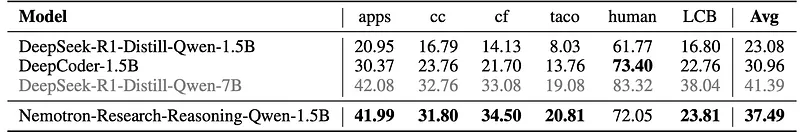 | Performance (pass@1) comparison across benchmarks for Code. |
| 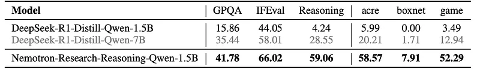 | Performance comparison on STEM reasoning (GPQA Diamond), instruction following (IFEval), and logic puzzles (Reasoning Gym) tasks. |
| 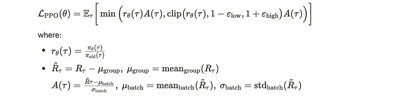 | At ProRL’s core is the clipped PPO loss, which stabilizes policy updates by restricting how much the new policy can diverge from the old ones. |
|  | A higher upper bound of PPO’s clipping range is used to mitigate policy entropy collapse and promote sampling diversity. |
| 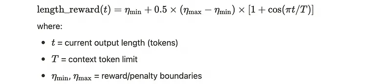 | To promote concise, token-efficient outputs, a scheduled cosine penalty is applied. |
|  | The length reward is incorporated into the total reward. |
|  | KL divergence in REINFORCE++-baseline is regularized using a k_2 estimator. |
| 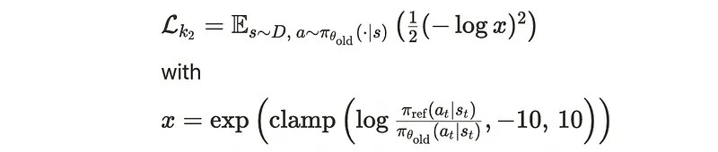 | KL divergence in REINFORCE++-baseline is regularized using a k_2 estimator. |
| 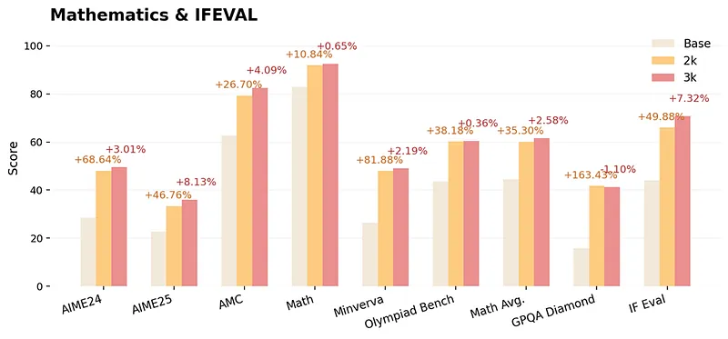 | ProRL was evaluated across math, code generation, and diverse reasoning gym benchmarks. Scores are reported for. |
| 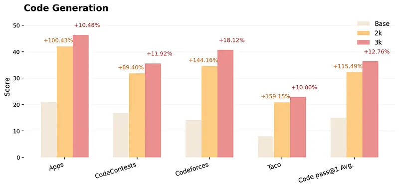 | ProRL was evaluated across math, code generation, and diverse reasoning gym benchmarks. Scores are reported for. |
| 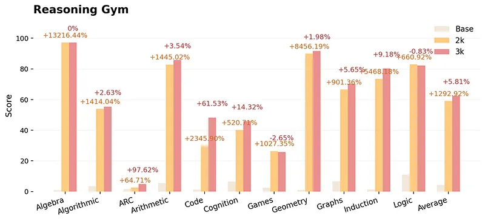 | ProRL was evaluated across math, code generation, and diverse reasoning gym benchmarks. Scores are reported for. |
| 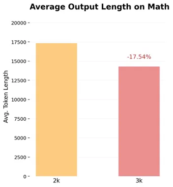 | ProRL was evaluated across math, code generation, and diverse reasoning gym benchmarks. Scores are reported for. |
## Related

- [[Papers Explained Corpus]]
- [[Reinforcement Learning Topic]]
- [[Safety and Alignment]]
- [[Reasoning Models]]
- [[Vision Language Models]]
- [[Reinforcement Learning]]
- [[KL Regularization]]
- [[Papers Explained 385 - J1]]
- [[Papers Explained 387 - Sarvam-Translate]]

#summary #topic
