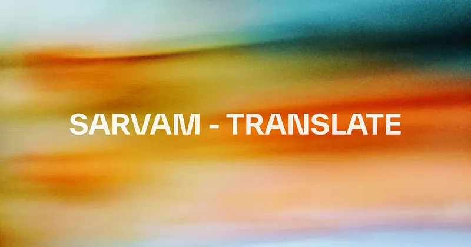
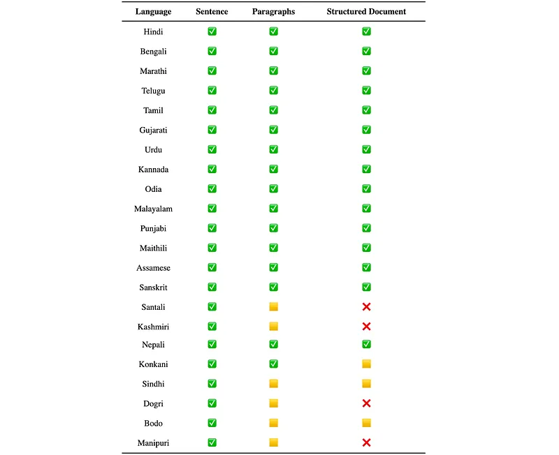
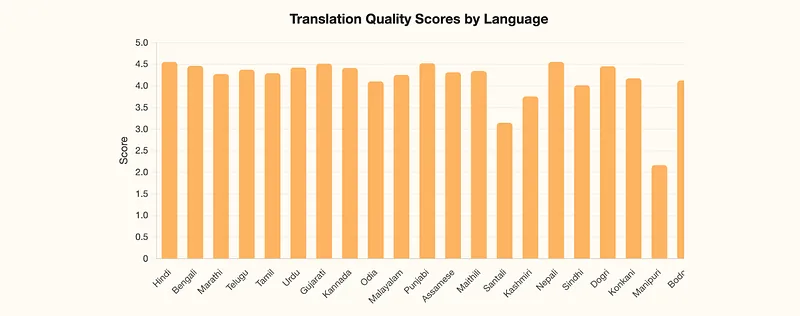
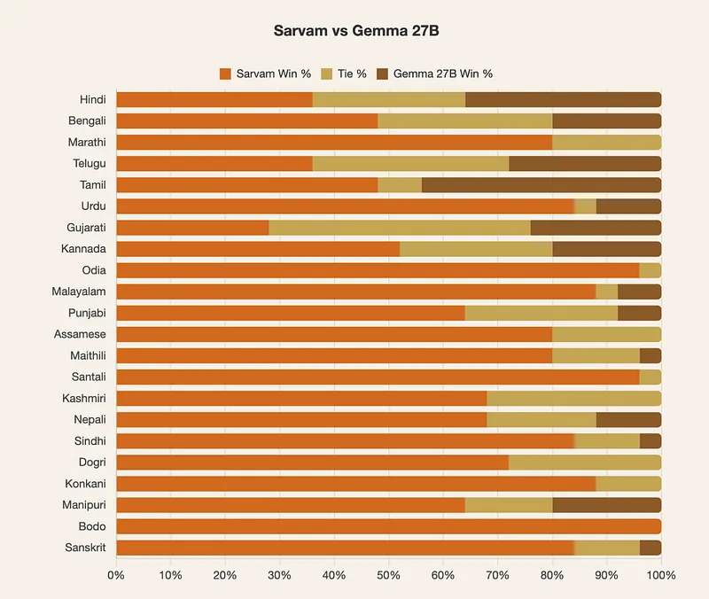
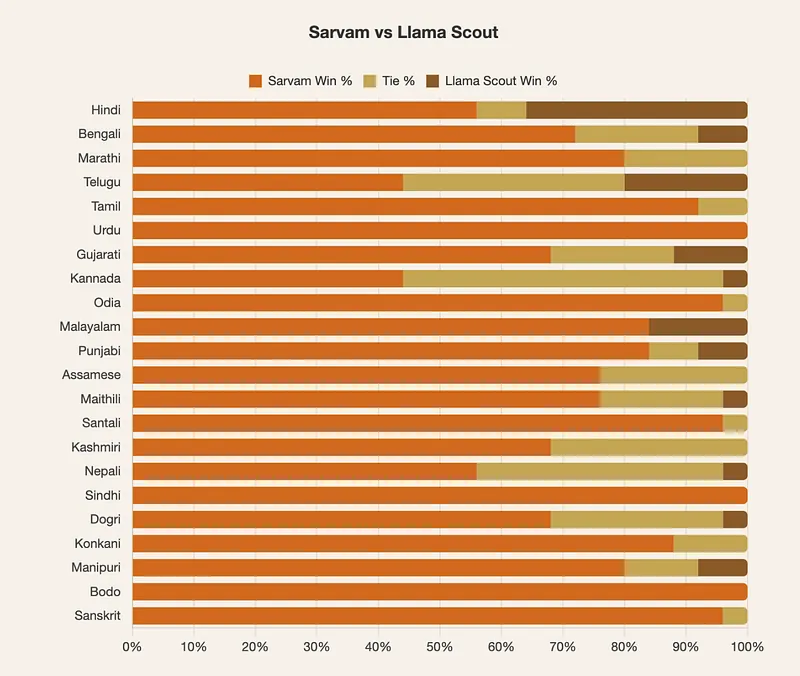
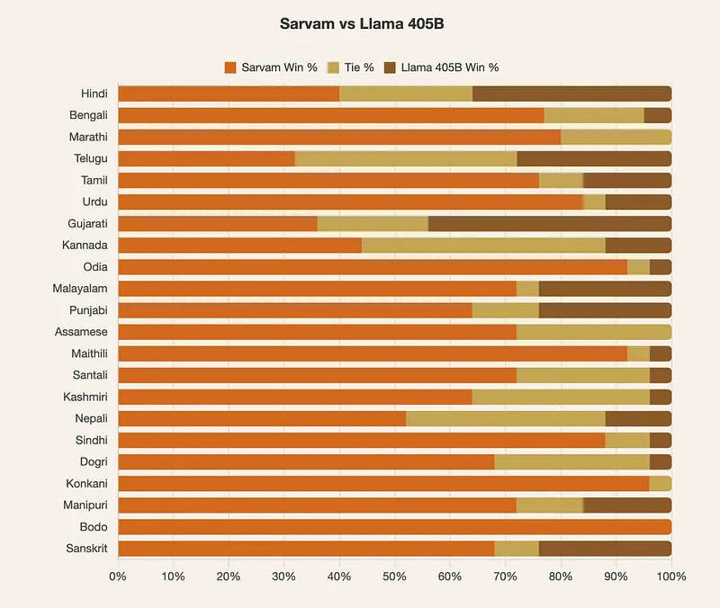

# Papers Explained 387 - Sarvam-Translate

Sarvam-Translate is trained by fine-tuning Gemma3–4B-IT. It supports 22 Indian languages — Hindi, Bengali, Marathi, Telugu, Tamil, Gujarati, Urdu, Kannada, Odia, Malayalam, Punjabi, Assamese, Maithili, Santali, Kashmiri, Nepali, Sindhi, Dogri, Konkani, Manipuri (Meitei), Bodo, Sanskrit.

This page ingests the source article into the wiki and connects it to [[Papers Explained Corpus]], [[Multilingual Models]], [[Synthetic Data]], [[Large Language Models]], [[Model Compression and Efficiency]], [[Evaluation and Benchmarks]], [[Supervised Fine-Tuning]].

## Source Metadata

- Source file: `raw/2025-06-13_Papers-Explained-387--Sarvam-Translate-fb96bd865054.md`
- Source title: Papers Explained 387: Sarvam-Translate
- Published: 2025-06-13
- Canonical: [https://medium.com/@ritvik19/papers-explained-387-sarvam-translate-fb96bd865054](https://medium.com/@ritvik19/papers-explained-387-sarvam-translate-fb96bd865054)

## Key Ideas

- Sarvam-Translate is trained by fine-tuning Gemma3–4B-IT. It supports 22 Indian languages — Hindi, Bengali, Marathi, Telugu, Tamil, Gujarati, Urdu, Kannada, Odia, Malayalam, Punjabi, Assamese, Maithili, Santali, Kashmiri, Nepali, Sindhi, Dogri, Konkani...
- The model is available on [HuggingFace](https://huggingface.co/sarvamai/sarvam-translate/).
- Sarvam invested heavily in building robust data-cleaning pipelines and sophisticated annotation workflows to ensure the highest quality datasets.
- Gemma3–4B-IT is fine-tuned in a two-stage process.
- In the first stage, the full model is fine-tuned on a larger dataset with broad coverage, including some noisier but domain-diverse data to establish wide-ranging translation capability.

## Notes

Sarvam-Translate is trained by fine-tuning Gemma3–4B-IT. It supports 22 Indian languages — Hindi, Bengali, Marathi, Telugu, Tamil, Gujarati, Urdu, Kannada, Odia, Malayalam, Punjabi, Assamese, Maithili, Santali, Kashmiri, Nepali, Sindhi, Dogri, Konkani, Manipuri (Meitei), Bodo, Sanskrit. It supports paragraph-level translation for 22 languages and supports translating diverse structured content for 15 languages.

The model is available on [HuggingFace](https://huggingface.co/sarvamai/sarvam-translate/).

## Method

Sarvam invested heavily in building robust data-cleaning pipelines and sophisticated annotation workflows to ensure the highest quality datasets. Leveraged the Gemma 3 open-source models which provided the best starting point to build Sarvam-Translate in comparison to any other model.

### Data

Sarvam-Translate is trained on a rich and diverse dataset of translation pairs between English and 22 Indian languages. This dataset combines multiple sources. Cleaned data from past open-data efforts, including BPCC, which itself contains both mined and manually validated data, is incorporated. This data is carefully cleaned using robust internal pipelines. New translation pairs are generated from carefully curated English source content, spanning a wide range of domains: scientific and historical content, conversational and modern text, and structurally complex formats such as code, LaTeX, HTML, and chemistry equations.

### Training Process

Gemma3–4B-IT is fine-tuned in a two-stage process.

- In the first stage, the full model is fine-tuned on a larger dataset with broad coverage, including some noisier but domain-diverse data to establish wide-ranging translation capability. This was also required to provide language ability to the model in languages it was not already fluent in.

- In the second stage, LoRA is used to fine-tune the model further on a smaller, highly curated, format-diverse dataset, paying careful attention to format preservation and style consistency.

## Evaluation

Due to the scale, automatic evaluations are performed using Gemini Flash 2.5, with prompts tailored to each document type to focus on specific aspects of translation quality. The goals for each content type are:

- Markdown (GitHub): Preserve Markdown structure and ensure translated content fits naturally.

- Digitized Markdown (VLM/OCR): Robustness to errors and preservation of structure.

- Math (LaTeX): Preserve LaTeX equations exactly while translating surrounding text.

- Chemistry: Retain chemical equations and symbols correctly.

- Code: Keep code unchanged and translate only comments and documentation.

- HTML: Preserve HTML tags and structure, translating only visible text.

Human evaluations are also conducted on 100 English documents translated by Sarvam-Translate and other open-source LLMs (Gemma3–27B-IT, Llama-3.1–405B-FP8 and Llama4 Scout). Professional language experts evaluated the translations on fluency, adequacy, faithfulness to the source structure, and inclusivity, by comparing two random translations and picking the preferred one.

Across all Indian languages, Sarvam-Translate consistently outperformed other models, particularly in its ability to handle structured content, maintain coherence over longer contexts, and deliver inclusive and culturally sensitive translations.

## Paper

[SARVAM — TRANSLATE](https://www.sarvam.ai/blogs/sarvam-translate)

## Figures

Figures from the Medium HTML export (`raw/2025-06-13_Papers-Explained-387--Sarvam-Translate-fb96bd865054.md`); local copies under `wiki/assets/papers-explained-387-sarvam-translate/` when download succeeded.

| Figure | Caption |
|--------|---------|
|  | Title card: Sarvam-Translate. |
|  | The model is available on HuggingFace. |
|  | Human evaluations are also conducted on 100 English documents translated by Sarvam-Translate and other open-source LLMs (Gemma3–27B-IT,... |
|  | Evaluation. |
|  | Evaluation. |
|  | Across all Indian languages, Sarvam-Translate consistently outperformed other models, particularly in its ability to handle structured... |
## Related

- [[Papers Explained Corpus]]
- [[Multilingual Models]]
- [[Synthetic Data]]
- [[Large Language Models]]
- [[Model Compression and Efficiency]]
- [[Evaluation and Benchmarks]]
- [[Supervised Fine-Tuning]]
- [[Papers Explained 386 - ProRL]]
- [[Papers Explained 388 - Magistral]]

#summary #topic
