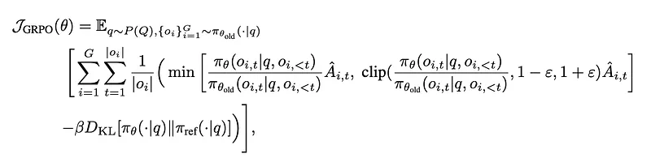
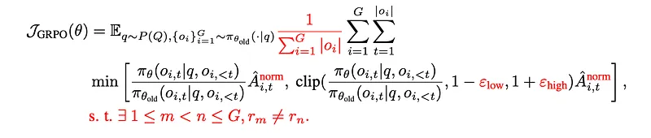
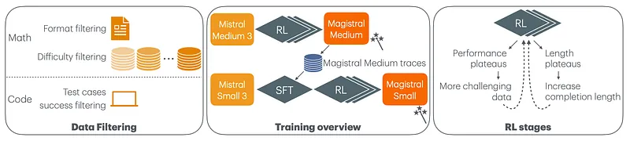
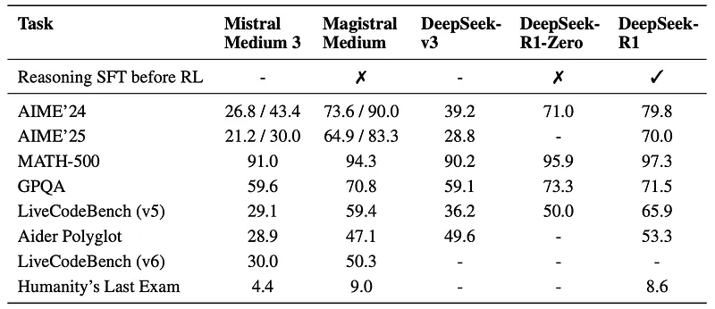
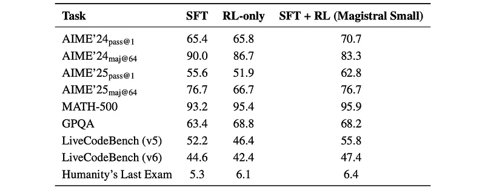
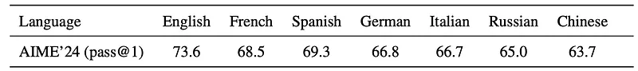
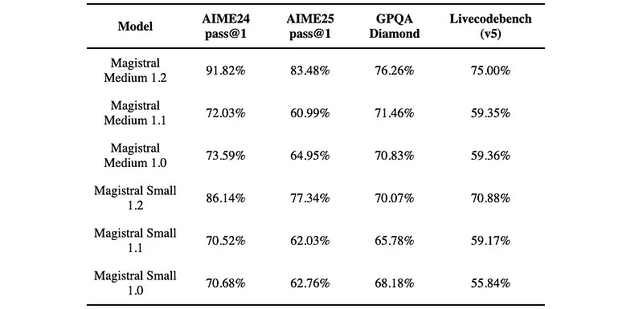

# Papers Explained 388 - Magistral

Magistral is Mistral AI’s first reasoning model, designed for domain-specific, transparent, and multilingual reasoning. It comes in two versions:

This page ingests the source article into the wiki and connects it to [[Papers Explained Corpus]], [[Reinforcement Learning Topic]], [[Reasoning Models]], [[Safety and Alignment]], [[Multilingual Models]], [[Large Language Models]], [[Reinforcement Learning]], [[KL Regularization]].

## Source Metadata

- Source file: `raw/2025-06-16_Papers-Explained-388--Magistral-d79523e0df6b.md`
- Source title: Papers Explained 388: Magistral
- Published: 2025-06-16
- Canonical: [https://medium.com/@ritvik19/papers-explained-388-magistral-d79523e0df6b](https://medium.com/@ritvik19/papers-explained-388-magistral-d79523e0df6b)

## Key Ideas

- Magistral Small: A 24B parameter open-source version: Available on [HuggingFace](https://huggingface.co/mistralai/Magistral-Small-2506)
- Magistral Medium: A more powerful, enterprise version.
- Group Relative Policy Optimization (GRPO) is used as the RL algorithm. GRPO, unlike PPO, uses the average reward from multiple generations per prompt to compute a baseline for advantage calculation, eliminating the need for a critic model.
- q represents queries drawn from the input dataset
- o represents the generation of the model

## Notes

Magistral is Mistral AI’s first reasoning model, designed for domain-specific, transparent, and multilingual reasoning. It comes in two versions:

- Magistral Small: A 24B parameter open-source version: Available on [HuggingFace](https://huggingface.co/mistralai/Magistral-Small-2506)

- Magistral Medium: A more powerful, enterprise version.

## Reinforcement Learning Algorithm

Group Relative Policy Optimization (GRPO) is used as the RL algorithm. GRPO, unlike PPO, uses the average reward from multiple generations per prompt to compute a baseline for advantage calculation, eliminating the need for a critic model. Specifically, GRPO optimizes the policy πθ to maximize the following objective:

where

- q represents queries drawn from the input dataset

- o represents the generation of the model

- ε is the PPO clipping threshold

- β is the KL penalty coefficient

- DKL denotes the Kullback–Leibler divergence between the current policy πθ and the reference policy πref.

The relative advantage, or the group normalized advantage, is given by Aˆi,t= ri−µ/σ where µ and σ are the mean and standard deviation of rewards computed within a single group.

Several modifications to GRPO are introduced:

- Eliminating KL Divergence: The KL divergence penalty is removed due to its computational cost and the policy’s tendency to diverge regardless.

- Loss Normalization: To avoid introducing length biases between generations in one group, the loss is normalized by the total length of generations in a group to avoid length biases.

- Advantage Normalization: The advantage is estimated as Aˆi,t = ˆAi = ri − µ, where µ is the mean of rewards within a group. These advantages are then normalized within each minibatch as Aˆnorm i,t = ( ˆAi − ˆAmean)/ ˆAstd, using the sequence-wise mean (Aˆmean) and standard deviation (Aˆstd) of advantages.

- Relaxing the Trust Region’s Upper Bound (Clip-Higher): The upper clipping threshold (ε) is increased to εhigh (tuned between 0.26 and 0.28) to allow low-probability tokens more room to grow, enhancing entropy, diversity, and reasoning exploration, preventing deterministic policies and entropy collapse.

- Eliminating Non-Diverse Groups: Groups with zero advantage (where all generations are either entirely correct or wrong) are filtered out to reduce noise sensitivity and improve gradient quality.

The final GRPO loss with all modifications highlighted in red is

## Reward Shaping

During training, model generations are evaluated along four axes: formatting, correctness, length, and language consistency

### Formatting

- Responses must begin with `<think>` and end with `</think>`, with only one such tag pair.

- Mathematical answers must enclose the final answer in `\boxed{}` after the `</think>` tag.

- Code answers must include at least one markdown code block (using triple backticks with language specification) after the `</think>` tag.

Failure to meet any formatting condition results in a reward of 0; otherwise, a reward of 0.1 is given, and the response proceeds to grading.

### Correctness

- For math, the final answer extracted from the last boxed section is compared to the reference answer using a rule-based verifier, normalizing both to account for syntactic variations. Parsers and SymPy are used for evaluation. A reward of 0.9 is added for a correct answer, totaling 1.0.

- For code, the code from the first markdown code block is extracted. C++ code is compiled with a 10-second timeout using C++20, with the `bits/stdc++.h` header pre-compiled. The code is tested against 20 randomly selected test cases (consistent within a response group), each with a 4-second timeout and 300MB memory limit. A reward of 0.9 is added if all tests pass.

### Length penalty

A soft length penalty (formula omitted) is applied to discourage exceeding the maximum completion length. Two lengths, lmax and lcache, are fixed and length penalty is computed:

### Language consistency reward

To ensure the model reasons in the user’s language, 10% of English problems are translated into French, Spanish, Italian, German, Chinese, and Russian. The problem, thoughts, and answer are normalized by removing LaTeX and code blocks, and a fastText classifier is applied to each. If all three parts are classified as the same language, a reward of 0.1 is given.

## System Prompt

The format and the language requirements are specified in the system prompt:

```text
A user will ask you to solve a task.
You should first draft your thinking process (inner monologue) until you have derived the final answer.
Afterwards, write a self-contained summary of your thoughts (i.e. your summary should be succinct but contain all the critical steps you needed to reach the conclusion).
You should use Markdown and Latex to format your response.
Write both your thoughts and summary in the same language as the task posed by the user.
Your thinking process must follow the template below:
<think>
Your thoughts or/and draft, like working through an exercise on scratch paper.
Be as casual and as long as you want until you are confident to generate a correct answer.
</think>
Here, provide a concise summary that reflects your reasoning and presents a clear final answer to the user.
Problem:
{problem}
```

## Data Curation

The focus is on problems with verifiable solutions, specifically mathematical problems whose solution is a numerical answer or expression, and code problems with associated tests.

### Math

A large initial dataset of 700k samples is filtered to remove proof-based and multi-part problems, and multiple-choice problems are reformulated. A two-stage filtering pipeline is then used to select problems of appropriate difficulty.

The first stage uses Mistral Large 2 to assess difficulty by sampling 16 solutions per problem and removing problems that are too easy or too hard. The resulting set is used to train a 24B model via online RL, which is then used in the second stage to re-grade the original dataset, again sampling 16 solutions per problem and filtering out easy and unsolved problems. Problems where the model consistently disagrees with the ground-truth answer are also removed, as they are likely to have incorrect ground truths.

This results in a dataset of 38k math problems.

### Code

Data is gathered from various sources, including problem statements, solutions, and tests. Problems without solutions or sufficient tests are removed. Solutions are executed on available tests, and tests with insufficient agreement are discarded. Tests where no solution succeeds are updated to reflect the most common output. Additional tests are generated for problems lacking them and subjected to the same evaluation. Finally, problem statements are duplicated to require code in both Python and C++.

This results in a dataset of 35k code problems.

## Training Recipe

Magistral Medium is trained on top of Mistral Medium 3 with pure RL, and Magistral Small begins with SFT traces derived from Magistral Medium.

*Figure: Overview of the filtering, training and RL stages.*

### Magistral Medium — reasoning RL from scratch

Training is done in multiple stages with distinct hyper-parameters. Particularly, the stages are designed to ensure the following criteria were always satisfied:

- Dataset difficulty increases as the model improves, by adding more complex data and removing solved problems.

- Generation length continues to grow by increasing the maximum allowed completion length and the maximum completion length not penalized by length penalty (lmax — lcache increased from 16k to 24k, then to 32k).

- KV-cache memory usage is managed by scaling down the number of concurrent requests (nasync), batch size (nbatch, decreased from 8k to 4k, then to 2k), and minibatch size (nminibatch).

### Magistral Small — RL on top of reasoning SFT bootstrapping

- Starts with SFT using traces from Magistral Medium’s RL training, excluding early steps with short Chains of Thought (CoTs).

- Maintains a mixed difficulty level by limiting generations per problem and upsampling problems with lower pass rates.

- Augments the SFT data with responses generated by Magistral Medium on diverse prompts from OpenThoughts and the code subset of OpenR1, followed by filtering.

- Includes 10% general instruction tuning data to preserve non-reasoning capabilities.

- Finetunes Mistral Small 3 Instruct (24B parameters) for 4 epochs, selecting the best checkpoint on AIME’24 as the initial checkpoint for the subsequent RL stage.

## Evaluation

### Magistral Medium

*Figure: Results of Magistral Medium.*

- Magistral Medium, trained solely with RL, significantly outperforms Mistral Medium 3 across all benchmarks. For example, AIME’24 (pass@1) increases from 26.8 to 73.6.

- Magistral Medium also outperforms DeepSeek-v3 and DeepSeek-R1-Zero on most tasks, demonstrating the effectiveness of the RL pipeline.

- The performance of Magistral Medium is comparable to DeepSeek-R1 with Reasoning SFT before RL, suggesting that pure RL can achieve similar results to models that are first fine-tuned on reasoning traces.

- There is a significant performance gap between pass@1 and maj@64 for AIME benchmarks, indicating that while the model can often generate a correct answer within 64 attempts, its initial attempt is less reliable.

### Magistral Small

*Figure: Performance of Magistral Small compared with different training setups across various benchmarks.*

- The combination of SFT (fine-tuning on reasoning traces) and RL (SFT + RL) yields the best performance for Magistral Small across all benchmarks compared to SFT alone or RL alone.

- RL alone can still provide a performance boost over SFT alone, but the improvement is not as substantial as when RL is combined with SFT.

- The performance gains from RL on top of SFT are particularly noticeable on AIME benchmarks, suggesting that RL is effective at refining the model’s reasoning abilities.

- The performance of Magistral Small (SFT + RL) is very close to Magistral Medium on some benchmarks, indicating that a smaller model can achieve comparable performance with the right training approach.

### Magistral Medium’s Multilingual Performance

*Figure: Magistral Medium’s pass@1 performance on multilingual versions of the AIME 2024 benchmark.*

- Magistral Medium’s performance on multilingual versions of AIME 2024 is lower than its performance on the English version.

- The performance degradation on multilingual benchmarks is relatively consistent across different languages, ranging from 4.3% to 9.9% lower than English.

- The degradation in performance on multilingual benchmarks is similar to that of the base model, suggesting that the RL training does not significantly improve or worsen multilingual capabilities.

- The model can reason and answer in the user’s language, even on multilingual benchmarks.

## Magistral 1.1 (2507)

Magistral 1.1 is a small, efficient reasoning model with 24B parameters. It builds upon Mistral Small 3.1 (2503), with added reasoning capabilities, undergoes SFT from Magistral Medium traces and RL on top. The update involves the following features:

- Better tone and model behaviour. You should experiment better LaTeX and Markdown formatting, and shorter answers on easy general prompts.

- The model is less likely to enter infinite generation loops.

- [THINK] and [/THINK] special tokens encapsulate the reasoning content in a thinking chunk. This makes it easier to parse the reasoning trace and prevents confusion when the '[THINK]' token is given as a string in the prompt.

- The reasoning prompt is now given in the system prompt.

The model is available on [HuggingFace](https://huggingface.co/mistralai/Magistral-Small-2507).

```text
First draft your thinking process (inner monologue) until you arrive at a response.
Format your response using Markdown, and use LaTeX for any mathematical equations.
Write both your thoughts and the response in the same language as the input.
Your thinking process must follow the template below:
[THINK]
Your thoughts or/and draft, like working through an exercise on scratch paper.
Be as casual and as long as you want until you are confident to generate the response.
Use the same language as the input.
[/THINK]
Here, provide a self-contained response.
```

## Magistral 1.2 (2509)

Magistral 1.2 is a small, efficient reasoning model with 24B parameters. It builds upon Mistral Small 3.2 (2506), with added reasoning capabilities, undergoes SFT from Magistral Medium traces and RL on top. The update involves the following features:

- Multimodality: The model now has a vision encoder and can take multimodal inputs, extending its reasoning capabilities to vision.

- Performance upgrade: Magistral Small 1.2 should give you significantly better performance than Magistral Small 1.1 as seen in the benchmark results.

- Better tone and persona: You should experience better LaTeX and Markdown formatting, and shorter answers on easy general prompts.

- Finite generation: The model is less likely to enter infinite generation loops.

- Special think tokens: [THINK] and [/THINK] special tokens encapsulate the reasoning content in a thinking chunk. This makes it easier to parse the reasoning trace and prevents confusion when the ‘[THINK]’ token is given as a string in the prompt.

The model is available on [HuggingFace](https://huggingface.co/mistralai/Magistral-Small-2509).

```text
First draft your thinking process (inner monologue) until you arrive at a response.
Format your response using Markdown, and use LaTeX for any mathematical equations.
Write both your thoughts and the response in the same language as the input.
Your thinking process must follow the template below:
[THINK]
Your thoughts or/and draft, like working through an exercise on scratch paper.
Be as casual and as long as you want until you are confident to generate the response.
Use the same language as the input.
[/THINK]
Here, provide a self-contained response.
```

## Paper

[Magistral](https://mistral.ai/static/research/magistral.pdf)

## Figures

Figures from the Medium HTML export (`raw/2025-06-16_Papers-Explained-388--Magistral-d79523e0df6b.md`); local copies under `wiki/assets/papers-explained-388-magistral/` when download succeeded.

| Figure | Caption |
|--------|---------|
|  | Title card: Magistral. |
|  | Group Relative Policy Optimization (GRPO) is used as the RL algorithm. |
|  | The final GRPO loss with all modifications highlighted in red is. |
|  | A soft length penalty (formula omitted) is applied to discourage exceeding the maximum completion length. |
|  | Overview of the filtering, training and RL stages. |
|  | Results of Magistral Medium. |
|  | Performance of Magistral Small compared with different training setups across various benchmarks. |
|  | Magistral Medium’s pass@1 performance on multilingual versions of the AIME 2024 benchmark. |
|  | The model is available on HuggingFace. |
## Related

- [[Magistral]] — official Mistral AI Magistral reasoning model launch blog.
- [[Papers Explained Corpus]]
- [[Reinforcement Learning Topic]]
- [[Reasoning Models]]
- [[Safety and Alignment]]
- [[Multilingual Models]]
- [[Large Language Models]]
- [[Reinforcement Learning]]
- [[KL Regularization]]
- [[Papers Explained 387 - Sarvam-Translate]]
- [[Papers Explained 389 - short-m@k]]

#summary #topic
