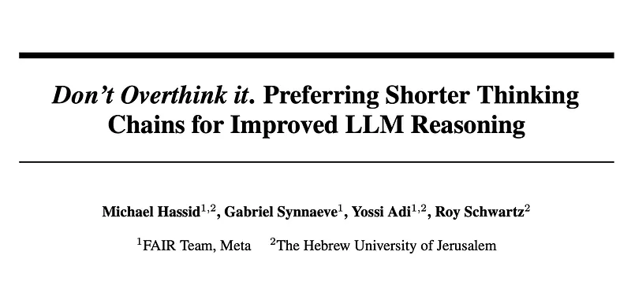
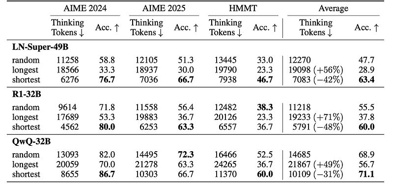
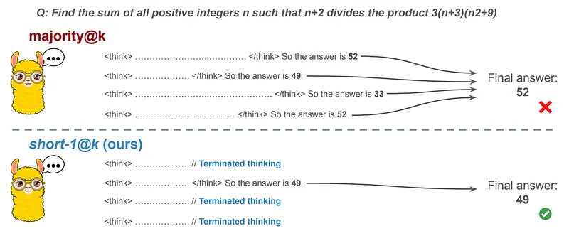
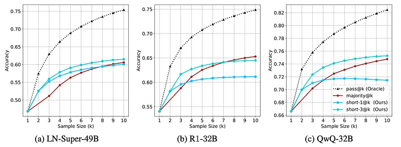
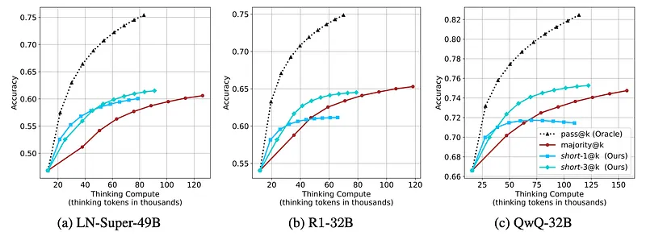
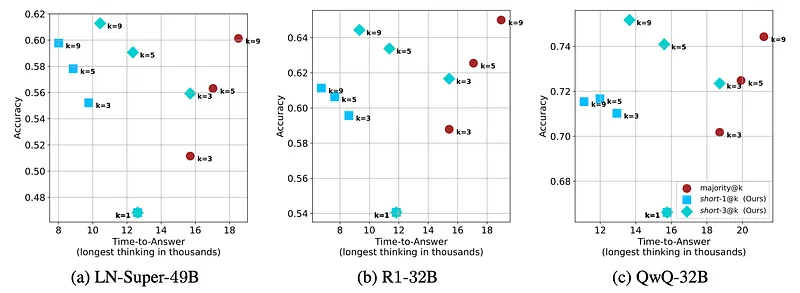
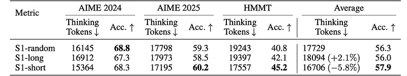

# Papers Explained 389 - short-m@k

Llama-3.3-Nemotron-Super-49B-v1: a reasoning RL-enhanced version of Llama-3.3–70B

This page ingests the source article into the wiki and connects it to [[Papers Explained Corpus]], [[Reasoning Models]], [[Large Language Models]], [[Supervised Fine-Tuning]].

## Source Metadata

- Source file: `raw/2025-06-17_Papers-Explained-389--short-m-k-e0b516dbb7c0.md`
- Source title: Papers Explained 389: short-m@k
- Published: 2025-06-17
- Canonical: [https://medium.com/@ritvik19/papers-explained-389-short-m-k-e0b516dbb7c0](https://medium.com/@ritvik19/papers-explained-389-short-m-k-e0b516dbb7c0)

## Key Ideas

- Three leading, high-performing, open, reasoning LLMs are considered:
- R1-Distill-Qwen-32B: an SFT finetuned version of Qwen-2.5–32B-Instruct derived from R1 trajectories
- QwQ-32B a reasoning RL-enhanced version Qwen-2.5–32B-Instruct
- All models are evaluated using three competitive reasoning benchmarks:
- For each question, 20 responses per model are generated, yielding a total of 5,400 generations. For all models, a temperature of 0.7, top-p=0.95, and a maximum number of generated tokens of 32,768 are used.

## Notes

In this work, the assumption that long thinking chains result in better reasoning capabilities is challenged. It is first demonstrated that shorter reasoning chains within individual questions are significantly more likely to yield correct answers than the longest chain sampled for the same question. Based on these results, short-m@k, a novel reasoning LLM inference method, is suggested. This method executes k independent generations in parallel and halts computation once the first m thinking processes are done. The final answer is chosen using majority voting among these m chains.

## Experimental Setup

Three leading, high-performing, open, reasoning LLMs are considered:

- Llama-3.3-Nemotron-Super-49B-v1: a reasoning RL-enhanced version of Llama-3.3–70B

- R1-Distill-Qwen-32B: an SFT finetuned version of Qwen-2.5–32B-Instruct derived from R1 trajectories

- QwQ-32B a reasoning RL-enhanced version Qwen-2.5–32B-Instruct

All models are evaluated using three competitive reasoning benchmarks:

- AIME 2024

- AIME 2025

- HMMT February 2025

For each question, 20 responses per model are generated, yielding a total of 5,400 generations. For all models, a temperature of 0.7, top-p=0.95, and a maximum number of generated tokens of 32,768 are used. When measuring the thinking chain length, the token count between the <think> and </think> tokens is measured.

## The shorter the better

Thinking chains tend to be longer for harder questions, as observed in recent studies. To quantify this phenomenon with generated samples, for each model, questions are split into three equal size groups according to the model’s success rate. Then, the average thinking length per easier and harder questions is calculated.

*Figure: Average thinking tokens for correct (C), incorrect (IC) and all (A) answers, per easier and harder questions.*

- Indeed models use more tokens for more challenging questions, up to a factor of 2.9.

- This may lead to the assumption that longer thinking chains leads to more complex reasoning, and therefore, better performance.

- Nevertheless, surprisingly, correct answers are typically shorter than incorrect ones, within each question subset.

To study the connection between performance and thinking length in a controlled manner, the study compares short vs. long thinking chains for the same question, along with a random chain.

*Figure: Comparison between taking the shortest/longest/random generation per example.*

- As expected, the shortest answers are 25%–50% shorter compared to randomly sampled responses.

- However, across almost all models and benchmarks, considering the answer with the shortest thinking chain actually boosts performance, yielding an average absolute improvement of 2.2%–15.7% across benchmarks compared to randomly selected generations.

The above results suggest that long generations might come with a significant price-tag, not only in running time, but also in performance. While more complex questions generally require a greater number of thinking tokens, within an individual example, shorter thinking trajectories are much more likely to be correct.

## short-m@k

*Figure: Visual comparison between majority voting and the proposed method short-m@k with m = 1.*

The short-m@k method performs parallel decoding of k generations for a given question, halting computation across all generations as soon as the m ≤k shortest thinking trajectories are completed. It then conducts majority voting among those shortest answers, resolving ties by selecting the answer with the shortest thinking chain. Given that thinking trajectories can be computationally intensive, terminating all generations once the m shortest trajectories are completed not only saves computational resources but also significantly reduces wall time due to the parallel decoding approach.

## Evaluation

*Figure: Comparing different inference methods under controlled sample size (k).*

- Generally, all methods improve with larger sample sizes (k), suggesting that more generations enhance performance.

*Figure: Comparing different inference methods under controlled thinking compute.*

- short-1@k outperforms majority@k at smaller sample sizes and lower compute budgets.

- short-3@k demonstrates superior performance, often dominating across models and sample sizes, and achieving higher performance with lower thinking compute compared to majority@k.

*Figure: Comparing time-to-answer for different inference methods.*

- short-1@k and short-3@k reduce time-to-answer with larger sample sizes, making them more usable than majority@k.

## Finetuning using shorter trajectories

This research further investigates whether fine-tuning on shorter reasoning chains enhances the accuracy of reasoning in LLMs. To do so, the S1 paradigm is followed, which fine-tunes an LLM to perform reasoning using only 1,000 trajectories. Three versions of the S1 dataset are created, built from examples with the shortest, longest, and random reasoning chains among several generations, from 10 responses per example using the QwQ-32B model. The Qwen-2.5–32B-Instruct model is then fine-tuned on the three S1 variants.

*Figure: Results for our finetuned models over the S1 variants.*

- S1-short achieves superior performance on AIME 2025 and HMMT while using fewer thinking tokens.

- Performance on AIME 2024 is similar across models, but S1-short uses the fewest thinking tokens.

- Across all benchmarks, S1-short improves relative performance by 2.8% compared to S1-random, with a 5.8% reduction in thinking tokens.

- S1-long consumes more tokens than S1-random but achieves similar performance.

## Paper

Don’t Overthink it. Preferring Shorter Thinking Chains for Improved LLM Reasoning [2505.17813](https://arxiv.org/abs/2505.17813)

## Figures

Figures from the Medium HTML export (`raw/2025-06-17_Papers-Explained-389--short-m-k-e0b516dbb7c0.md`); local copies under `wiki/assets/papers-explained-389-short-m-k/` when download succeeded.

| Figure | Caption |
|--------|---------|
|  | Title card: short-m@k. |
|  | Average thinking tokens for correct (C), incorrect (IC) and all (A) answers, per easier and harder questions. |
|  | Comparison between taking the shortest/longest/random generation per example. |
|  | Visual comparison between majority voting and the proposed method short-m@k with m = 1. |
|  | Comparing different inference methods under controlled sample size (k). |
|  | Comparing different inference methods under controlled thinking compute. |
|  | Comparing time-to-answer for different inference methods. |
|  | Results for our finetuned models over the S1 variants. |
## Related

- [[Papers Explained Corpus]]
- [[Reasoning Models]]
- [[Large Language Models]]
- [[Supervised Fine-Tuning]]
- [[Papers Explained 388 - Magistral]]
- [[Papers Explained 390 - Perplexity-based Importance Refinement (PIR)]]

#summary #topic
