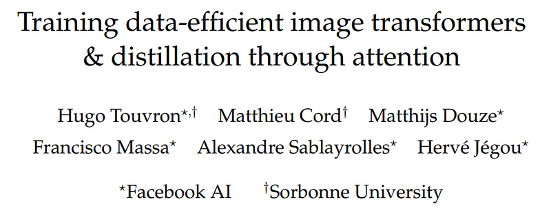
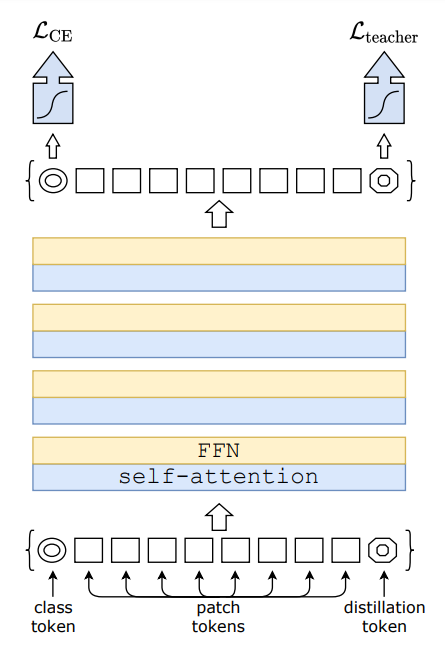
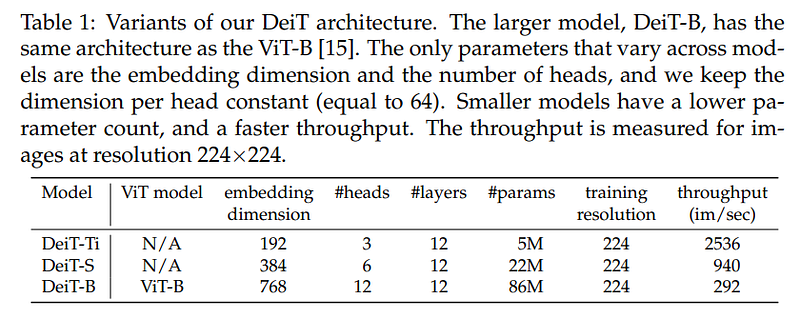
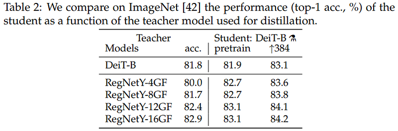
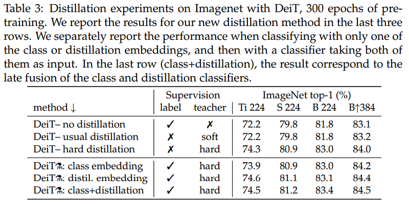
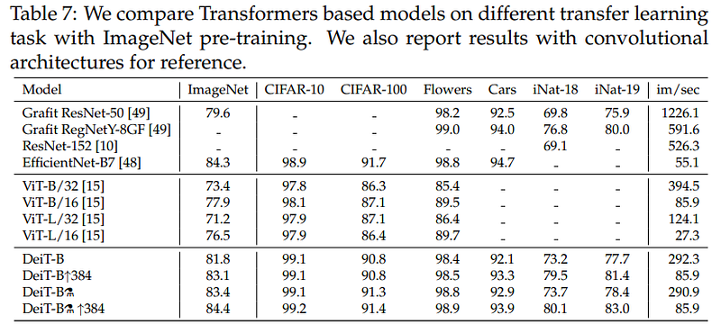
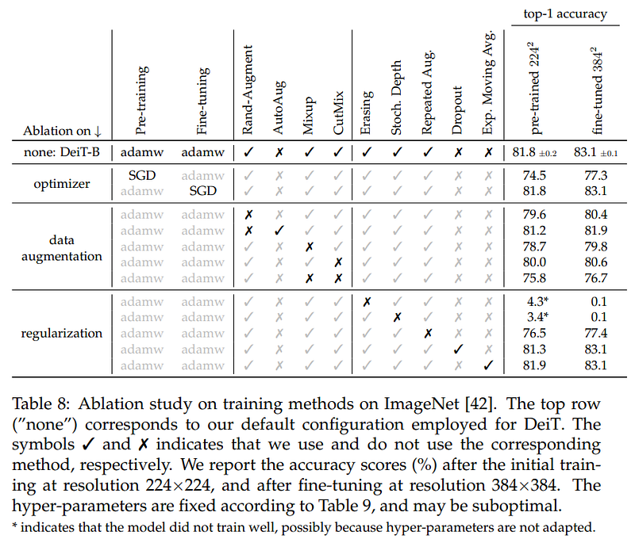

# Papers Explained 39 - DeiT

DeiT is a competitive convolution-free transformer trained on Imagenet only. It introduces a teacher-student strategy specific to transformers. It relies on a distillation token ensuring that the student learns from the teacher through attention.

This page ingests the source article into the wiki and connects it to [[Papers Explained Corpus]], [[Model Compression and Efficiency]], [[Embedding and Retrieval]], [[Computer Vision]], [[Large Language Models]], [[Model Distillation]], [[Supervised Fine-Tuning]], [[KL Regularization]].

## Source Metadata

- Source file: `raw/2023-03-27_Papers-Explained-39--DeiT-3d78dd98c8ec.html`
- Source title: Papers Explained 39: DeiT
- Published: 2023-03-27
- Canonical: [https://medium.com/@ritvik19/papers-explained-39-deit-3d78dd98c8ec](https://medium.com/@ritvik19/papers-explained-39-deit-3d78dd98c8ec)

## Key Ideas

- The architecture design of DeiT is identical to the one proposed by ViT with no convolutions. Our only differences are the training strategies and the distillation token.
- minimizes the Kullback-Leibler divergence between the softmax of the teacher and the softmax of the student model.
- we take the hard decision of the teacher as a true label.
- We add a new token, the distillation token, to the initial embeddings (patches and class token).
- Interestingly, we observe that the learned class and distillation tokens converge towards different vectors: the average cosine similarity between these tokens equals 0.06.

## Notes

DeiT is a competitive convolution-free transformer trained on Imagenet only. It introduces a teacher-student strategy specific to transformers. It relies on a distillation token ensuring that the student learns from the teacher through attention.

The architecture design of DeiT is identical to the one proposed by ViT with no convolutions. Our only differences are the training strategies and the distillation token.

## Distillation through attention

### Soft Distillation

minimizes the Kullback-Leibler divergence between the softmax of the teacher and the softmax of the student model.

### Hard-label distillation.

we take the hard decision of the teacher as a true label.

### Distillation Token

We add a new token, the distillation token, to the initial embeddings (patches and class token). Our distillation token is used similarly to the class token: it interacts with other embeddings through self-attention and is output by the network after the last layer. Its target objective is given by the distillation component of the loss. The distillation embedding allows our model to learn from the output of the teacher, as in a regular distillation, while remaining complementary to the class embedding.

Interestingly, we observe that the learned class and distillation tokens converge towards different vectors: the average cosine similarity between these tokens equals 0.06. As the class and distillation embeddings are computed at each layer, they gradually become more similar through the network, all the way through the last layer at which their similarity is high (cos=0.93), but still lower than 1. This is expected since they aim at producing targets that are similar but not identical.

### Fine-tuning with distillation

We use both the true label and teacher prediction during the fine-tuning stage at a higher resolution. We use a teacher with the same target resolution, typically obtained from the lower-resolution teacher. We have also tested with true labels only but this reduces the benefit of the teacher and leads to lower performance.

### Classification with our approach: joint classifiers

At test time, both the class or the distillation embeddings produced by the transformer are associated with linear classifiers and are able to infer the image label. Yet our referent method is the late fusion of these two separate heads, for which we add the softmax output by the two classifiers to make the prediction.

### Convnets teachers

We have observed that using a convnet teacher gives better performance than using a transformer. The fact that the convnet is a better teacher is probably due to the inductive bias inherited by the transformers through distillation

### Comparison of distillation methods

The distillation token gives slightly better results than the class token. It is also more correlated to the convnets prediction. This difference in performance is probably due to the fact that it benefits more from the inductive bias of convnets.

### Agreement with the teacher & inductive bias?

Our distilled model is more correlated to the convnet than with a transformer learned from scratch. As to be expected, the classifier associated with the distillation embedding is closer to the convnet than the one associated with the class embedding, and conversely the one associated with the class embedding is more similar to DeiT learned without distillation. Unsurprisingly, the joint class+distil classifier offers a middle ground.

### Transfer learning: Performance on downstream tasks

### Ablation Study

## Paper

Training data-efficient image transformers & distillation through attention [2012.12877](https://arxiv.org/abs/2012.12877)

Recommended Reading [Vision Transformers](https://ritvik19.medium.com/list/vision-transformers-61e6836230f1)

## Figures

Figures from the Medium HTML export (`raw/2023-03-27_Papers-Explained-39--DeiT-3d78dd98c8ec.html`); local copies under `wiki/assets/papers-explained-39-deit/` when download succeeded.

| Figure | Caption |
|--------|---------|
|  | Title card: DeiT. |
|  | DeiT is a competitive convolution-free transformer trained on Imagenet only. |
|  | The architecture design of DeiT is identical to the one proposed by ViT with no convolutions. |
|  | minimizes the Kullback-Leibler divergence between the softmax of the teacher and the softmax of the student model. |
|  | we take the hard decision of the teacher as a true label. |
|  | We have observed that using a convnet teacher gives better performance than using a transformer. |
|  | The distillation token gives slightly better results than the class token. |
|  | Our distilled model is more correlated to the convnet than with a transformer learned from scratch. |
|  | Our distilled model is more correlated to the convnet than with a transformer learned from scratch. |
## Related

- [[Papers Explained Corpus]]
- [[Model Compression and Efficiency]]
- [[Embedding and Retrieval]]
- [[Computer Vision]]
- [[Large Language Models]]
- [[Model Distillation]]
- [[Supervised Fine-Tuning]]
- [[KL Regularization]]
- [[Papers Explained 38 - Longformer]]
- [[Papers Explained 40 - MobileViT]]

#summary #topic
