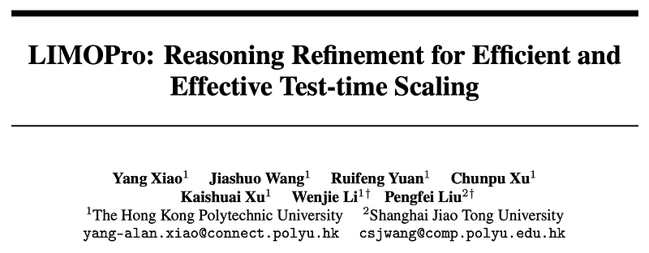
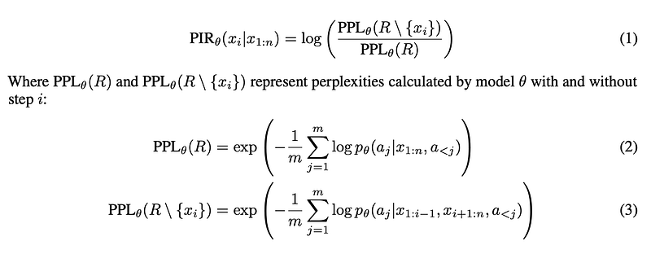
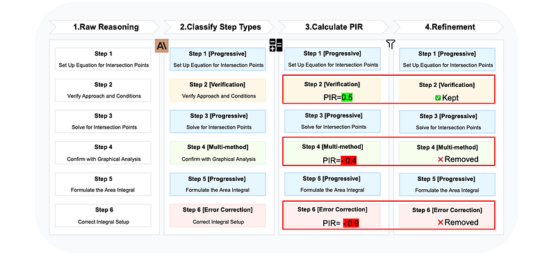
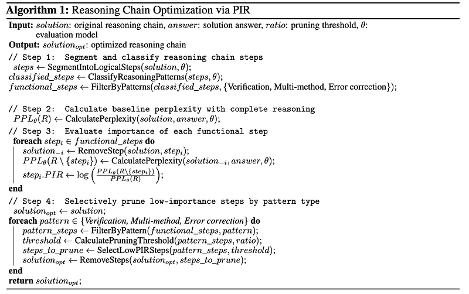
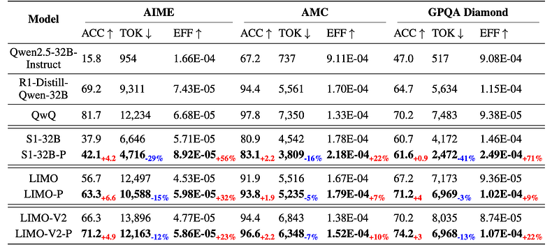
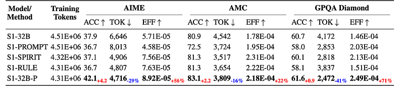
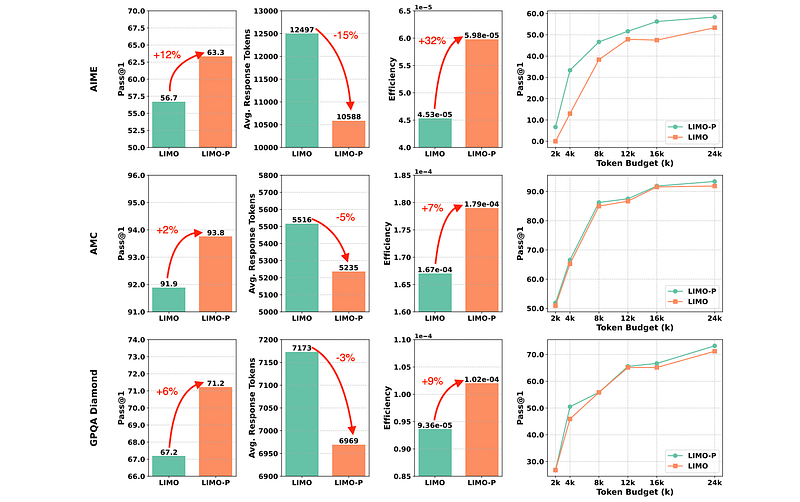
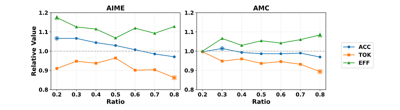
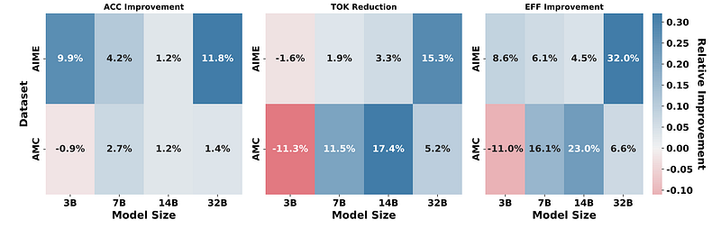

# Papers Explained 390 - Perplexity-based Importance Refinement (PIR)

PIR (Perplexity-based Importance Refinement) is a framework that quantitatively evaluates the importance of each reasoning step based on its impact on answer prediction confidence.

This page ingests the source article into the wiki and connects it to [[Papers Explained Corpus]], [[Reasoning Models]], [[Synthetic Data]].

## Source Metadata

- Source file: `raw/2025-06-18_Papers-Explained-390--Perplexity-based-Importance-Refinement--PIR--68103a8da269.html`
- Source title: Papers Explained 390: Perplexity-based Importance Refinement (PIR)
- Published: 2025-06-18
- Canonical: [https://medium.com/@ritvik19/papers-explained-390-perplexity-based-importance-refinement-pir-68103a8da269](https://medium.com/@ritvik19/papers-explained-390-perplexity-based-importance-refinement-pir-68103a8da269)

## Key Ideas

- The project is available on [GitHub](https://github.com/GAIR-NLP/LIMOPro/).
- This paper addresses the challenge of optimizing reasoning chains for complex reasoning tasks.
- The goal is to refine each reasoning chain r into an optimized version r′ such that:
- The answer accuracy is preserved: f(q,r′) = f(q,r) = a
- The essential reasoning logic is maintained without harming the quality of the dataset.

## Notes

PIR (Perplexity-based Importance Refinement) is a framework that quantitatively evaluates the importance of each reasoning step based on its impact on answer prediction confidence. PIR systematically identifies and selectively prunes only low-importance functional steps while preserving progressive reasoning components, creating optimized training data that maintains the integrity of the core solution path while reducing verbosity.

The project is available on [GitHub](https://github.com/GAIR-NLP/LIMOPro/).

## Problem Formulation

This paper addresses the challenge of optimizing reasoning chains for complex reasoning tasks. Consider a dataset D, containing question-reasoning-answer triplets (q,r,a), where q∈Q represents a reasoning problem, r∈R is the reasoning chain, and a∈A is the answer. A reasoning chain r is defined as a sequence of intermediate steps {s1,s2,…,sn}, where each step si represents a logical deduction that bridges the gap between the question and the final answer.

The goal is to refine each reasoning chain r into an optimized version r′ such that:

- The answer accuracy is preserved: f(q,r′) = f(q,r) = a

- The token length is reduced: |r′|<|r|

- The essential reasoning logic is maintained without harming the quality of the dataset.

## PIR (Perplexity-Based Importance Refinement)

Four distinct modes of cognitive reasoning are identified:

- Progressive Reasoning: Forward-chaining inference, the core deductive logic.

- Verification: Metacognitive monitoring to validate calculations.

- Multi-method Validation: Using different methods to confirm conclusions.

- Error Correction: Identifying and fixing mistakes in reasoning.

Progressive reasoning is considered essential, while the other three are functional patterns that can contain redundancies.

PIR quantifies the importance of each reasoning step. It measures the change in perplexity (a measure of how well a language model predicts a sequence) when a specific step is removed.

A higher PIR value indicates a more important step. Removing it significantly impacts the model’s ability to predict the correct answer.

*Figure: PIR framework pipeline for reasoning optimization.*

Reasoning chains are divided into logical steps using Claude 3.7 Sonnet. A two-phase system classifies reasoning steps into the four cognitive patterns.

- Rule-based pattern matching identifies steps with linguistic markers (e.g., “Let me check” for verification).

- Claude 3.7 Sonnet performs contextual analysis for steps lacking explicit markers.

- Functional steps (verification, multi-method validation, and error correction) are selectively removed based on their PIR values.

- Progressive reasoning steps are always preserved.

- Steps with the lowest PIR values are removed according to a predefined ratio threshold.

## Experimental Setup

The PIR framework is applied to three datasets (LIMO, LIMO-V2, S1K) distilled from different foundation models (DeepSeek R1, QwQ, Gemini Thinking) to create optimized versions (LIMO-P, LIMO-V2-P, S1K-P).

The Qwen2.5–32B-Instruct model is fine-tuned on both the original and PIR-optimized datasets.

The models are evaluated on three reasoning-intensive benchmarks: AIME24, GPQA Diamond, and AMC23.

## Evaluation

*Figure: Experimental results comparing baseline models with their PIR-optimized variants (-P) across reasoning benchmarks.*

- PIR-optimized models (LIMO-P, LIMO-V2-P, S1–32B-P) consistently achieved superior efficiency-accuracy trade-offs compared to baseline models (LIMO, LIMO-V2, S1–32B) across all benchmarks. For example, S1–32B-P showed a 4.2 percentage point accuracy increase and a 29% token reduction on AIME, resulting in a 56% efficiency improvement.

- The consistent improvements across diverse benchmarks and data sources suggest that the PIR framework effectively identifies and preserves high-value reasoning steps while eliminating low-importance functional components, indicating strong generalizability.

*Figure: Experimental results comparing PIR(S1–32B-P) with different optimization approaches.*

- PIR (S1–32B-P) outperformed other reasoning optimization approaches (S1-PROMPT, S1-SPIRIT, S1-RULE) across benchmarks, demonstrating the superiority of selectively pruning functional steps while preserving progressive reasoning components.

- PIR-optimized models consistently outperformed their non-optimized counterparts across most token budget levels, demonstrating the generalizability of the approach to different resource constraints.

*Figure: Impact of pruning ratio on model performance.*

- There exists an optimal refinement threshold that balances the removal of redundant functional steps with the preservation of critical reasoning components. Excessive pruning beyond this threshold leads to declining accuracy.

*Figure: Impact of PIR refinement across model sizes and benchmarks.*

- PIR demonstrates robust scalability with performance improvements across most model sizes, with the benefits becoming increasingly pronounced as model size increases.

## Paper

LIMOPro: Reasoning Refinement for Efficient and Effective Test-time Scaling [2505.19187](https://arxiv.org/abs/2505.19187)

## Figures

Figures from the Medium HTML export (`raw/2025-06-18_Papers-Explained-390--Perplexity-based-Importance-Refinement--PIR--68103a8da269.html`); local copies under `wiki/assets/papers-explained-390-perplexity-based-importance-refinement-pir/` when download succeeded.

| Figure | Caption |
|--------|---------|
|  | Title card: Perplexity-based Importance Refinement (PIR). |
|  | PIR quantifies the importance of each reasoning step. |
|  | PIR framework pipeline for reasoning optimization. |
|  | Reasoning chains are divided into logical steps using Claude 3.7 Sonnet. |
|  | Experimental results comparing baseline models with their PIR-optimized variants (-P) across reasoning benchmarks. |
|  | Experimental results comparing PIR(S1–32B-P) with different optimization approaches. |
|  | The models are evaluated on three reasoning-intensive benchmarks: AIME24, GPQA Diamond, and AMC23. |
|  | Impact of pruning ratio on model performance. |
|  | Impact of PIR refinement across model sizes and benchmarks. |
## Related

- [[Papers Explained Corpus]]
- [[Reasoning Models]]
- [[Synthetic Data]]
- [[Papers Explained 389 - short-m@k]]
- [[Papers Explained 391 - Adaptive Reasoning Model]]

#summary #topic
