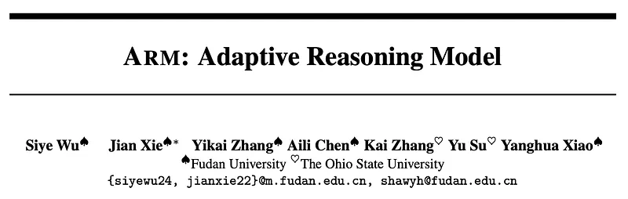
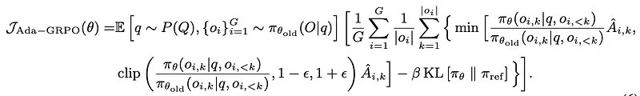
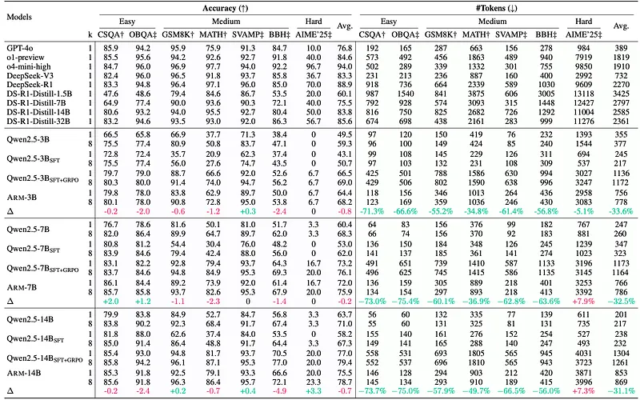
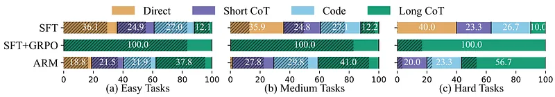
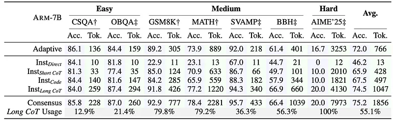

# Papers Explained 391 - Adaptive Reasoning Model

Adaptive Reasoning Model (ARM) is a reasoning model capable of adaptively selecting appropriate reasoning formats based on the task at hand. These formats include three efficient ones — Direct Answer, Short CoT, and Code — as well as a more elaborate format, Long CoT.

This page ingests the source article into the wiki and connects it to [[Papers Explained Corpus]], [[Reasoning Models]], [[Reinforcement Learning Topic]], [[Model Compression and Efficiency]], [[Code Models]], [[Safety and Alignment]], [[Reinforcement Learning]], [[Supervised Fine-Tuning]].

## Source Metadata

- Source file: `raw/2025-06-19_Papers-Explained-391--Adaptive-Reasoning-Model-9aacae6918a9.md`
- Source title: Papers Explained 391: Adaptive Reasoning Model
- Published: 2025-06-19
- Canonical: [https://medium.com/@ritvik19/papers-explained-391-adaptive-reasoning-model-9aacae6918a9](https://medium.com/@ritvik19/papers-explained-391-adaptive-reasoning-model-9aacae6918a9)

## Key Ideas

- Adaptive Reasoning Model (ARM) is a reasoning model capable of adaptively selecting appropriate reasoning formats based on the task at hand.
- The project is available on [GitHub](https://team-arm.github.io/arm/).
- Supervised Fine-tuning (SFT) for Reasoning Formats Understanding. In this stage, 10.8K diverse questions, each annotated with solutions in four distinct reasoning formats, are used to fine-tune the model and build a foundational understanding of different...
- Reinforcement Learning (RL) for Encouraging Efficient Format Selection. An adapted version of the GRPO algorithm, named Ada-GRPO, is adopted to train the model to be capable of selecting more efficient reasoning formats over solely Long CoT, while maintaining...
- SFT is leveraged as a cold start to introduce the model to various reasoning formats it can utilize to solve problems.

## Notes

Adaptive Reasoning Model (ARM) is a reasoning model capable of adaptively selecting appropriate reasoning formats based on the task at hand. These formats include three efficient ones — Direct Answer, Short CoT, and Code — as well as a more elaborate format, Long CoT. To train ARM, Ada-GRPO, an adaptation of Group Relative Policy Optimization (GRPO), is introduced. Ada-GRPO addresses the format collapse issue in traditional GRPO.

The project is available on [GitHub](https://team-arm.github.io/arm/).

## Method

ARM is trained in two stages.

- Supervised Fine-tuning (SFT) for Reasoning Formats Understanding. In this stage, 10.8K diverse questions, each annotated with solutions in four distinct reasoning formats, are used to fine-tune the model and build a foundational understanding of different reasoning strategies.

- Reinforcement Learning (RL) for Encouraging Efficient Format Selection. An adapted version of the GRPO algorithm, named Ada-GRPO, is adopted to train the model to be capable of selecting more efficient reasoning formats over solely Long CoT, while maintaining accuracy.

### SFT for Reasoning Formats Understanding

SFT is leveraged as a cold start to introduce the model to various reasoning formats it can utilize to solve problems. These formats include three efficient reasoning formats: Direct Answer, Short CoT, and Code, as well as the elaborate reasoning format Long CoT.

- Direct Answer: This format provides a direct answer without any reasoning chain, making it the most efficient in terms of token usage.

- Short CoT: This format begins with a short reasoning and then provides an answer, which has been proved effective in mathematical problems.

- Code: This format adopts code-based reasoning, which has proven effective across a variety of tasks due to its structured process.

- Long CoT: This format involves a more detailed, iterative reasoning process, thus incurs higher token usage. It is suited for tasks requiring advanced reasoning capabilities, such as self-reflection and alternative generation, where those more efficient formats fall short.

## Adaptive GRPO (Ada-GRPO)

Since traditional GRPO solely optimizes for accuracy, it leads, in this setting, to overuse of the highest-accuracy format while discouraging exploration of alternative reasoning formats. Specifically, if Long CoT achieves higher accuracy than other formats, models trained with GRPO tend to increasingly reinforce it, leading to an over-reliance on Long CoT and reduced exploration of more efficient alternatives. This phenomenon is referred to as Format Collapse, which ultimately hinders the model’s ability to develop adaptiveness.

Ada-GRPO to address the format collapse issue by amplifying the reward ri for less frequently sampled reasoning formats, preventing their disappearance and ensuring adequate learning.

### Traditional GRPO

- Group Sampling: For each question ( q ), the model samples a group of outputs ( O = {o_1, o_2, … , o_G} ), where ( G ) denotes the group size.

- Binary Reward Calculation: For each output ( o_i ), a binary reward (r_i) is computed using a rule-based reward function that checks whether the prediction matches the ground truth.

- Optimization Focus: Traditional GRPO optimizes solely for accuracy, which can lead to over-reliance on the highest-accuracy format (e.g., Long CoT) and reduced exploration of alternative reasoning formats. This phenomenon is referred to as Format Collapse.

### Ada-GRPO

Reward Scaling: The reward ( r_i ) is scaled to ( r’_i ) to prevent the disappearance of less frequently sampled reasoning formats:

Format Diversity Scaling Factor: ( alpha_i(t) ) is defined as:

- ( F(o_i) ) denotes the number of times the reasoning format corresponding to ( o_i ) appears within its group ( O ).

- ( t ) represents the training step.

Decay Factor: The decay factor ( \text{decay}_i(t) ) is introduced to gradually reduce the influence of diversity over time:

Group Advantage Calculation: The group advantage for all tokens in each output is computed based on the group of reshaped rewards:

Objective Function: The model is optimized by maximizing the following objective:

- ( epsilon ) is a clipping parameter.

- ( beta ) is a coefficient for the KL divergence term.

## Experiment Setup

Qwen2.5-Base-3B/7B/14B are used as backbone models. The Instruct and DeepSeek-R1-Distill variants are also examined.

Stage 1: Uses the AQuA-Rat dataset for Supervised Fine-Tuning (SFT). Answers are transformed into four reasoning formats: Direct Answer, Short Chain-of-Thought (CoT), Code, and Long CoT. GPT-4o and DeepSeek-R1 are used to generate Code and Long CoT rationales, respectively. The training set consists of 3.0K multiple-choice and 7.8K open-form questions, each with four reasoning formats, after filtering out incorrect rationales.

Stage 2: Employs three additional datasets (CommonsenseQA (CSQA), GSM8K, and MATH) exclusively for the Reinforcement Learning (RL) stage to prevent data leakage. These datasets cover a range of difficulty levels and comprise 19.8K verifiable question-answer pairs.

### Evaluation Settings

- For commonsense reasoning, Common-senseQA (CSQA) and OpenBookQA (OBQA) are included, as these are easier tasks based on intuitive knowledge.

- For mathematical reasoning, SVAMP, GSM8K, MATH, and AIME’25 are utilized to assess models’ ability to solve complex mathematical problems that require advanced reasoning and strict logical thinking.

- For symbolic reasoning, Big-Bench-Hard (BBH) is turned to, as it is a benchmark for evaluating models’ structured reasoning ability to manipulate symbols according to formal rules.

## Evaluation

*Figure: Performance of various models across evaluation datasets.*

*Figure: Format distribution by task difficulty with Qwen2.5–7B.*

- SFT models improve on easy tasks but degrade on medium and hard tasks due to inappropriate reasoning format selection. They tend to use Direct Answer regardless of task difficulty.

- GRPO improves reasoning capabilities but relies heavily on Long CoT for all tasks, leading to high token costs.

- ARM adaptively selects reasoning formats based on task difficulty, achieving comparable accuracy to GRPO with significantly fewer tokens. It saves over 70% of tokens on easy tasks.

- ARM demonstrates a better balance between effectiveness and efficiency compared to SFT+GRPO .

*Figure: Accuracy (Acc.) and token usage (Tok.) for the three reasoning modes supported by ARM-7B.*

- Adaptive Mode: Achieves a balance between high accuracy and efficient token usage across all datasets, demonstrating its ability to adaptively select reasoning formats.

- Instruction-Guided Mode: Offers an advantage when the assigned reasoning format is appropriate for the task. Direct Answer works for commonsense, Code for symbolic reasoning. InstLong CoT achieves better performance (74.5%) than the same-sized model trained on GRPO (73.2%).

- Consensus-Guided Mode: Is performance-oriented, using more tokens to achieve better performance by leveraging consensus across multiple formats to mitigate bias and uncertainty.

## Paper

ARM: Adaptive Reasoning Model [2505.20258](https://arxiv.org/abs/2505.20258)

## Figures

Figures from the Medium HTML export (`raw/2025-06-19_Papers-Explained-391--Adaptive-Reasoning-Model-9aacae6918a9.md`); local copies under `wiki/assets/papers-explained-391-adaptive-reasoning-model/` when download succeeded.

| Figure | Caption |
|--------|---------|
|  | Title card: Adaptive Reasoning Model. |
|  | Traditional GRPO. |
|  | Reward Scaling: The reward ( r_i ) is scaled to ( r’_i ) to prevent the disappearance of less frequently sampled reasoning formats. |
|  | Format Diversity Scaling Factor: ( alpha_i(t) ) is defined as. |
|  | Decay Factor: The decay factor ( \text{decay}_i(t) ) is introduced to gradually reduce the influence of diversity over time. |
|  | Group Advantage Calculation: The group advantage for all tokens in each output is computed based on the group of reshaped rewards. |
|  | Objective Function: The model is optimized by maximizing the following objective. |
|  | Performance of various models across evaluation datasets. |
|  | Format distribution by task difficulty with Qwen2.5–7B. |
|  | Accuracy (Acc.) and token usage (Tok.) for the three reasoning modes supported by ARM-7B. |
## Related

- [[Papers Explained Corpus]]
- [[Reasoning Models]]
- [[Reinforcement Learning Topic]]
- [[Model Compression and Efficiency]]
- [[Code Models]]
- [[Safety and Alignment]]
- [[Reinforcement Learning]]
- [[Supervised Fine-Tuning]]
- [[Papers Explained 390 - Perplexity-based Importance Refinement (PIR)]]
- [[Papers Explained 392 - Hard Negative Mining for Domain-Specific Retrieval]]

#summary #topic
