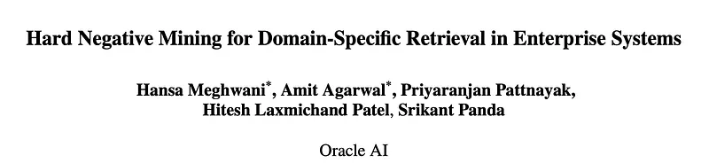
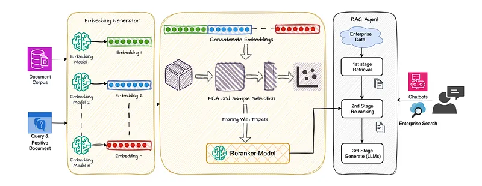
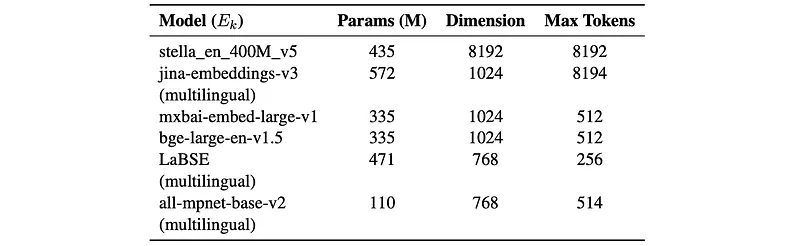
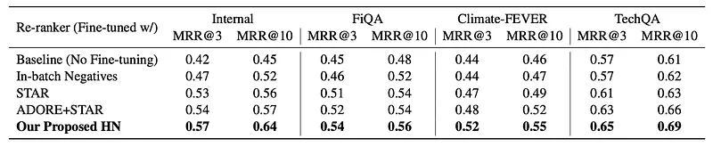
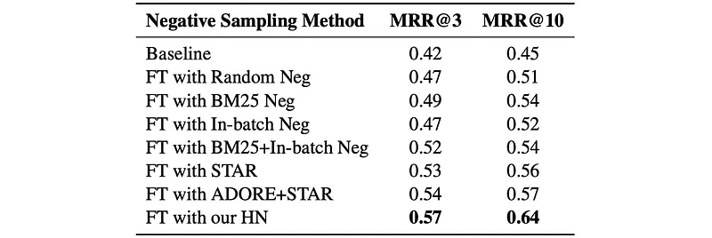
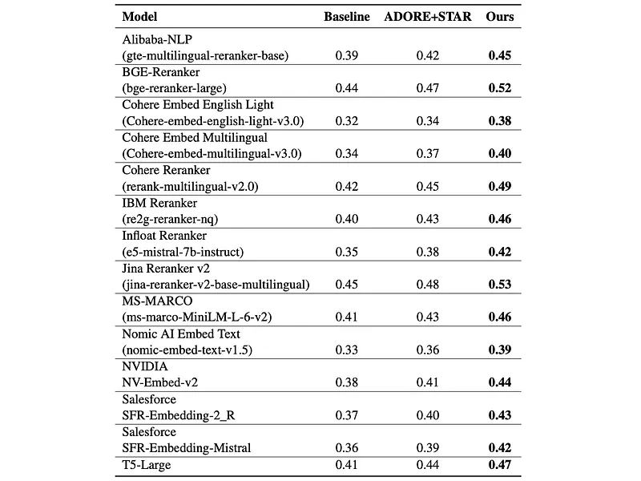
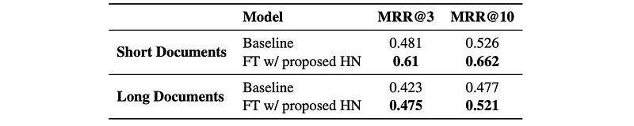

# Papers Explained 392 - Hard Negative Mining for Domain-Specific Retrieval

This paper addresses the challenge of retrieving accurate, domain-specific information in enterprise search systems, by dynamically selecting semantically challenging but contextually irrelevant documents to improve re-ranking models.

This page ingests the source article into the wiki and connects it to [[Papers Explained Corpus]], [[Embedding and Retrieval]], [[Document AI]], [[Agentic AI]], [[Model Compression and Efficiency]], [[Multilingual Models]].

## Source Metadata

- Source file: `raw/2025-06-20_Papers-Explained-392--Hard-Negative-Mining-for-Domain-Specific-Retrieval-a334df3c97fa.md`
- Source title: Papers Explained 392: Hard Negative Mining for Domain-Specific Retrieval
- Published: 2025-06-20
- Canonical: [https://medium.com/@ritvik19/papers-explained-392-hard-negative-mining-for-domain-specific-retrieval-a334df3c97fa](https://medium.com/@ritvik19/papers-explained-392-hard-negative-mining-for-domain-specific-retrieval-a334df3c97fa)

## Key Ideas

- To effectively train and fine-tune reranker models for domain-specific retrieval, it is essential to systematically handle technical ambiguities stemming from specialized terminologies, overlapping concepts, and abbreviations prevalent within enterprise...
- The approach begins by encoding queries and documents into semantically rich vector representations using an ensemble of state-of-the-art bi-encoder embedding models.
- To manage embedding dimensionality and improve computational efficiency, Principal Component Analysis (PCA) is utilized to project the concatenated embeddings onto a lower-dimensional space, maintaining 95% of the original variance.
- Two semantic conditions are defined to dynamically select high-quality hard negatives, addressing semantic similarity challenges and minimizing false negatives.
- A document D is selected as a hard negative only if it satisfies both criteria:

## Notes

This paper addresses the challenge of retrieving accurate, domain-specific information in enterprise search systems, by dynamically selecting semantically challenging but contextually irrelevant documents to improve re-ranking models. The method integrates diverse embedding models, performs dimensionality reduction, and employs a unique hard negative selection process to ensure computational efficiency and semantic precision.

## Methodology

*Figure: Overview of the methodology pipeline.*

To effectively train and fine-tune reranker models for domain-specific retrieval, it is essential to systematically handle technical ambiguities stemming from specialized terminologies, overlapping concepts, and abbreviations prevalent within enterprise domains.

The approach begins by encoding queries and documents into semantically rich vector representations using an ensemble of state-of-the-art bi-encoder embedding models. These embeddings are strategically selected based on multilingual support, embedding quality, training data diversity, context length handling, and performance.

*Figure: Embedding models used.*

To manage embedding dimensionality and improve computational efficiency, Principal Component Analysis (PCA) is utilized to project the concatenated embeddings onto a lower-dimensional space, maintaining 95% of the original variance.

Two semantic conditions are defined to dynamically select high-quality hard negatives, addressing semantic similarity challenges and minimizing false negatives. For each query-positive document pair (Q, PD), candidate documents D from the corpus are evaluated via cosine distances: d(Q, PD), d(Q, D), d(PD, D).

A document D is selected as a hard negative only if it satisfies both criteria:

d(Q, D) < d(Q, PD)

d(Q, D) < d(PD, D)

The first equation ensures that the candidate negative document is semantically closer to the query than the actual positive document, making it a challenging negative example that potentially confuses the reranking model. The second equation ensures that the selected hard negative is not just query-confusing but also sufficiently dissimilar from the actual positive, avoiding near-duplicates or false negatives.

### Dataset

The experiments leverage a proprietary corpus containing 36,871 unannotated documents sourced from over 30 enterprise cloud services. Additionally, 5250 annotated query-positive document pairs (< Q, P D >) were prepared for training and testing.

To further validate generalizability, evaluations were conducted on publicly available domain-specific benchmarks: FiQA (finance), Climate Fever (climate science), and TechQA (technology).

## Evaluation

*Figure: Comparative performance benchmarking of the reranker across multiple domain-specific datasets.*

- Fine-tuning with the generated hard negatives consistently improved retrieval across diverse public domain-specific datasets (FiQA, Climate-FEVER, TechQA).

- The negative sampling method is effective not only within the internal enterprise corpus but also across diverse, domain-specific public datasets, indicating broad applicability and domain independence.

*Figure: Comparison of negative sampling methods for fine-tuning(FT) in-house cross-encoder reranker model.*

- The proposed method achieved significant relative improvements (15% in MRR@3 and 19% in MRR@10) over the baseline (internal reranker model without fine-tuning) on the internal dataset.

- The semantic nature of the hard negatives allows the reranker to better distinguish contextually irrelevant but semantically similar documents.

*Figure: Performance benchmarking (MRR@3) of reranker and embedding models using the proposed hard negative selection framework, compared with ADORE+STAR and baseline methods.*

- The framework demonstrates improvements across various open-source embedding and reranker models when fine-tuned with the proposed negative sampling, compared to ADORE+STAR and the baseline.

- Rerankers with multilingual capabilities and larger models showed pronounced improvements, indicating the benefit of the embedding ensemble’s multilingual semantic richness and the models’ capacity to exploit nuanced semantic differences.

- Short documents experienced substantial performance improvements due to minimal semantic redundancy and tokenization constraints. Long documents showed more moderate improvements due to embedding truncation and increased semantic complexity.

## Paper

Hard Negative Mining for Domain-Specific Retrieval in Enterprise Systems [2505.18366](https://arxiv.org/abs/2505.18366)

## Figures

Figures from the Medium HTML export (`raw/2025-06-20_Papers-Explained-392--Hard-Negative-Mining-for-Domain-Specific-Retrieval-a334df3c97fa.md`); local copies under `wiki/assets/papers-explained-392-hard-negative-mining-for-domain-specific-retrieval/` when download succeeded.

| Figure | Caption |
|--------|---------|
|  | Title card: Hard Negative Mining for Domain-Specific Retrieval. |
|  | Overview of the methodology pipeline. |
|  | Embedding models used. |
|  | The experiments leverage a proprietary corpus containing 36,871 unannotated documents sourced from over 30 enterprise cloud services. |
|  | Comparative performance benchmarking of the reranker across multiple domain-specific datasets. |
|  | Comparison of negative sampling methods for fine-tuning(FT) in-house cross-encoder reranker model. |
|  | Performance benchmarking (MRR@3) of reranker and embedding models using the proposed hard negative selection framework, compared with ADORE+STAR and baseline methods. |
|  | d(Q, D) < d(PD, D). |
## Related

- [[Papers Explained Corpus]]
- [[Embedding and Retrieval]]
- [[Document AI]]
- [[Agentic AI]]
- [[Model Compression and Efficiency]]
- [[Multilingual Models]]
- [[Papers Explained 391 - Adaptive Reasoning Model]]
- [[Papers Explained 393 - Gemini 2.5]]

#summary #topic
